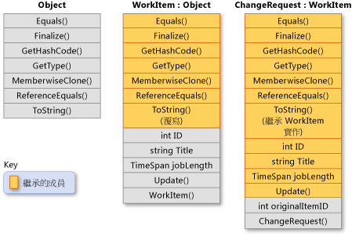

# 繼承 (C# 程式設計手冊)
繼承 \(Inheritance\) 和封裝 \(Encapsulation\) 以及多型 \(Polymorphism\) 並稱物件導向程式設計的三個主要特性 \(或「*支柱*」\)。  繼承可讓您建立新類別 \(Class\) 以重複使用、擴充和修改其他類別中定義的行為。  成員被繼承的類別稱為「*基底類別*」\(Base Class\)，而繼承這種成員的類別即稱為「*衍生類別*」\(Derived Class\)。  派生類別只能有一個直接基底類別。  但是，繼承是可傳遞的。  如果 ClassC 衍生自 ClassB，ClassB 衍生自 ClassA，則 ClassC 會繼承在 ClassB 和 ClassA 中宣告的成員。  
  
> [!NOTE]
>  結構 \(Struct\) 不支援繼承，但可以實作介面。  如需詳細資訊，請參閱 [介面](../../../csharp/programming-guide/interfaces/index.md)。  
  
 就概念而言，衍生類別是基底類別的特製化項目。  例如，如果您擁有基底類別 `Animal`，則可能還會有一個名為 `Mammal` 的衍生類別，以及另一個名為 `Reptile` 的衍生類別。  `Mammal` 是 `Animal`，`Reptile` 也是 `Animal`，但這兩個衍生類別各代表不同的基底類別特製化項目。  
  
 當您定義一個類別從其他類別衍生時，衍生類別會隱含地取得基底類別的所有成員，建構函式 \(Constructor\) 和解構函式 \(Destructor\) 除外。  因此，衍生類別可以重複使用基底類別的程式碼，而不用重新實作。  您可以在衍生類別中加入更多成員。  透過這種方式，衍生類別等於是擴充了基底類別的功能。  
  
 下圖顯示 `WorkItem` 類別，代表商務處理流程中的工作項目。  與所有類別相同，它衍生自 <xref:System.Object?displayProperty=fullName>，並繼承其所有方法。  `WorkItem` 可加入自己的五個成員。  這其中包括建構函式，因為不會繼承建構函式。  `ChangeRequest` 類別會繼承自 `WorkItem`，並代表特定種類的工作項目。  `ChangeRequest` 會再新增兩個成員到其繼承自 `WorkItem` 和 <xref:System.Object> 的成員中。  它必須新增自己的建構函式，而且會新增`originalItemID`。  屬性`originalItemID`可讓`ChangeRequest`執行個體與套用變更要求的原始`WorkItem`產生關聯性。  
  
   
類別繼承  
  
 下列範例顯示如何以 C\# 表示上圖中示範的類別關聯性 \(Relationship\)。  這個範例也會顯示 `WorkItem` 如何覆寫虛擬方法 <xref:System.Object.ToString%2A?displayProperty=fullName> 以及 `ChangeRequest` 類別如何繼承方法的 `WorkItem` 實作 \(Implementation\)。  
  
 [!code-cs[csProgGuideInheritance#49](../../../csharp/programming-guide/classes-and-structs/codesnippet/csharp/inheritance_1.cs)]  
  
## 抽象和虛擬方法  
 當基底類別宣告方法為[虛擬](../../../csharp/language-reference/keywords/virtual.md)時，衍生類別可以用它自己的實作[覆寫](../../../csharp/language-reference/keywords/override.md)方法。  如果基底類別宣告成員為[抽象](../../../csharp/language-reference/keywords/abstract.md)，則在所有直接繼承自該類別的非抽象類別中，都必須覆寫該方法。  如果衍生類別本身就是抽象的，則會繼承抽象成員，不需進行實作。  抽象和虛擬成員是多型 \(Polymorphism\) 的基礎，多型是物件導向程式設計的第二個主要特性。  如需詳細資訊，請參閱 [多型](../../../csharp/programming-guide/classes-and-structs/polymorphism.md)。  
  
## 抽象基底類別  
 如果想要避免使用 [new](../../../csharp/language-reference/keywords/new.md) 關鍵字直接具現化 \(Instantiation\)，您可將類別宣告為[抽象](../../../csharp/language-reference/keywords/abstract.md)。  如果這麼做，則必須從該類別衍生新類別，才能加以使用。  抽象類別可以包含一個或多個本身宣告為抽象的方法簽章。  這些簽章可指定參數和傳回值，但沒有實作 \(方法主體\)。  抽象類別不需包含抽象成員，但是，如果一個類別包含抽象成員，則該類別本身必須宣告為抽象。  本身不是抽象的衍生類別，必須為來自抽象基底類別的所有抽象方法提供實作。  如需詳細資訊，請參閱 [抽象和密封類別以及類別成員](../../../csharp/programming-guide/classes-and-structs/abstract-and-sealed-classes-and-class-members.md)。  
  
## 介面  
 「*介面*」\(Interface\) 是一種參考型別 \(Reference Type\)，某些方面與只包含抽象成員的抽象基底類別類似。  當類別實作介面時，必須為介面的所有成員提供實作。  雖然類別只能衍生自單一直接基底類別，但類別可實作多個介面。  
  
 介面可針對不必然有「是」關聯性的類別，為其定義特定能力。  例如，任何必須啟用用戶端程式碼以判斷兩個型別的物件是否對等的類別或結構，都能實作 <xref:System.IEquatable%601?displayProperty=fullName> 介面 \(不過其型別定義等價\)。  <xref:System.IEquatable%601> 不表示基底類別和衍生類別之間存在「是」這類的關聯性 \(例如，`Mammal` 是 `Animal`\)。  如需詳細資訊，請參閱 [介面](../../../csharp/programming-guide/interfaces/index.md)。  
  
## 衍生類別對基底類別成員的存取  
 衍生類別可以存取基底類別的 public、protected、internal 和 protected internal 成員。  而就算衍生類別繼承自基底類別的 private 成員，衍生類別仍不能存取這些成員。  不過，所有的 private 成員都存在於衍生類別中，可以執行與基底類別中相同的工作。  例如，假設有個 protected 基底類別方法需存取私用欄位。  該欄位必須存在於衍生類別中，繼承的基底類別方法才能正確運作。  
  
## 防止進一步衍生  
 將類別或其成員宣告為[密封](../../../csharp/language-reference/keywords/sealed.md)，即可防止其他類別繼承該類別，或繼承其成員。  如需詳細資訊，請參閱 [抽象和密封類別以及類別成員](../../../csharp/programming-guide/classes-and-structs/abstract-and-sealed-classes-and-class-members.md)。  
  
## 衍生類別隱藏基底類別成員  
 衍生類別可透過以相同的名稱或簽章宣告成員，來隱藏基底類別成員。  您可以使用 [new](../../../csharp/language-reference/keywords/new.md) 修飾詞 \(Modifier\) 明確指示成員不是用於基底成員的覆寫。  [new](../../../csharp/language-reference/keywords/new.md) 的使用並非必要，但如果未使用 [new](../../../csharp/language-reference/keywords/new.md) 則會產生編譯器警告。  如需詳細資訊，請參閱 [使用 Override 和 New 關鍵字的進行版本控制](../../../csharp/programming-guide/classes-and-structs/versioning-with-the-override-and-new-keywords.md)和 [了解使用 Override 和 New 關鍵字的時機](../../../csharp/programming-guide/classes-and-structs/knowing-when-to-use-override-and-new-keywords.md)。  
  
## 請參閱  
 [C\# 程式設計手冊](../../../csharp/programming-guide/index.md)   
 [類別和結構](../../../csharp/programming-guide/classes-and-structs/index.md)   
 [Class \- 類別](../../../csharp/language-reference/keywords/class.md)   
 [struct](../../../csharp/language-reference/keywords/struct.md)