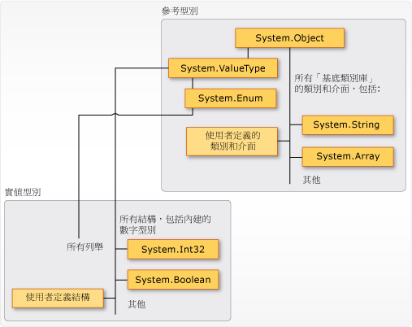

# <a name="types-c-programming-guide"></a>類型 (C# 程式設計手冊)
## <a name="types-variables-and-values"></a>型別、變數和值  
 C# 是強型別語言。 每個變數和常數都有型別，如同每個會評估為值的運算式一般。 每種方法簽章都會指定每個輸入參數與其傳回值的型別。 .NET Framework Class Library 會定義一組內建數字型別以及較複雜型別，代表各種邏輯建構，例如檔案系統、網路連線、物件集合與陣列，以及日期。 一般 C# 程式會使用類別庫的型別和使用者定義的型別，模型化程式的問題領域特有概念。  
  
 可儲存在型別中的資訊包括下列各項：  
  
-   型別的變數需要的儲存空間。  
  
-   它可以代表的最大值和最小值。  
  
-   它所包含的成員 (方法、欄位、事件等等)。  
  
-   它繼承自的基底型別。  
  
-   將在執行階段配置給變數的記憶體位置。  
  
-   允許的作業類型。  
  
 編譯器會使用型別資訊，來確認在您的程式碼中執行的全部都是「型別安全」的作業。 例如，如果您宣告型別 [int](../../../csharp/language-reference/keywords/int.md) 的變數，編譯器會允許您使用這個變數去做加減運算。 如果您嘗試針對型別 [bool](../../../csharp/language-reference/keywords/bool.md) 的變數執行相同作業，編譯器會產生錯誤，如下列範例所示︰  
  
 [!code-cs[csProgGuideTypes#42](../../../csharp/programming-guide/nullable-types/codesnippet/CSharp/index_1.cs)]  
  
> [!NOTE]
>  C 和 C++ 開發人員要注意在 C# 中，[bool](../../../csharp/language-reference/keywords/bool.md) 不能轉換為 [int](../../../csharp/language-reference/keywords/int.md)。  
  
 編譯器會將型別資訊視為中繼資料內嵌至可執行檔。 通用語言執行平台 (CLR) 會在執行階段使用該中繼資料，以在它配置和回收記憶體時，進一步保證型別安全。  
  
### <a name="specifying-types-in-variable-declarations"></a>在變數宣告中指定型別  
 當您在程式中宣告變數或常數時，您必須指定其型別，或使用 [var](../../../csharp/language-reference/keywords/var.md) 關鍵字以讓編譯器推斷其型別。 下列範例示範一些變數宣告，使用內建的數字型別和複雜的使用者定義型別︰  
  
 [!code-cs[csProgGuideTypes#36](../../../csharp/programming-guide/nullable-types/codesnippet/CSharp/index_2.cs)]  
  
 在方法簽章中指定方法參數和傳回值的型別。 下列簽章顯示的方法要求 [int](../../../csharp/language-reference/keywords/int.md) 做為輸入引數且會傳回字串︰  
  
 [!code-cs[csProgGuideTypes#35](../../../csharp/programming-guide/nullable-types/codesnippet/CSharp/index_3.cs)]  
  
 宣告變數之後，不能以新型別重新宣告它，也無法將與所宣告型別不相容的值指派給它。 例如，您無法宣告 [int](../../../csharp/language-reference/keywords/int.md) 並將為 [true](../../../csharp/language-reference/keywords/true-literal.md) 的布林值指派給它。 不過，可以將值轉換為其他型別，例如，指派給新的變數，或做為方法引數傳遞時。 編譯器會自動執行不會造成資料遺失的「型別轉換」作業。 而可能導致資料遺失的轉換在原始程式碼中需要有 *cast*。  
  
 如需詳細資訊，請參閱[轉型和型別轉換](../../../csharp/programming-guide/types/casting-and-type-conversions.md)。  
  
## <a name="built-in-types"></a>內建類型  
 C# 提供一組標準的內建數字型別，代表整數、浮點數值、布林運算式、文字字元、十進位值及其他資料型別。 另外還有內建的 `string` 和 `object` 型別。 這些都可供您在任何 C# 程式中使用。 如需內建類型的詳細資訊，請參閱[類型的參考表](../../../csharp/language-reference/keywords/reference-tables-for-types.md)。  
  
## <a name="custom-types"></a>自訂型別  
 您可使用 [struct](../../../csharp/language-reference/keywords/struct.md)、[class](../../../csharp/language-reference/keywords/class.md)、[interface](../../../csharp/language-reference/keywords/interface.md) 及 [enum](../../../csharp/language-reference/keywords/enum.md) 建構來建立您自己的自訂型別。 .NET Framework Class Library 本身是 Microsoft 所提供的自訂型別集合，您可以在自己的應用程式中使用。 根據預設，類別庫中最常使用的型別可用於任何 C# 程式中。 只有當您明確地將專案參考新增至定義所在的組件時，才能使用其他類型。 編譯器在有該組件的參考之後，您可以針對在原始程式碼的那個組件中宣告的型別宣告變數 (和常數) 。 如需詳細資訊，請參閱 [.NET Framework Class Library](http://go.microsoft.com/fwlink/?LinkID=217856)。  
  
## <a name="the-common-type-system"></a>一般型別系統  
 請務必了解 [!INCLUDE[dnprdnshort](~/includes/dnprdnshort-md.md)] 中有關型別系統的兩個基本概念：  
  
-   它支援繼承原則。 型別可以衍生自稱為「基底型別」的其他型別。 衍生的型別會繼承 (有部份限制) 基底型別的方法、屬性和其他成員。 基底型別同樣可以衍生自一些其他型別，所衍生的型別會繼承其繼承階層架構中兩個基底型別的成員。 包括 <xref:System.Int32?displayProperty=fullName> (C# 關鍵字：[int](../../../csharp/language-reference/keywords/int.md)) 等內建數字型別在內的所有型別，最終都衍生自單一基底型別，即 <xref:System.Object?displayProperty=fullName> (C# 關鍵字：[object](../../../csharp/language-reference/keywords/object.md))。 這種統一型別階層架構稱為[一般型別系統](../../../standard/base-types/common-type-system.md) (CTS)。 如需 C# 中有關繼承的詳細資訊，請參閱[繼承](../../../csharp/programming-guide/classes-and-structs/inheritance.md)。  
  
-   CTS 中的每個型別都會定義為「實值型別」或「參考型別」。 這包括 .NET Framework Class Library 中的所有自訂型別以及您自己的使用者定義型別。 您使用 [struct](../../../csharp/language-reference/keywords/struct.md) 關鍵字定義的型別為實值型別；所有內建的數字型別都是 `structs`。 您使用 [class](../../../csharp/language-reference/keywords/class.md) 關鍵字定義的型別為參考型別。 參考型別和實值型別有不同的編譯時期規則和不同的執行階段行為。  
  
 下圖顯示 CTS 中的實值型別和參考型別之間的關聯性。  
  
   
CTS 中的實值型別和參考型別  
  
> [!NOTE]
>  您可以看到最常使用的型別全都整理在 <xref:System> 命名空間中。 不過，其中包含型別的命名空間和實值型別或參考型別毫無關聯。  
  
### <a name="value-types"></a>實值類型  
 實值型別衍生自 <xref:System.ValueType?displayProperty=fullName>，該型別又衍生自 <xref:System.Object?displayProperty=fullName>。 衍生自 <xref:System.ValueType?displayProperty=fullName> 的型別在 CLR 中具有特殊行為。 實值型別變數會直接包含其值，這表示配置的記憶體內嵌在宣告該變數的內容中。 實值型別變數不會有任何個別的堆積配置或記憶體回收額外負荷。  
  
 實值型別有兩種類別︰[struct](../../../csharp/language-reference/keywords/struct.md) 和 [enum](../../../csharp/language-reference/keywords/enum.md)。  
  
 內建的數字型別為結構，而您可以存取其屬性和方法︰  
  
```csharp  
// Static method on type Byte.  
byte b = Byte.MaxValue;  
```  
  
 但您會將它們當做簡單的非彙總型別來宣告並將值指派給它們︰  
  
```csharp  
byte num = 0xA;  
int i = 5;  
char c = 'Z';  
```  
  
 實值型別為 *sealed*，其表示您無法從 <xref:System.Int32?displayProperty=fullName> 衍生類型，也無法定義從任何使用者定義的類別或結構繼承的結構，因為結構只能從 <xref:System.ValueType?displayProperty=fullName> 繼承。 不過，結構可以實作一或多個介面。 您可以將 struct 型別轉換為 interface 型別；原因是包裝結構的 *boxing* 作業在 Managed 堆積上的參考型別物件內。 當您將實值型別傳遞至接受 <xref:System.Object?displayProperty=fullName> 做為輸入參數的方法時，就會發生 Boxing 作業。 如需詳細資訊，請參閱 [Boxing 和 Unboxing](../../../csharp/programming-guide/types/boxing-and-unboxing.md)。  
  
 您使用 [struct](../../../csharp/language-reference/keywords/struct.md) 關鍵字來建立您自己自訂的實值型別。 一般來說，會使用結構做為一小組相關變數的容器，如下列範例所示︰  
  
 [!code-cs[csProgGuideObjects#1](../../../csharp/programming-guide/classes-and-structs/codesnippet/CSharp/index_4.cs)]  
  
 如需結構的詳細資訊，請參閱[結構](../../../csharp/programming-guide/classes-and-structs/structs.md)。 如需有關 [!INCLUDE[dnprdnshort](~/includes/dnprdnshort-md.md)] 中實值型別的詳細資訊，請參閱[一般型別系統](../../../standard/base-types/common-type-system.md)。  
  
 實值型別的另一種類別是 [enum](../../../csharp/language-reference/keywords/enum.md)。 列舉會定義一組具名的整數常數。 例如，.NET Framework Class Library 中的 <xref:System.IO.FileMode?displayProperty=fullName> 列舉包含一組指定該如何開啟檔案的具名常數整數。 其定義方式如下列範例所示：  
 
 [!code-cs[csProgGuideTypes#44](../../../csharp/programming-guide/nullable-types/codesnippet/CSharp/index_5.cs)]  
  
 `System.IO.FileMode.Create` 常數的值為 2。 不過，使用者在讀取原始程式碼時，名稱會更有意義，也因此最好使用列舉，而不要使用常數常值數字。 如需詳細資訊，請參閱<xref:System.IO.FileMode?displayProperty=fullName>。  
  
 所有的委派都繼承自 <xref:System.Enum?displayProperty=fullName>，該列舉又繼承自 <xref:System.ValueType?displayProperty=fullName>。 所有適用於結構的規則，也適用於列舉。 如需有關列舉的詳細資訊，請參閱[列舉型別](../../../csharp/programming-guide/enumeration-types.md)。  
  
### <a name="reference-types"></a>參考類型  
 定義為 [class](../../../csharp/language-reference/keywords/class.md)、[delegate](../../../csharp/language-reference/keywords/delegate.md)、array 或 [interface](../../../csharp/language-reference/keywords/interface.md) 的型別即為「參考型別」。 在執行階段，當您宣告參考型別的變數時，該變數會包含值 [null](../../../csharp/language-reference/keywords/null.md)，直到您使用 [new](../../../csharp/language-reference/keywords/new.md) 運算子明確地建立物件的執行個體，或為它指派在他處使用 `new` 建立的物件為止，如下列範例所示︰
  
```csharp  
MyClass mc = new MyClass();  
MyClass mc2 = mc;  
```  
   介面必須和實作它的類別物件一起初始化。 如果 `MyClass` 實作 `IMyInterface`，您建立的 `IMyInterface` 執行個體會如下列範例所示︰  
  
```csharp  
IMyInterface iface = new MyClass();  
```  
  
 建立物件時，會在 Managed 堆積上配置記憶體，而變數只會保留物件位置的參考。 配置和由 CLR 的自動記憶體管理功能 (也就是「記憶體回收」) 回收 Managed 堆積上的型別時，都需要額外負荷。 不過，記憶體回收也已獲得高度最佳化，因此在大部分情況下並不會產生效能問題。 如需有關記憶體回收的詳細資訊，請參閱[自動記憶體管理](../../../standard/automatic-memory-management.md)。  
  
 所有陣列都是參考型別，即使其元素都是實值型別。 陣列隱含衍生自 <xref:System.Array?displayProperty=fullName> 類別，但您會利用 C# 所提供的簡化語法來宣告及使用陣列，如下列範例所示：  
  
 [!code-cs[csProgGuideTypes#45](../../../csharp/programming-guide/nullable-types/codesnippet/CSharp/index_6.cs)]  
  
 參考型別完全支援繼承。 當您建立類別時，您可以繼承自任何未定義為 [sealed](../../../csharp/language-reference/keywords/sealed.md) 的介面或類別，而其他類別可以繼承自您的類別並覆寫您的虛擬方法。 如需如何為您自己建立類別的詳細資訊，請參閱[類別和結構](../../../csharp/programming-guide/classes-and-structs/index.md)。 如有關繼承和虛擬方法的詳細資訊，請參閱[繼承](../../../csharp/programming-guide/classes-and-structs/inheritance.md)。  
  
## <a name="types-of-literal-values"></a>常值型別  
 在 C# 中，常值會接收來自編譯器的型別。 您可以在數字後面附加一個字母，指定應如何輸入數值常值。 例如，若要指定應該將值 4.56 視為浮點數時，請在數字之後附加 "f" 或 "F"︰`4.56f`。 如果未附加任何字母時，編譯器會推斷其型別為常值。 如需您可以使用字母後置字元指定哪些型別的詳細資訊，請參閱參考頁面中個別型別的[實值型別](../../../csharp/language-reference/keywords/value-types.md)。  
  
 因為輸入的是常值且所有類型最終都衍生自 <xref:System.Object?displayProperty=fullName>，所以您可以如下所示來撰寫和編譯程式碼：  
  
 [!code-cs[csProgGuideTypes#37](../../../csharp/programming-guide/nullable-types/codesnippet/CSharp/index_7.cs)]  
  
## <a name="generic-types"></a>泛型型別  
 可使用一或多個「型別參數」宣告的型別，做為預留位置 (具象型別)，以供用戶端程式碼在其建立該型別的執行個體時提供實際型別。 這類的型別稱為「泛型型別」。 例如，.NET Framework 型別 <xref:System.Collections.Generic.List%601?displayProperty=fullName> 有一個型別參數，依慣例命名為 *T*。當您建立該型別的執行個體時，您會指定該清單將包含的物件型別，例如 string：  
 
```csharp
List<string> stringList = new List<string>();
stringList.Add("String example");
// compile time error adding a type other than a string:
stringList.Add(4);
```
 使用型別參數讓您能夠重複使用相同的類別來保存任何元素型別，而不需要將每個元素都轉換成 [object](../../../csharp/language-reference/keywords/object.md)。 泛型集合類別則稱為「強型別集合」，因為編譯器知道集合元素的特定型別，如果您嘗試將整數加入至上一個範例中的 `strings` 物件，便會在編譯時期引發錯誤。 如需詳細資訊，請參閱[泛型](../../../csharp/programming-guide/generics/index.md)。  
  
## <a name="implicit-types-anonymous-types-and-nullable-types"></a>隱含型別、匿名型別以及可為 Null 的型別  
 如先前所述，您可以使用 [var](../../../csharp/language-reference/keywords/var.md) 關鍵字，隱含地輸入本機變數 (但不是類別成員)。 變數還是會在編譯時期收到型別，但其是由編譯器所提供的型別。 如需詳細資訊，請參閱[隱含型別區域變數](../../../csharp/programming-guide/classes-and-structs/implicitly-typed-local-variables.md)。  
  
 在某些情況下，不方便為一組您不想要儲存或在方法界限外傳遞的簡單相關值，建立簡單的具名型別。 為此，您可以建立「匿名型別」。 如需詳細資訊，請參閱[匿名型別](../../../csharp/programming-guide/classes-and-structs/anonymous-types.md)。  
  
 一般的實值型別值不能為 [null](../../../csharp/language-reference/keywords/null.md)。 不過，您可以在該型別後面添加 `?`，建立可為 null 的實值型別。 例如，`int?` 就是也能有 [null](../../../csharp/language-reference/keywords/null.md) 值的 `int` 型別。 在 CTS 中，可為 Null 的型別是泛型結構類型 <xref:System.Nullable%601?displayProperty=fullName> 的執行個體。 當您要在資料庫之間來回傳遞的資料數值可能為 Null 時，可為 Null 的型別特別有用。 如需詳細資訊，請參閱[可為 Null 的型別](../../../csharp/programming-guide/nullable-types/index.md)。  
  
## <a name="related-sections"></a>相關章節  
 如需詳細資訊，請參閱下列主題：  
  
-   [轉換和型別轉換](../../../csharp/programming-guide/types/casting-and-type-conversions.md)  
  
-   [Boxing 和 Unboxing](../../../csharp/programming-guide/types/boxing-and-unboxing.md)  
  
-   [使用動態型別](../../../csharp/programming-guide/types/using-type-dynamic.md)  
  
-   [實值型別](../../../csharp/language-reference/keywords/value-types.md)  
  
-   [參考型別](../../../csharp/language-reference/keywords/reference-types.md)  
  
-   [類別和結構](../../../csharp/programming-guide/classes-and-structs/index.md)  
  
-   [匿名類型](../../../csharp/programming-guide/classes-and-structs/anonymous-types.md)  
  
-   [泛型](../../../csharp/programming-guide/generics/index.md)  

## <a name="c-language-specification"></a>C# 語言規格  
 [!INCLUDE[CSharplangspec](~/includes/csharplangspec-md.md)]  
  
## <a name="see-also"></a>另請參閱  
 [C# 參考](../../../csharp/language-reference/index.md)   
 [C# 程式設計指南](../../../csharp/programming-guide/index.md)   
 [XML 資料型別轉換](../../../standard/data/xml/conversion-of-xml-data-types.md)   
 [整數型別表](../../../csharp/language-reference/keywords/integral-types-table.md)

