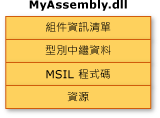
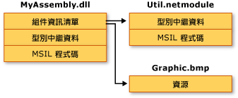

# 組件內容
一般而言，靜態組件可包含四個項目：  
  
-   [組件資訊清單](../../../docs/framework/app-domains/assembly-manifest.md)，其中含有組件中繼資料  
  
-   型別中繼資料  
  
-   會實作型別的 Microsoft Intermediate Language \(MSIL\) 程式碼  
  
-   資源集合  
  
 只有組件資訊清單是必要項，不過型別或資源兩者必須有一項要用來賦予組件任何有意義的功能。  
  
 有幾種方式可以將這些項目群組在組件中。  您可以將所有項目群組在一個如下所示的實際檔案中。  
  
   
單一檔案組件  
  
 或者，可以將組件的項目包含在幾個檔案中。  這些檔案可以是應用程式所需要的已編譯程式碼模組 \(.netmodule\)、資源 \(例如 .bmp 或 .jpg 檔案\) 或是其他檔案。  如果您希望結合以不同語言所撰寫之模組，並且藉由將不常使用的型別放在需要時才會下載的模組中，以最佳化應用程式的下載，那麼請建立多檔案 \(Multifile\) 組件。  
  
 在下圖中，假想應用程式的開發人員選擇將某些公用程式的程式碼分隔在不同的模組中，並且將大型的資源檔 \(在這裡為 .bmp 影像\) 存放在原始檔案中。  .NET Framework 是在要參考某個檔案的時候才下載它；將不常參考的程式碼保存在應用程式以外的單獨檔案中，可以最佳化程式碼的下載。  
  
   
多檔案組件  
  
> [!NOTE]
>  構成多檔案組件的檔案沒有與檔案系統實際連結。  而是透過組件資訊清單連結，而且 Common Language Runtime 會將它們當做一個單位來管理。  
  
 在這個圖中，這三個檔案都屬於一個組件，如同 MyAssembly.dll 中所含組件資訊清單中的描述。  對於檔案系統而言，它們是三個不同的檔案。  請注意，Util.netmodule 這個檔案會編譯為模組，這是因為它並不包含組件資訊。  建立這個組件時，已將組件資訊清單加入至 MyAssembly.dll 中，指出它與 Util.netmodule 和 Graphic.bmp 的關聯性。  
  
 目前在設計原始程式碼時，您必須明確決定要如何將應用程式的功能分割在一個或多個檔案中。  在設計 .NET Framework 程式碼時，您也必須做出如何將功能分割為一個或多個組件的類似決定。  
  
## 請參閱  
 [Common Language Runtime 中的組件](../../../docs/framework/app-domains/assemblies-in-the-common-language-runtime.md)   
 [組件資訊清單](../../../docs/framework/app-domains/assembly-manifest.md)   
 [組件安全性考量](../../../docs/framework/app-domains/assembly-security-considerations.md)