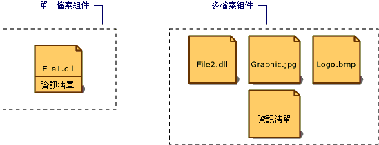

# 組件資訊清單Assembly Manifest
每個組件 (不論是靜態或是動態) 都含有描述組件中項目彼此如何關聯的資料集合。Every assembly, whether static or dynamic, contains a collection of data that describes how the elements in the assembly relate to each other. 組件資訊清單就包含這個組件的中繼資料。The assembly manifest contains this assembly metadata. 組件資訊清單含有指定組件的版本需求和安全性識別所需的所有中繼資料，以及定義組件範圍和解析資源與類別參考所需的所有中繼資料。An assembly manifest contains all the metadata needed to specify the assembly's version requirements and security identity, and all metadata needed to define the scope of the assembly and resolve references to resources and classes. 組件資訊清單可以存放在具有 Microsoft Intermediate Language (MSIL) 程式碼的可移植執行檔 (PE) (.exe 或 .dll) 中，或者存放在只包含組件資訊清單的獨立 PE 檔中。The assembly manifest can be stored in either a PE file (an .exe or .dll) with Microsoft intermediate language (MSIL) code or in a standalone PE file that contains only assembly manifest information.  
  
 下圖所示為儲存資訊清單的不同方式。The following illustration shows the different ways the manifest can be stored.  
  
   
組件的類型Types of assemblies  
  
 對於具有一個關聯檔案的組件，資訊清單是合併在 PE 檔中以構成單一檔案組件。For an assembly with one associated file, the manifest is incorporated into the PE file to form a single-file assembly. 您可以建立多檔案組件，它可具有獨立的資訊清單檔案，或者將資訊清單合併在該組件中的某一個 PE 檔中。You can create a multifile assembly with a standalone manifest file or with the manifest incorporated into one of the PE files in the assembly.  
  
 每個組件的資訊清單都會執行下列功能：Each assembly's manifest performs the following functions:  
  
-   列舉構成組件的檔案Enumerates the files that make up the assembly.  
  
-   控制組件之型別和資源的參考如何對應到含有它們的宣告和實作的檔案Governs how references to the assembly's types and resources map to the files that contain their declarations and implementations.  
  
-   列舉組件所依賴的其他組件Enumerates other assemblies on which the assembly depends.  
  
-   在組件使用者與組件的實作詳細資料之間提供一層間接取值 (Indirection)Provides a level of indirection between consumers of the assembly and the assembly's implementation details.  
  
-   轉譯組件的自我描述Renders the assembly self-describing.  
  
## 組件資訊清單內容Assembly Manifest Contents  
 下表所示為組件資訊清單中包含的資訊。The following table shows the information contained in the assembly manifest. 前四個項目 - 組件名稱、版本號碼、文化特性 (Culture) 和強式名稱 (Strong Name) 資訊 - 構成組件的識別。The first four items—the assembly name, version number, culture, and strong name information—make up the assembly's identity.  
  
|資訊Information|描述Description|  
|-----------------|-----------------|  
|組件名稱Assembly name|指定組件名稱的文字字串。A text string specifying the assembly's name.|  
|版本號碼Version number|主要和次要版本號碼，以及修訂和組建編號。A major and minor version number, and a revision and build number. Common Language Runtime 會使用這些編號來強制執行版本原則。The common language runtime uses these numbers to enforce version policy.|  
|cultureCulture|有關組件所支援文化特性或語言的資訊。Information on the culture or language the assembly supports. 這項資訊應該只用來將組件指定為包含文化特性或語言相關資訊的附屬組件This information should be used only to designate an assembly as a satellite assembly containing culture- or language-specific information. (具有文化特性資訊的組件會自動假設為附屬組件)。(An assembly with culture information is automatically assumed to be a satellite assembly.)|  
|強式名稱資訊Strong name information|如果已經為組件指定強式名稱，則為發行者 (Publisher) 的公開金鑰 (Public Key)。The public key from the publisher if the assembly has been given a strong name.|  
|組件中所有檔案的清單List of all files in the assembly|組件中所含每一檔案的雜湊和檔名。A hash of each file contained in the assembly and a file name. 請注意，構成組件的所有檔案必須與含有組件資訊清單的檔案在同一個目錄中。Note that all files that make up the assembly must be in the same directory as the file containing the assembly manifest.|  
|型別參考資訊Type reference information|Runtime 用來將型別參考對應到含有其宣告和實作之檔案的資訊。Information used by the runtime to map a type reference to the file that contains its declaration and implementation. 這是使用於從組件匯出之型別。This is used for types that are exported from the assembly.|  
|所參考組件的資訊Information on referenced assemblies|組件以靜態方式參考之其他組件的清單。A list of other assemblies that are statically referenced by the assembly. 每一參考包括相依組件的名稱、組件中繼資料 (版本、文化特性、作業系統等)，以及公開金鑰 (如果組件具有強式名稱)。Each reference includes the dependent assembly's name, assembly metadata (version, culture, operating system, and so on), and public key, if the assembly is strong named.|  
  
 您可以在程式碼中使用組件屬性在組件資訊清單中加入或變更某些資訊。You can add or change some information in the assembly manifest by using assembly attributes in your code. 您可以變更版本資訊和資訊屬性，包括商標、著作權、產品、公司和資訊版本。You can change version information and informational attributes, including Trademark, Copyright, Product, Company, and Informational Version. 如需完整的組件屬性清單，請參閱[設定組件屬性](../../../docs/framework/app-domains/set-assembly-attributes.md)。For a complete list of assembly attributes, see [Setting Assembly Attributes](../../../docs/framework/app-domains/set-assembly-attributes.md).  
  
## 請參閱See Also  
 [組件內容Assembly Contents](../../../docs/framework/app-domains/assembly-contents.md)  
 [組件版本控制Assembly Versioning](../../../docs/framework/app-domains/assembly-versioning.md)  
 [建立附屬組件Creating Satellite Assemblies](../../../docs/framework/resources/creating-satellite-assemblies-for-desktop-apps.md)  
 [強式名稱的組件Strong-Named Assemblies](../../../docs/framework/app-domains/strong-named-assemblies.md)
