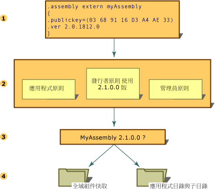

# 組件版本控制Assembly Versioning
使用 Common Language Runtime 之組件的所有版本控制都是在組件層級進行的。All versioning of assemblies that use the common language runtime is done at the assembly level. 組件的特定版本和相依組件的版本是記錄在組件的資訊清單中。The specific version of an assembly and the versions of dependent assemblies are recorded in the assembly's manifest. Runtime 的預設版本原則為，除非被組態檔 (應用程式組態檔、發行者原則檔和電腦的系統管理員組態檔) 中的明確版本原則強制取代，否則應用程式只能搭配用來建置和測試它們的版本執行。The default version policy for the runtime is that applications run only with the versions they were built and tested with, unless overridden by explicit version policy in configuration files (the application configuration file, the publisher policy file, and the computer's administrator configuration file).  
  
> [!NOTE]
>  版本控制只能在具有強式名稱 (Strong Name) 的組件上進行。Versioning is done only on assemblies with strong names.  
  
 Runtime 會執行以下幾個步驟來解析組件繫結要求：The runtime performs several steps to resolve an assembly binding request:  
  
1.  檢查原始組件參考來判斷要繫結的組件版本。Checks the original assembly reference to determine the version of the assembly to be bound.  
  
2.  檢查所有適用的組態檔來套用版本原則。Checks for all applicable configuration files to apply version policy.  
  
3.  從原始組件參考和組態檔中指定的任何重新導向判斷正確的組件，並且判斷應該繫結至呼叫之組件的版本。Determines the correct assembly from the original assembly reference and any redirection specified in the configuration files, and determines the version that should be bound to the calling assembly.  
  
4.  檢查全域組件快取、組態檔中指定的程式碼基底，然後使用[執行階段如何找出組件](../../../docs/framework/deployment/how-the-runtime-locates-assemblies.md)中說明的探查規則檢查應用程式的目錄和子目錄。Checks the global assembly cache, codebases specified in configuration files, and then checks the application's directory and subdirectories using the probing rules explained in [How the Runtime Locates Assemblies](../../../docs/framework/deployment/how-the-runtime-locates-assemblies.md).  
  
 下圖所示即為這些步驟。The following illustration shows these steps.  
  
   
解析組件繫結要求Resolving an assembly binding request  
  
 如需設定應用程式的詳細資訊，請參閱[設定應用程式](../../../docs/framework/configure-apps/index.md)。For more information about configuring applications, see [Configuring Apps](../../../docs/framework/configure-apps/index.md). 如需繫結原則的詳細資訊，請參閱[執行階段如何找出組件](../../../docs/framework/deployment/how-the-runtime-locates-assemblies.md)。For more information about binding policy, see [How the Runtime Locates Assemblies](../../../docs/framework/deployment/how-the-runtime-locates-assemblies.md).  
  
## 版本資訊Version Information  
 每一組件有兩種表示版本資訊的不同方式：Each assembly has two distinct ways of expressing version information:  
  
-   組件的版本號碼以及組件名稱和文化特性資訊，都是組件識別的一部分。The assembly's version number, which, together with the assembly name and culture information, is part of the assembly's identity. 這個號碼是執行階段用來強制執行版本原則的，也是在執行階段時的型別解析過程中非常重要的一部分。This number is used by the runtime to enforce version policy and plays a key part in the type resolution process at run time.  
  
-   資訊版本，為表示其他版本資訊的字串，它隨附於組件僅做為資訊用途。An informational version, which is a string that represents additional version information included for informational purposes only.  
  
### 組件版本號碼Assembly Version Number  
 每一組件都有一個版本號碼做為其識別的一部分。Each assembly has a version number as part of its identity. 因此，兩個版本號碼不同的組件會被執行階段視為完全不同的組件。As such, two assemblies that differ by version number are considered by the runtime to be completely different assemblies. 這個版本號碼實際上會以下列格式表示為四個部分的字串：This version number is physically represented as a four-part string with the following format:  
  
 \<主要版本>.\<次要版本>.\<組建編號>.\<修訂>\<*major version*>.\<*minor version*>.\<*build number*>.\<*revision*>  
  
 例如，在版本 1.5.1254.0 中，1 表示主要版本、5 是次要版本、1254 是組建編號，而 0 則是修訂編號。For example, version 1.5.1254.0 indicates 1 as the major version, 5 as the minor version, 1254 as the build number, and 0 as the revision number.  
  
 版本號碼儲存在組件資訊清單中，其他識別資訊 (包括組件名稱和公開金鑰) 以及與應用程式連接的其他組件之關係和識別的相關資訊也一併儲存。The version number is stored in the assembly manifest along with other identity information, including the assembly name and public key, as well as information on relationships and identities of other assemblies connected with the application.  
  
 在建置組件時，開發工具會記錄組件資訊清單中所參考之每一組件的相依資訊。When an assembly is built, the development tool records dependency information for each assembly that is referenced in the assembly manifest. Runtime 會使用這些版本號碼配合系統管理員、應用程式或發行者所設定的組態資訊來載入所參考之組件的適當版本。The runtime uses these version numbers, in conjunction with configuration information set by an administrator, an application, or a publisher, to load the proper version of a referenced assembly.  
  
 Runtime 會針對版本的用途區別一般和強式名稱的組件。The runtime distinguishes between regular and strong-named assemblies for the purposes of versioning. 版本檢查只會發生於強式名稱的組件。Version checking only occurs with strong-named assemblies.  
  
 如需指定版本繫結原則的資訊，請參閱[設定應用程式](../../../docs/framework/configure-apps/index.md)。For information about specifying version binding policies, see [Configuring Apps](../../../docs/framework/configure-apps/index.md). 如需執行階段如何使用版本資訊找到特定組件的資訊，請參閱[執行階段如何找出組件](../../../docs/framework/deployment/how-the-runtime-locates-assemblies.md)。For information about how the runtime uses version information to find a particular assembly, see [How the Runtime Locates Assemblies](../../../docs/framework/deployment/how-the-runtime-locates-assemblies.md).  
  
### 組件資訊版本Assembly Informational Version  
 資訊版本是個將其他版本資訊附加到組件僅供資訊用途的字串；這項資訊不會在執行階段時使用。The informational version is a string that attaches additional version information to an assembly for informational purposes only; this information is not used at run time. 文字架構的資訊版本會對應到該產品的行銷刊物、包裝或產品名稱，並且不會被執行階段使用。The text-based informational version corresponds to the product's marketing literature, packaging, or product name and is not used by the runtime. 例如，資訊版本可以是 "Common Language Runtime Version 1.0" 或 "NET Control SP 2"。For example, an informational version could be "Common Language Runtime version 1.0" or "NET Control SP 2". 在 Microsoft Windows 中檔案 [內容] 對話方塊的 [版本] 索引標籤上，這項資訊會出現在 [產品版本] 項目之中。On the Version tab of the file properties dialog in Microsoft Windows, this information appears in the item "Product Version".  
  
> [!NOTE]
>  儘管您可以指定任何文字，如果字串不屬於組件版本號碼所使用的格式，或是屬於這種格式卻包含萬用字元，在編譯時就會出現警告訊息。Although you can specify any text, a warning message appears on compilation if the string is not in the format used by the assembly version number, or if it is in that format but contains wildcards. 這項警告是無害的。This warning is harmless.  
  
 資訊版本是使用自訂屬性 <xref:System.Reflection.AssemblyInformationalVersionAttribute?displayProperty=nameWithType> 表示。The informational version is represented using the custom attribute <xref:System.Reflection.AssemblyInformationalVersionAttribute?displayProperty=nameWithType>. 如需資訊版本屬性的詳細資訊，請參閱[設定組件屬性](../../../docs/framework/app-domains/set-assembly-attributes.md)。For more information about the informational version attribute, see [Setting Assembly Attributes](../../../docs/framework/app-domains/set-assembly-attributes.md).  
  
## 請參閱See Also  
 [執行階段如何找出組件How the Runtime Locates Assemblies](../../../docs/framework/deployment/how-the-runtime-locates-assemblies.md)  
 [設定應用程式Configuring Apps](../../../docs/framework/configure-apps/index.md)  
 [設定組件屬性Setting Assembly Attributes](../../../docs/framework/app-domains/set-assembly-attributes.md)  
 [Common Language Runtime 中的組件Assemblies in the Common Language Runtime](../../../docs/framework/app-domains/assemblies-in-the-common-language-runtime.md)
