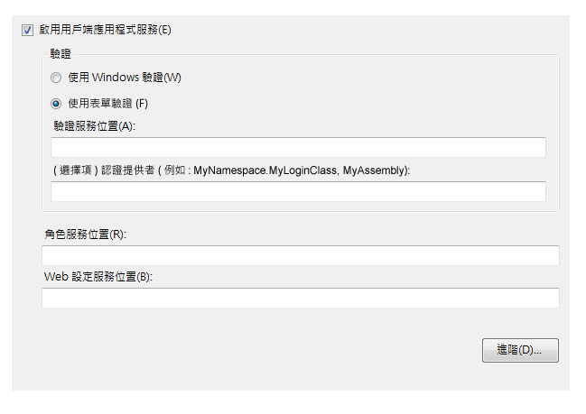
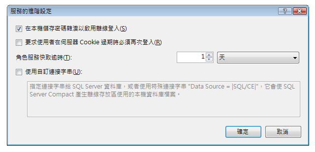

# <a name="how-to-configure-client-application-services"></a>如何：設定用戶端應用程式服務
本主題說明如何使用 [!INCLUDE[vsprvs](../../../includes/vsprvs-md.md)] [專案設計工具] 啟用及設定用戶端應用程式服務。 您可以使用用戶端應用程式服務來驗證使用者，以及從現有的 [!INCLUDE[ajax_current_short](../../../includes/ajax-current-short-md.md)] 應用程式服務擷取使用者角色和設定。 設定後，您可以依照[用戶端應用程式服務概觀](../../../docs/framework/common-client-technologies/client-application-services-overview.md)中所述，在應用程式程式碼中存取已啟用的服務。 如需 [!INCLUDE[ajax_current_short](../../../includes/ajax-current-short-md.md)] 應用程式服務的詳細資訊，請參閱 [ASP.NET 應用程式服務概觀](http://msdn.microsoft.com/library/1162e529-0d70-44b2-b3ab-83e60c695013)。  
  
 您可以在 [專案設計工具] 的 [服務] 頁面上，啟用及設定用戶端應用程式服務。 [服務] 頁面會更新專案之 App.config 檔中的值。 若要存取 [專案設計工具]，請使用 [專案] 功能表上的 [屬性] 命令。 如需 [服務] 頁面的詳細資訊，請參閱[專案設計工具、服務頁](https://msdn.microsoft.com/library/bb398109)。  
  
 下列程序說明如何執行用戶端應用程式服務的基本組態。 進階組態選項會在稍後的章節中進行說明。  
  
### <a name="to-configure-client-application-services"></a>設定用戶端應用程式服務  
  
1.  在 [方案總管] 中，選取專案節點，然後在 [專案] 功能表上按一下 [屬性]。  
  
     [專案設計工具] 隨即出現。  
  
2.  按一下 [服務] 索引標籤。[服務] 頁面會隨即顯示 (如下圖所示)。  
  
       
  
3.  在 [服務] 頁面上，選取 [啟用用戶端應用程式服務]。  
  
    > [!NOTE]
    >  用戶端應用程式服務需要完整版的 .NET Framework，且 .NET Framework 用戶端設定檔中不支援這些服務。 如果停用 [啟用用戶端應用程式服務] 核取方塊，請確認 [目標 Framework] 已設定為 .NET Framework 3.5 (含) 以後版本。 若要檢視 C# 中的 [目標 Framework]，請開啟 [專案設計工具]，然後按一下 [應用程式] 頁面。 若要檢視 Visual Basic 中的 [目標 Framework] 設定，請開啟 [專案設計工具]，並按一下 [編譯] 頁面，然後按一下 [進階編譯選項]。  
  
4.  如果您要提供自己的登入控制項或對話方塊，請選取 [使用表單驗證]，或選取 [使用 Windows 驗證] 使用作業系統提供的識別。 如需詳細資訊，請參閱[用戶端應用程式服務概觀](../../../docs/framework/common-client-technologies/client-application-services-overview.md)。  
  
    > [!NOTE]
    >  如果您選取 [使用 Windows 驗證]，用戶端應用程式服務會自動設定為使用 SQL Server Compact 資料庫。 這會在 [服務的進階設定] 對話方塊中表示 (如下一節所述)。 如果您接著選取 [使用表單驗證]，將不會自動清除 [使用自訂連接字串] 設定。 如果已產生用於 Windows 驗證的 [!INCLUDE[ssEW](../../../includes/ssew-md.md)] 資料庫，這可能會造成錯誤。 若要修正這些錯誤，請清除 [服務的進階設定] 對話方塊中的 [使用自訂連接字串] 設定。  
  
5.  如果您選取了 [使用表單驗證]，請在 [驗證服務位置] 方塊中，指定服務主機的 URL (不包含檔案名稱)。 設計工具會在將值寫入組態檔時，自動附加標準檔案名稱 (Authentication_JSON_AppService.axd)。  
  
6.  或者，如果您選取了 [使用表單驗證]，您可以在 [認證提供者] 方塊中指定值。 認證提供者必須實作 <xref:System.Web.ClientServices.Providers.IClientFormsAuthenticationCredentialsProvider> 介面。 您可以藉由使用認證提供者，將登入使用者介面與其他應用程式程式碼予以區隔。 這可以讓您建立單一登入對話方塊，以供在多個應用程式中使用。 如需詳細資訊，請參閱[如何：使用用戶端應用程式服務實作使用者登入](../../../docs/framework/common-client-technologies/how-to-implement-user-login-with-client-application-services.md)。  
  
     如果您指定認證提供者，則必須將其指定為組件限定的類型名稱。 如需詳細資訊，請參閱 <xref:System.Type.AssemblyQualifiedName%2A?displayProperty=nameWithType> 和[組件名稱](../../../docs/framework/app-domains/assembly-names.md)。 最簡單的組件限定類型名稱格式看起來會類似下列範例：  
  
    ```  
    MyNamespace.MyLoginClass, MyAssembly  
    ```  
  
7.  在 [角色服務位置] 和 [Web 設定服務位置] 文字方塊中，指定每個服務的服務位置 (不包含檔案名稱)。 設計工具會在將值寫入組態檔時，自動附加標準檔案名稱 (Role_JSON_AppService.axd 和 Profile_JSON_AppService.axd)。  
  
8.  或者，按一下 [進階] 修改進階設定，例如本機快取行為。 如需詳細資訊，請參閱下一個程序。  
  
## <a name="advanced-configuration"></a>進階組態  
 下列程序說明如何為較不常見的案例，設定用戶端應用程式服務。 例如，您可以針對部署在公用位置的應用程式使用這些組態選項，或使用加密的 SQL Server Compact 資料庫做為本機資料快取。  
  
#### <a name="to-configure-advanced-settings-for-client-application-services"></a>設定用戶端應用程式服務的進階設定  
  
1.  在 [專案設計工具] 的 [服務] 頁面上，按一下 [進階]。  
  
     [服務的進階設定] 對話方塊會隨即顯示 (如下圖所示)。 如需這個對話方塊的詳細資訊，請參閱[服務對話方塊的進階設定](/visualstudio/ide/reference/advanced-settings-for-services-dialog-box)。  
  
       
  
2.  選取或清除 [在本機儲存密碼雜湊以啟用離線登入]。 當您選取這個選項時，即會在本機以加密格式快取使用者的密碼。 如果您實作應用程式的離線模式，這個選項會很有用。 選取這個選項時，即使 <xref:System.Web.ClientServices.ConnectivityStatus.IsOffline%2A> 屬性已設定為 `true`，也可以驗證使用者。  
  
3.  選取或清除 [要求使用者在伺服器 Cookie 過期時必須再次登入]。 驗證 Cookie 會在遠端服務上設定，表示使用者登入保持使用中的時間長度。 如需如何設定 Cookie 的詳細資訊，請參閱[驗證的 forms 項目 (ASP.NET 設定結構描述)](http://msdn.microsoft.com/library/8163b8b5-ea6c-46c8-b5a9-c4c3de31c0b3) 中的 `timeout` 屬性。  
  
     如果您選取這個選項，在驗證 Cookie 過期後嘗試存取遠端角色或 Web 設定服務，將會擲回 <xref:System.Net.WebException>。 您可以處理這個例外狀況，然後顯示登入對話方塊以重新驗證使用者。 如需這個行為的範例，請參閱[逐步解說：使用用戶端應用程式服務](../../../docs/framework/common-client-technologies/walkthrough-using-client-application-services.md)。 您可以針對部署在公用位置的應用程式，使用這個選項來確保使用應用程式後讓應用程式繼續執行的使用者，不會無限期地保持已驗證的狀態。  
  
     如果您清除這個選項，然後在驗證 Cookie 過期後嘗試存取遠端服務，則會自動重新驗證使用者。  
  
4.  指定 [角色服務快取逾時] 的值。 請在角色經常更新時，將這個時間間隔設定為較小的值，並在角色不常更新時，將其設定為較大的值。 如果您實作離線模式，請將時間間隔設定為較大的值，以避免角色資訊在應用程式離線時過期。  
  
     當您呼叫 <xref:System.Web.Security.RolePrincipal.IsInRole%2A> 方法時，角色提供者會存取已快取的角色值或角色服務。 若要以程式設計方式重設快取，並強制執行這個方法以存取遠端服務，請呼叫 <xref:System.Web.ClientServices.Providers.ClientRoleProvider.ResetCache%2A> 方法。  
  
5.  選取或清除 [使用自訂連接字串]。 如需詳細資訊，請參閱下一個程序。  
  
#### <a name="to-configure-client-application-services-to-use-a-database-for-the-local-cache"></a>設定用戶端應用程式服務使用資料庫做為本機快取  
  
1.  在 [專案設計工具] 的 [服務] 頁面上，按一下 [進階]。  
  
     [服務的進階設定] 對話方塊會隨即顯示。  
  
2.  選取 [使用自訂連接字串]。  
  
     `Data Source = |SQL/CE|` 的預設值會顯示在文字方塊中。  
  
3.  若要產生並使用 SQL Server Compact 資料庫，請保留預設連接字串值。 [!INCLUDE[vsprvs](../../../includes/vsprvs-md.md)] 會產生資料庫檔案，並放入 <xref:System.Windows.Forms.Application.UserAppDataPath%2A?displayProperty=nameWithType> 屬性指示的目錄中。  
  
4.  若要產生並使用加密的 [!INCLUDE[ssEW](../../../includes/ssew-md.md)] 資料庫，請將 `password` 和 `encrypt database` 值加入至連接字串，如下列範例所示。  
  
    > [!NOTE]
    >  請務必指定強式密碼。 產生資料庫之後，便無法變更密碼。  
  
    ```  
    Data Source = |SQL/CE|;password=<password>;encrypt database=true  
    ```  
  
5.  若要使用您自己的 [!INCLUDE[ssNoVersion](../../../includes/ssnoversion-md.md)] 資料庫，請指定您自己的連接字串。 如需有效連接字串格式的詳細資訊，請參閱 [!INCLUDE[ssNoVersion](../../../includes/ssnoversion-md.md)] 文件。 這個資料庫不是自動產生的。 連接字串必須參考現有資料庫，您可以使用下列 SQL 陳述式建立這個資料庫。  
  
    ```  
    CREATE TABLE ApplicationProperties (PropertyName nvarchar(256),  
        PropertyValue nvarchar(256))  
    CREATE TABLE UserProperties (PropertyName nvarchar(256),  
        PropertyValue nvarchar(256))  
    CREATE TABLE Roles (UserName nvarchar(256),   
        RoleName nvarchar(256))  
    CREATE TABLE Settings (PropertyName nvarchar(256),   
        PropertyStoredAs nvarchar(1), PropertyValue nvarchar(2048))  
    ```  
  
## <a name="using-custom-providers"></a>使用自訂提供者  
 根據預設，用戶端應用程式服務功能會使用 <xref:System.Web.ClientServices.Providers?displayProperty=nameWithType> 命名空間中的提供者。 當您使用 [專案設計工具] 的 [服務] 頁面設定應用程式時，會將這些提供者的參考新增至您的 App.config 檔。 這些預設提供者會存取伺服器上的對應提供者。 Web 服務通常會設定為透過 <xref:System.Web.Security.SqlMembershipProvider> 和 <xref:System.Web.Security.SqlRoleProvider> 等提供者存取使用者資料。  
  
 如果您想要使用自訂服務提供者，通常會在伺服器端變更提供者，以便影響存取該伺服器的所有用戶端應用程式。 但是，您也可以選擇在用戶端使用非預設的提供者。 您可以在專案的 App.config 檔中指定自訂驗證或角色提供者，如下列程序所示。 如需如何建立自訂驗證和角色提供者的相關資訊，請參閱[實作成員資格提供者](http://msdn.microsoft.com/library/d8658b8e-c962-4f64-95e1-4acce35e4582)和[實作角色提供者](http://msdn.microsoft.com/library/851671ce-bf9b-43f2-aba4-bc9d28b11c7d)。 您也可以修改專案的 `Settings` 類別 (在 C# 中是當做 `Properties.Settings.Default` 存取，而在 `My.Settings` 中是當做 [!INCLUDE[vbprvb](../../../includes/vbprvb-md.md)] 存取)，以使用自訂設定提供者。 如需詳細資訊，請參閱[應用程式設定架構](../../../docs/framework/winforms/advanced/application-settings-architecture.md)。  
  
#### <a name="to-configure-client-application-services-to-use-non-default-providers"></a>設定用戶端應用程式服務使用非預設的提供者  
  
1.  若要使用非預設的驗證或角色服務提供者，請先使用 [服務] 頁面完成其他所有組態設定。  
  
2.  關閉 [專案設計工具]。 由於即使您未修改任何設定，[服務] 頁面也會自動更新您的 App.config 檔，因此這是必要步驟。 如果您依照這個程序所述，手動修改 App.config 檔，然後再返回 [服務] 頁面，則會重設您的修改。  
  
3.  在 [方案總管] 中，按兩下 App.config。  
  
     應用程式組態檔會隨即在文字編輯器中開啟。  
  
4.  在 `<providers>` 或 `<membership>` 項目中尋找 `<roleManager>` 項目。 這些項目是 `<system.web>` 項目的子項。 `<membership>` 項目可用來指定驗證提供者，而 `<roleManager>` 項目可用來指定角色提供者。  
  
5.  加入 `<add>` 項目以做為 `<providers>` 項目的子項。 您必須指定 `name` 和 `type` 屬性，如下列範例所示。 `type` 屬性值必須是組件限定的類型名稱。 如需詳細資訊，請參閱 <xref:System.Type.AssemblyQualifiedName%2A?displayProperty=nameWithType> 和[組件名稱](../../../docs/framework/app-domains/assembly-names.md)。  
  
    ```xml  
    <add name="MyCustomRoleProvider" type="MyNamespace.MyRoleProvider, MyAssembly" />  
    ```  
  
6.  修改 `defaultProvider` 或 `<membership>` 項目的 `<roleManager>` 屬性，指定您在上一個步驟中加入之 `<add>` 項目的名稱值。  
  
    ```xml  
    <roleManager enabled="true" defaultProvider="MyCustomRoleProvider">  
    ```  
  
## <a name="see-also"></a>請參閱  
 [用戶端應用程式服務](../../../docs/framework/common-client-technologies/client-application-services.md)  
 [用戶端應用程式服務概觀](../../../docs/framework/common-client-technologies/client-application-services-overview.md)  
 [專案設計工具、服務頁面](https://msdn.microsoft.com/library/bb398109)  
 [服務對話方塊的進階設定](/visualstudio/ide/reference/advanced-settings-for-services-dialog-box)  
 [如何：使用用戶端應用程式服務實作使用者登入](../../../docs/framework/common-client-technologies/how-to-implement-user-login-with-client-application-services.md)  
 [逐步解說：使用用戶端應用程式服務](../../../docs/framework/common-client-technologies/walkthrough-using-client-application-services.md)  
 [實作成員資格提供者](http://msdn.microsoft.com/library/d8658b8e-c962-4f64-95e1-4acce35e4582)  
 [實作角色提供者](http://msdn.microsoft.com/library/851671ce-bf9b-43f2-aba4-bc9d28b11c7d)  
 [應用程式設定架構](../../../docs/framework/winforms/advanced/application-settings-architecture.md)  
 [建立及設定 SQL Server 的應用程式服務資料庫](http://msdn.microsoft.com/library/ab894e83-7e2f-4af8-a116-b1bff8f815b2)
