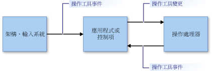

# 操作和慣性概觀Manipulations and Inertia Overview
「操作」可讓使用者使用「操作工具」來移動、旋轉和調整使用者介面 (UI) 項目大小。*Manipulations* enable users to move, rotate, and resize user interface (UI) elements by using *manipulators*. 操作工具代表滑鼠或 (在觸控式的情況下) 手寫筆或手指。A manipulator represents a mouse or (in a touch-enabled scenario) a stylus or a finger.  
  
 「慣性」藉由在項目上模擬摩擦力，可模擬移動的 UI 項目在真實世界中的行為。*Inertia* emulates real-world behavior for UI elements that are in motion by simulating friction forces on the elements. 這可讓項目在停止前逐漸減緩移動 (直線和有角度的方向)。This enables elements to gradually slow their movement (both linear and angular) before coming to a stop. 本文提供 .NET Framework 操作和慣性的簡介。This article provides an introduction to manipulations and inertia for the .NET Framework.  
  
## 操作Manipulations  
 操作視操作工具的集合為複合物件。A manipulation treats a collection of manipulators as a composite object. 應用程式可以追蹤複合物件的變更，而非個別元件的變更。An application can track the changes to the composite object instead of the individual components.  
  
 請考慮下圖中的影像。Consider the image in the following illustration. 使用者可以使用兩個操作工具來移動、旋轉和縮放影像。A user can use two manipulators to move, rotate, and scale the image. 對每個操作工具的變更會與其他操作工具一同被解譯。The changes to each manipulator are interpreted together with the other manipulators.  
  
 例如，如果您在影像上有兩個操作工具 (1 和 2)，且您以 +Y 方向 (下) 移動操作工具 1，則該影像的變更會取決於操作工具 2 產生的變化。For example, if you have two manipulators (1 and 2) on the image, and you move manipulator 1 in a +Y direction (down), the change to the image depends on what happens to manipulator 2. 如果操作工具 2 也以 +Y (下) 的方向移動，則該影像就會直接以 +Y 方向移動。If manipulator 2 also moves in the +Y direction (down), the image simply moves in the +Y direction. 但若操作工具 2 沒有變更，或以 -Y 方向 (上) 移動，則該影像會變小或旋轉。But if manipulator 2 does not change, or it moves in a -Y direction (up), the image is made smaller or rotated.  
  
   
  
 受兩個操作工具所管理的影像An image being manipulated by two manipulators  
  
 操作處理可提供監視操作工具子集的架構，並會解譯它們，如同一起動作，而非獨立地動作。Manipulation processing provides a framework that monitors a subset of manipulators and interprets them as if they are acting together, instead of independently. 您可以同時建立數個操作處理器物件，可在應用程式中操作每個 UI 項目。You can create several manipulation processor objects simultaneously, one for each UI element to be manipulated in an application. 會通知操作處理器要觀察哪個輸入裝置，並透過 [.NET 事件](https://msdn.microsoft.com/library/17sde2xt.aspx)報告操作。A manipulation processor is informed of which input devices to observe and it reports manipulations through [.NET events](https://msdn.microsoft.com/library/17sde2xt.aspx).  
  
 操作處理器沒有受管理之特定項目的資訊。A manipulation processor does not have information about the particular element that is being manipulated. 應用程式會各自將變更套用至特定應用程式項目。An application separately applies the changes to an application-specific element. 例如，應用程式將轉換套用至影像或重新繪製，在新的位置以新的大小或方向顯示。For example, an application applies transformations to an image or redraws it to display it at its new location or with a new size or orientation.  
  
 操作專為二維 (2-D) [仿射轉換](/windows/desktop/gdiplus/-gdiplus-transformations-use) (affine transformation) 所設計。Manipulations are designed for two-dimensional (2-D) [affine transformations](/windows/desktop/gdiplus/-gdiplus-transformations-use). 這些轉換包含平移、旋轉和縮放。These transformations include translate, rotate, and scale.  
  
### 操作的各部分Parts of a Manipulation  
 操作是 <xref:System.Windows.Input.Manipulations.Manipulator2D> 物件的集合。A manipulation is a collection of <xref:System.Windows.Input.Manipulations.Manipulator2D> objects. 此彙總的操作會由原點和橢圓形呈現。This aggregate manipulation is represented by an origin point and an ellipse. 原點是操控項目的所有操作工具的平均位置。The origin point is the average position of all manipulators that are manipulating an element. 此橢圓形的半徑為從原點到每個 <xref:System.Windows.Input.Manipulations.Manipulator2D> 物件的平均距離。The ellipse has a radius that is the average distance from the origin to each of the <xref:System.Windows.Input.Manipulations.Manipulator2D> objects.  
  
   
  
 兩個操作工具 (1 和 2)、一個原點和一個橢圓形可指定一項操作Two manipulators (1 and 2), an origin, and an ellipse specify a manipulation  
  
 加入、移動或移除 UI 項目的操作工具時，應用程式會呼叫 <xref:System.Windows.Input.Manipulations.ManipulationProcessor2D.ProcessManipulators%2A> 方法來更新 <xref:System.Windows.Input.Manipulations.ManipulationProcessor2D> 物件。As manipulators are added, moved, or removed for a UI element, an application updates the <xref:System.Windows.Input.Manipulations.ManipulationProcessor2D> object by calling the <xref:System.Windows.Input.Manipulations.ManipulationProcessor2D.ProcessManipulators%2A> method. 操作第一次開始時，會引發 <xref:System.Windows.Input.Manipulations.ManipulationProcessor2D.Started> 事件。When the manipulation first begins, the <xref:System.Windows.Input.Manipulations.ManipulationProcessor2D.Started> event is raised.  
  
> [!NOTE]
>  在以框架為基礎的更新環境中使用時，操作處理會更有效率。Manipulation processing is more efficient when used in a frame-based update environment. 當在 Microsoft XNA 應用程式中使用操作處理時，這不成問題，因為 XNA Framework 會使用 [Game.Update](https://msdn.microsoft.com/library/microsoft.xna.framework.game.update.aspx) 方法來提供以框架為基礎的更新。When using manipulation processing in a Microsoft XNA application, this is not a concern because the XNA framework provides frame-based updates using the [Game.Update](https://msdn.microsoft.com/library/microsoft.xna.framework.game.update.aspx) method. 在另一個環境中 (例如 WinForms)，您可能會需要提供您自己以框架為基礎的邏輯，以收集操作，並定期以批次方式傳送到 <xref:System.Windows.Input.Manipulations.ManipulationProcessor2D.ProcessManipulators%2A>。In another environment (such as WinForms), you might need to provide your own frame-based logic to collect manipulations and periodically send them to the <xref:System.Windows.Input.Manipulations.ManipulationProcessor2D.ProcessManipulators%2A> method as a batch.  
  
 當操作工具或其位置的數目變更時，會引發 <xref:System.Windows.Input.Manipulations.ManipulationProcessor2D.Delta> 事件。As the number of manipulators or their position change, the <xref:System.Windows.Input.Manipulations.ManipulationProcessor2D.Delta> event is raised. 傳遞至 <xref:System.Windows.Input.Manipulations.ManipulationProcessor2D.Delta> 事件處理常式的 <xref:System.Windows.Input.Manipulations.Manipulation2DDeltaEventArgs> 物件屬性會指定最後一個事件發生後原點、縮放、旋轉和轉譯的變更。Properties of the <xref:System.Windows.Input.Manipulations.Manipulation2DDeltaEventArgs> object that is passed to the <xref:System.Windows.Input.Manipulations.ManipulationProcessor2D.Delta> event handler specify changes in origin, scale, rotation, and translation that have occurred since the last event. 當操作工具移動時，以及當新增或移除操作工具時，就會變更操作的原點。The origin of the manipulation changes when manipulators move, and when manipulators are added or removed. 轉譯值指定此操作包含多少 X 或 Y 移動。Translation values specify how much X or Y movement the manipulation includes.  
  
 應用程式使用新的值來重新繪製 UI 項目。Using the new values, an application redraws the UI element.  
  
   
  
 操作工具 1 移動，並造成原點變更Manipulator 1 moves and causes the origin to change  
  
 從 <xref:System.Windows.Input.Manipulations.ManipulationProcessor2D> 物件中移除最後一個與操作相關聯的操作工具時，會引發 <xref:System.Windows.Input.Manipulations.ManipulationProcessor2D.Completed> 事件。When the last manipulator that is associated with the manipulation is removed from the <xref:System.Windows.Input.Manipulations.ManipulationProcessor2D> object, the <xref:System.Windows.Input.Manipulations.ManipulationProcessor2D.Completed> event is raised.  
  
### 操作處理模型The Manipulation Processing Model  
 操作處理器會使用直接使用方式模型。A manipulation processor uses a direct-usage model. 藉由這個簡單的模型，應用程式必須將任何輸入事件的詳細資料傳遞給操作處理器。With this simple model, an application must pass any input event details to the manipulation processor. 輸入的事件可能會由任何基本輸入所引發，例如滑鼠裝置、手寫筆或手指。An input event might be raised by any input primitive, such as a mouse device, a stylus, or a finger. 這個程序提供直接的篩選機制以及簡單的使用模型，讓應用程式在必要時可以批次輸入事件。This process provides a direct filtering mechanism and a simple usage model, so the application can batch input events when it is necessary.  
  
 對於要在操作程序中包含基本輸入的應用程式，它會從基本輸入的詳細資料建立 <xref:System.Windows.Input.Manipulations.Manipulator2D> 結構，並使用 <xref:System.Windows.Input.Manipulations.ManipulationProcessor2D.ProcessManipulators%2A> 方法將結構傳遞給操作處理器。For an application to include an input primitive in the manipulation process, it creates a <xref:System.Windows.Input.Manipulations.Manipulator2D> structure from the details of the input primitive, and passes the structure to the manipulation processor using the <xref:System.Windows.Input.Manipulations.ManipulationProcessor2D.ProcessManipulators%2A> method. 操作處理器接著會引發事件，其中應用程式必須適當地處理視覺化元件的更新。The manipulation processor then raises events, which the application must handle to update the visual component in an appropriate way.  
  
   
  
 操作處理模型The manipulation processing model  
  
## 慣性Inertia  
 慣性處理器可讓應用程式模擬真實世界行為，來外推位置、方向與其他 UI 項目的屬性。The inertia processor enables applications to extrapolate location, orientation, and other properties of a UI element by simulating real-world behavior.  
  
 例如，當使用者撥動項目，它可以繼續移動、減速，並慢慢停止。For instance, when a user flicks an element, it can continue moving, decelerate, and then slowly stop. 慣性處理器會實作此行為，讓仿射 2D 值 (原點、縮放、轉譯和旋轉) 在指定時間內以指定減速速率變更。The inertia processor implements this behavior by causing the affine 2-D values (origin, scale, translation, and rotation) to change over a specified time at a specified deceleration rate.  
  
 如同操作處理，慣性處理器並沒有任何特定 UI 項目的相關資訊。As with manipulation processing, an inertia processor does not have information about any particular UI element. 為了回應 <xref:System.Windows.Input.Manipulations.InertiaProcessor2D> 物件引發的事件，應用程式會分別將變更套用至應用程式特定的項目。In response to events that are raised on an <xref:System.Windows.Input.Manipulations.InertiaProcessor2D> object, an application separately applies the changes to an application-specific element.  
  
 慣性處理和操作處理通常一起使用。Inertia processing and manipulation processing are often used together. 其介面很類似，而且它們所引發的事件 (在某些情況下) 完全相同。Their interfaces are similar, and the events that they raise are (in some cases) identical. 一般而言，當 UI 項目操作完成時，就會開始慣性處理。Generally, inertia processing begins when the manipulation of the UI element is completed. 這透過接聽 <xref:System.Windows.Input.Manipulations.ManipulationProcessor2D.Completed> 事件和從事件處理常式啟動慣性處理而完成。This is accomplished by listening to the <xref:System.Windows.Input.Manipulations.ManipulationProcessor2D.Completed> event and starting the inertia processing from that event handler.  
  
## 請參閱See Also  
 <xref:System.Windows.Input.Manipulations>
