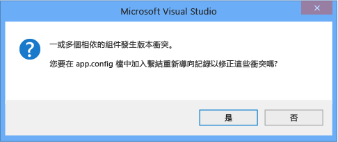

# <a name="how-to-enable-and-disable-automatic-binding-redirection"></a><span data-ttu-id="aa96c-102">作法：啟用和停用自動繫結重新導向</span><span class="sxs-lookup"><span data-stu-id="aa96c-102">How to: Enable and Disable Automatic Binding Redirection</span></span>

<span data-ttu-id="aa96c-103">當您在以 .NET Framework 4.5.1 和更新版本為目標的 Visual Studio 中編譯應用程式時，可能會自動將系結重新導向新增至應用程式佈建檔，以覆寫元件統一。</span><span class="sxs-lookup"><span data-stu-id="aa96c-103">When you compile apps in Visual Studio that target the .NET Framework 4.5.1 and later versions, binding redirects may be automatically added to the app configuration file to override assembly unification.</span></span> <span data-ttu-id="aa96c-104">如果您的應用程式或其元件參考相同組件的多個版本，即使您在應用程式的組態檔中手動指定繫結重新導向，仍會加入繫結重新導向。</span><span class="sxs-lookup"><span data-stu-id="aa96c-104">Binding redirects are added if your app or its components reference more than one version of the same assembly, even if you manually specify binding redirects in the configuration file for your app.</span></span> <span data-ttu-id="aa96c-105">自動系結重新導向功能會影響以 .NET Framework 4.5.1 或更新版本為目標的桌面應用程式和 web 應用程式，雖然 web 應用程式的行為稍有不同。</span><span class="sxs-lookup"><span data-stu-id="aa96c-105">The automatic binding redirection feature affects desktop apps and web apps that target the .NET Framework 4.5.1 or a later version, although the behavior is slightly different for a web app.</span></span> <span data-ttu-id="aa96c-106">如果您現有的應用程式是以舊版 .NET Framework 為目標，您可以啟用自動系結重新導向，如果您想要手動編寫系結重新導向，可以停用這項功能。</span><span class="sxs-lookup"><span data-stu-id="aa96c-106">You can enable automatic binding redirection if you have existing apps that target previous versions of the .NET Framework, or you can disable this feature if you want to manually author binding redirects.</span></span>

## <a name="disable-automatic-binding-redirects-in-desktop-apps"></a><span data-ttu-id="aa96c-107">在桌面應用程式中停用自動系結重新導向</span><span class="sxs-lookup"><span data-stu-id="aa96c-107">Disable automatic binding redirects in desktop apps</span></span>

<span data-ttu-id="aa96c-108">針對以 .NET Framework 4.5.1 和更新版本為目標的 Windows 桌面應用程式，預設會啟用自動系結重新導向。</span><span class="sxs-lookup"><span data-stu-id="aa96c-108">Automatic binding redirects are enabled by default for Windows desktop apps that target the .NET Framework 4.5.1 and later versions.</span></span> <span data-ttu-id="aa96c-109">編譯應用程式時，會將系結重新導向新增至輸出設定（**app.config**）檔案，並覆寫可能會發生的元件統一。</span><span class="sxs-lookup"><span data-stu-id="aa96c-109">The binding redirects are added to the output configuration (**app.config**) file when the app is compiled and override the assembly unification that might otherwise take place.</span></span> <span data-ttu-id="aa96c-110">未修改來源**app.config**檔案。</span><span class="sxs-lookup"><span data-stu-id="aa96c-110">The source **app.config** file is not modified.</span></span> <span data-ttu-id="aa96c-111">您可以藉由修改應用程式的專案檔，或在 Visual Studio 的專案屬性中取消勾選核取方塊，來停用這項功能。</span><span class="sxs-lookup"><span data-stu-id="aa96c-111">You can disable this feature by modifying the project file for the app or by deselecting a checkbox in the project's properties in Visual Studio.</span></span>

### <a name="disable-through-project-properties"></a><span data-ttu-id="aa96c-112">透過專案屬性停用</span><span class="sxs-lookup"><span data-stu-id="aa96c-112">Disable through project properties</span></span>

<span data-ttu-id="aa96c-113">如果您有 Visual Studio 2017 15.7 版或更新版本，您可以輕鬆地在專案的屬性頁中停用自動產生的系結重新導向。</span><span class="sxs-lookup"><span data-stu-id="aa96c-113">If you have Visual Studio 2017 version 15.7 or later, you can easily disable autogenerated binding redirects in the project's property pages.</span></span>

1. <span data-ttu-id="aa96c-114">以滑鼠右鍵按一下 [方案總管] 中的專案，然後選取 [屬性]。</span><span class="sxs-lookup"><span data-stu-id="aa96c-114">Right-click the project in **Solution Explorer** and select **Properties**.</span></span>

2. <span data-ttu-id="aa96c-115">在 [**應用程式**] 頁面上，取消核取 [**自動產生**系結重新導向] 選項。</span><span class="sxs-lookup"><span data-stu-id="aa96c-115">On the **Application** page, uncheck the **Auto-generate binding redirects** option.</span></span>

3. <span data-ttu-id="aa96c-116">按**Ctrl** + **S**以儲存變更。</span><span class="sxs-lookup"><span data-stu-id="aa96c-116">Press **Ctrl**+**S** to save the change.</span></span>

### <a name="disable-manually-in-the-project-file"></a><span data-ttu-id="aa96c-117">在專案檔中手動停用</span><span class="sxs-lookup"><span data-stu-id="aa96c-117">Disable manually in the project file</span></span>

1. <span data-ttu-id="aa96c-118">使用下列其中一種方法開啟專案檔進行編輯：</span><span class="sxs-lookup"><span data-stu-id="aa96c-118">Open the project file for editing using one of the following methods:</span></span>

   - <span data-ttu-id="aa96c-119">在 Visual Studio 中，選取**方案總管**中的專案，然後從快捷方式功能表選擇 [**在檔案瀏覽器中開啟資料夾**]。</span><span class="sxs-lookup"><span data-stu-id="aa96c-119">In Visual Studio, select the project in **Solution Explorer**, and then choose **Open Folder in File Explorer** from the shortcut menu.</span></span> <span data-ttu-id="aa96c-120">在 [檔案管理器] 中，尋找專案（.csproj 或. vbproj）檔案，然後在 [記事本] 中開啟。</span><span class="sxs-lookup"><span data-stu-id="aa96c-120">In File Explorer, find the project (.csproj or .vbproj) file and open it in Notepad.</span></span>
   - <span data-ttu-id="aa96c-121">在 Visual Studio 的**方案總管**中，以滑鼠右鍵按一下專案，然後選擇 **[卸載專案**]。</span><span class="sxs-lookup"><span data-stu-id="aa96c-121">In Visual Studio, in **Solution Explorer**, right-click the project and choose **Unload Project**.</span></span> <span data-ttu-id="aa96c-122">再次以滑鼠右鍵按一下卸載的專案，然後選擇 **[編輯 [專案名稱 .csproj]]** 。</span><span class="sxs-lookup"><span data-stu-id="aa96c-122">Right-click the unloaded project again, and then choose **Edit [projectname.csproj]**.</span></span>

2. <span data-ttu-id="aa96c-123">在專案檔中尋找下列屬性項目：</span><span class="sxs-lookup"><span data-stu-id="aa96c-123">In the project file, find the following property entry:</span></span>

   ```xml
   <AutoGenerateBindingRedirects>true</AutoGenerateBindingRedirects>
   ```

3. <span data-ttu-id="aa96c-124">將 `true` 變更為 `false`：</span><span class="sxs-lookup"><span data-stu-id="aa96c-124">Change `true` to `false`:</span></span>

   ```xml
   <AutoGenerateBindingRedirects>false</AutoGenerateBindingRedirects>
   ```

## <a name="enable-automatic-binding-redirects-manually"></a><span data-ttu-id="aa96c-125">手動啟用自動系結重新導向</span><span class="sxs-lookup"><span data-stu-id="aa96c-125">Enable automatic binding redirects manually</span></span>

<span data-ttu-id="aa96c-126">您可以在以舊版 .NET Framework 為目標的現有應用程式中啟用自動系結重新導向，或在不會自動提示您加入重新導向的情況下進行。</span><span class="sxs-lookup"><span data-stu-id="aa96c-126">You can enable automatic binding redirects in existing apps that target older versions of the .NET Framework, or in cases where you're not automatically prompted to add a redirect.</span></span> <span data-ttu-id="aa96c-127">如果您的目標是較新版本的 framework，但未自動提示您加入重新導向，您可能會取得建議您重新對應元件的組建輸出。</span><span class="sxs-lookup"><span data-stu-id="aa96c-127">If you're targeting a newer version of the framework but do not get automatically prompted to add a redirect, you'll likely get build output that suggests you remap assemblies.</span></span>

1. <span data-ttu-id="aa96c-128">使用下列其中一種方法開啟專案檔進行編輯：</span><span class="sxs-lookup"><span data-stu-id="aa96c-128">Open the project file for editing using one of the following methods:</span></span>

   - <span data-ttu-id="aa96c-129">在 Visual Studio 中，選取**方案總管**中的專案，然後從快捷方式功能表選擇 [**在檔案瀏覽器中開啟資料夾**]。</span><span class="sxs-lookup"><span data-stu-id="aa96c-129">In Visual Studio, select the project in **Solution Explorer**, and then choose **Open Folder in File Explorer** from the shortcut menu.</span></span> <span data-ttu-id="aa96c-130">在 [檔案管理器] 中，尋找專案（.csproj 或. vbproj）檔案，然後在 [記事本] 中開啟。</span><span class="sxs-lookup"><span data-stu-id="aa96c-130">In File Explorer, find the project (.csproj or .vbproj) file and open it in Notepad.</span></span>
   - <span data-ttu-id="aa96c-131">在 Visual Studio 的**方案總管**中，以滑鼠右鍵按一下專案，然後選擇 **[卸載專案**]。</span><span class="sxs-lookup"><span data-stu-id="aa96c-131">In Visual Studio, in **Solution Explorer**, right-click the project and choose **Unload Project**.</span></span> <span data-ttu-id="aa96c-132">再次以滑鼠右鍵按一下卸載的專案，然後選擇 **[編輯 [專案名稱 .csproj]]** 。</span><span class="sxs-lookup"><span data-stu-id="aa96c-132">Right-click the unloaded project again, and then choose **Edit [projectname.csproj]**.</span></span>

2. <span data-ttu-id="aa96c-133">將下列元素新增至第一個設定屬性群組（在\<PropertyGroup > 標記底下）：</span><span class="sxs-lookup"><span data-stu-id="aa96c-133">Add the following element to the first configuration property group (under the \<PropertyGroup> tag):</span></span>

   ```xml
   <AutoGenerateBindingRedirects>true</AutoGenerateBindingRedirects>
   ```

   <span data-ttu-id="aa96c-134">以下顯示已插入元素的範例專案檔：</span><span class="sxs-lookup"><span data-stu-id="aa96c-134">The following shows an example project file with the element inserted:</span></span>

   ```xml
   <?xml version="1.0" encoding="utf-8"?>
   <Project ToolsVersion="12.0" DefaultTargets="Build" xmlns="http://schemas.microsoft.com/developer/msbuild/2003">
     <Import Project="$(MSBuildExtensionsPath)\$(MSBuildToolsVersion)\Microsoft.Common.props" Condition="Exists('$(MSBuildExtensionsPath)\$(MSBuildToolsVersion)\Microsoft.Common.props')" />
     <PropertyGroup>
       <Configuration Condition=" '$(Configuration)' == '' ">Debug</Configuration>
       <Platform Condition=" '$(Platform)' == '' ">AnyCPU</Platform>
       <ProjectGuid>{123334}</ProjectGuid>
       ...
       <AutoGenerateBindingRedirects>true</AutoGenerateBindingRedirects>
     </PropertyGroup>
     ...
   </Project>
   ```

3. <span data-ttu-id="aa96c-135">編譯您的應用程式。</span><span class="sxs-lookup"><span data-stu-id="aa96c-135">Compile your app.</span></span>

## <a name="enable-automatic-binding-redirects-in-web-apps"></a><span data-ttu-id="aa96c-136">在 web 應用程式中啟用自動系結重新導向</span><span class="sxs-lookup"><span data-stu-id="aa96c-136">Enable automatic binding redirects in web apps</span></span>

<span data-ttu-id="aa96c-137">在 Web 應用程式中，自動繫結重新導向是以不同的方式實作。</span><span class="sxs-lookup"><span data-stu-id="aa96c-137">Automatic binding redirects are implemented differently for web apps.</span></span> <span data-ttu-id="aa96c-138">因為必須修改 web 應用程式的來源設定（**web.config**）檔案，所以不會自動將系結重新導向新增至設定檔。</span><span class="sxs-lookup"><span data-stu-id="aa96c-138">Because the source configuration (**web.config**) file must be modified for web apps, binding redirects are not automatically added to the configuration file.</span></span> <span data-ttu-id="aa96c-139">不過，如果發生繫結衝突，Visual Studio 會通知您，那麼您就可以加入繫結重新導向來解決衝突。</span><span class="sxs-lookup"><span data-stu-id="aa96c-139">However, Visual Studio notifies you of binding conflicts, and you can add binding redirects to resolve the conflicts.</span></span> <span data-ttu-id="aa96c-140">由於系統一律會提示您加入系結重新導向，因此您不需要明確停用 web 應用程式的這項功能。</span><span class="sxs-lookup"><span data-stu-id="aa96c-140">Because you're always prompted to add binding redirects, you don't need to explicitly disable this feature for a web app.</span></span>

<span data-ttu-id="aa96c-141">若要將系結重新導向加入至**web.config**檔案：</span><span class="sxs-lookup"><span data-stu-id="aa96c-141">To add binding redirects to a **web.config** file:</span></span>

1. <span data-ttu-id="aa96c-142">在 Visual Studio 中編譯應用程式，並檢查是否有建置警告。</span><span class="sxs-lookup"><span data-stu-id="aa96c-142">In Visual Studio, compile the app, and check for build warnings.</span></span>

   <span data-ttu-id="aa96c-143"></span><span class="sxs-lookup"><span data-stu-id="aa96c-143"></span></span>

2. <span data-ttu-id="aa96c-144">如果有組件繫結衝突，則會出現警告。</span><span class="sxs-lookup"><span data-stu-id="aa96c-144">If there are assembly binding conflicts, a warning appears.</span></span> <span data-ttu-id="aa96c-145">按兩下警告，或選取警告，然後按**enter**鍵。</span><span class="sxs-lookup"><span data-stu-id="aa96c-145">Double-click the warning, or select the warning and press **Enter**.</span></span>

   <span data-ttu-id="aa96c-146">可讓您自動將必要的系結重新導向加入至來源**web.config**檔案的對話方塊隨即出現。</span><span class="sxs-lookup"><span data-stu-id="aa96c-146">A dialog box that enables you to automatically add the necessary binding redirects to the source **web.config** file appears.</span></span>

   <span data-ttu-id="aa96c-147"></span><span class="sxs-lookup"><span data-stu-id="aa96c-147"></span></span>

## <a name="see-also"></a><span data-ttu-id="aa96c-148">另請參閱</span><span class="sxs-lookup"><span data-stu-id="aa96c-148">See also</span></span>

- [<span data-ttu-id="aa96c-149">\<bindingRedirect > 元素</span><span class="sxs-lookup"><span data-stu-id="aa96c-149">\<bindingRedirect> Element</span></span>](./file-schema/runtime/bindingredirect-element.md)
- [<span data-ttu-id="aa96c-150">重新導向組件版本</span><span class="sxs-lookup"><span data-stu-id="aa96c-150">Redirecting Assembly Versions</span></span>](redirect-assembly-versions.md)
