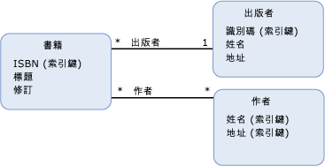

# 關聯 End 多重性association end multiplicity
*關聯 end 多重性*定義數目[實體類型](../../../../docs/framework/data/adonet/entity-type.md)可能是其中一端的執行個體[關聯](../../../../docs/framework/data/adonet/association-type.md)。*Association end multiplicity* defines the number of [entity type](../../../../docs/framework/data/adonet/entity-type.md) instances that can be at one end of an [association](../../../../docs/framework/data/adonet/association-type.md).  
  
 關聯 End 多重性可以具有下列其中一個值：An association end multiplicity can have one of the following values:  
  
-   一 (1)：表示關聯 End 只存在唯一的一個實體類型執行個體。one (1): Indicates that exactly one entity type instance exists at the association end.  
  
-   零或一 (0..1)：表示關聯 End 具有零個或一個實體類型執行個體。zero or one (0..1): Indicates that zero or one entity type instances exist at the association end.  
  
-   許多 (*)：表示關聯 End 具有零個、一個或多個實體類型執行個體。many (*): Indicates that zero, one, or more entity type instances exist at the association end.  
  
 關聯通常以其關聯 End 多重性來區分。An association is often characterized by its association end multiplicities. 例如，如果關聯的 End 具有多重性一 (0) 和許多 (*)，則該關聯稱為一對多關聯。For example, if the ends of an association have multiplicities one (1) and many (*), the association is called a one-to-many association. 在下列範例中，`PublishedBy` 關聯集為一對多關聯 (一個發行者發行許多書籍，以及一本書籍由一個發行者發行)。In the example below, the `PublishedBy` association is a one-to-many association (a publisher publishes many books and a book is published by one publisher). `WrittenBy` 關聯式多對多關聯 (一本書可以有多位作者，一位作者可以撰寫許多本書)。The `WrittenBy` association is a many-to-many association (a book can have multiple authors and an author can write multiple books).  
  
## 範例Example  
 下圖顯示包含兩個關聯 (`PublishedBy` 和 `WrittenBy`) 的概念模型。The diagram below shows a conceptual model with two associations: `PublishedBy` and `WrittenBy`. `PublishedBy` 關聯的關聯 End 為 `Book` 和 `Publisher` 實體類型。The association ends for the `PublishedBy` association are the `Book` and `Publisher` entity types. `Publisher` 端的多重性是一 (1)，而 `Book` 端的多重性則是多個 (*)。The multiplicity of the `Publisher` end is one (1) and the multiplicity of the `Book` end is many (*).  
  
   
  
 ADO.NET Entity Framework 會使用稱為概念結構定義語言的特定領域語言 (DSL) ([CSDL](../../../../docs/framework/data/adonet/ef/language-reference/csdl-specification.md)) 來定義概念模型。The ADO.NET Entity Framework uses a domain-specific language (DSL) called conceptual schema definition language ([CSDL](../../../../docs/framework/data/adonet/ef/language-reference/csdl-specification.md)) to define conceptual models. 下列 CSDL 定義上圖中的 `PublishedBy` 關聯。The following CSDL defines the `PublishedBy` association shown in the diagram above:  
  
 [!code-xml[EDM_Example_Model#AssociationExample](../../../../samples/snippets/xml/VS_Snippets_Data/edm_example_model/xml/books.edmx#associationexample)]  
  
## 請參閱See Also  
 [實體資料模型索引鍵概念Entity Data Model Key Concepts](../../../../docs/framework/data/adonet/entity-data-model-key-concepts.md)  
 [實體資料模型Entity Data Model](../../../../docs/framework/data/adonet/entity-data-model.md)
