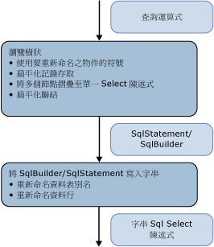

# <a name="architecture-and-design"></a><span data-ttu-id="28315-102">架構與設計</span><span class="sxs-lookup"><span data-stu-id="28315-102">Architecture and Design</span></span>
<span data-ttu-id="28315-103">中的 SQL 產生模組[範例提供者](https://go.microsoft.com/fwlink/?LinkId=180616)會實作成運算式樹狀架構表示的命令樹上的造訪者。</span><span class="sxs-lookup"><span data-stu-id="28315-103">The SQL generation module in the [Sample Provider](https://go.microsoft.com/fwlink/?LinkId=180616) is implemented as a visitor on the expression tree that represents the command tree.</span></span> <span data-ttu-id="28315-104">此產生作業是透過運算式樹狀，在單一行程中完成。</span><span class="sxs-lookup"><span data-stu-id="28315-104">The generation is done in a single pass over the expression tree.</span></span>  
  
 <span data-ttu-id="28315-105">樹狀結構節點的處理方式是由下而上。</span><span class="sxs-lookup"><span data-stu-id="28315-105">The nodes of the tree are processed from the bottom up.</span></span> <span data-ttu-id="28315-106">首先，系統會產生中繼結構：SqlSelectStatement 或 SqlBuilder (都會實作 ISqlFragment)。</span><span class="sxs-lookup"><span data-stu-id="28315-106">First, an intermediate structure is produced: SqlSelectStatement or SqlBuilder, both implementing ISqlFragment.</span></span> <span data-ttu-id="28315-107">接著，系統會根據該結構產生 SQL 陳述式字串。</span><span class="sxs-lookup"><span data-stu-id="28315-107">Next, the string SQL statement is produced from that structure.</span></span> <span data-ttu-id="28315-108">使用中繼結構的原因有兩個：</span><span class="sxs-lookup"><span data-stu-id="28315-108">There are two reasons for the intermediate structure:</span></span>  
  
-   <span data-ttu-id="28315-109">就邏輯上來說，SQL SELECT 陳述式會以不按照順序的方式擴展。</span><span class="sxs-lookup"><span data-stu-id="28315-109">Logically, a SQL SELECT statement is populated out of order.</span></span> <span data-ttu-id="28315-110">系統會先造訪參與 FROM 子句的節點，然後再造訪參與 WHERE、GROUP BY 和 ORDER BY 子句的節點。</span><span class="sxs-lookup"><span data-stu-id="28315-110">The nodes that participate in the FROM clause are visited before the nodes that participate in the WHERE, GROUP BY, and the ORDER BY clause.</span></span>  
  
-   <span data-ttu-id="28315-111">若要重新命名別名，您必須識別所有使用的別名，才能避免在重新命名期間發生衝突。</span><span class="sxs-lookup"><span data-stu-id="28315-111">To rename aliases, you must identify all used aliases to avoid collisions during renaming.</span></span> <span data-ttu-id="28315-112">若要在 SqlBuilder 中延後重新命名選擇，請使用 Symbol 物件來代表成為重新命名候選的資料行。</span><span class="sxs-lookup"><span data-stu-id="28315-112">To defer the renaming choices in SqlBuilder, use Symbol objects to represent the columns that are candidates for renaming.</span></span>  
  
 <span data-ttu-id="28315-113"></span><span class="sxs-lookup"><span data-stu-id="28315-113"></span></span>  
  
 <span data-ttu-id="28315-114">在第一個階段中，造訪運算式樹狀時，運算式會組成 SqlSelectStatement、聯結會扁平化，而且聯結別名也會扁平化。</span><span class="sxs-lookup"><span data-stu-id="28315-114">In the first phase, while visiting the expression tree, expressions are grouped into SqlSelectStatements, joins are flattened, and join aliases are flattened.</span></span> <span data-ttu-id="28315-115">在這個行程中，Symbol 物件代表可重新命名的資料行或輸入別名。</span><span class="sxs-lookup"><span data-stu-id="28315-115">During this pass, Symbol objects represent columns or input aliases that may be renamed.</span></span>  
  
 <span data-ttu-id="28315-116">在第二個階段中，產生實際字串時，就會重新命名別名。</span><span class="sxs-lookup"><span data-stu-id="28315-116">In the second phase, while producing the actual string, aliases are renamed.</span></span>  
  
## <a name="data-structures"></a><span data-ttu-id="28315-117">資料結構</span><span class="sxs-lookup"><span data-stu-id="28315-117">Data Structures</span></span>  
 <span data-ttu-id="28315-118">本章節將討論使用中的型別[範例提供者](https://go.microsoft.com/fwlink/?LinkId=180616)您用於建立 SQL 陳述式。</span><span class="sxs-lookup"><span data-stu-id="28315-118">This section discusses the types used in the [Sample Provider](https://go.microsoft.com/fwlink/?LinkId=180616) that you use to build a SQL statement.</span></span>  
  
### <a name="isqlfragment"></a><span data-ttu-id="28315-119">ISqlFragment</span><span class="sxs-lookup"><span data-stu-id="28315-119">ISqlFragment</span></span>  
 <span data-ttu-id="28315-120">本節內容涵蓋了實作 ISqlFragment 介面的類別，而這個介面具有兩種用途：</span><span class="sxs-lookup"><span data-stu-id="28315-120">This section covers the classes that implement the ISqlFragment interface, which serves two purposes:</span></span>  
  
-   <span data-ttu-id="28315-121">當做所有造訪者方法的一般傳回型別。</span><span class="sxs-lookup"><span data-stu-id="28315-121">A common return type for all the visitor methods.</span></span>  
  
-   <span data-ttu-id="28315-122">提供寫入最終 SQL 字串的方法。</span><span class="sxs-lookup"><span data-stu-id="28315-122">Gives a method to write the final SQL string.</span></span>  
  
```  
internal interface ISqlFragment {  
   void WriteSql(SqlWriter writer, SqlGenerator sqlGenerator);  
}  
```  
  
#### <a name="sqlbuilder"></a><span data-ttu-id="28315-123">SqlBuilder</span><span class="sxs-lookup"><span data-stu-id="28315-123">SqlBuilder</span></span>  
 <span data-ttu-id="28315-124">SqlBuilder 是一種最終 SQL 字串的蒐集裝置，與 StringBuilder 很相似。</span><span class="sxs-lookup"><span data-stu-id="28315-124">SqlBuilder is a gathering device for the final SQL string, similar to StringBuilder.</span></span> <span data-ttu-id="28315-125">它包含了組成最終 SQL 的字串，以及可轉換成字串的 ISqlFragment。</span><span class="sxs-lookup"><span data-stu-id="28315-125">It consists of the strings that make up the final SQL, along with ISqlFragments that can be converted into strings.</span></span>  
  
```  
internal sealed class SqlBuilder : ISqlFragment {  
   public void Append(object s)  
   public void AppendLine()  
   public bool IsEmpty  
}  
```  
  
#### <a name="sqlselectstatement"></a><span data-ttu-id="28315-126">SqlSelectStatement</span><span class="sxs-lookup"><span data-stu-id="28315-126">SqlSelectStatement</span></span>  
 <span data-ttu-id="28315-127">SqlSelectStatement 代表標準 SQL SELECT 陳述式的圖形"SELECT...</span><span class="sxs-lookup"><span data-stu-id="28315-127">SqlSelectStatement represents a canonical SQL SELECT statement of the shape "SELECT …</span></span> <span data-ttu-id="28315-128">從...</span><span class="sxs-lookup"><span data-stu-id="28315-128">FROM  ..</span></span> <span data-ttu-id="28315-129">WHERE...</span><span class="sxs-lookup"><span data-stu-id="28315-129">WHERE …</span></span> <span data-ttu-id="28315-130">分組依據...</span><span class="sxs-lookup"><span data-stu-id="28315-130">GROUP BY …</span></span> <span data-ttu-id="28315-131">ORDER BY。 」</span><span class="sxs-lookup"><span data-stu-id="28315-131">ORDER BY".</span></span>  
  
 <span data-ttu-id="28315-132">其中每個 SQL 子句都由 StringBuilder 表示。</span><span class="sxs-lookup"><span data-stu-id="28315-132">Each of the SQL clauses is represented by a StringBuilder.</span></span> <span data-ttu-id="28315-133">此外，它會追蹤是否已經指定 Distinct 以及此陳述式是否為最上層。</span><span class="sxs-lookup"><span data-stu-id="28315-133">In addition, it tracks whether Distinct has been specified and whether the statement is topmost.</span></span> <span data-ttu-id="28315-134">如果此陳述式不是最上層，除非此陳述式也具有 TOP 子句，否則就會省略 ORDER BY 子句。</span><span class="sxs-lookup"><span data-stu-id="28315-134">If the statement is not topmost, the ORDER BY clause is omitted unless the statement also has a TOP clause.</span></span>  
  
 <span data-ttu-id="28315-135">FromExtents 包含 SELECT 陳述式的輸入清單。</span><span class="sxs-lookup"><span data-stu-id="28315-135">FromExtents contains the list of inputs for the SELECT statement.</span></span> <span data-ttu-id="28315-136">不過，這個清單通常只有一個項目。</span><span class="sxs-lookup"><span data-stu-id="28315-136">There is usually just one element in this.</span></span> <span data-ttu-id="28315-137">聯結的 SELECT 陳述式可能會暫時具有多個項目。</span><span class="sxs-lookup"><span data-stu-id="28315-137">SELECT statements for joins may temporarily have more than one element.</span></span>  
  
 <span data-ttu-id="28315-138">如果 SELECT 陳述式是由聯結節點所建立，SqlSelectStatement 就會維護已經在 AllJoinExtents 之聯結中扁平化的所有範圍清單。</span><span class="sxs-lookup"><span data-stu-id="28315-138">If the SELECT statement is created by a Join node, SqlSelectStatement maintains a list of all the extents that have been flattened in the join in AllJoinExtents.</span></span> <span data-ttu-id="28315-139">OuterExtents 代表 SqlSelectStatement 的外部參考，用於輸入別名重新命名。</span><span class="sxs-lookup"><span data-stu-id="28315-139">OuterExtents represents outer references of the SqlSelectStatement and is used for input alias renaming.</span></span>  
  
```  
internal sealed class SqlSelectStatement : ISqlFragment {  
   internal bool IsDistinct { get, set };  
   internal bool IsTopMost  
  
   internal List<Symbol> AllJoinExtents { get, set };  
   internal List<Symbol> FromExtents { get};  
   internal Dictionary<Symbol, bool> OuterExtents { get};  
  
   internal TopClause Top { get, set };  
  
   internal SqlBuilder Select {get};  
   internal SqlBuilder From  
   internal SqlBuilder Where  
   internal SqlBuilder GroupBy  
   public SqlBuilder OrderBy  
}  
```  
  
#### <a name="topclause"></a><span data-ttu-id="28315-140">TopClause</span><span class="sxs-lookup"><span data-stu-id="28315-140">TopClause</span></span>  
 <span data-ttu-id="28315-141">TopClause 代表 SqlSelectStatement 中的 TOP 運算式。</span><span class="sxs-lookup"><span data-stu-id="28315-141">TopClause represents the TOP expression in a SqlSelectStatement.</span></span> <span data-ttu-id="28315-142">TopCount 屬性會指出應該選取多少個 TOP 資料列。</span><span class="sxs-lookup"><span data-stu-id="28315-142">The TopCount property indicates how many TOP rows should be selected.</span></span>  <span data-ttu-id="28315-143">當 WithTies 為 true 時，就會根據 DbLimitExpession 建置 TopClause。</span><span class="sxs-lookup"><span data-stu-id="28315-143">When WithTies is true, the TopClause was built from a DbLimitExpession.</span></span>  
  
```  
class TopClause : ISqlFragment {  
   internal bool WithTies {get}  
   internal ISqlFragment TopCount {get}  
   internal TopClause(ISqlFragment topCount, bool withTies)  
   internal TopClause(int topCount, bool withTies)  
}  
```  
  
### <a name="symbols"></a><span data-ttu-id="28315-144">符號</span><span class="sxs-lookup"><span data-stu-id="28315-144">Symbols</span></span>  
 <span data-ttu-id="28315-145">Symbol 相關類別和符號表會執行輸入別名重新命名、聯結別名扁平化和資料行別名重新命名。</span><span class="sxs-lookup"><span data-stu-id="28315-145">The Symbol-related classes and the symbol table perform input alias renaming, join alias flattening, and column alias renaming.</span></span>  
  
 <span data-ttu-id="28315-146">Symbol 類別代表範圍、巢狀 SELECT 陳述式或資料行。</span><span class="sxs-lookup"><span data-stu-id="28315-146">The Symbol class represents an extent, a nested SELECT statement, or a column.</span></span> <span data-ttu-id="28315-147">它會用來取代實際別名，以便在使用此類別之後允許重新命名，而且也帶有它所代表之成品的其他資訊 (例如型別)。</span><span class="sxs-lookup"><span data-stu-id="28315-147">It is used instead of an actual alias to allow for renaming after it has been used and it also carries additional information for the artifact it represents (like the type).</span></span>  
  
```  
class Symbol : ISqlFragment {  
   internal Dictionary<string, Symbol> Columns {get}  
   internal bool NeedsRenaming {get, set}  
   internal bool IsUnnest {get, set}   //not used  
  
   public string Name{get}  
   public string NewName {get,set}  
   internal TypeUsage Type {get, set}  
  
   public Symbol(string name, TypeUsage type)  
}  
```  
  
 <span data-ttu-id="28315-148">Name 會儲存所代表之範圍、巢狀 SELECT 陳述式或資料行的原始別名。</span><span class="sxs-lookup"><span data-stu-id="28315-148">Name stores the original alias for the represented extent, nested SELECT statement, or a column.</span></span>  
  
 <span data-ttu-id="28315-149">NewName 會儲存將用於 SQL SELECT 陳述式的別名。</span><span class="sxs-lookup"><span data-stu-id="28315-149">NewName stores the alias that will be used in the SQL SELECT statement.</span></span> <span data-ttu-id="28315-150">它原本設定為 Name，而且只有在產生最終字串查詢時，才會視需要重新命名。</span><span class="sxs-lookup"><span data-stu-id="28315-150">It is originally set to Name, and only renamed if needed when generating the final string query.</span></span>  
  
 <span data-ttu-id="28315-151">Type 僅適用於代表範圍和巢狀 SELECT 陳述式的符號。</span><span class="sxs-lookup"><span data-stu-id="28315-151">Type is only useful for symbols representing extents and nested SELECT statements.</span></span>  
  
#### <a name="symbolpair"></a><span data-ttu-id="28315-152">SymbolPair</span><span class="sxs-lookup"><span data-stu-id="28315-152">SymbolPair</span></span>  
 <span data-ttu-id="28315-153">SymbolPair 類別會處理記錄扁平化。</span><span class="sxs-lookup"><span data-stu-id="28315-153">The SymbolPair class addresses record flattening.</span></span>  
  
 <span data-ttu-id="28315-154">以屬性運算式 D(v, "j3.j2.j1.a.x") 為例，其中 v 是 VarRef、j1、j2 和 j3 是聯結、a 是範圍，而 x 是資料行。</span><span class="sxs-lookup"><span data-stu-id="28315-154">Consider a property expression D(v, "j3.j2.j1.a.x") where v is a VarRef, j1, j2, j3 are joins, a is an extent, and x is a columns.</span></span>  
  
 <span data-ttu-id="28315-155">這個運算式最後必須轉譯成 {j'}.{x'}。</span><span class="sxs-lookup"><span data-stu-id="28315-155">This has to be translated eventually into {j'}.{x'}.</span></span> <span data-ttu-id="28315-156">Source 欄位代表最外層的 SqlStatement，而後者代表聯結運算式 (例如 j2)。這一定是聯結符號。</span><span class="sxs-lookup"><span data-stu-id="28315-156">The source field represents the outermost SqlStatement, representing a join expression (say j2); this is always a Join symbol.</span></span> <span data-ttu-id="28315-157">Column 欄位會從某個聯結符號移至下一個聯結符號，直到它停止於非聯結符號為止。</span><span class="sxs-lookup"><span data-stu-id="28315-157">The column field moves from one join symbol to the next until it stops at a non-join symbol.</span></span> <span data-ttu-id="28315-158">這個運算式會在造訪 DbPropertyExpression 時傳回，但是絕對不會加入至 SqlBuilder。</span><span class="sxs-lookup"><span data-stu-id="28315-158">This is returned when visiting a DbPropertyExpression but is never added to a SqlBuilder.</span></span>  
  
```  
class SymbolPair : ISqlFragment {  
   public Symbol Source;  
   public Symbol Column;  
   public SymbolPair(Symbol source, Symbol column)  
}  
```  
  
#### <a name="joinsymbol"></a><span data-ttu-id="28315-159">JoinSymbol</span><span class="sxs-lookup"><span data-stu-id="28315-159">JoinSymbol</span></span>  
 <span data-ttu-id="28315-160">聯結符號是指代表具有聯結或聯結輸入之巢狀 SELECT 陳述式的符號。</span><span class="sxs-lookup"><span data-stu-id="28315-160">A Join symbol is a Symbol that represents a nested SELECT statement with a join or a join input.</span></span>  
  
```  
internal sealed class JoinSymbol : Symbol {  
   internal List<Symbol> ColumnList {get, set}  
   internal List<Symbol> ExtentList {get}  
   internal List<Symbol> FlattenedExtentList {get, set}  
   internal Dictionary<string, Symbol> NameToExtent {get}  
   internal bool IsNestedJoin {get, set}  
  
   public JoinSymbol(string name, TypeUsage type, List<Symbol> extents)  
}  
```  
  
 <span data-ttu-id="28315-161">如果這個符號代表 SQL SELECT 陳述式，ColumnList 就會代表 SELECT 子句中的資料行清單。</span><span class="sxs-lookup"><span data-stu-id="28315-161">ColumnList represents the list of columns in the SELECT clause if this symbol represents a SQL SELECT statement.</span></span> <span data-ttu-id="28315-162">ExtentList 是指 SELECT 子句中的範圍清單。</span><span class="sxs-lookup"><span data-stu-id="28315-162">ExtentList is the list of extents in the SELECT clause.</span></span> <span data-ttu-id="28315-163">如果此聯結具有多個在最上層扁平化的範圍，FlattenedExtentList 就會追蹤這些範圍，以便確保範圍別名正確重新命名。</span><span class="sxs-lookup"><span data-stu-id="28315-163">If the join has multiple extents flattened at the top level, FlattenedExtentList tracks the extents to ensure that extent aliases are renamed correctly.</span></span>  
  
 <span data-ttu-id="28315-164">NameToExtent 具有 ExtentList 中的所有範圍做為字典。</span><span class="sxs-lookup"><span data-stu-id="28315-164">NameToExtent has all the extents in ExtentList as a dictionary.</span></span> <span data-ttu-id="28315-165">IsNestedJoin 是用來判斷 JoinSymbol 是一般聯結符號，還是具有對應 SqlSelectStatement 的聯結符號。</span><span class="sxs-lookup"><span data-stu-id="28315-165">IsNestedJoin is used to determine whether a JoinSymbol is an ordinary join symbol or one that has a corresponding SqlSelectStatement.</span></span>  
  
 <span data-ttu-id="28315-166">所有清單只會設定一次，然後再用於查閱或列舉。</span><span class="sxs-lookup"><span data-stu-id="28315-166">All the lists are set exactly once and then used for lookups or enumeration.</span></span>  
  
#### <a name="symboltable"></a><span data-ttu-id="28315-167">SymbolTable</span><span class="sxs-lookup"><span data-stu-id="28315-167">SymbolTable</span></span>  
 <span data-ttu-id="28315-168">SymbolTable 是用來將變數名稱解析成符號。</span><span class="sxs-lookup"><span data-stu-id="28315-168">SymbolTable is used to resolve variable names to Symbols.</span></span> <span data-ttu-id="28315-169">SymbolTable 會實作成堆疊，而且每個範圍都有新的項目。</span><span class="sxs-lookup"><span data-stu-id="28315-169">SymbolTable is implemented as a stack with a new entry for each scope.</span></span> <span data-ttu-id="28315-170">查閱會從堆疊頂端搜尋到底部，直到找到項目為止。</span><span class="sxs-lookup"><span data-stu-id="28315-170">Lookups search from the top of the stack to the bottom until an entry is found.</span></span>  
  
```  
internal sealed class SymbolTable {  
   internal void EnterScope()  
   internal void ExitScope()  
   internal void Add(string name, Symbol value)  
   internal Symbol Lookup(string name)  
}  
```  
  
 <span data-ttu-id="28315-171">SQL 產生模組的每個執行個體都只有一個 SymbolTable。</span><span class="sxs-lookup"><span data-stu-id="28315-171">There is only one SymbolTable per one instance of the Sql Generation module.</span></span> <span data-ttu-id="28315-172">系統會針對每個關聯節點進入並退出範圍。</span><span class="sxs-lookup"><span data-stu-id="28315-172">Scopes are entered and exited for each relational node.</span></span> <span data-ttu-id="28315-173">除非具有相同名稱的其他符號隱藏了範圍，否則先前範圍中的所有符號都會顯示給後續範圍查看。</span><span class="sxs-lookup"><span data-stu-id="28315-173">All symbols in earlier scopes are visible to later scopes unless hidden by other symbols with the same name.</span></span>  
  
### <a name="global-state-for-the-visitor"></a><span data-ttu-id="28315-174">造訪者的全域狀態</span><span class="sxs-lookup"><span data-stu-id="28315-174">Global State for the Visitor</span></span>  
 <span data-ttu-id="28315-175">若要協助重新命名別名和資料行，請維護已經透過查詢樹狀結構在第一個行程中使用的所有資料行名稱 (AllColumnNames) 和範圍別名 (AllExtentNames) 清單。</span><span class="sxs-lookup"><span data-stu-id="28315-175">To assist in renaming of aliases and columns, maintain a list of all the column names (AllColumnNames) and extent aliases (AllExtentNames) that have been used in the first pass over the query tree.</span></span>  <span data-ttu-id="28315-176">符號表會將變數名稱解析成符號。</span><span class="sxs-lookup"><span data-stu-id="28315-176">The symbol table resolves variable names to Symbols.</span></span> <span data-ttu-id="28315-177">IsVarRefSingle 僅用於驗證目的，並非絕對必要。</span><span class="sxs-lookup"><span data-stu-id="28315-177">IsVarRefSingle is only used for verification purposes, it is not strictly necessary.</span></span>  
  
 <span data-ttu-id="28315-178">經由 CurrentSelectStatement 和 IsParentAJoin 使用的兩個堆疊會用來將「參數」從父節點傳遞至子節點，因為造訪者模式不允許我們傳遞參數。</span><span class="sxs-lookup"><span data-stu-id="28315-178">The two stacks used via CurrentSelectStatement and IsParentAJoin are used to pass "parameters" from parent to child nodes, since the visitor pattern does not allow us to pass parameters.</span></span>  
  
```  
internal Dictionary<string, int> AllExtentNames {get}  
internal Dictionary<string, int> AllColumnNames {get}  
SymbolTable symbolTable = new SymbolTable();  
bool isVarRefSingle = false;  
  
Stack<SqlSelectStatement> selectStatementStack;  
private SqlSelectStatement CurrentSelectStatement{get}  
  
Stack<bool> isParentAJoinStack;  
private bool IsParentAJoin{get}  
```  
  
## <a name="common-scenarios"></a><span data-ttu-id="28315-179">常見案例</span><span class="sxs-lookup"><span data-stu-id="28315-179">Common Scenarios</span></span>  
 <span data-ttu-id="28315-180">本節將討論常見的提供者案例。</span><span class="sxs-lookup"><span data-stu-id="28315-180">This section discusses common provider scenarios.</span></span>  
  
### <a name="grouping-expression-nodes-into-sql-statements"></a><span data-ttu-id="28315-181">將運算式節點組成 SQL 陳述式</span><span class="sxs-lookup"><span data-stu-id="28315-181">Grouping Expression Nodes into SQL Statements</span></span>  
 <span data-ttu-id="28315-182">由下而上造訪樹狀結構時，如果遇到第一個關聯節點 (通常是 DbScanExpression 範圍)，就會建立 SqlSelectStatement。</span><span class="sxs-lookup"><span data-stu-id="28315-182">A SqlSelectStatement is created when the first relational node is encountered (typically a DbScanExpression extent) when visiting the tree from the bottom up.</span></span> <span data-ttu-id="28315-183">若要產生巢狀查詢越少越好的 SQL SELECT 陳述式，請在該 SqlSelectStatement 中盡可能彙總其父節點 (越多越好)。</span><span class="sxs-lookup"><span data-stu-id="28315-183">To produce a SQL SELECT statement with as few nested queries as possible, aggregate as many of its parent nodes as possible in that SqlSelectStatement.</span></span>  
  
 <span data-ttu-id="28315-184">決定給定 (關聯) 節點是否能加入至目前的 SqlSelectStatement (造訪輸入時傳回) 或者是否需要啟動新的陳述式是由 IsCompatible 方法計算而得，而且主要取決於已經存在 SqlSelectStatement 中的項目 (根據哪些節點低於給定節點而定)。</span><span class="sxs-lookup"><span data-stu-id="28315-184">The decision of whether a given (relational) node can be added to the current SqlSelectStatement (the one returned when visiting the input) or if a new statement needs to be started is computed by the method IsCompatible and depends on what is already in the SqlSelectStatement, which depends on what nodes were below the given node.</span></span>  
  
 <span data-ttu-id="28315-185">一般而言，如果 SQL 陳述式子句是在考慮要合併之節點不是空的子句之後進行評估，此節點就無法加入至目前的陳述式。</span><span class="sxs-lookup"><span data-stu-id="28315-185">Typically, if SQL statement clauses are evaluated after clauses where the nodes being considered for merging are not empty, the node cannot be added to the current statement.</span></span> <span data-ttu-id="28315-186">例如，如果下一個節點是篩選，只有當下列條件成立時，該節點才能併入目前的 SqlSelectStatement：</span><span class="sxs-lookup"><span data-stu-id="28315-186">For example, if the next node is a Filter, that node can be incorporated into the current SqlSelectStatement only if the following is true:</span></span>  
  
-   <span data-ttu-id="28315-187">SELECT 清單是空的。</span><span class="sxs-lookup"><span data-stu-id="28315-187">The SELECT list is empty.</span></span> <span data-ttu-id="28315-188">如果 SELECT 清單不是空的，就表示 SELECT 清單是由篩選前面的節點所產生，而且述詞可能會參考該 SELECT 清單所產生的資料行。</span><span class="sxs-lookup"><span data-stu-id="28315-188">If the SELECT list is not empty, the select list was produced by a node preceding the filter and the predicate may refer to columns produced by that SELECT list.</span></span>  
  
-   <span data-ttu-id="28315-189">GROUPBY 是空的。</span><span class="sxs-lookup"><span data-stu-id="28315-189">The GROUPBY is empty.</span></span> <span data-ttu-id="28315-190">如果 GROUPBY 不是空的，加入篩選就表示在分組之前篩選，而這是不正確的作法。</span><span class="sxs-lookup"><span data-stu-id="28315-190">If the GROUPBY is not empty, adding the filter would mean filtering before grouping, which is not correct.</span></span>  
  
-   <span data-ttu-id="28315-191">TOP 子句是空的。</span><span class="sxs-lookup"><span data-stu-id="28315-191">The TOP clause is empty.</span></span> <span data-ttu-id="28315-192">如果 TOP 子句不是空的，加入篩選就表示在進行 TOP 之前篩選，而這是不正確的作法。</span><span class="sxs-lookup"><span data-stu-id="28315-192">If the TOP clause is not empty, adding the filter would mean filtering before doing TOP, which is not correct.</span></span>  
  
 <span data-ttu-id="28315-193">這不會套用至 DbConstantExpression 或算術運算式等非關聯節點，因為這些節點一定會包含在現有的 SqlSelectStatement 中。</span><span class="sxs-lookup"><span data-stu-id="28315-193">This does not apply to non-relational nodes like DbConstantExpression or arithmetic expressions, because these are always included as part of an existing SqlSelectStatement.</span></span>  
  
 <span data-ttu-id="28315-194">此外，遇到聯結樹狀結構的根 (沒有聯結父系的聯結節點) 時，就會啟動新的 SqlSelectStatement。</span><span class="sxs-lookup"><span data-stu-id="28315-194">Also, when encountering the root of join tree (a join node that does not have a join parent), a new SqlSelectStatement is started.</span></span> <span data-ttu-id="28315-195">所有其左背面聯結子系都會彙總至該 SqlSelectStatement 中。</span><span class="sxs-lookup"><span data-stu-id="28315-195">All of its left spine join children are aggregated into that SqlSelectStatement.</span></span>  
  
 <span data-ttu-id="28315-196">每當啟動新的 SqlSelectStatement，而且目前的陳述式已加入至輸入時，可能必須透過加入投影資料行 (SELECT 子句) 完成目前的 SqlSelectStatement (如果 SELECT 子句不存在的話)。</span><span class="sxs-lookup"><span data-stu-id="28315-196">Whenever a new SqlSelectStatement is started, and the current one is added to the input, the current SqlSelectStatement may need to be completed by adding projection columns (a SELECT clause) if one does not exist.</span></span> <span data-ttu-id="28315-197">這項作業是使用 AddDefaultColumns 方法來完成，這個方法會查看 SqlSelectStatement 的 FromExtents 並將 FromExtents 所代表之範圍清單帶入範圍內的所有資料行加入至投影資料行清單。</span><span class="sxs-lookup"><span data-stu-id="28315-197">This is done with the method AddDefaultColumns, which looks at the FromExtents of the SqlSelectStatement and adds all the columns that the list of extents represented by FromExtents brings in scope to the list of projected columns.</span></span> <span data-ttu-id="28315-198">完成這項作業的原因是，此時無法得知其他節點參考了哪些資料行。</span><span class="sxs-lookup"><span data-stu-id="28315-198">This is done, because at that point, it is unknown which columns are referenced by the other nodes.</span></span> <span data-ttu-id="28315-199">這項作業可最佳化為僅投影之後可用的資料行。</span><span class="sxs-lookup"><span data-stu-id="28315-199">This can be optimized to only project the columns that can later be used.</span></span>  
  
### <a name="join-flattening"></a><span data-ttu-id="28315-200">聯結扁平化</span><span class="sxs-lookup"><span data-stu-id="28315-200">Join Flattening</span></span>  
 <span data-ttu-id="28315-201">IsParentAJoin 屬性有助於判斷給定的聯結是否能夠扁平化。</span><span class="sxs-lookup"><span data-stu-id="28315-201">The IsParentAJoin property helps determine whether a given join can be flattened.</span></span> <span data-ttu-id="28315-202">尤其，IsParentAJoin 只會針對聯結的左子系以及屬於聯結之立即輸入的每個 DbScanExpression 傳回 `true`，而在此情況下，子節點會重複使用父系之後使用的相同 SqlSelectStatement。</span><span class="sxs-lookup"><span data-stu-id="28315-202">In particular, IsParentAJoin returns `true` only for the left child of a join and for each DbScanExpression that is an immediate input to a join, in which case that child node reuses the same SqlSelectStatement that the parent would later use.</span></span> <span data-ttu-id="28315-203">如需詳細資訊，請參閱＜聯結運算式＞。</span><span class="sxs-lookup"><span data-stu-id="28315-203">For more information, see "Join Expressions".</span></span>  
  
### <a name="input-alias-redirecting"></a><span data-ttu-id="28315-204">輸入別名重新導向</span><span class="sxs-lookup"><span data-stu-id="28315-204">Input Alias Redirecting</span></span>  
 <span data-ttu-id="28315-205">輸入別名重新導向是使用符號表來達成。</span><span class="sxs-lookup"><span data-stu-id="28315-205">Input alias redirecting is accomplished with the symbol table.</span></span>  
  
 <span data-ttu-id="28315-206">若要說明輸入的別名重新導向，請參閱中的第一個範例[產生的 SQL，從命令樹-最佳作法](../../../../../docs/framework/data/adonet/ef/generating-sql-from-command-trees-best-practices.md)。</span><span class="sxs-lookup"><span data-stu-id="28315-206">To explain input alias redirecting, refer to the first example in [Generating SQL from Command Trees - Best Practices](../../../../../docs/framework/data/adonet/ef/generating-sql-from-command-trees-best-practices.md).</span></span>  <span data-ttu-id="28315-207">在該範例中，"a" 必須重新導向至投影中的 "b"。</span><span class="sxs-lookup"><span data-stu-id="28315-207">There "a" needed to be redirected to "b" in the projection.</span></span>  
  
 <span data-ttu-id="28315-208">建立 SqlSelectStatement 物件時，屬於節點之輸入的範圍就會放入 SqlSelectStatement 的 From 屬性。</span><span class="sxs-lookup"><span data-stu-id="28315-208">When a SqlSelectStatement object is created, the extent that is the input to the node is put in the From property of the SqlSelectStatement.</span></span> <span data-ttu-id="28315-209">符號 (<symbol_b>) 是根據輸入繫結名稱 ("b") 建立以表示該範圍，而且 "AS  " + <symbol_b> 會附加至 From 子句。</span><span class="sxs-lookup"><span data-stu-id="28315-209">A Symbol (<symbol_b>) is created based on the input binding name ("b") to represent that extent and "AS  " +  <symbol_b> is appended to the From Clause.</span></span>  <span data-ttu-id="28315-210">此符號也會加入至 FromExtents 屬性。</span><span class="sxs-lookup"><span data-stu-id="28315-210">The symbol is also added to the FromExtents property.</span></span>  
  
 <span data-ttu-id="28315-211">此符號也會加入至符號表，以便將輸入繫結名稱連結至該符號 ("b", <symbol_b>)。</span><span class="sxs-lookup"><span data-stu-id="28315-211">The symbol is also added to the symbol table to link the input binding name to it ("b", <symbol_b>).</span></span>  
  
 <span data-ttu-id="28315-212">如果後續節點重複使用該 SqlSelectStatement，它就會在符號表中加入一個項目，以便將其輸入繫結名稱連結至該符號。</span><span class="sxs-lookup"><span data-stu-id="28315-212">If a subsequent node reuses that SqlSelectStatement, it adds an entry to the symbol table to link its input binding name to that symbol.</span></span> <span data-ttu-id="28315-213">在本例中，輸入繫結名稱為"a"的 DbProjectExpression 會重複使用 SqlSelectStatement 並新增 ("a"、 \< symbol_b >) 的資料表。</span><span class="sxs-lookup"><span data-stu-id="28315-213">In our example, the DbProjectExpression with the input binding name of "a" would reuse the SqlSelectStatement and add ("a", \< symbol_b>) to the table.</span></span>  
  
 <span data-ttu-id="28315-214">當運算式參考正在重複使用 SqlSelectStatement 之節點的輸入繫結名稱時，就會使用符號表，將該參考解析成正確的重新導向符號。</span><span class="sxs-lookup"><span data-stu-id="28315-214">When expressions reference the input binding name of the node that is reusing the SqlSelectStatement, that reference is resolved using the symbol table to the correct redirected symbol.</span></span> <span data-ttu-id="28315-215">造訪代表 "a" 的 DbVariableReferenceExpression 時，如果從 "a.x" 解析了 "a"，它就會解析成符號 <symbol_b>。</span><span class="sxs-lookup"><span data-stu-id="28315-215">When "a" from "a.x" is resolved while visiting the DbVariableReferenceExpression representing "a" it will resolve to the Symbol <symbol_b>.</span></span>  
  
### <a name="join-alias-flattening"></a><span data-ttu-id="28315-216">聯結別名扁平化</span><span class="sxs-lookup"><span data-stu-id="28315-216">Join Alias Flattening</span></span>  
 <span data-ttu-id="28315-217">聯結別名扁平化是在造訪 DbPropertyExpression 時達成，如＜DbPropertyExpression＞一節所述。</span><span class="sxs-lookup"><span data-stu-id="28315-217">Join alias flattening is achieved when visiting a DbPropertyExpression as described in the section titled DbPropertyExpression.</span></span>  
  
### <a name="column-name-and-extent-alias-renaming"></a><span data-ttu-id="28315-218">資料行名稱和範圍別名重新命名</span><span class="sxs-lookup"><span data-stu-id="28315-218">Column Name and Extent Alias Renaming</span></span>  
 <span data-ttu-id="28315-219">資料行名稱和範圍別名重新命名的問題是使用只在產生的第二個階段中由別名取代的符號來處理，如＜SQL 產生的第二個階段：產生字串命令＞一節所述。</span><span class="sxs-lookup"><span data-stu-id="28315-219">The issue of column name and extent alias renaming is addressed by using symbols that only get substituted with aliases in the second phase of the generation described in the section titled Second Phase of SQL Generation: Generating the String Command.</span></span>  
  
## <a name="first-phase-of-the-sql-generation-visiting-the-expression-tree"></a><span data-ttu-id="28315-220">SQL 產生的第一個階段：造訪運算式樹狀結構</span><span class="sxs-lookup"><span data-stu-id="28315-220">First Phase of the SQL Generation: Visiting the Expression Tree</span></span>  
 <span data-ttu-id="28315-221">本節將描述 SQL 產生的第一個階段，這個階段會造訪代表查詢的運算式並且產生中繼結構：SqlSelectStatement 或 SqlBuilder。</span><span class="sxs-lookup"><span data-stu-id="28315-221">This section describes the first phase of SQL generation, when the expression representing the query is visited and an intermediate structure is produced, either a SqlSelectStatement or a SqlBuilder.</span></span>  
  
 <span data-ttu-id="28315-222">本節將描述造訪不同運算式節點分類的原則，以及造訪特定運算式型別的詳細資料。</span><span class="sxs-lookup"><span data-stu-id="28315-222">This section describes the principles of visiting different expression node categories, and details of visiting specific expression types.</span></span>  
  
### <a name="relational-non-join-nodes"></a><span data-ttu-id="28315-223">關聯 (非聯結) 節點</span><span class="sxs-lookup"><span data-stu-id="28315-223">Relational (Non-Join) Nodes</span></span>  
 <span data-ttu-id="28315-224">下列運算式型別支援非聯結節點：</span><span class="sxs-lookup"><span data-stu-id="28315-224">The following expression types support non-join nodes:</span></span>  
  
-   <span data-ttu-id="28315-225">DbDistinctExpression</span><span class="sxs-lookup"><span data-stu-id="28315-225">DbDistinctExpression</span></span>  
  
-   <span data-ttu-id="28315-226">DbFilterExpression</span><span class="sxs-lookup"><span data-stu-id="28315-226">DbFilterExpression</span></span>  
  
-   <span data-ttu-id="28315-227">DbGroupByExpression</span><span class="sxs-lookup"><span data-stu-id="28315-227">DbGroupByExpression</span></span>  
  
-   <span data-ttu-id="28315-228">DbLimitExpession</span><span class="sxs-lookup"><span data-stu-id="28315-228">DbLimitExpession</span></span>  
  
-   <span data-ttu-id="28315-229">DbProjectExpression</span><span class="sxs-lookup"><span data-stu-id="28315-229">DbProjectExpression</span></span>  
  
-   <span data-ttu-id="28315-230">DbSkipExpression</span><span class="sxs-lookup"><span data-stu-id="28315-230">DbSkipExpression</span></span>  
  
-   <span data-ttu-id="28315-231">DbSortExpression</span><span class="sxs-lookup"><span data-stu-id="28315-231">DbSortExpression</span></span>  
  
 <span data-ttu-id="28315-232">造訪這些節點的作業會遵循下列模式：</span><span class="sxs-lookup"><span data-stu-id="28315-232">Visiting these nodes follows the following pattern:</span></span>  
  
1.  <span data-ttu-id="28315-233">造訪關聯輸入並取得產生的 SqlSelectStatement。</span><span class="sxs-lookup"><span data-stu-id="28315-233">Visit the relational input and get the resulting SqlSelectStatement.</span></span> <span data-ttu-id="28315-234">關聯節點的輸入可能是下列其中一項：</span><span class="sxs-lookup"><span data-stu-id="28315-234">The input to a relational node could be one of the following:</span></span>  
  
    -   <span data-ttu-id="28315-235">關聯節點，包括範圍 (例如 DbScanExpression)。</span><span class="sxs-lookup"><span data-stu-id="28315-235">A relational node, including an extent (a DbScanExpression, for example).</span></span> <span data-ttu-id="28315-236">造訪這類節點會傳回 SqlSelectStatement。</span><span class="sxs-lookup"><span data-stu-id="28315-236">Visiting such a node returns a SqlSelectStatement.</span></span>  
  
    -   <span data-ttu-id="28315-237">設定作業運算式 (例如 UNION ALL)。</span><span class="sxs-lookup"><span data-stu-id="28315-237">A set operation expression (UNION ALL, for example).</span></span> <span data-ttu-id="28315-238">其結果必須用括弧包裝並且放入新 SqlSelectStatement 的 FROM 子句中。</span><span class="sxs-lookup"><span data-stu-id="28315-238">The result has to be wrapped in brackets and put in the FROM clause of a new SqlSelectStatement.</span></span>  
  
2.  <span data-ttu-id="28315-239">檢查目前的節點是否能夠加入至輸入所產生的 SqlSelectStatement。</span><span class="sxs-lookup"><span data-stu-id="28315-239">Check whether the current node can be added to the SqlSelectStatement produced by the input.</span></span> <span data-ttu-id="28315-240">＜將運算式組成 SQL 陳述式＞一節將詳細說明這點。</span><span class="sxs-lookup"><span data-stu-id="28315-240">The section titled Grouping Expressions into SQL Statements describes this.</span></span> <span data-ttu-id="28315-241">如果無法加入，則</span><span class="sxs-lookup"><span data-stu-id="28315-241">If not,</span></span>  
  
    -   <span data-ttu-id="28315-242">推出目前的 SqlSelectStatement 物件。</span><span class="sxs-lookup"><span data-stu-id="28315-242">Pop the current SqlSelectStatement object.</span></span>  
  
    -   <span data-ttu-id="28315-243">建立新的 SqlSelectStatement 物件並加入推出的 SqlSelectStatement 做為新 SqlSelectStatement 物件的 FROM。</span><span class="sxs-lookup"><span data-stu-id="28315-243">Create a new SqlSelectStatement object and add the popped SqlSelectStatement as the FROM of the new SqlSelectStatement object.</span></span>  
  
    -   <span data-ttu-id="28315-244">將新物件放在堆疊的頂端。</span><span class="sxs-lookup"><span data-stu-id="28315-244">Put the new object on top of the stack.</span></span>  
  
3.  <span data-ttu-id="28315-245">將輸入運算式繫結重新導向至輸入中的正確符號。</span><span class="sxs-lookup"><span data-stu-id="28315-245">Redirect the input expression binding to the correct symbol from the input.</span></span> <span data-ttu-id="28315-246">這項資訊會在 SqlSelectStatement 物件中維護。</span><span class="sxs-lookup"><span data-stu-id="28315-246">This information is maintained in the SqlSelectStatement object.</span></span>  
  
4.  <span data-ttu-id="28315-247">加入新的 SymbolTable 範圍。</span><span class="sxs-lookup"><span data-stu-id="28315-247">Add a new SymbolTable scope.</span></span>  
  
5.  <span data-ttu-id="28315-248">造訪運算式的非輸入部分 (例如投影和述詞)。</span><span class="sxs-lookup"><span data-stu-id="28315-248">Visit the non-input part of the expression (for example, Projection and Predicate).</span></span>  
  
6.  <span data-ttu-id="28315-249">推出加入至全域堆疊的所有物件。</span><span class="sxs-lookup"><span data-stu-id="28315-249">Pop all the objects added to the global stacks.</span></span>  
  
 <span data-ttu-id="28315-250">DbSkipExpression 沒有 SQL 的直接對等項目。</span><span class="sxs-lookup"><span data-stu-id="28315-250">DbSkipExpression not have a direct equivalent in SQL.</span></span> <span data-ttu-id="28315-251">就邏輯上來說，它會轉譯成：</span><span class="sxs-lookup"><span data-stu-id="28315-251">Logically, it is translated into:</span></span>  
  
```  
SELECT Y.x1, Y.x2, ..., Y.xn  
FROM (  
   SELECT X.x1, X.x2, ..., X.xn, row_number() OVER (ORDER BY sk1, sk2, ...) AS [row_number]   
   FROM input as X   
   ) as Y  
WHERE Y.[row_number] > count   
ORDER BY sk1, sk2, ...  
```  
  
### <a name="join-expressions"></a><span data-ttu-id="28315-252">聯結運算式</span><span class="sxs-lookup"><span data-stu-id="28315-252">Join Expressions</span></span>  
 <span data-ttu-id="28315-253">下列運算式會被視為聯結運算式，而且它們是以常見的方式進行處理 (透過 VisitJoinExpression 方法)：</span><span class="sxs-lookup"><span data-stu-id="28315-253">The following are considered join expressions and they are processed in a common way, by the VisitJoinExpression method:</span></span>  
  
-   <span data-ttu-id="28315-254">DbApplyExpression</span><span class="sxs-lookup"><span data-stu-id="28315-254">DbApplyExpression</span></span>  
  
-   <span data-ttu-id="28315-255">DbJoinExpression</span><span class="sxs-lookup"><span data-stu-id="28315-255">DbJoinExpression</span></span>  
  
-   <span data-ttu-id="28315-256">DbCrossJoinExpression</span><span class="sxs-lookup"><span data-stu-id="28315-256">DbCrossJoinExpression</span></span>  
  
 <span data-ttu-id="28315-257">下面是造訪步驟：</span><span class="sxs-lookup"><span data-stu-id="28315-257">The following are the visit steps:</span></span>  
  
 <span data-ttu-id="28315-258">第一步，造訪子系之前，系統會叫用 IsParentAJoin 來檢查聯結節點是否屬於左背面聯結的子系。</span><span class="sxs-lookup"><span data-stu-id="28315-258">First, before visiting the children, IsParentAJoin is invoked to check whether the join node is a child of a join along a left spine.</span></span> <span data-ttu-id="28315-259">如果傳回 false，就會啟動新的 SqlSelectStatement。</span><span class="sxs-lookup"><span data-stu-id="28315-259">If it returns false, a new SqlSelectStatement is started.</span></span> <span data-ttu-id="28315-260">就這個方面來看，聯結的造訪方式與其餘節點不同，因為父系 (聯結節點) 會針對可能要使用的子系建立 SqlSelectStatement。</span><span class="sxs-lookup"><span data-stu-id="28315-260">In that sense, joins are visited differently from the rest of the nodes, as the parent (the join node) creates the SqlSelectStatement for the children to possibly use.</span></span>  
  
 <span data-ttu-id="28315-261">第二步，一次處理一個輸入。</span><span class="sxs-lookup"><span data-stu-id="28315-261">Second, process the inputs one at a time.</span></span> <span data-ttu-id="28315-262">針對每個輸入：</span><span class="sxs-lookup"><span data-stu-id="28315-262">For each input:</span></span>  
  
1.  <span data-ttu-id="28315-263">造訪輸入。</span><span class="sxs-lookup"><span data-stu-id="28315-263">Visit the input.</span></span>  
  
2.  <span data-ttu-id="28315-264">透過叫用 ProcessJoinInputResult，後置處理造訪輸入的結果，而這個方法會在造訪聯結運算式的子系以及可能完成子系所產生的 SqlSelectStatement 之後負責維護符號表。</span><span class="sxs-lookup"><span data-stu-id="28315-264">Post process the result of visiting the input by invoking ProcessJoinInputResult, which is responsible for maintaining the symbol table after visiting a child of a join expression and possibly finishing the SqlSelectStatement produced by the child.</span></span> <span data-ttu-id="28315-265">子系的結果可能是下列其中一項：</span><span class="sxs-lookup"><span data-stu-id="28315-265">The child's result could be one of the following:</span></span>  
  
    -   <span data-ttu-id="28315-266">與即將加入父系之陳述式不同的 SqlSelectStatement。</span><span class="sxs-lookup"><span data-stu-id="28315-266">A SqlSelectStatement different from the one to which the parent will be added.</span></span> <span data-ttu-id="28315-267">在這種情況下，它可能必須透過加入預設資料行完成。</span><span class="sxs-lookup"><span data-stu-id="28315-267">In such case, it may need to be completed by adding default columns.</span></span> <span data-ttu-id="28315-268">如果輸入是聯結，您就必須建立新的聯結符號。</span><span class="sxs-lookup"><span data-stu-id="28315-268">If the input was a Join, you need to create a new join symbol.</span></span> <span data-ttu-id="28315-269">否則，請建立一般符號。</span><span class="sxs-lookup"><span data-stu-id="28315-269">Otherwise, create a normal symbol.</span></span>  
  
    -   <span data-ttu-id="28315-270">範圍 (例如 DbScanExpression)，在此情況下，它只會加入至父系之 SqlSelectStatement 的輸入清單。</span><span class="sxs-lookup"><span data-stu-id="28315-270">An extent (a DbScanExpression, for example), in which case it is simply added to the list of inputs of the parent’s SqlSelectStatement.</span></span>  
  
    -   <span data-ttu-id="28315-271">非 SqlSelectStatement，在此情況下，它會用括弧包裝。</span><span class="sxs-lookup"><span data-stu-id="28315-271">Not a SqlSelectStatement, in which case it is wrapped with brackets.</span></span>  
  
    -   <span data-ttu-id="28315-272">加入父系的相同 SqlSelectStatement。</span><span class="sxs-lookup"><span data-stu-id="28315-272">The same SqlSelectStatement to which the parent is added.</span></span> <span data-ttu-id="28315-273">在這種情況下，FromExtents 清單中的符號都必須取代成代表所有符號的單一新 JoinSymbol。</span><span class="sxs-lookup"><span data-stu-id="28315-273">In such case, the symbols in the FromExtents list need to be replaced with a single new JoinSymbol representing them all.</span></span>  
  
    -   <span data-ttu-id="28315-274">在前三種情況中，系統會呼叫 AddFromSymbol 來加入 AS 子句，並且更新符號表。</span><span class="sxs-lookup"><span data-stu-id="28315-274">For the first three cases, AddFromSymbol is called to add the AS clause, and update the symbol table.</span></span>  
  
 <span data-ttu-id="28315-275">第三步，造訪聯結條件 (如果有的話)。</span><span class="sxs-lookup"><span data-stu-id="28315-275">Third, the join condition (if any) is visited.</span></span>  
  
### <a name="set-operations"></a><span data-ttu-id="28315-276">設定作業</span><span class="sxs-lookup"><span data-stu-id="28315-276">Set Operations</span></span>  
 <span data-ttu-id="28315-277">設定作業 DbUnionAllExpression、DbExceptExpression 和 DbIntersectExpression 是由 VisitSetOpExpression 方法所產生。</span><span class="sxs-lookup"><span data-stu-id="28315-277">The set operations DbUnionAllExpression, DbExceptExpression, and DbIntersectExpression are processed by the method VisitSetOpExpression.</span></span> <span data-ttu-id="28315-278">這個方法會建立 SqlBuilder，其形狀為：</span><span class="sxs-lookup"><span data-stu-id="28315-278">It creates a SqlBuilder of the shape</span></span>  
  
```xml  
<leftSqlSelectStatement> <setOp> <rightSqlSelectStatement>  
```  
  
 <span data-ttu-id="28315-279">其中\<leftSqlSelectStatement > 並\<rightSqlSelectStatement > 會造訪每個輸入，取得的 Sqlselectstatement 並\<setOp > 是對應的作業 (例如 UNION ALL)。</span><span class="sxs-lookup"><span data-stu-id="28315-279">Where \<leftSqlSelectStatement> and \<rightSqlSelectStatement> are SqlSelectStatements obtained by visiting each of the inputs, and \<setOp> is the corresponding operation (UNION ALL for example).</span></span>  
  
### <a name="dbscanexpression"></a><span data-ttu-id="28315-280">DbScanExpression</span><span class="sxs-lookup"><span data-stu-id="28315-280">DbScanExpression</span></span>  
 <span data-ttu-id="28315-281">如果在聯結內容中造訪 (當做屬於另一個聯結左子系之聯結的輸入)，DbScanExpression 就會傳回 SqlBuilder 並將目標 SQL 設定為對應的目標 (定義查詢、資料表或檢視表)。</span><span class="sxs-lookup"><span data-stu-id="28315-281">If visited in a join context (as an input to a join that is a left child of another join), DbScanExpression returns a SqlBuilder with the target SQL for the corresponding target, which is either a defining query, table, or a view.</span></span> <span data-ttu-id="28315-282">否則，就會建立新的 SqlSelectStatement 並將 FROM 欄位設定為對應至對應的目標。</span><span class="sxs-lookup"><span data-stu-id="28315-282">Otherwise, a new SqlSelectStatement is created with the FROM field set to correspond to the corresponding target.</span></span>  
  
### <a name="dbvariablereferenceexpression"></a><span data-ttu-id="28315-283">DbVariableReferenceExpression</span><span class="sxs-lookup"><span data-stu-id="28315-283">DbVariableReferenceExpression</span></span>  
 <span data-ttu-id="28315-284">造訪 DbVariableReferenceExpression 會根據符號表中的查閱，傳回對應至該變數參考運算式的符號。</span><span class="sxs-lookup"><span data-stu-id="28315-284">The visit of a DbVariableReferenceExpression returns the Symbol corresponding to that variable reference expression based on a look up in the symbol table.</span></span>  
  
### <a name="dbpropertyexpression"></a><span data-ttu-id="28315-285">DbPropertyExpression</span><span class="sxs-lookup"><span data-stu-id="28315-285">DbPropertyExpression</span></span>  
 <span data-ttu-id="28315-286">聯結別名扁平化是在造訪 DbPropertyExpression 時識別並處理。</span><span class="sxs-lookup"><span data-stu-id="28315-286">Join alias flattening is identified and processed when visiting a DbPropertyExpression.</span></span>  
  
 <span data-ttu-id="28315-287">系統會先造訪 Instance 屬性，而且其結果為 Symbol、JoinSymbol 或 SymbolPair。</span><span class="sxs-lookup"><span data-stu-id="28315-287">The Instance property is first visited and the result is a Symbol, a JoinSymbol, or a SymbolPair.</span></span> <span data-ttu-id="28315-288">下面是這三種情況的處理方式：</span><span class="sxs-lookup"><span data-stu-id="28315-288">Here is how these three cases are handled:</span></span>  
  
-   <span data-ttu-id="28315-289">如果傳回了 JoinSymbol，則其 NameToExtent 屬性會包含代表所需屬性的符號。</span><span class="sxs-lookup"><span data-stu-id="28315-289">If a JoinSymbol is returned, than its NameToExtent property contains a symbol for the needed property.</span></span> <span data-ttu-id="28315-290">如果此聯結符號代表巢狀聯結，就會傳回具有聯結符號的新符號配對，以便追蹤當做執行個體別名使用的符號，以及代表要進一步解析之實際屬性的符號。</span><span class="sxs-lookup"><span data-stu-id="28315-290">If the join symbol represents a nested join, a new Symbol pair is returned with the join symbol to track the symbol that would be used as the instance alias, and the symbol representing the actual property for further resolving.</span></span>  
  
-   <span data-ttu-id="28315-291">如果傳回了 SymbolPair 而且 Column 部分是聯結符號，就會再次傳回聯結符號，但是這次 Column 屬性會更新為指向目前屬性運算式所代表的屬性。</span><span class="sxs-lookup"><span data-stu-id="28315-291">If a SymbolPair is returned and the Column part is a join symbol, a join symbol is again returned, but now the column property is updated to point to the property represented by the current property expression.</span></span> <span data-ttu-id="28315-292">否則，就會傳回 SqlBuilder，並將 SymbolPair 來源當做別名，而將目前屬性的符號當做資料行。</span><span class="sxs-lookup"><span data-stu-id="28315-292">Otherwise a SqlBuilder is returned with the SymbolPair source as the alias, and the symbol for the current property as the column.</span></span>  
  
-   <span data-ttu-id="28315-293">如果傳回了 Symbol，Visit 方法就會傳回 SqlBuilder 方法，並將該執行個體當做別名，而將屬性名稱當做資料行名稱。</span><span class="sxs-lookup"><span data-stu-id="28315-293">If a Symbol is returned, the Visit method returns a SqlBuilder method with that instance as the alias, and the property name as column name.</span></span>  
  
### <a name="dbnewinstanceexpression"></a><span data-ttu-id="28315-294">DbNewInstanceExpression</span><span class="sxs-lookup"><span data-stu-id="28315-294">DbNewInstanceExpression</span></span>  
 <span data-ttu-id="28315-295">將 DbNewInstanceExpression 當做 DbProjectExpression 的 Projection 屬性使用時，它會產生引數的逗號分隔清單，代表投影的資料行。</span><span class="sxs-lookup"><span data-stu-id="28315-295">When used as the Projection property of DbProjectExpression, DbNewInstanceExpression produces a comma-separated list of the arguments to represent the projected columns.</span></span>  
  
 <span data-ttu-id="28315-296">當 DbNewInstanceExpression 具有集合傳回型別，而且定義當做引數提供之運算式的新集合時，就會個別處理下列三種情況：</span><span class="sxs-lookup"><span data-stu-id="28315-296">When DbNewInstanceExpression has a collection return type, and defines a new collection of the expressions provided as arguments, the following three cases are handled separately:</span></span>  
  
-   <span data-ttu-id="28315-297">如果 DbNewInstanceExpression 具有 DbElementExpression 當做唯一的引數，它就會轉譯成：</span><span class="sxs-lookup"><span data-stu-id="28315-297">If DbNewInstanceExpression has DbElementExpression as the only argument, it is translated as follows:</span></span>  
  
    ```  
    NewInstance(Element(X)) =>  SELECT TOP 1 …FROM X  
    ```  
  
 <span data-ttu-id="28315-298">如果 DbNewInstanceExpression 沒有任何引數 (代表空的資料表)，DbNewInstanceExpression 就會轉譯成：</span><span class="sxs-lookup"><span data-stu-id="28315-298">If DbNewInstanceExpression has no arguments (represents an empty table), DbNewInstanceExpression is translated into:</span></span>  
  
```  
SELECT CAST(NULL AS <primitiveType>) as X  
FROM (SELECT 1) AS Y WHERE 1=0  
```  
  
 <span data-ttu-id="28315-299">否則，DbNewInstanceExpression 就會建置引數的 UNION ALL 階梯：</span><span class="sxs-lookup"><span data-stu-id="28315-299">Otherwise DbNewInstanceExpression builds a union-all ladder of the arguments:</span></span>  
  
```  
SELECT <visit-result-arg1> as X  
UNION ALL SELECT <visit-result-arg2> as X  
UNION ALL …  
UNION ALL SELECT <visit-result-argN> as X  
```  
  
### <a name="dbfunctionexpression"></a><span data-ttu-id="28315-300">DbFunctionExpression</span><span class="sxs-lookup"><span data-stu-id="28315-300">DbFunctionExpression</span></span>  
 <span data-ttu-id="28315-301">標準函式與內建函式的處理方式都相同：如果它們需要特殊處理 (例如 TRIM(string) 到  LTRIM(RTRIM(string))，就會叫用適當的處理常式。</span><span class="sxs-lookup"><span data-stu-id="28315-301">Canonical and built-in functions are processed the same way: if they need special handling (TRIM(string) to  LTRIM(RTRIM(string), for example), the appropriate handler is invoked.</span></span> <span data-ttu-id="28315-302">否則，它們會轉譯成 FunctionName(arg1, arg2, ..., argn)。</span><span class="sxs-lookup"><span data-stu-id="28315-302">Otherwise they are translated to FunctionName(arg1, arg2, ..., argn).</span></span>  
  
 <span data-ttu-id="28315-303">字典是用來追蹤哪些函式需要特殊處理及其適當的處理常式。</span><span class="sxs-lookup"><span data-stu-id="28315-303">Dictionaries are used to keep track of which functions need special handling and their appropriate handlers.</span></span>  
  
 <span data-ttu-id="28315-304">使用者定義函式會轉譯成 NamespaceName.FunctionName(arg1, arg2, ..., argn)。</span><span class="sxs-lookup"><span data-stu-id="28315-304">User-defined functions are tanslated to NamespaceName.FunctionName(arg1, arg2, ..., argn).</span></span>  
  
### <a name="dbelementexpression"></a><span data-ttu-id="28315-305">DbElementExpression</span><span class="sxs-lookup"><span data-stu-id="28315-305">DbElementExpression</span></span>  
 <span data-ttu-id="28315-306">造訪 DbElementExpression 的方法只會針對造訪用來代表純量子查詢的 DbElementExpression 叫用。</span><span class="sxs-lookup"><span data-stu-id="28315-306">The method that visits DbElementExpression is only invoked for visiting a DbElementExpression when used to represent a scalar subquery.</span></span> <span data-ttu-id="28315-307">因此，DbElementExpression 會轉譯成完整的 SqlSelectStatement 並在前後加上括弧。</span><span class="sxs-lookup"><span data-stu-id="28315-307">Therefore, DbElementExpression translates into a complete SqlSelectStatement and adds brackets around it.</span></span>  
  
### <a name="dbquantifierexpression"></a><span data-ttu-id="28315-308">DbQuantifierExpression</span><span class="sxs-lookup"><span data-stu-id="28315-308">DbQuantifierExpression</span></span>  
 <span data-ttu-id="28315-309">根據運算式型別 (Any 或 All)，DbQuantifierExpression 會轉譯成：</span><span class="sxs-lookup"><span data-stu-id="28315-309">Depending on the expression type (Any or All), DbQuantifierExpression is translated it as:</span></span>  
  
```  
Any(input, x) => Exists(Filter(input,x))  
All(input, x) => Not Exists(Filter(input, not(x))  
```  
  
### <a name="dbnotexpression"></a><span data-ttu-id="28315-310">DbNotExpression</span><span class="sxs-lookup"><span data-stu-id="28315-310">DbNotExpression</span></span>  
 <span data-ttu-id="28315-311">在某些情況下，您可以使用 DbNotExpression 的輸入運算式來摺疊其轉譯。</span><span class="sxs-lookup"><span data-stu-id="28315-311">In some cases it is possible to collapse the translation of DbNotExpression with its input expression.</span></span> <span data-ttu-id="28315-312">例如：</span><span class="sxs-lookup"><span data-stu-id="28315-312">For example:</span></span>  
  
```  
Not(IsNull(a)) =>  "a IS NOT NULL"  
Not(All(input, x) => Not (Not Exists(Filter(input, not(x))) => Exists(Filter(input, not(x))  
```  
  
 <span data-ttu-id="28315-313">執行第二次摺疊的原因是，轉譯型別為 All 的 DbQuantifierExpression 時，提供者會發生效率不佳的情況。</span><span class="sxs-lookup"><span data-stu-id="28315-313">The reason the second collapse is performed is because inefficiencies were introduced by the provider when translating DbQuantifierExpression of type All.</span></span> <span data-ttu-id="28315-314">因此，Entity Framework 無法完成簡化。</span><span class="sxs-lookup"><span data-stu-id="28315-314">Thus the Entity Framework could not have done the simplification.</span></span>  
  
### <a name="dbisemptyexpression"></a><span data-ttu-id="28315-315">DbIsEmptyExpression</span><span class="sxs-lookup"><span data-stu-id="28315-315">DbIsEmptyExpression</span></span>  
 <span data-ttu-id="28315-316">DbIsEmptyExpression 會轉譯成：</span><span class="sxs-lookup"><span data-stu-id="28315-316">DbIsEmptyExpression is translated as:</span></span>  
  
```  
IsEmpty(inut) = Not Exists(input)  
```  
  
## <a name="second-phase-of-sql-generation-generating-the-string-command"></a><span data-ttu-id="28315-317">SQL 產生的第二個階段：產生字串命令</span><span class="sxs-lookup"><span data-stu-id="28315-317">Second Phase of SQL Generation: Generating the String Command</span></span>  
 <span data-ttu-id="28315-318">產生字串 SQL 命令時，SqlSelectStatement 會產生符號的實際別名，以便處理資料行名稱和範圍別名重新命名的問題。</span><span class="sxs-lookup"><span data-stu-id="28315-318">When generating a string SQL command, the SqlSelectStatement produces actual aliases for the symbols, which addresses the issue of column name and extent alias renaming.</span></span>  
  
 <span data-ttu-id="28315-319">範圍別名重新命名是在將 SqlSelectStatement 物件寫入字串時進行。</span><span class="sxs-lookup"><span data-stu-id="28315-319">Extent alias renaming occurs while writing the SqlSelectStatement object into a string.</span></span> <span data-ttu-id="28315-320">先建立外部範圍所使用之所有別名的清單。</span><span class="sxs-lookup"><span data-stu-id="28315-320">First create a list of all the aliases used by the outer extents.</span></span> <span data-ttu-id="28315-321">FromExtents (或 AllJoinExtents，如果它是非 null 的話) 中的每個符號都會重新命名 (如果它與任何外部範圍發生衝突的話)。</span><span class="sxs-lookup"><span data-stu-id="28315-321">Each symbol in the FromExtents (or AllJoinExtents if it is non-null), gets renamed if it collides with any of the outer extents.</span></span> <span data-ttu-id="28315-322">如果需要重新命名，它就不會與 AllExtentNames 中收集的任何範圍發生衝突。</span><span class="sxs-lookup"><span data-stu-id="28315-322">If renaming is needed, it will not conflict with any of the extents collected in AllExtentNames.</span></span>  
  
 <span data-ttu-id="28315-323">資料行重新命名是在將 Symbol 物件寫入字串時進行。</span><span class="sxs-lookup"><span data-stu-id="28315-323">Column renaming occurs while writing a Symbol object to a string.</span></span> <span data-ttu-id="28315-324">在第一個階段中，AddDefaultColumns 已經判斷出特定資料行符號是否必須重新命名。</span><span class="sxs-lookup"><span data-stu-id="28315-324">AddDefaultColumns in the first phase has determined if a certain column symbol has to be renamed.</span></span> <span data-ttu-id="28315-325">在第二個階段中，只會進行重新命名作業，確保產生的名稱不會與 AllColumnNames 中使用的任何名稱發生衝突。</span><span class="sxs-lookup"><span data-stu-id="28315-325">In the second phase only the rename occurs making sure that the name produced does not conflict with any name used in AllColumnNames</span></span>  
  
 <span data-ttu-id="28315-326">若要同時針對範圍別名與資料行產生唯一的名稱，請使用 <existing_name>_n，其中 n 是尚未使用過的最小別名。</span><span class="sxs-lookup"><span data-stu-id="28315-326">To produce unique names both for extent aliases and for columns, use <existing_name>_n where n is the smallest alias that has not been used yet.</span></span> <span data-ttu-id="28315-327">所有別名的全域清單會增加串聯重新命名的需求。</span><span class="sxs-lookup"><span data-stu-id="28315-327">The global list of all aliases increases the need for cascading renames.</span></span>  
  
## <a name="see-also"></a><span data-ttu-id="28315-328">另請參閱</span><span class="sxs-lookup"><span data-stu-id="28315-328">See Also</span></span>  
 [<span data-ttu-id="28315-329">範例提供者中的 SQL 產生</span><span class="sxs-lookup"><span data-stu-id="28315-329">SQL Generation in the Sample Provider</span></span>](../../../../../docs/framework/data/adonet/ef/sql-generation-in-the-sample-provider.md)
