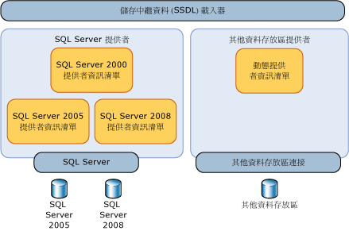
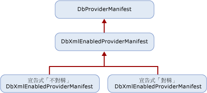

# 提供者資訊清單規格
本節將討論資料存放區提供者如何支援資料存放區中的型別與函式。  
  
 雖然實體服務的運作與特定資料存放區提供者無關，不過它仍然允許資料提供者明確定義模型、對應和查詢與基礎資料存放區互動的方式。  如果沒有抽象層，實體服務的目標只能設定為特定資料存放區或資料提供者。  
  
 基礎資料庫會直接或間接支援提供者所支援的型別。  這些型別不一定是確切的存放區型別，而是提供者用來支援 [!INCLUDE[adonet_ef](../../../../../includes/adonet-ef-md.md)] 的型別。  提供者\/存放區型別將以實體資料模型 \(EDM\) 詞彙描述。  
  
 資料存放區所支援之函式的參數和傳回型別則以 EDM 詞彙指定。  
  
## 需求  
 [!INCLUDE[adonet_ef](../../../../../includes/adonet-ef-md.md)] 和資料存放區必須能夠用已知的型別來回傳遞資料，而不會造成任何資料遺失或截斷。  
  
 提供者資訊清單必須能夠在設計階段中由工具載入，而不需要開啟資料存放區的連接。  
  
 [!INCLUDE[adonet_ef](../../../../../includes/adonet-ef-md.md)] 會區分大小寫，但是基礎資料存放區可能不區分大小寫。  在資訊清單中定義和使用 EDM 成品 \(例如，識別碼和型別名稱\) 時，它們必須使用 [!INCLUDE[adonet_ef](../../../../../includes/adonet-ef-md.md)] 區分大小寫。  如果可能區分大小寫的資料存放區項目出現在提供者資訊清單中，就必須在提供者資訊清單中保留該大小寫設定。  
  
 [!INCLUDE[adonet_ef](../../../../../includes/adonet-ef-md.md)] 需要所有資料提供者的提供者資訊清單。  如果您嘗試使用沒有提供者資訊清單的提供者搭配 [!INCLUDE[adonet_ef](../../../../../includes/adonet-ef-md.md)]，就會收到錯誤。  
  
 下表將描述透過提供者互動引發例外狀況時，[!INCLUDE[adonet_ef](../../../../../includes/adonet-ef-md.md)] 會擲回的例外狀況種類：  
  
|問題|例外狀況|  
|--------|----------|  
|提供者不支援 DbProviderServices 中的 GetProviderManifest。|ProviderIncompatibleException|  
|遺漏提供者資訊清單：嘗試擷取提供者資訊清單時，提供者會傳回 `null`。|ProviderIncompatibleException|  
|無效的提供者資訊清單：嘗試擷取提供者資訊清單時，提供者會傳回無效的 XML。|ProviderIncompatibleException|  
  
## 案例  
 提供者應該支援下列案例：  
  
### 使用對稱型別對應撰寫提供者  
 您可以撰寫 [!INCLUDE[adonet_ef](../../../../../includes/adonet-ef-md.md)] 的提供者，讓每個存放區型別都對應至單一 EDM 型別，不論對應方向為何。  若為具有非常簡單對應 \(與某個 EDM 型別對應\) 的提供者型別，您就可以使用對稱方案，因為型別系統很簡單或符合 EDM 型別。  
  
 您可以使用其網域的簡易性並產生靜態宣告式提供者資訊清單。  
  
 您可以撰寫具有兩個區段的 XML 檔案：  
  
-   以存放區型別或函式之「EDM 對應項目」詞彙表示的提供者型別清單。  存放區型別具有對應的 EDM 型別。  存放區函式具有對應的 EDM 函式。  例如，varchar 是 SQL Server 型別，但是對應的 EDM 型別是 string。  
  
-   提供者所支援的函式清單，其中參數和傳回型別是以 EDM 詞彙表示。  
  
### 使用非對稱型別對應撰寫提供者  
 撰寫 [!INCLUDE[adonet_ef](../../../../../includes/adonet-ef-md.md)] 的資料存放區提供者時，某些型別的 EDM 到提供者型別對應可能會與提供者到 EDM 型別對應不同。  例如，unbounded EDM PrimitiveTypeKind.String 可能會對應至提供者的 nvarchar\(4000\)，而 nvarchar\(4000\) 則對應至 EDM PrimitiveTypeKind.String\(MaxLength\=4000\)。  
  
 您可以撰寫具有兩個區段的 XML 檔案：  
  
-   以 EDM 詞彙表示的提供者型別清單並且定義兩個方向的對應：EDM 到提供者以及提供者到 EDM。  
  
-   提供者所支援的函式清單，其中參數和傳回型別是以 EDM 詞彙表示。  
  
## 提供者資訊清單探索能力  
 此資訊清單會由實體服務中的許多元件類型 \(例如工具或查詢\) 間接使用，但是更直接由中繼資料透過資料存放區中繼資料載入器運用。  
  
   
  
 不過，給定的提供者可能會支援不同的存放區或相同存放區的不同版本。  因此，提供者必須針對每個支援的資料存放區報告不同的資訊清單。  
  
### 提供者資訊清單語彙基元  
 當開啟資料存放區連接時，提供者可以查詢資訊，以便傳回正確的資訊清單。  在離線案例中 \(無法使用連接資訊或是無法連接至存放區\)，可能就無法這樣做。  您可以使用 .ssdl 檔案中 `Schema` 項目的 `ProviderManifestToken` 屬性來識別資訊清單。  這個屬性沒有必要的格式。提供者會選擇識別資訊清單所需的最少資訊，而不必開啟存放區的連接。  
  
 例如：  
  
```  
<Schema Namespace="Northwind" Provider="System.Data.SqlClient" ProviderManifestToken="2005" xmlns:edm="http://schemas.microsoft.com/ado/2006/04/edm/ssdl" xmlns="http://schemas.microsoft.com/ado/2006/04/edm/ssdl">  
```  
  
## 提供者資訊清單程式設計模型  
 提供者會衍生自 <xref:System.Data.Common.DbXmlEnabledProviderManifest>，以便讓它們以宣告方式指定其資訊清單。  下圖將說明提供者的類別階層：  
  
   
  
### 探索能力 API  
 存放區中繼資料載入器 \(StoreItemCollection\) 會使用資料存放區連接或提供者資訊清單語彙基元來載入提供者資訊清單。  
  
#### 使用資料存放區連接  
 當資料存放區連接可用時，請呼叫 DbProvderServices.GetProviderManifestToken 來傳回傳遞給 GetProviderManifest 方法 \(可傳回 DbProviderManifest\) 的語彙基元。  這個方法會委派給提供者的 GetDbProviderManifestToken 實作。  
  
```  
public string GetProviderManifestToken(DbConnection connection);  
public DbProviderManifest GetProviderManifest(string manifestToken);  
```  
  
#### 使用提供者資訊清單語彙基元  
 在離線案例中，系統會從 SSDL 表示中挑選語彙基元。  SSDL 可讓您指定 ProviderManifestToken \(如需詳細資訊，請參閱 [Schema Element \(SSDL\)](http://msdn.microsoft.com/zh-tw/fec75ae4-7f16-4421-9265-9dac61509222)\)。  例如，如果無法開啟連接，SSDL 就會具有指定資訊清單之相關資訊的提供者資訊清單語彙基元。  
  
```  
public DbProviderManifest GetProviderManifest(string manifestToken);  
```  
  
### 提供者資訊清單結構描述  
 針對每個提供者所定義的資訊結構描述都包含要由中繼資料取用的靜態資訊：  
  
```  
<?xml version="1.0" encoding="utf-8"?>  
<xs:schema elementFormDefault="qualified"  
   xmlns:xs="http://www.w3.org/2001/XMLSchema"  
   targetNamespace="http://schemas.microsoft.com/ado/2006/04/edm/providermanifest"  
   xmlns:pm="http://schemas.microsoft.com/ado/2006/04/edm/providermanifest">  
  
  <xs:element name="ProviderManifest">  
    <xs:complexType>  
      <xs:sequence>  
        <xs:element name="Types" type="pm:TTypes" minOccurs="1" maxOccurs="1" />  
        <xs:element name="Functions" type="pm:TFunctions" minOccurs="0" maxOccurs="1"/>  
      </xs:sequence>  
      <xs:attribute name="Namespace" type="xs:string" use="required"/>  
    </xs:complexType>  
  </xs:element>  
  <xs:complexType name="TVersion">  
    <xs:attribute name="Major" type="xs:int" use="required" />  
    <xs:attribute name="Minor" type="xs:int" use="required" />  
    <xs:attribute name="Build" type="xs:int" use="required" />  
    <xs:attribute name="Revision" type="xs:int" use="required" />  
  </xs:complexType>  
  
  <xs:complexType name="TIntegerFacetDescription">  
    <xs:attribute name="Minimum" type="xs:int" use="optional" />  
    <xs:attribute name="Maximum" type="xs:int" use="optional" />  
    <xs:attribute name="DefaultValue" type="xs:int" use="optional" />  
    <xs:attribute name="Constant" type="xs:boolean" default="false" />  
  </xs:complexType>  
  
  <xs:complexType name="TBooleanFacetDescription">  
    <xs:attribute name="DefaultValue" type="xs:boolean" use="optional" />  
    <xs:attribute name="Constant" type="xs:boolean" default="true" />  
  </xs:complexType>  
  
  <xs:complexType name="TDateTimeFacetDescription">  
    <xs:attribute name="Constant" type="xs:boolean" default="false" />  
  </xs:complexType>  
  
  <xs:complexType name="TFacetDescriptions">  
    <xs:choice maxOccurs="unbounded">  
      <xs:element name="Precision" minOccurs="0" maxOccurs="1" type="pm:TIntegerFacetDescription"/>  
      <xs:element name="Scale" minOccurs="0" maxOccurs="1" type="pm:TIntegerFacetDescription"/>  
      <xs:element name="MaxLength" minOccurs="0" maxOccurs="1" type="pm:TIntegerFacetDescription"/>  
      <xs:element name="Unicode" minOccurs="0" maxOccurs="1" type="pm:TBooleanFacetDescription"/>  
      <xs:element name="FixedLength" minOccurs="0" maxOccurs="1" type="pm:TBooleanFacetDescription"/>  
    </xs:choice>  
  </xs:complexType>  
  
  <xs:complexType name="TType">  
    <xs:sequence>  
      <xs:element name="FacetDescriptions" type="pm:TFacetDescriptions" minOccurs="0" maxOccurs="1"/>  
    </xs:sequence>  
    <xs:attribute name="Name" type="xs:string" use="required"/>  
    <xs:attribute name="PrimitiveTypeKind" type="pm:TPrimitiveTypeKind" use="required" />  
  </xs:complexType>  
  
  <xs:complexType name="TTypes">  
    <xs:sequence>  
      <xs:element name="Type" type="pm:TType" minOccurs="0" maxOccurs="unbounded"/>  
    </xs:sequence>  
  </xs:complexType>  
  
  <xs:attributeGroup name="TFacetAttribute">  
    <xs:attribute name="Precision" type="xs:int" use="optional"/>  
    <xs:attribute name="Scale" type="xs:int" use="optional"/>  
    <xs:attribute name="MaxLength" type="xs:int" use="optional"/>  
    <xs:attribute name="Unicode" type="xs:boolean" use="optional"/>  
    <xs:attribute name="FixedLength" type="xs:boolean" use="optional"/>  
  </xs:attributeGroup>  
  
  <xs:complexType name="TFunctionParameter">  
    <xs:attribute name="Name" type="xs:string" use="required" />  
    <xs:attribute name="Type" type="xs:string" use="required" />  
    <xs:attributeGroup ref="pm:TFacetAttribute" />  
    <xs:attribute name="Mode" type="pm:TParameterDirection" use="required" />  
  </xs:complexType>  
  
  <xs:complexType name="TReturnType">  
    <xs:attribute name="Type" type="xs:string" use="required" />  
    <xs:attributeGroup ref="pm:TFacetAttribute" />  
  </xs:complexType>  
  
  <xs:complexType name="TFunction">  
    <xs:choice minOccurs="0" maxOccurs ="unbounded">  
      <xs:element name ="ReturnType" type="pm:TReturnType" minOccurs="0" maxOccurs="1" />  
      <xs:element name="Parameter" type="pm:TFunctionParameter" minOccurs="0" maxOccurs="unbounded"/>  
    </xs:choice>  
    <xs:attribute name="Name" type="xs:string" use="required" />  
    <xs:attribute name="Aggregate" type="xs:boolean" use="optional" />  
    <xs:attribute name="BuiltIn" type="xs:boolean" use="optional" />  
    <xs:attribute name="StoreFunctionName" type="xs:string" use="optional" />  
    <xs:attribute name="NiladicFunction" type="xs:boolean" use="optional" />  
    <xs:attribute name="ParameterTypeSemantics" type="pm:TParameterTypeSemantics" use="optional" default="AllowImplicitConversion" />  
  </xs:complexType>  
  
  <xs:complexType name="TFunctions">  
    <xs:sequence>  
      <xs:element name="Function" type="pm:TFunction" minOccurs="0" maxOccurs="unbounded"/>  
    </xs:sequence>  
  </xs:complexType>  
  
  <xs:simpleType name="TPrimitiveTypeKind">  
    <xs:restriction base="xs:string">  
      <xs:enumeration value="Binary"/>  
      <xs:enumeration value="Boolean"/>  
      <xs:enumeration value="Byte"/>  
      <xs:enumeration value="Decimal"/>  
      <xs:enumeration value="DateTime"/>  
      <xs:enumeration value="Time"/>  
      <xs:enumeration value="DateTimeOffset"/>          
      <xs:enumeration value="Double"/>  
      <xs:enumeration value="Guid"/>  
      <xs:enumeration value="Single"/>  
      <xs:enumeration value="SByte"/>  
      <xs:enumeration value="Int16"/>  
      <xs:enumeration value="Int32"/>  
      <xs:enumeration value="Int64"/>  
      <xs:enumeration value="String"/>  
    </xs:restriction>  
  </xs:simpleType>  
  
  <xs:simpleType name="TParameterDirection">  
    <xs:restriction base="xs:string">  
      <xs:enumeration value="In"/>  
      <xs:enumeration value="Out"/>  
      <xs:enumeration value="InOut"/>  
    </xs:restriction>  
  </xs:simpleType>  
  
  <xs:simpleType name="TParameterTypeSemantics">  
    <xs:restriction base="xs:string">  
      <xs:enumeration value="ExactMatchOnly" />  
      <xs:enumeration value="AllowImplicitPromotion" />  
      <xs:enumeration value="AllowImplicitConversion" />  
    </xs:restriction>  
  </xs:simpleType>  
</xs:schema>  
```  
  
#### Types 節點  
 提供者資訊清單中的 Types 節點會包含資料存放區原本支援或透過提供者支援之型別的相關資訊。  
  
##### Type 節點  
 每個 Type 節點都會以 EDM 的詞彙定義提供者類型。  Type 節點會描述提供者類型的名稱、它所對應之模型型別的相關資訊，以及描述該型別對應的 Facet。  
  
 若要在提供者資訊清單中表示這種型別資訊，每個 TypeInformation 宣告都必須針對每個型別定義許多 Facet 描述：  
  
|屬性名稱|資料類型|必要項|預設值|描述|  
|----------|----------|---------|---------|--------|  
|名稱|String|是|N\/A|提供者特有的資料型別名稱。|  
|PrimitiveTypeKind|PrimitiveTypeKind|是|N\/A|EDM 型別名稱。|  
  
###### Function 節點  
 每個 Function 都會定義透過提供者所提供的單一函式。  
  
|屬性名稱|資料類型|必要項|預設值|描述|  
|----------|----------|---------|---------|--------|  
|名稱|String|是|N\/A|函式的識別碼\/名稱。|  
|ReturnType|String|否|Void|函式的 EDM 傳回型別。|  
|彙總|Boolean|否|False|如果此函式是彙總函式，則為 True。|  
|BuiltIn|Boolean|否|True|如果此函式內建在資料存放區中，則為 True。|  
|StoreFunctionName|String|否|\<Name\>|資料存放區中的函式名稱。  允許重新導向函式名稱的層級。|  
|NiladicFunction|Boolean|否|False|如果此函式不需要參數，而且會在不使用任何參數的情況下呼叫，則為 True。|  
|ParameterType<br /><br /> 語意|ParameterSemantics|否|AllowImplicit<br /><br /> 轉換|選擇查詢管線應該如何處理參數型別替代項目：<br /><br /> -   ExactMatchOnly<br />-   AllowImplicitPromotion<br />-   AllowImplicitConversion|  
  
 **Parameters 節點**  
  
 每個函式都具有一個或多個 Parameter 節點的集合。  
  
|屬性名稱|資料類型|必要項|預設值|描述|  
|----------|----------|---------|---------|--------|  
|名稱|String|是|N\/A|參數的識別碼\/名稱。|  
|類型|String|是|N\/A|參數的 EDM 型別。|  
|模式|參數<br /><br /> Direction|是|N\/A|參數的方向：<br /><br /> -   in<br />-   out<br />-   inout|  
  
##### Namespace 屬性  
 每個資料存放區提供者都必須針對資訊清單中定義的資訊定義一個命名空間或命名空間群組。  這個命名空間可用於 Entity SQL 查詢中，以便解析函式和型別的名稱。  例如：SqlServer。  不過，該命名空間必須與標準命名空間 EDM 不同，後者是實體服務針對要由 Entity SQL 查詢所支援之標準函式定義的。  
  
## 請參閱  
 [撰寫 Entity Framework 資料提供者](../../../../../docs/framework/data/adonet/ef/writing-an-ef-data-provider.md)