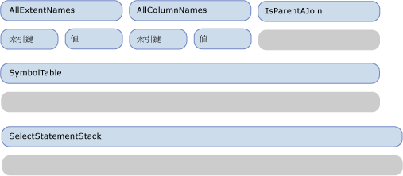
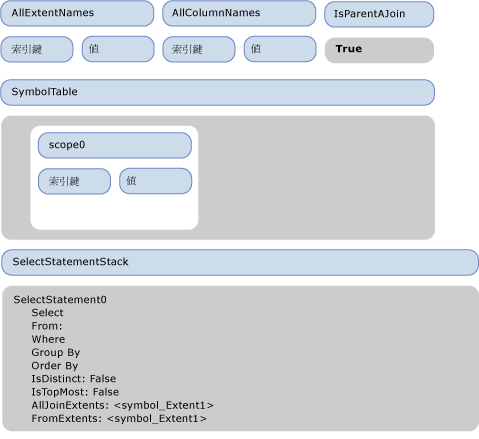
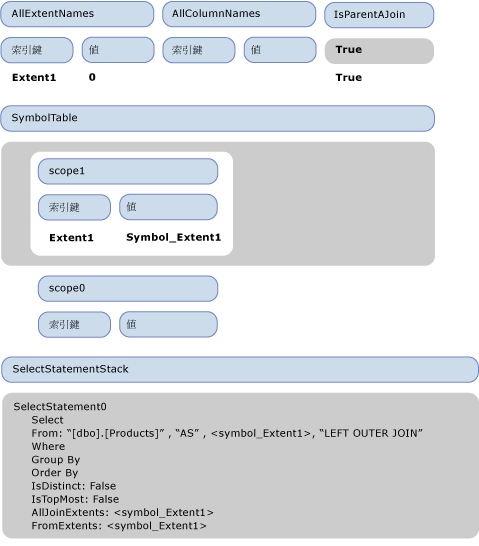
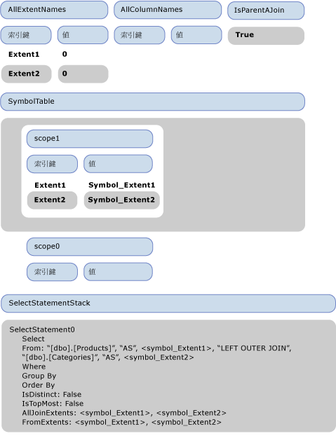
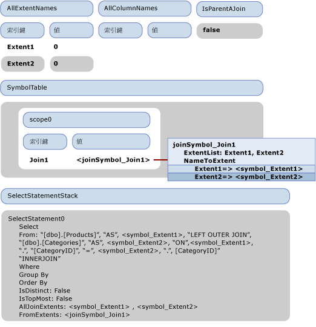
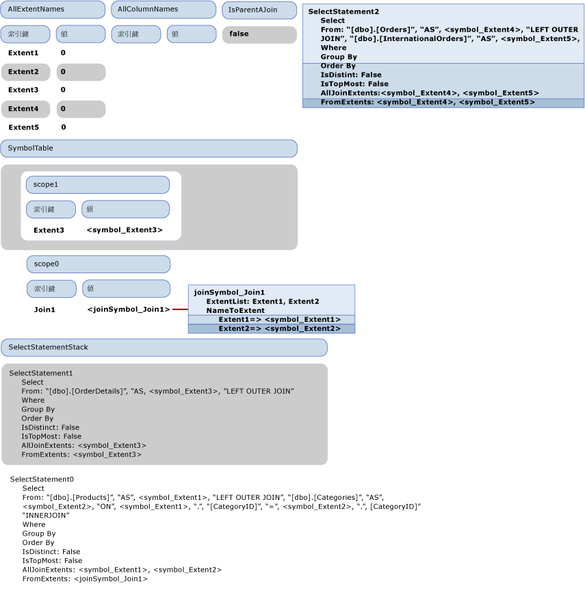
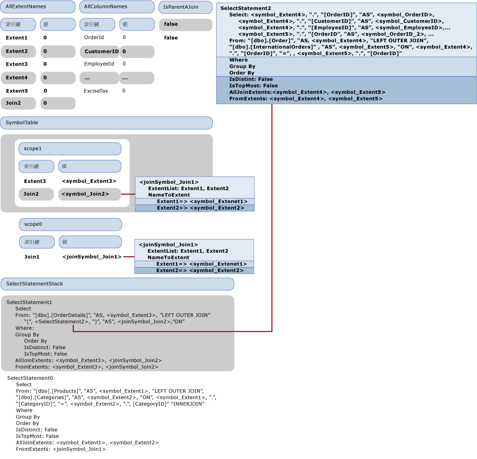

# <a name="walkthrough-sql-generation"></a>逐步解說：SQL 產生
本主題將說明 SQL 產生就會發生在[範例提供者](http://go.microsoft.com/fwlink/?LinkId=180616)。 下列 Entity SQL 查詢會使用範例提供者所隨附的模型：  
  
```  
SELECT  j1.ProductId, j1.ProductName, j1.CategoryName, j2.ShipCountry, j2.ProductId  
FROM (  SELECT P.ProductName, P.ProductId, P.Category.CategoryName  
        FROM NorthwindEntities.Products AS P) as j1  
INNER JOIN (SELECT OD.ProductId, OD.Order.ShipCountry as ShipCountry  
            FROM NorthwindEntities.OrderDetails AS OD) as j2  
            ON j1.ProductId == j2.ProductId   
```  
  
 此查詢會產生傳遞給提供者的下列輸出命令樹：  
  
```  
DbQueryCommandTree  
|_Parameters  
|_Query : Collection{Record['C1'=Edm.Int32, 'ProductID'=Edm.Int32, 'ProductName'=Edm.String, 'CategoryName'=Edm.String, 'ShipCountry'=Edm.String, 'ProductID1'=Edm.Int32]}  
  |_Project  
    |_Input : 'Join4'  
    | |_InnerJoin  
    |   |_Left : 'Join1'  
    |   | |_LeftOuterJoin  
    |   |   |_Left : 'Extent1'  
    |   |   | |_Scan : dbo.Products  
    |   |   |_Right : 'Extent2'  
    |   |   | |_Scan : dbo.Categories  
    |   |   |_JoinCondition  
    |   |     |_  
    |   |       |_Var(Extent1).CategoryID  
    |   |       |_=  
    |   |       |_Var(Extent2).CategoryID  
    |   |_Right : 'Join3'  
    |   | |_LeftOuterJoin  
    |   |   |_Left : 'Extent3'  
    |   |   | |_Scan : dbo.OrderDetails  
    |   |   |_Right : 'Join2'  
    |   |   | |_LeftOuterJoin  
    |   |   |   |_Left : 'Extent4'  
    |   |   |   | |_Scan : dbo.Orders  
    |   |   |   |_Right : 'Extent5'  
    |   |   |   | |_Scan : dbo.InternationalOrders  
    |   |   |   |_JoinCondition  
    |   |   |     |_  
    |   |   |       |_Var(Extent4).OrderID  
    |   |   |       |_=  
    |   |   |       |_Var(Extent5).OrderID  
    |   |   |_JoinCondition  
    |   |     |_  
    |   |       |_Var(Extent3).OrderID  
    |   |       |_=  
    |   |       |_Var(Join2).Extent4.OrderID  
    |   |_JoinCondition  
    |     |_  
    |       |_Var(Join1).Extent1.ProductID  
    |       |_=  
    |       |_Var(Join3).Extent3.ProductID  
    |_Projection  
      |_NewInstance : Record['C1'=Edm.Int32, 'ProductID'=Edm.Int32, 'ProductName'=Edm.String, 'CategoryName'=Edm.String, 'ShipCountry'=Edm.String, 'ProductID1'=Edm.Int32]  
        |_Column : 'C1'  
        | |_1  
        |_Column : 'ProductID'  
        | |_Var(Join4).Join1.Extent1.ProductID  
        |_Column : 'ProductName'  
        | |_Var(Join4).Join1.Extent1.ProductName  
        |_Column : 'CategoryName'  
        | |_Var(Join4).Join1.Extent2.CategoryName  
        |_Column : 'ShipCountry'  
        | |_Var(Join4).Join3.Join2.Extent4.ShipCountry  
        |_Column : 'ProductID1'  
          |_Var(Join4).Join3.Extent3.ProductID  
```  
  
 本主題描述如何將這個輸出命令樹轉譯為下列 SQL 陳述式。  
  
```  
SELECT   
1 AS [C1],   
[Extent1].[ProductID] AS [ProductID],   
[Extent1].[ProductName] AS [ProductName],   
[Extent2].[CategoryName] AS [CategoryName],   
[Join3].[ShipCountry] AS [ShipCountry],   
[Join3].[ProductID] AS [ProductID1]  
FROM   [dbo].[Products] AS [Extent1]  
LEFT OUTER JOIN [dbo].[Categories] AS [Extent2] ON [Extent1].[CategoryID] = [Extent2].[CategoryID]  
INNER JOIN    
(SELECT [Extent3].[OrderID] AS [OrderID1], [Extent3].[ProductID] AS [ProductID], [Extent3].[UnitPrice] AS [UnitPrice], [Extent3].[Quantity] AS [Quantity], [Extent3].[Discount] AS [Discount], [Join2].[OrderID2], [Join2].[CustomerID], [Join2].[EmployeeID], [Join2].[OrderDate], [Join2].[RequiredDate], [Join2].[ShippedDate], [Join2].[Freight], [Join2].[ShipName], [Join2].[ShipAddress], [Join2].[ShipCity], [Join2].[ShipRegion], [Join2].[ShipPostalCode], [Join2].[ShipCountry], [Join2].[OrderID3], [Join2].[CustomsDescription], [Join2].[ExciseTax]  
FROM  [dbo].[OrderDetails] AS [Extent3]  
LEFT OUTER JOIN    
      (SELECT [Extent4].[OrderID] AS [OrderID2], [Extent4].[CustomerID] AS [CustomerID], [Extent4].[EmployeeID] AS [EmployeeID], [Extent4].[OrderDate] AS [OrderDate], [Extent4].[RequiredDate] AS [RequiredDate], [Extent4].[ShippedDate] AS [ShippedDate], [Extent4].[Freight] AS [Freight], [Extent4].[ShipName] AS [ShipName], [Extent4].[ShipAddress] AS [ShipAddress], [Extent4].[ShipCity] AS [ShipCity], [Extent4].[ShipRegion] AS [ShipRegion], [Extent4].[ShipPostalCode] AS [ShipPostalCode], [Extent4].[ShipCountry] AS [ShipCountry], [Extent5].[OrderID] AS [OrderID3], [Extent5].[CustomsDescription] AS [CustomsDescription], [Extent5].[ExciseTax] AS [ExciseTax]  
FROM  [dbo].[Orders] AS [Extent4]  
LEFT OUTER JOIN [dbo].[InternationalOrders] AS [Extent5] ON [Extent4].[OrderID] = [Extent5].[OrderID]   
      ) AS [Join2] ON [Extent3].[OrderID] = [Join2].[OrderID2]   
   ) AS [Join3] ON [Extent1].[ProductID] = [Join3].[ProductID]  
```  
  
## <a name="first-phase-of-sql-generation-visiting-the-expression-tree"></a>SQL 產生的第一個階段：瀏覽運算式樹狀架構  
 下圖說明造訪者的最初空白狀態。  在整個主題中，只會顯示與逐步解說有關的屬性。  
  
   
  
 當瀏覽專案節點時，VisitInputExpression 會在它的輸入 (Join4) 上呼叫，這樣會由 VisitJoinExpression 方法觸發 Join4 的瀏覽。 因為這是最上層的聯結，所以 IsParentAJoin 會傳回 false，而且新的 SqlSelectStatement (SelectStatement0) 會建立並推送到 SELECT 陳述式堆疊上。 此外，新的範圍 (scope0) 也會輸入符號表中。 在瀏覽聯結的第一個 (左邊) 輸入之前，'true' 會推送到 IsParentAJoin 堆疊上。 在瀏覽 Join1 (這是 Join4 的左邊輸入) 之前，造訪者的狀態會顯示在下一個圖中。  
  
   
  
 當透過 Join4 叫用聯結造訪方法時，IsParentAJoin 為 true，因此它會重複使用目前的 SELECT 陳述式 SelectStatement0。 輸入新的範圍 (scope1)。 在瀏覽它的左邊子系 Extent1 之前，另一個 true 會推送到 IsParentAJoin 堆疊上。  
  
 當瀏覽 Extent1 時，因為 IsParentAJoin 會傳回 true，所以它會傳回包含 "[dbo].[Products]" 的 SqlBuilder。 控制權會傳回瀏覽 Join4 的方法。 將會從 IsParentAJoin 推出項目並呼叫 ProcessJoinInputResul，這樣會將瀏覽 Extent1 的結果附加到 SelectStatement0 的 From 子句。 建立之輸入繫結名稱 "Extent1" 所適用的新 from 符號 symbol_Extent1 會加入至 SelectStatement0 的 FromExtents，而且 "As" 和 symbol_Extent1 也會附加到 from 子句。 新的項目會加入至 "Extent1" 的 AllExtentNames，而且值為 0。 新的項目會加入至符號表中的目前範圍，以便將 "Extent1" 與它的符號 symbol_Extent1 產生關聯。 Symbol_Extent1 也會加入至 SqlSelectStatement 的 AllJoinExtents。  
  
 在瀏覽 Join1 的右邊輸入之前，"LEFT OUTER JOIN" 會加入至 SelectStatement0 的 From 子句。 因為右邊輸入是 Scan 運算式，所以會再次將 true 推送到 IsParentAJoin 堆疊。 瀏覽右邊輸入之前的狀態會顯示在下一個圖中。  
  
   
  
 右邊輸入會使用與左邊輸入相同的方式來處理。 瀏覽右邊輸入之後的狀態會顯示在下一個圖中。  
  
   
  
 下一個 "false" 會推送到 IsParentAJoin 堆疊上，而且會處理聯結條件 Var(Extent1).CategoryID == Var(Extent2).CategoryID。 Var(Extenent1) 會在查詢符號表之後解析為 <symbol_Extent1>。 因為執行個體解析成簡單的符號，這是處理 Var(Extent1) 結果。CategoryID、 sqlbuilder 並包含\<symbol1 >。 」會傳回 CategoryID"。 同樣地，將會處理比較的另一端，而且瀏覽聯結條件的結果會附加到 SelectStatement1 的 FROM 子句，並從 IsParentAJoin 堆疊推出 "false" 的值。  
  
 這樣就已經完整處理 Join1，而且會從符號表推出範圍。  
  
 控制權會傳回正在處理的 Join4，它是 Join1 的父系。 因為子系已重複使用 Select 陳述式，所以會使用單一 Join 符號 <joinSymbol_Join1> 來取代 Join1 範圍。 此外，新項目會加入至符號表中，以便將 Join1 與 <joinSymbol_Join1> 產生關聯。  
  
 下一個要處理的節點是 Join3，這是 Join4 的第二個子系。 因為它是右邊子系，所以會將 "false" 推送到 IsParentAJoin 堆疊。 此時造訪者的狀態會在下一個圖中說明。  
  
   
  
 如果是 Join3，IsParentAJoin 會傳回 false 而且需要啟動新的 SqlSelectStatement (SelectStatement1) 並將它推送到堆疊上。 處理作業會繼續，就像處理之前的聯結一樣，而且新的範圍會推送到堆疊上並處理子系。 左邊子系是範圍 (Extent3) 而右邊子系是聯結 (Join2)，這個聯結也需要啟動新的 SqlSelectStatement：SelectStatement2。 Join2 上的子系也是範圍，而且會彙總到 SelectStatement2。  
  
 造訪者在瀏覽 Join2 之後，但是完成它的後置處理 (ProcessJoinInputResult) 之前的狀態會顯示在下一個圖中：  
  
   
  
 在上一個圖中，SelectStatement2 會顯示為自由浮動，因為它已經從堆疊推出但是父系尚未進行後置處理。 它需要加入至父系的 FROM 部分，但是它沒有 SELECT 子句，所以不是完整 SQL 陳述式。 所以在此時，預設資料行 (所有資料行都是由它的輸入產生) 會由 AddDefaultColumns 方法加入至 SELECT 清單中。 AddDefaultColumns 會逐一查看 FromExtents 中的符號，並針對每一個符號加入範圍中的所有資料行。 如果是簡單符號，它會查看符號類型，以便擷取要加入的所有屬性。 它也會使用資料行名稱填入 AllColumnNames 字典。 完成的 SelectStatement2 會附加到 SelectStatement1 的 FROM 子句。  
  
 接下來，將會建立新的聯結符號來表示 Join2，它會標示為巢狀聯結，並加入至 SelectStatement1 的 AllJoinExtents 和符號表中。  現在需要處理 Join3 的聯結條件：Var(Extent3).OrderID =  Var(Join2).Extent4.OrderID。 左邊的處理類似於 Join1 的聯結條件。 但是，右邊 "Var(Join2).Extent4.OrderID" 的處理則不同，因為需要扁平化聯結。  
  
 下一個圖顯示造訪者在處理 DbPropertyExpression "Var(Join2).Extent4.OrderID" 之前的狀態。  
  
 考慮如何瀏覽 "Var(Join2).Extent4.OrderID"。 首先會瀏覽執行個體屬性 "Var(Join2).Extent4" (這是另一個 DbPropertyExpression) 並初次瀏覽它的執行個體 "Var(Join2)"。 在符號表的最上層範圍中，"Join2" 會解析為 <joinSymbol_join2>。 在 DbPropertyExpression 處理 "Var(Join2).Extent4" 的瀏覽方法中，請注意當瀏覽執行個體時已傳回聯結符號，而且需要扁平化。  
  
 因為它是巢狀聯結，所以我們會查詢聯結符號的 NameToExtent 字典中的屬性 "Extent4"，並將它解析為 <symbol_Extent4>，然後傳回新的 SymbolPair(<joinSymbol_join2>, <symbol_Extent4>)。 因為符號組是從處理 "Var(Join2).Extent4.OrderID" 執行個體所傳回，所以會從該符號組 (<symbol_Extent4>) 的 ColumnPart 解析 "OrderID" 屬性，這個符號組具有其所代表之範圍的資料行清單。 所以，"Var(Join2).Extent4.OrderID" 會解析為 { <joinSymbol_Join2>, ".", <symbol_OrderID>}。  
  
 Join4 的聯結條件會以類似的方式處理。 控制權會傳回已處理最上層專案的 VisitInputExpression 方法。 在查看傳回之 SelectStatement0 的 FromExtents 時，輸入會識別為聯結，而且會移除原始範圍，並使用只有聯結符號的新範圍來加以取代。 也會更新符號表，接下來會處理專案的投射部分。 屬性的解析以及聯結範圍的扁平化如同之前所述。  
  
   
  
 最後會產生下列 SqlSelectStatement：  
  
```  
SELECT:   
  "1", " AS ", "[C1]",  
  <symbol_Extent1>, ".", "[ProductID]", " AS ", "[ProductID]",   
  <symbol_Extent1>, ".", "[ProductName]", " AS ", "[ProductName]",  
  <symbol_Extent2>, ".", "[CategoryName]", " AS ", "[CategoryName]",  
  <joinSymbol_Join3>, ".", <symbol_ShipCountry>, " AS ", "[ShipCountry]",   
  <joinSymbol_Join3>, ".", <symbol_ProductID>, " AS ", "[ProductID1]"  
FROM: "[dbo].[Products]", " AS ", <symbol_Extent1>,   
        "LEFT OUTER JOIN ""[dbo].[Categories]", " AS ", <symbol_Extent2>, " ON ", <symbol_Extent1>, ".", "[CategoryID]", " = ", <symbol_Extent2>, ".", "[CategoryID]",   
        "INNER JOIN ",   
        " (", SELECT:   
           <symbol_Extent3>, ".", "[OrderID]", " AS ", <symbol_OrderID>, ",   
              <symbol_Extent3>, ".", "[ProductID]", " AS ", <symbol_ProductID>, ...,  
         <joinSymbol_Join2>, ".", <symbol_OrderID_2>, ", ",   
           <joinSymbol_Join2>, ".", <symbol_CustomerID>, ....,    
        <joinSymbol_Join2>, ".", <symbol_OrderID_3>,   
<joinSymbol_Join2>, ".", <symbol_CustomsDescription>,   
<joinSymbol_Join2>, ".", <symbol_ExciseTax>  
FROM: "[dbo].[OrderDetails]", " AS ", <symbol_Extent3>,   
"LEFT OUTER JOIN ",   
" (", SELECT:   
<symbol_Extent4>, ".", "[OrderID]", " AS ", <symbol_OrderID_2>,   
<symbol_Extent4>, ".", "[CustomerID]", " AS ", <symbol_CustomerID>, ...  
<symbol_Extent5>, ".", "[OrderID]", " AS ", <symbol_OrderID_3>,  
<symbol_Extent5>, ".", "[CustomsDescription]", " AS ", <symbol_CustomsDescription>,  
<symbol_Extent5>, ".", "[ExciseTax]", " AS ", <symbol_ExciseTax>  
FROM: "[dbo].[Orders]", " AS ", <symbol_Extent4>,  
"LEFT OUTER JOIN ", , "[dbo].[InternationalOrders]", " AS ", <symbol_Extent5>,   
" ON ", <symbol_Extent4>, ".", "[OrderID]", " = ", , <symbol_Extent5>, ".", "[OrderID]"  
" )", " AS ", <joinSymbol_Join2>, " ON ", , , <symbol_Extent3>, ".", "[OrderID]", " = ", , <joinSymbol_Join2>, ".", <symbol_OrderID_2>  
" )", " AS ", <joinSymbol_Join3>, " ON ", , , <symbol_Extent1>, ".", "[ProductID]", " = ", , <joinSymbol_Join3>, ".", <symbol_ProductID>  
```  
  
### <a name="second-phase-of-sql-generation-generating-the-string-command"></a>SQL 產生的第二個階段：產生字串命令  
 第二個階段會產生實際的符號名稱，我們只著重於代表 "OrderID" 資料行的符號，因為這個情況下需要解決衝突。 這些會在 SqlSelectStatement 中強調。 請注意，圖中所用的尾碼只是為了強調這些是不同的執行個體，不是為了代表任何新的名稱，因為在這個階段尚未指派其最終的名稱 (可能與原始名稱不同)。  
  
 找到的需要重新命名的第一個符號是 <symbol_OrderID>。 它的新名稱會指派為 "OrderID1"，而且 1 會標示為上次用於 "OrderID" 的尾碼，而且此符號會標示為不需要重新命名。 接下來會找到第一個使用的 <symbol_OrderID_2>。 它會重新命名來使用下一個可用的尾碼 ("OrderID2") 而且會再次標示為不需要重新命名，所以下次使用它時就不會重新命名。 也會針對 <symbol_OrderID_3> 進行這項處理。  
  
 第二個階段結束時，將會產生最終的 SQL 陳述式。  
  
## <a name="see-also"></a>請參閱  
 [範例提供者中的 SQL 產生](../../../../../docs/framework/data/adonet/ef/sql-generation-in-the-sample-provider.md)
