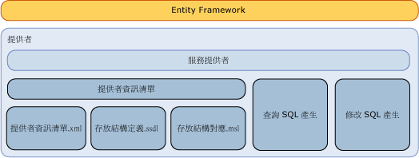

# 撰寫 Entity Framework 資料提供者Writing an Entity Framework Data Provider
本節討論如何撰寫[!INCLUDE[adonet_ef](../../../../../includes/adonet-ef-md.md)]支援 SQL Server 以外的資料來源的提供者。This section discusses how to write an [!INCLUDE[adonet_ef](../../../../../includes/adonet-ef-md.md)] provider to support a data source other than SQL Server. [!INCLUDE[adonet_ef](../../../../../includes/adonet-ef-md.md)]包含支援 SQL Server 的提供者。The [!INCLUDE[adonet_ef](../../../../../includes/adonet-ef-md.md)] includes a provider that supports SQL Server.  
  
## Entity Framework 提供者模型簡介Introducing the Entity Framework Provider Model  
 [!INCLUDE[adonet_ef](../../../../../includes/adonet-ef-md.md)] 與資料庫無關，而且您可以使用 ADO.NET 提供者模型來撰寫提供者，以便連接到各種不同的資料來源。The [!INCLUDE[adonet_ef](../../../../../includes/adonet-ef-md.md)] is database independent, and you can write a provider by using the ADO.NET Provider Model to connect to a diverse set of data sources.  
  
 Entity Framework 資料提供者 (使用 ADO.NET 資料提供者模型所建置) 會執行下列功能：The Entity Framework data provider (built using the ADO.NET Data Provider model) performs the following functions:  
  
-   將實體資料模型 (EDM) 基本型別對應到提供者類型。Maps Entity Data Model (EDM) primitive types to provider types.  
  
-   公開提供者特有的函式。Exposes provider-specific functions.  
  
-   為給定的 DbQueryCommandTree 產生提供者特有的命令來支援 [!INCLUDE[adonet_ef](../../../../../includes/adonet-ef-md.md)] 查詢。Generates provider-specific commands for a given DbQueryCommandTree to support [!INCLUDE[adonet_ef](../../../../../includes/adonet-ef-md.md)] queries.  
  
-   為給定的 DbModificationCommandTree 產生提供者特有的更新命令，以支援透過 [!INCLUDE[adonet_ef](../../../../../includes/adonet-ef-md.md)] 的更新。Generates provider-specific update commands for a given DbModificationCommandTree to support updates through the [!INCLUDE[adonet_ef](../../../../../includes/adonet-ef-md.md)].  
  
-   公開存放結構定義的對應檔案，以便支援根據資料庫產生模型。Exposes mapping files for the store schema definition, to support generation of a model based on a database.  
  
-   透過概念模型公開中繼資料 (如資料表和檢視表)。Exposes metadata (tables and views, for example) via a conceptual model.  
  
   
  
## 範例Sample  
 請參閱[Entity Framework 範例提供者](https://code.msdn.microsoft.com/windowsdesktop/Entity-Framework-Sample-6a9801d0)如需範例的[!INCLUDE[adonet_ef](../../../../../includes/adonet-ef-md.md)]支援 SQL Server 以外的資料來源的提供者。See the [Entity Framework Sample Provider](https://code.msdn.microsoft.com/windowsdesktop/Entity-Framework-Sample-6a9801d0) for a sample of an [!INCLUDE[adonet_ef](../../../../../includes/adonet-ef-md.md)] provider that supports a data source other than SQL Server.  
  
## 本節內容In This Section  
 [SQL 產生SQL Generation](../../../../../docs/framework/data/adonet/ef/sql-generation.md)  
  
 [修改 SQL 產生Modification SQL Generation](../../../../../docs/framework/data/adonet/ef/modification-sql-generation.md)  
  
 [提供者資訊清單規格Provider Manifest Specification](../../../../../docs/framework/data/adonet/ef/provider-manifest-specification.md)  
  
## 另請參閱See also

- [處理資料提供者Working with Data Providers](../../../../../docs/framework/data/adonet/ef/working-with-data-providers.md)
