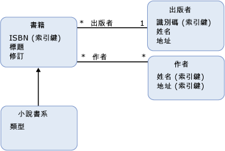

# 實體資料模型：繼承
實體資料模型 (EDM) 支援的繼承[實體類型](../../../../docs/framework/data/adonet/entity-type.md)。 EDM 中的繼承類似於物件導向程式設計語言中的類別繼承。 Like 與物件導向語言中的類別，，您也可以在概念模型中定義實體類型 (*衍生型別*) 繼承自另一個實體類型 (*基底型別*)。 不過，不同於物件導向程式設計中的類別，概念模型中的衍生的類型一律會繼承所有[屬性](../../../../docs/framework/data/adonet/property.md)和[導覽屬性](../../../../docs/framework/data/adonet/navigation-property.md)基底類型。 您不能覆寫衍生型別中的繼承屬性。  
  
 在概念模型中，您可以組建繼承階層，其中的衍生型別繼承自另一種衍生型別。 頂端的階層 （不是衍生的型別階層架構中的一個類型） 的類型稱為*根類型*。 繼承階層架構中[實體索引鍵](../../../../docs/framework/data/adonet/entity-key.md)必須在根類型上定義。  
  
 您不可建置衍生型別繼承自多個型別的繼承階層。 例如，在具有 `Book` 實體類型的概念模型中，您可以定義分別繼承自 `FictionBook` 的衍生型別 `NonFictionBook` 和 `Book`。 不過，您可能無法定義同時繼承自 `FictionBook` 和 `NonFictionBook` 型別的型別。  
  
## 範例  
 下圖顯示包含四種實體類型 (`Book`、`FictionBook`、`Publisher` 和 `Author`) 的概念模型： `FictionBook` 實體類型為衍生型別，繼承自 `Book` 實體類型。 `FictionBook` 型別繼承自 `ISBN (Key)`、`Title` 和 `Revision` 屬性，並且定義稱為 `Genre` 的額外屬性。  
  
   
  
 [ADO.NET Entity Framework](../../../../docs/framework/data/adonet/ef/index.md)會使用稱為概念結構定義語言的特定領域語言 (DSL) ([CSDL](../../../../docs/framework/data/adonet/ef/language-reference/csdl-specification.md)) 來定義概念模型。 下列 CSDL 定義實體類型 `FictionBook`，此實體類型繼承自 `Book` 型別 (如上圖所示)：  
  
 [!code-xml[EDM_Example_Model#DerivedType](../../../../samples/snippets/xml/VS_Snippets_Data/edm_example_model/xml/books5.edmx#derivedtype)]  
  
## 另請參閱  
 [實體資料模型索引鍵概念](../../../../docs/framework/data/adonet/entity-data-model-key-concepts.md)  
 [實體資料模型](../../../../docs/framework/data/adonet/entity-data-model.md)
