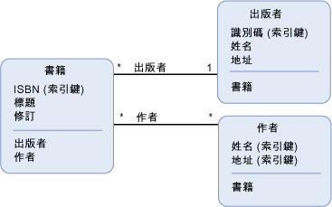

# 實體資料模型索引鍵概念
實體資料模型 \(EDM\) 使用索引鍵概念描述資料的結構：「*實體類型*」\(Entity Type\)、「*關聯型別*」\(Association Type\) 和「*屬性*」\(Property\)。  描述任何 EDM 實作中的資料結構時，這些是最重要的概念。  
  
## 實體類型  
 [實體類型](../../../../docs/framework/data/adonet/entity-type.md)是基本的建置組塊，可透過實體資料模型描述資料的結構。  在概念模型中，實體類型是以[屬性](../../../../docs/framework/data/adonet/property.md)建構而成的，用於描述最上層概念的結構，例如商務應用程式中的客戶和訂單。  電腦程式中的類別定義是類別執行個體的範本，同樣地，實體類型也是實體的範本。  實體代表特定的物件 \(例如特定的客戶或訂單\)。  [實體集](../../../../docs/framework/data/adonet/entity-set.md)內的每個實體必須要有一個唯一的[實體索引鍵](../../../../docs/framework/data/adonet/entity-key.md)。  實體集是特定實體類型的執行個體集合。  實體集 \(和[關聯集](../../../../docs/framework/data/adonet/association-set.md)\) 均在邏輯上群組於[實體容器](../../../../docs/framework/data/adonet/entity-container.md)中。  
  
 實體類型支援繼承：也就是說，一個實體類型可以衍生自另一個實體類型。  如需詳細資訊，請參閱[實體資料模型：繼承](../../../../docs/framework/data/adonet/entity-data-model-inheritance.md)。  
  
## 關聯型別  
 [關聯型別](../../../../docs/framework/data/adonet/association-type.md) \(Association type，亦稱為關聯\) 是在實體資料模型中描述關聯的基本建置組塊。  在概念模型中，關聯 \(association\) 代表兩個實體類型 \(例如 Customer 和 Order\) 之間的關聯性 \(relationship\)。  每個關聯具有兩個[關聯 End](../../../../docs/framework/data/adonet/association-end.md)，指定關聯中相關的實體類型。  每個關聯 End 也指定一個[關聯和多重性](../../../../docs/framework/data/adonet/association-end-multiplicity.md)，指出可在關聯 End 的實體數目。  關聯 End 多重性的值可以是一 \(0\)、零或一 \(0..1\)，或許多 \(\*\)。  其中一個關聯 End 的實體可透過[導覽屬性](../../../../docs/framework/data/adonet/navigation-property.md)來存取，如果是在實體類型上公開的，也可以透過外部索引鍵存取。  如需詳細資訊，請參閱[外部索引鍵屬性](../../../../docs/framework/data/adonet/foreign-key-property.md)。  
  
 在應用程式中，關聯的執行個體代表特定的關聯 \(例如 Customer 和 Order 執行個體之間的關聯\)。  關聯執行個體會在邏輯上群組於[關聯集](../../../../docs/framework/data/adonet/association-set.md)中。  關聯集 \(和[實體集](../../../../docs/framework/data/adonet/entity-set.md)\) 均在邏輯上群組於[實體容器](../../../../docs/framework/data/adonet/entity-container.md)中。  
  
## 屬性  
 [實體類型](../../../../docs/framework/data/adonet/entity-type.md)包含定義其結構和特性的[屬性](../../../../docs/framework/data/adonet/property.md)。  例如，一個 Customer 實體類型可能會有 CustomerId、Name 和 Address 之類的屬性。  
  
 概念模型中的屬性類似電腦程式中在類別定義的屬性。  如同類別上的屬性可定義類別的圖形並包含關於物件的資訊，概念模型的屬性可定義實體類別的圖形，並包含關於實體類型執行個體的資訊。  
  
 屬性可以包含基底資料 \(例如字串、整數或布林值\) 或結構化資料 \(例如複雜類型\)。  如需詳細資訊，請參閱[實體資料模型：基本資料型別](../../../../docs/framework/data/adonet/entity-data-model-primitive-data-types.md)。  
  
## 概念模型的表現方式  
 「*概念模型*」\(Conceptual Model\) 是將某些資料結構以實體和關聯性表示的特定表現方式。  表示概念模型的方法之一就是使用圖表。  下圖代表包含三種實體類型 \(`Book`、`Publisher` 和 `Author`\) 及兩種關聯 \(`PublishedBy` 和 `WrittenBy`\) 的概念模型；  
  
   
  
 不過，若要使用這種表示方法傳達某些與模型相關的詳細資料，則會有些缺點。  例如，圖表中不會顯示屬性和實體集資訊。  以網域特定語言 \(DSL\) 傳達的概念模型豐富度會更清楚。  [ADO.NET Entity Framework](../../../../docs/framework/data/adonet/ef/index.md) 會使用稱為「*概念結構定義語言*」\(Conceptual Schema Definition Language，[CSDL](../../../../docs/framework/data/adonet/ef/language-reference/csdl-specification.md)\) 的 XML 型 DSL 來定義概念模型。  以下是上圖所示之概念模型的 CSDL 定義：  
  
 [!code-xml[EDM_Example_Model#EDMExampleCSDL](../../../../samples/snippets/xml/VS_Snippets_Data/edm_example_model/xml/books.edmx#edmexamplecsdl)]  
  
## 請參閱  
 [實體資料模型](../../../../docs/framework/data/adonet/entity-data-model.md)