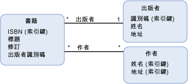

# 外部索引鍵屬性foreign key property
A*外部索引鍵屬性*實體資料模型 (EDM) 中是基本型別[屬性](../../../../docs/framework/data/adonet/property.md)（或基本型別屬性的一組） 上[實體類型](../../../../docs/framework/data/adonet/entity-type.md)包含[實體索引鍵](../../../../docs/framework/data/adonet/entity-key.md)另一個實體類型。A *foreign key property* in the Entity Data Model (EDM) is a primitive type [property](../../../../docs/framework/data/adonet/property.md) (or a set of primitive type properties) on an [entity type](../../../../docs/framework/data/adonet/entity-type.md) that contains the [entity key](../../../../docs/framework/data/adonet/entity-key.md) of another entity type.  
  
 外部索引鍵屬性類似關聯式資料庫中的外部索引鍵資料行。A foreign key property is analogous to a foreign key column in a relational database. 外部索引鍵資料行用於建立資料表中的資料列之間的關聯性的關聯式資料庫的相同方式，在概念模型中的外部索引鍵屬性用來建立[關聯](../../../../docs/framework/data/adonet/association-type.md)實體類型之間。In the same way that foreign key columns are used in a relational database to create relationships between rows in tables, foreign key properties in a conceptual model are used to establish [associations](../../../../docs/framework/data/adonet/association-type.md) between entity types. A[參考完整性條件約束](../../../../docs/framework/data/adonet/referential-integrity-constraint.md)用來定義兩個實體類型，當其中一個型別具有外部索引鍵屬性之間的關聯。A [referential integrity constraint](../../../../docs/framework/data/adonet/referential-integrity-constraint.md) is used to define an association between two entity types when one of the types has a foreign key property.  
  
## 範例Example  
 下圖顯示包含三種實體類型 (`Book`、`Publisher` 和 `Author`) 的概念模型。The diagram below shows a conceptual model with three entity types: `Book`, `Publisher`, and `Author`. `Book` 實體類型具有屬性 `PublisherId`，當您定義 `Publisher` 關聯的參考完整性條件約束時，此屬性會參考 `PublishedBy` 實體類型的實體索引鍵。The `Book` entity type has a property, `PublisherId`, that references the entity key of the `Publisher` entity type when you define a referential integrity constraint on the `PublishedBy` association.  
  
   
  
 [ADO.NET Entity Framework](../../../../docs/framework/data/adonet/ef/index.md)會使用稱為概念結構定義語言的特定領域語言 (DSL) ([CSDL](../../../../docs/framework/data/adonet/ef/language-reference/csdl-specification.md)) 來定義概念模型。The [ADO.NET Entity Framework](../../../../docs/framework/data/adonet/ef/index.md) uses a domain-specific language (DSL) called conceptual schema definition language ([CSDL](../../../../docs/framework/data/adonet/ef/language-reference/csdl-specification.md)) to define conceptual models. 下列 CSDL 使用外部索引鍵屬性 `PublisherId`，針對上述概念模型中的 `PublishedBy` 關聯定義參考完整性條件約束。The following CSDL uses the foreign key property `PublisherId` to define a referential integrity constraint on the `PublishedBy` association shown in the conceptual model shown above.  
  
 [!code-xml[EDM_Example_Model#RefConstraint](../../../../samples/snippets/xml/VS_Snippets_Data/edm_example_model/xml/books4.edmx#refconstraint)]  
  
## 另請參閱See Also  
 [實體資料模型的重要概念Entity Data Model Key Concepts](../../../../docs/framework/data/adonet/entity-data-model-key-concepts.md)  
 [實體資料模型Entity Data Model](../../../../docs/framework/data/adonet/entity-data-model.md)
