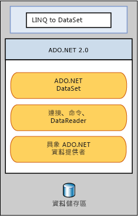

# LINQ to DataSet
[!INCLUDE[linq_dataset](../../../../includes/linq-dataset-md.md)] 可讓您更方便且更快速地查詢在 <xref:System.Data.DataSet> 物件中快取的資料。  更明確地說，[!INCLUDE[linq_dataset](../../../../includes/linq-dataset-md.md)] 可讓開發人員從程式語言本身撰寫查詢，而非使用不同的查詢語言，藉以簡化查詢作業。  這點對於 [!INCLUDE[vsprvs](../../../../includes/vsprvs-md.md)] 開發人員特別有用，因為他們現在就可以在查詢中運用 [!INCLUDE[vsprvs](../../../../includes/vsprvs-md.md)] 所提供的編譯時期語法檢查、靜態型別和 IntelliSense 支援。  
  
 [!INCLUDE[linq_dataset](../../../../includes/linq-dataset-md.md)] 也可用來查詢已經從一個或多個資料來源合併的資料。  這點可以實現許多資料表示和處理方式需要彈性的案例，例如本機查詢彙總的資料和在 Web 應用程式中進行中介層 \(Middle Tier\) 快取。  尤其，一般報表、分析和商務智慧應用程式都需要這種管理方法。  
  
 [!INCLUDE[linq_dataset](../../../../includes/linq-dataset-md.md)] 功能主要是透過 <xref:System.Data.DataRowExtensions> 和 <xref:System.Data.DataTableExtensions> 類別 \(Class\) 中的擴充方法公開 \(Expose\) 的。[!INCLUDE[linq_dataset](../../../../includes/linq-dataset-md.md)] 是以現有的 [!INCLUDE[ado_whidbey_long](../../../../includes/ado-whidbey-long-md.md)] 架構為基礎並加以使用，但是不會在應用程式程式碼中取代 [!INCLUDE[ado_whidbey_long](../../../../includes/ado-whidbey-long-md.md)]。  現有的 ADO.NET 2.0 程式碼將繼續在 [!INCLUDE[linq_dataset](../../../../includes/linq-dataset-md.md)] 應用程式中運作。 下圖將說明 [!INCLUDE[linq_dataset](../../../../includes/linq-dataset-md.md)] 與 [!INCLUDE[ado_whidbey_long](../../../../includes/ado-whidbey-long-md.md)] 的關聯性以及資料存放區。  
  
   
  
## 在本節中  
 [使用者入門](../../../../docs/framework/data/adonet/getting-started-linq-to-dataset.md)  
  
 [程式設計手冊](../../../../docs/framework/data/adonet/programming-guide-linq-to-dataset.md)  
  
## 參考  
 <xref:System.Data.DataTableExtensions>  
  
 <xref:System.Data.DataRowExtensions>  
  
 <xref:System.Data.DataRowComparer>  
  
## 請參閱  
 [LINQ \(Language\-Integrated Query\)](../Topic/LINQ%20\(Language-Integrated%20Query\).md)   
 [LINQ 和 ADO.NET](../../../../docs/framework/data/adonet/linq-and-ado-net.md)   
 [ADO.NET](../../../../docs/framework/data/adonet/index.md)