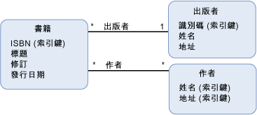

# 模型定義函式model-defined function
A*模型定義函式*是概念模型中所定義的函式。A *model-defined function* is a function that is defined in a conceptual model. 模型定義函式的主體以表示[Entity SQL](../../../../docs/framework/data/adonet/ef/language-reference/entity-sql-language.md)、 表示之外，獨立函式可讓規則或資料來源中支援的語言。The body of a model-defined function is expressed in [Entity SQL](../../../../docs/framework/data/adonet/ef/language-reference/entity-sql-language.md), which allows for the function to be expressed independently of rules or languages supported in the data source.  
  
 模型定義函式的定義包含下列資訊：A definition for a model-defined function contains the following information:  
  
-   函式名稱。A function name. (必要項)(Required)  
  
-   傳回值的型別。The type of the return value. (選擇項)(Optional)  
  
    > [!NOTE]
    >  若未指定任何傳回型別，則傳回值為 void。If no return type is specified, the return value is void.  
  
-   參數資訊。Parameter information. (選擇項)(Optional)  
  
-   [Entity SQL](../../../../docs/framework/data/adonet/ef/language-reference/entity-sql-language.md)定義函式主體的運算式。An [Entity SQL](../../../../docs/framework/data/adonet/ef/language-reference/entity-sql-language.md) expression that defines the body of the function.  
  
 請注意，模型定義函式不支援輸出參數。Note that model-defined functions do not support output parameters. 有此限制後才能夠撰寫模型定義函式。This restriction is in place so that model-defined functions can be composed.  
  
## 範例Example  
 下圖顯示包含三種實體類型 (`Book`、`Publisher` 和 `Author`) 的概念模型。The diagram below shows a conceptual model with three entity types: `Book`, `Publisher`, and `Author`.  
  
   
  
 [ADO.NET Entity Framework](../../../../docs/framework/data/adonet/ef/index.md)會使用稱為概念結構定義語言的特定領域語言 (DSL) ([CSDL](../../../../docs/framework/data/adonet/ef/language-reference/csdl-specification.md)) 來定義概念模型。The [ADO.NET Entity Framework](../../../../docs/framework/data/adonet/ef/index.md) uses a domain-specific language (DSL) called conceptual schema definition language ([CSDL](../../../../docs/framework/data/adonet/ef/language-reference/csdl-specification.md)) to define conceptual models. 下列 CSDL 定義概念模型中的函式，會傳回上圖中 `Book` 執行個體發行年度以來的年份。The following CSDL defines a function in the conceptual model that returns the numbers of years since an instance of a `Book` (in the diagram above) was published.  
  
 [!code-xml[EDM_Example_Model#ModelDefinedFunction](../../../../samples/snippets/xml/VS_Snippets_Data/edm_example_model/xml/books4.edmx#modeldefinedfunction)]  
  
## 另請參閱See Also  
 [實體資料模型索引鍵概念Entity Data Model Key Concepts](../../../../docs/framework/data/adonet/entity-data-model-key-concepts.md)  
 [實體資料模型Entity Data Model](../../../../docs/framework/data/adonet/entity-data-model.md)  
 [實體資料模型：基本資料類型Entity Data Model: Primitive Data Types](../../../../docs/framework/data/adonet/entity-data-model-primitive-data-types.md)
