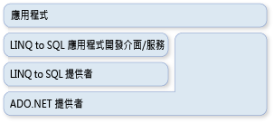

# ADO.NET 和 LINQ to SQL
[!INCLUDE[vbtecdlinq](../../../../../../includes/vbtecdlinq-md.md)] 是 ADO.NET 系列技術的一部分。 它根據 ADO.NET 提供者模型所提供的服務。 因此您可以混合[!INCLUDE[vbtecdlinq](../../../../../../includes/vbtecdlinq-md.md)]與現有的 ADO.NET 應用程式程式碼，並移轉至目前的 ADO.NET 解決方案[!INCLUDE[vbtecdlinq](../../../../../../includes/vbtecdlinq-md.md)]。 下圖提供關聯性 (Relationship) 的高層級檢視。  
  
   
  
## 連接  
 當您建立時，您可以提供現有的 ADO.NET 連接[!INCLUDE[vbtecdlinq](../../../../../../includes/vbtecdlinq-md.md)] <xref:System.Data.Linq.DataContext>。 對所有作業<xref:System.Data.Linq.DataContext>（包括查詢）。 使用此提供的連接。 如果連接已經開啟，[!INCLUDE[vbtecdlinq](../../../../../../includes/vbtecdlinq-md.md)]離開它時完成它。  
  
 [!code-csharp[DLinqCommunicatingWithDatabase#4](../../../../../../samples/snippets/csharp/VS_Snippets_Data/DLinqCommunicatingWithDatabase/cs/Program.cs#4)]
 [!code-vb[DLinqCommunicatingWithDatabase#4](../../../../../../samples/snippets/visualbasic/VS_Snippets_Data/DLinqCommunicatingWithDatabase/vb/Module1.vb#4)]  
  
 您可以一直存取此連接，並且使用 <xref:System.Data.Linq.DataContext.Connection%2A> 屬性自行將它關閉，如下列程式碼所示：  
  
 [!code-csharp[DLinqAdoNet#1](../../../../../../samples/snippets/csharp/VS_Snippets_Data/DLinqAdoNet/cs/Program.cs#1)]
 [!code-vb[DLinqAdoNet#1](../../../../../../samples/snippets/visualbasic/VS_Snippets_Data/DLinqAdoNet/vb/Module1.vb#1)]  
  
## 異動  
 當您的應用程式已經啟始異動而且您希望您的 <xref:System.Data.Linq.DataContext> 參與其中時，您可以提供您的 <xref:System.Data.Linq.DataContext> 與自己的資料庫異動。  
  
 進行.NET framework 的異動的慣用的方法是使用<xref:System.Transactions.TransactionScope>物件。 使用這個方法，您可以進行適用於所有資料庫和其他常駐記憶體資源管理員的分散式異動。 交易範圍需要少數資源即可開始。 當交易範圍內有多個連線時，才會自行升級至分散式交易。  
  
 [!code-csharp[DLinqAdoNet#2](../../../../../../samples/snippets/csharp/VS_Snippets_Data/DLinqAdoNet/cs/Program.cs#2)]
 [!code-vb[DLinqAdoNet#2](../../../../../../samples/snippets/visualbasic/VS_Snippets_Data/DLinqAdoNet/vb/Module1.vb#2)]  
  
 您無法將此方法用於所有資料庫。 例如，SqlClient 連接它適用於 SQL Server 2000 伺服器時，無法升級系統異動。 反而，每當它看見正在使用的異動範圍時，就會自動參與完整的分散式異動。  
  
## 直接 SQL 命令  
 您偶而會碰到 <xref:System.Data.Linq.DataContext> 查詢或提交變更的能力不足以因應您想執行之特殊工作的情況。 在這些情況下，您可以使用 <xref:System.Data.Linq.DataContext.ExecuteQuery%2A> 方法將 SQL 命令發出至資料庫，並將查詢結果轉換為物件。  
  
 例如，假設 `Customer` 類別的資料會分布於兩個資料表 (customer1 和 customer2)。 下列查詢會傳回 `Customer` 物件的序列：  
  
 [!code-csharp[DLinqAdoNet#3](../../../../../../samples/snippets/csharp/VS_Snippets_Data/DLinqAdoNet/cs/Program.cs#3)]
 [!code-vb[DLinqAdoNet#3](../../../../../../samples/snippets/visualbasic/VS_Snippets_Data/DLinqAdoNet/vb/Module1.vb#3)]  
  
 只要表格式結果中的資料行名稱符合您的實體類別中的資料行屬性[!INCLUDE[vbtecdlinq](../../../../../../includes/vbtecdlinq-md.md)]建立您的物件，從任何 SQL 查詢。  
  
### 參數  
 <xref:System.Data.Linq.DataContext.ExecuteQuery%2A> 方法可接受參數。 下列程式碼會執行參數型查詢：  
  
 [!code-csharp[DlinqAdoNet#4](../../../../../../samples/snippets/csharp/VS_Snippets_Data/DLinqAdoNet/cs/Program.cs#4)]
 [!code-vb[DlinqAdoNet#4](../../../../../../samples/snippets/visualbasic/VS_Snippets_Data/DLinqAdoNet/vb/Module1.vb#4)]  
  
> [!NOTE]
>  查詢文字中的參數會使用與 `Console.WriteLine()` 和 `String.Format()` 所用的相同大括號標記法加以表示。 `String.Format()` 會採用您提供的查詢字串，並且以產生的參數名稱 (例如 `@p0`、`@p1` ...、`@p(n)`) 替代大括號內的參數。  
  
## 另請參閱

- [背景資訊](../../../../../../docs/framework/data/adonet/sql/linq/background-information.md)
- [如何：重複使用 ADO.NET 命令和 DataContext 之間的連線](../../../../../../docs/framework/data/adonet/sql/linq/how-to-reuse-a-connection-between-an-ado-net-command-and-a-datacontext.md)
