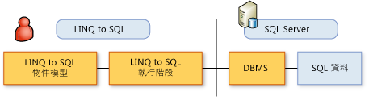

# LINQ to SQL 物件模型The LINQ to SQL Object Model
在  [!INCLUDE[vbtecdlinq](../../../../../../includes/vbtecdlinq-md.md)]，以開發人員的程式語言表示的物件模型對應到關聯式資料庫的資料模型。In [!INCLUDE[vbtecdlinq](../../../../../../includes/vbtecdlinq-md.md)], an object model expressed in the programming language of the developer is mapped to the data model of a relational database. 然後就會根據物件模型對資料執行作業。Operations on the data are then conducted according to the object model.  
  
 在這種情況下，您不會發出資料庫命令 (例如，`INSERT`) 至資料庫。In this scenario, you do not issue database commands (for example, `INSERT`) to the database. 而是在您的物件模型中變更值和執行方法。Instead, you change values and execute methods within your object model. 當您要查詢資料庫或將變更傳送至資料庫時，[!INCLUDE[vbtecdlinq](../../../../../../includes/vbtecdlinq-md.md)] 會將您的要求轉譯為正確的 SQL 命令，並將這些命令傳送至資料庫。When you want to query the database or send it changes, [!INCLUDE[vbtecdlinq](../../../../../../includes/vbtecdlinq-md.md)] translates your requests into the correct SQL commands and sends those commands to the database.  
  
   
  
 中的最基本項目[!INCLUDE[vbtecdlinq](../../../../../../includes/vbtecdlinq-md.md)]物件模型和其與關聯式資料模型中的項目關聯性會摘要在下列資料表：The most fundamental elements in the [!INCLUDE[vbtecdlinq](../../../../../../includes/vbtecdlinq-md.md)] object model and their relationship to elements in the relational data model are summarized in the following table:  
  
|LINQ to SQL 物件模型LINQ to SQL Object Model|關聯式資料模型Relational Data Model|  
|------------------------------|---------------------------|  
|實體類別Entity class|資料表Table|  
|類別成員Class member|資料行Column|  
|關聯Association|外部索引鍵關聯性Foreign-key relationship|  
|方法Method|預存程序或函式Stored Procedure or Function|  
  
> [!NOTE]
>  下列說明假設您對於關聯式資料模型和規則有基本知識。The following descriptions assume that you have a basic knowledge of the relational data model and rules.  
  
## LINQ to SQL 實體類別和資料庫資料表LINQ to SQL Entity Classes and Database Tables  
 在  [!INCLUDE[vbtecdlinq](../../../../../../includes/vbtecdlinq-md.md)]，表示資料庫資料表*實體類別*。In [!INCLUDE[vbtecdlinq](../../../../../../includes/vbtecdlinq-md.md)], a database table is represented by an *entity class*. 實體類別就像您可能建立的任何其他類別，但您會使用能讓類別與資料庫資料表產生關聯的特殊資訊來標註此類別。An entity class is like any other class you might create except that you annotate the class by using special information that associates the class with a database table. 您可將自訂屬性 (<xref:System.Data.Linq.Mapping.TableAttribute>) 加入至您的類別宣告，藉以產生此附註，如下列範例所示：You make this annotation by adding a custom attribute (<xref:System.Data.Linq.Mapping.TableAttribute>) to your class declaration, as in the following example:  
  
### 範例Example  
 [!code-csharp[DLinqObjectModel#1](../../../../../../samples/snippets/csharp/VS_Snippets_Data/DLinqObjectModel/cs/Program.cs#1)]
 [!code-vb[DLinqObjectModel#1](../../../../../../samples/snippets/visualbasic/VS_Snippets_Data/DLinqObjectModel/vb/Module1.vb#1)]  
  
 只有宣告為資料表的類別執行個體 (也就是實體類別) 可以儲存至資料庫。Only instances of classes declared as tables (that is, entity classes) can be saved to the database.  
  
 如需詳細資訊，請參閱的資料表屬性 > 一節[屬性為基礎的對應](../../../../../../docs/framework/data/adonet/sql/linq/attribute-based-mapping.md)。For more information, see the Table Attribute section of [Attribute-Based Mapping](../../../../../../docs/framework/data/adonet/sql/linq/attribute-based-mapping.md).  
  
## LINQ to SQL 類別成員和資料庫資料行LINQ to SQL Class Members and Database Columns  
 除了使類別和資料表產生關聯以外，您還會指定欄位或屬性，以表示資料庫資料行。In addition to associating classes with tables, you designate fields or properties to represent database columns. 基於這個目的，[!INCLUDE[vbtecdlinq](../../../../../../includes/vbtecdlinq-md.md)] 會定義 <xref:System.Data.Linq.Mapping.ColumnAttribute> 屬性，如下列範例所示：For this purpose, [!INCLUDE[vbtecdlinq](../../../../../../includes/vbtecdlinq-md.md)] defines the <xref:System.Data.Linq.Mapping.ColumnAttribute> attribute, as in the following example:  
  
### 範例Example  
 [!code-csharp[DLinqObjectModel#2](../../../../../../samples/snippets/csharp/VS_Snippets_Data/DLinqObjectModel/cs/Program.cs#2)]
 [!code-vb[DLinqObjectModel#2](../../../../../../samples/snippets/visualbasic/VS_Snippets_Data/DLinqObjectModel/vb/Module1.vb#2)]  
  
 只有對應到資料行的欄位和屬性會保存至資料庫或自資料庫擷取。Only fields and properties mapped to columns are persisted to or retrieved from the database. 至於未宣告為資料行者，則會被視為應用程式邏輯的暫時性部分。Those not declared as columns are considered as transient parts of your application logic.  
  
 <xref:System.Data.Linq.Mapping.ColumnAttribute> 屬性 (Attribute) 具有各種屬性 (Property)，您可以用於自訂表示資料行的這些成員 (例如，指定成員以表示主索引鍵資料行)。The <xref:System.Data.Linq.Mapping.ColumnAttribute> attribute has a variety of properties that you can use to customize these members that represent columns (for example, designating a member as representing a primary key column). 如需詳細資訊，請參閱的資料行屬性 > 一節[屬性為基礎的對應](../../../../../../docs/framework/data/adonet/sql/linq/attribute-based-mapping.md)。For more information, see the Column Attribute section of [Attribute-Based Mapping](../../../../../../docs/framework/data/adonet/sql/linq/attribute-based-mapping.md).  
  
## LINQ to SQL 關聯和資料庫外部索引鍵關聯性LINQ to SQL Associations and Database Foreign-key Relationships  
 在  [!INCLUDE[vbtecdlinq](../../../../../../includes/vbtecdlinq-md.md)]，您藉由套用代表資料庫關聯 （例如外部索引鍵對主索引鍵關聯性）<xref:System.Data.Linq.Mapping.AssociationAttribute>屬性。In [!INCLUDE[vbtecdlinq](../../../../../../includes/vbtecdlinq-md.md)], you represent database associations (such as foreign-key to primary-key relationships) by applying the <xref:System.Data.Linq.Mapping.AssociationAttribute> attribute. 下列程式碼區段中`Order`類別包含`Customer`具有屬性<xref:System.Data.Linq.Mapping.AssociationAttribute>屬性。In the following segment of code, the `Order` class contains a `Customer` property that has an <xref:System.Data.Linq.Mapping.AssociationAttribute> attribute. 這個屬性 (Property) 與其屬性 (Attribute) 提供了與 `Order` 類別有關的 `Customer` 類別。This property and its attribute provide the `Order` class with a relationship to the `Customer` class.  
  
 下列程式碼範例顯示 `Customer` 類別中的 `Order` 屬性 (Property)。The following code example shows the `Customer` property from the `Order` class.  
  
### 範例Example  
 [!code-csharp[DLinqObjectModel#3](../../../../../../samples/snippets/csharp/VS_Snippets_Data/DLinqObjectModel/cs/northwind.cs#3)]
 [!code-vb[DLinqObjectModel#3](../../../../../../samples/snippets/visualbasic/VS_Snippets_Data/DLinqObjectModel/vb/northwind.vb#3)]  
  
 如需詳細資訊，請參閱的關聯屬性 > 一節[屬性為基礎的對應](../../../../../../docs/framework/data/adonet/sql/linq/attribute-based-mapping.md)。For more information, see the Association Attribute section of [Attribute-Based Mapping](../../../../../../docs/framework/data/adonet/sql/linq/attribute-based-mapping.md).  
  
## LINQ to SQL 方法和資料庫預存程序LINQ to SQL Methods and Database Stored Procedures  
 [!INCLUDE[vbtecdlinq](../../../../../../includes/vbtecdlinq-md.md)] 支援預存程序和使用者定義函式。supports stored procedures and user-defined functions. 在  [!INCLUDE[vbtecdlinq](../../../../../../includes/vbtecdlinq-md.md)]，好讓您可以存取它們以強型別的方式從用戶端程式碼，用戶端物件來對應這些資料庫定義的抽象概念。In [!INCLUDE[vbtecdlinq](../../../../../../includes/vbtecdlinq-md.md)], you map these database-defined abstractions to client objects so that you can access them in a strongly typed manner from client code. 方法簽章與資料庫中定義的程序和函式簽章十分相似。The method signatures resemble as closely as possible the signatures of the procedures and functions defined in the database. 您可以使用 IntelliSense 來探索這些方法。You can use IntelliSense to discover these methods.  
  
 呼叫對應程序所傳回的結果集是強型別集合。A result set that is returned by a call to a mapped procedure is a strongly typed collection.  
  
 [!INCLUDE[vbtecdlinq](../../../../../../includes/vbtecdlinq-md.md)] 會使用 <xref:System.Data.Linq.Mapping.FunctionAttribute> 和 <xref:System.Data.Linq.Mapping.ParameterAttribute> 屬性，將預存程序和函式對應至方法。maps stored procedures and functions to methods by using the <xref:System.Data.Linq.Mapping.FunctionAttribute> and <xref:System.Data.Linq.Mapping.ParameterAttribute> attributes. <xref:System.Data.Linq.Mapping.FunctionAttribute.IsComposable%2A> 屬性可以區分表示預存程序的方法和表示使用者定義函式的方法。Methods representing stored procedures are distinguished from those representing user-defined functions by the <xref:System.Data.Linq.Mapping.FunctionAttribute.IsComposable%2A> property. 如果此屬性設為 `false` (預設值)，則此方法表示預存程序。If this property is set to `false` (the default), the method represents a stored procedure. 如果設為 `true`，則此方法表示資料庫函式。If it is set to `true`, the method represents a database function.  
  
> [!NOTE]
>  如果您使用 Visual Studio，您可以使用[!INCLUDE[vs_ordesigner_long](../../../../../../includes/vs-ordesigner-long-md.md)]來建立對應至預存程序和使用者定義函式的方法。If you are using Visual Studio, you can use the [!INCLUDE[vs_ordesigner_long](../../../../../../includes/vs-ordesigner-long-md.md)] to create methods mapped to stored procedures and user-defined functions.  
  
### 範例Example  
 [!code-csharp[DLinqObjectModel#4](../../../../../../samples/snippets/csharp/VS_Snippets_Data/DLinqObjectModel/cs/northwind.cs#4)]
 [!code-vb[DLinqObjectModel#4](../../../../../../samples/snippets/visualbasic/VS_Snippets_Data/DLinqObjectModel/vb/northwind.vb#4)]  
  
 如需詳細資訊，請參閱函式屬性、 預存程序屬性 > 和 < 參數屬性的章節[屬性為基礎的對應](../../../../../../docs/framework/data/adonet/sql/linq/attribute-based-mapping.md)並[預存程序](../../../../../../docs/framework/data/adonet/sql/linq/stored-procedures.md)。For more information, see the Function Attribute, Stored Procedure Attribute, and Parameter Attribute sections of [Attribute-Based Mapping](../../../../../../docs/framework/data/adonet/sql/linq/attribute-based-mapping.md) and [Stored Procedures](../../../../../../docs/framework/data/adonet/sql/linq/stored-procedures.md).  
  
## 另請參閱See also

- [以屬性為基礎的對應Attribute-Based Mapping](../../../../../../docs/framework/data/adonet/sql/linq/attribute-based-mapping.md)
- [背景資訊Background Information](../../../../../../docs/framework/data/adonet/sql/linq/background-information.md)
