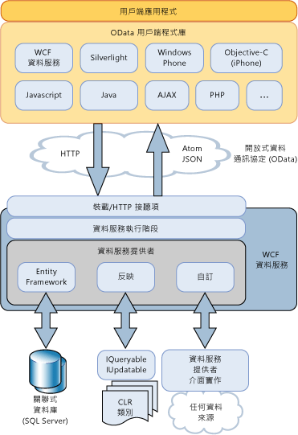

# WCF 資料服務概觀WCF Data Services Overview
[!INCLUDE[ssAstoria](../../../../includes/ssastoria-md.md)]建立及取用 Web 或內部的資料服務會使用啟用[!INCLUDE[ssODataFull](../../../../includes/ssodatafull-md.md)]。 enables creation and consumption of data services for the Web or an intranet by using the [!INCLUDE[ssODataFull](../../../../includes/ssodatafull-md.md)]. [!INCLUDE[ssODataShort](../../../../includes/ssodatashort-md.md)]可讓您將資料公開為可由 Uri 定址的資源。 enables you to expose your data as resources that are addressable by URIs. 這可讓您使用具像狀態傳輸 (REST) 的語意存取及變更資料，尤其是標準 HTTP 動作，例如 GET、PUT、POST 和 DELETE。This enables you to access and change data by using the semantics of representational state transfer (REST), specifically the standard HTTP verbs of GET, PUT, POST, and DELETE. 本主題提供 [!INCLUDE[ssODataShort](../../../../includes/ssodatashort-md.md)] 所定義的模式和作法概觀以及 [!INCLUDE[ssAstoria](../../../../includes/ssastoria-md.md)] 所提供的功能，以便在 .NET Framework 應用程式中充分利用 [!INCLUDE[ssODataShort](../../../../includes/ssodatashort-md.md)]。This topic provides an overview of both the patterns and practices defined by [!INCLUDE[ssODataShort](../../../../includes/ssodatashort-md.md)] and also the facilities provided by [!INCLUDE[ssAstoria](../../../../includes/ssastoria-md.md)] to take advantage of [!INCLUDE[ssODataShort](../../../../includes/ssodatashort-md.md)] in .NET Framework-based applications.  
  
## 將資料定址為資源Address Data as Resources  
 [!INCLUDE[ssODataShort](../../../../includes/ssodatashort-md.md)] 會將資料公開為可由 URI 定址的資源。 exposes data as resources that are addressable by URIs. 資源路徑會根據實體資料模型的實體-關聯性慣例來建構。The resource paths are constructed based on the entity-relationship conventions of the Entity Data Model. 在此模型中，實體代表應用程式定義域，例如客戶、 訂單、 項目，以及產品中的資料運算單位。In this model, entities represent operational units of data in an application domain, such as customers, orders, items, and products. 如需詳細資訊，請參閱[實體資料模型](../../../../docs/framework/data/adonet/entity-data-model.md)。For more information, see [Entity Data Model](../../../../docs/framework/data/adonet/entity-data-model.md).  
  
 在 [!INCLUDE[ssODataShort](../../../../includes/ssodatashort-md.md)] 中，您將實體資源定址為包含實體型別執行個體的實體集。In [!INCLUDE[ssODataShort](../../../../includes/ssodatashort-md.md)], you address entity resources as an entity set that contains instances of entity types. 例如，URI`http://services.odata.org/Northwind/Northwind.svc/Customers('ALFKI')/Orders`傳回所有訂單`Northwind`與客戶相關的資料服務`CustomerID`值`ALFKI.`For example, the URI `http://services.odata.org/Northwind/Northwind.svc/Customers('ALFKI')/Orders` returns all of the orders from the `Northwind` data service that are related to the customer with a `CustomerID` value of `ALFKI.`  
  
 查詢運算式可讓您針對資源執行傳統查詢運算，例如篩選、排序和分頁。Query expressions enable you to perform traditional query operations against resources, such as filtering, sorting, and paging. 例如，URI `http://services.odata.org/Northwind/Northwind.svc/Customers('ALFKI')/Orders?$filter=Freight gt 50` 會篩選資源，只傳回運費超過 $50 美元的訂單。For example, the URI `http://services.odata.org/Northwind/Northwind.svc/Customers('ALFKI')/Orders?$filter=Freight gt 50` filters the resources to return only the orders with a freight cost of more than $50. 如需詳細資訊，請參閱[存取資料服務資源](../../../../docs/framework/data/wcf/accessing-data-service-resources-wcf-data-services.md)。For more information, see [Accessing Data Service Resources](../../../../docs/framework/data/wcf/accessing-data-service-resources-wcf-data-services.md).  
  
## 可互通的資料存取Interoperable Data Access  
 [!INCLUDE[ssODataShort](../../../../includes/ssodatashort-md.md)]若要使資料服務可與不使用.NET Framework 的應用程式的互通標準網際網路通訊協定為基礎。 builds on standard Internet protocols to make data services interoperable with applications that do not use the .NET Framework. 您可以使用標準 Uri 來定址資料，因為您的應用程式可以存取和變更資料，以利用具像狀態傳輸 (REST)，特別是標準 HTTP 動詞命令的 GET、 PUT、 POST 和刪除。Because you can use standard URIs to address data, your application can access and change data by using the semantics of representational state transfer (REST), specifically the standard HTTP verbs of GET, PUT, POST, and DELETE. 這樣能讓您從任何用戶端存取這些服務 (這些用戶端需可剖析及存取透過標準 HTTP 通訊協定傳輸的資料)。This enables you to access these services from any client that can parse and access data that is transmitted over standard HTTP protocols.  
  
 [!INCLUDE[ssODataShort](../../../../includes/ssodatashort-md.md)] 會定義 Atom 發行通訊協定 (AtomPub) 的一組延伸。 defines a set of extensions to the Atom Publishing Protocol (AtomPub). 它可支援採用多種資料格式的 HTTP 要求和回應，配合各種用戶端應用程式和平台。It supports HTTP requests and responses in more than one data format to accommodate various client applications and platforms. [!INCLUDE[ssODataShort](../../../../includes/ssodatashort-md.md)] 摘要可以表示 Atom、JavaScript 物件標記法 (JSON) 和單純 XML 格式的資料。An [!INCLUDE[ssODataShort](../../../../includes/ssodatashort-md.md)] feed can represent data in Atom, JavaScript Object Notation (JSON), and as plain XML. 雖然 Atom 是預設格式，但是摘要的格式會在 HTTP 要求的標頭中指定。While Atom is the default format, the format of the feed is specified in the header of the HTTP request. 如需詳細資訊，請參閱[OData: Atom 格式](http://go.microsoft.com/fwlink/?LinkID=185794)和[OData: JSON 格式](http://go.microsoft.com/fwlink/?LinkID=185795)。For more information, see [OData: Atom Format](http://go.microsoft.com/fwlink/?LinkID=185794) and [OData: JSON Format](http://go.microsoft.com/fwlink/?LinkID=185795).  
  
 當資料發行為[!INCLUDE[ssODataShort](../../../../includes/ssodatashort-md.md)]換行字元、[!INCLUDE[ssAstoria](../../../../includes/ssastoria-md.md)]依賴其他現有的網際網路機能進行此類作業，例如快取和驗證。When publishing data as an [!INCLUDE[ssODataShort](../../../../includes/ssodatashort-md.md)] feed, [!INCLUDE[ssAstoria](../../../../includes/ssastoria-md.md)] relies on other existing Internet facilities for such operations as caching and authentication. 若要達成此目的，[!INCLUDE[ssAstoria](../../../../includes/ssastoria-md.md)]與現有的裝載應用程式及服務，例如 ASP.NET、 Windows Communication Foundation (WCF) 和網際網路資訊服務 (IIS) 的整合。To accomplish this, [!INCLUDE[ssAstoria](../../../../includes/ssastoria-md.md)] integrates with existing hosting applications and services, such as ASP.NET, Windows Communication Foundation (WCF), and Internet Information Services (IIS).  
  
## 儲存獨立性Storage Independence  
 雖然會根據實體-關聯性模型定址資源，但無論基礎資料來源為何，[!INCLUDE[ssAstoria](../../../../includes/ssastoria-md.md)] 都會公開 [!INCLUDE[ssODataShort](../../../../includes/ssodatashort-md.md)] 摘要。Although resources are addressed based on an entity-relationship model, [!INCLUDE[ssAstoria](../../../../includes/ssastoria-md.md)] expose [!INCLUDE[ssODataShort](../../../../includes/ssodatashort-md.md)] feeds regardless of the underlying data source. [!INCLUDE[ssAstoria](../../../../includes/ssastoria-md.md)] 接受 URI 識別之資源所傳來的 HTTP 要求後，會將該要求還原序列化，並將該要求的表示法傳遞至 [!INCLUDE[ssAstoria](../../../../includes/ssastoria-md.md)] 提供者。After [!INCLUDE[ssAstoria](../../../../includes/ssastoria-md.md)] accepts an HTTP request for a resource that a URI identifies, the request is deserialized and a representation of that request is passed to an [!INCLUDE[ssAstoria](../../../../includes/ssastoria-md.md)] provider. 此提供者會將要求轉譯為特定資料來源格式，並且在基礎資料來源執行該要求。This provider translates the request into a data source-specific format and executes the request on the underlying data source. [!INCLUDE[ssAstoria](../../../../includes/ssastoria-md.md)] 會將定址資源的概念模型 ([!INCLUDE[ssODataShort](../../../../includes/ssodatashort-md.md)] 所規定) 與基礎資料來源的特定結構描述區隔開來，以達到儲存獨立性。 achieves storage independence by separating the conceptual model that addresses resources prescribed by [!INCLUDE[ssODataShort](../../../../includes/ssodatashort-md.md)] from the specific schema of the underlying data source.  
  
 [!INCLUDE[ssAstoria](../../../../includes/ssastoria-md.md)] 整合 ADO.NET Entity Framework，可讓您建立公開關聯式資料的資料服務。 integrates with the ADO.NET Entity Framework to enable you to create data services that expose relational data. 您可以使用實體資料模型工具建立以實體形式包含可定址資源的資料模型，同時定義此模型和基礎資料庫中資料表的對應。You can use the Entity Data Model tools to create a data model that contains addressable resources as entities and at the same time define the mapping between this model and the tables in the underlying database. 如需詳細資訊，請參閱[Entity Framework 提供者](../../../../docs/framework/data/wcf/entity-framework-provider-wcf-data-services.md)。For more information, see [Entity Framework Provider](../../../../docs/framework/data/wcf/entity-framework-provider-wcf-data-services.md).  
  
 [!INCLUDE[ssAstoria](../../../../includes/ssastoria-md.md)]也可讓您建立資料服務公開 （expose） 的實作會傳回任何資料結構<xref:System.Linq.IQueryable%601>介面。 also enables you to create data services that expose any data structures that return an implementation of the <xref:System.Linq.IQueryable%601> interface. 這可讓您建立公開 .NET Framework 型別資料的資料服務。This enables you to create data services that expose data from .NET Framework types. 若您同時實作 <xref:System.Data.Services.IUpdatable> 介面，則亦支援建立、更新及刪除作業。Create, update, and delete operations are supported when you also implement the <xref:System.Data.Services.IUpdatable> interface. 如需詳細資訊，請參閱[反映提供者](../../../../docs/framework/data/wcf/reflection-provider-wcf-data-services.md)。For more information, see [Reflection Provider](../../../../docs/framework/data/wcf/reflection-provider-wcf-data-services.md).  
  
 如需如何的圖例[!INCLUDE[ssAstoria](../../../../includes/ssastoria-md.md)]整合這些資料提供者，請參閱本主題稍後的架構的圖表。For an illustration of how [!INCLUDE[ssAstoria](../../../../includes/ssastoria-md.md)] integrates with these data providers, see the architectural diagram later in this topic.  
  
## 自訂商務邏輯Custom Business Logic  
 [!INCLUDE[ssAstoria](../../../../includes/ssastoria-md.md)]可讓您輕鬆地將自訂商務邏輯加入至服務作業和攔截器透過資料服務。 makes it easy to add custom business logic to a data service through service operations and interceptors. 服務作業是在伺服器上定義的方法，而 URI 可透過與資料資源相同的格式來定址這些方法。Service operations are methods defined on the server that are addressable by URIs in the same form as data resources. 服務作業也使用查詢運算式語法來篩選、排序及分頁作業所傳回的資料。Service operations can also use query expression syntax to filter, order, and page data returned by an operation. 例如，URI `http://localhost:12345/Northwind.svc/GetOrdersByCity?city='London'&$orderby=OrderDate&$top=10&$skip=10` 代表呼叫 Northwind 資料服務中名為 `GetOrdersByCity` 的服務作業，該服務會傳回來自 London 客戶的訂單，同時傳回按 `OrderDate` 排序的分頁結果。For example, the URI `http://localhost:12345/Northwind.svc/GetOrdersByCity?city='London'&$orderby=OrderDate&$top=10&$skip=10` represents a call to a service operation named `GetOrdersByCity` on the Northwind data service that returns orders for customers from London, with paged results sorted by `OrderDate`. 如需詳細資訊，請參閱[服務作業](../../../../docs/framework/data/wcf/service-operations-wcf-data-services.md)。For more information, see [Service Operations](../../../../docs/framework/data/wcf/service-operations-wcf-data-services.md).  
  
 攔截器可讓您依照資料服務將自訂應用程式邏輯整合至要求或回應訊息的處理。Interceptors enable custom application logic to be integrated in the processing of request or response messages by a data service. 在指定的實體集上進行查詢、插入、更新或刪除動作時，系統就會呼叫攔截器。Interceptors are called when a query, insert, update, or delete action occurs on the specified entity set. 然後，攔截器可能會更改資料、強制執行授權原則，甚至結束作業。An interceptor then may alter the data, enforce authorization policy, or even terminate the operation. 您必須針對資料服務所公開的特定實體集，明確地註冊攔截器方法。Interceptor methods must be explicitly registered for a given entity set that is exposed by a data service. 如需詳細資訊，請參閱[攔截器](../../../../docs/framework/data/wcf/interceptors-wcf-data-services.md)。For more information, see [Interceptors](../../../../docs/framework/data/wcf/interceptors-wcf-data-services.md).  
  
## 用戶端程式庫Client Libraries  
 [!INCLUDE[ssODataShort](../../../../includes/ssodatashort-md.md)]定義一組用於與資料服務互動的統一模式。 defines a set of uniform patterns for interacting with data services. 這會提供機會建立可重複使用這些服務，例如更輕鬆地使用資料服務的用戶端程式庫為基礎的元件。This provides an opportunity to create reusable components that are based on these services, such as client-side libraries that make it easier to consume data services.  
  
 [!INCLUDE[ssAstoria](../../../../includes/ssastoria-md.md)] 所包含的用戶端程式庫，適用於以 .NET Framework 和 Silverlight 為基礎的用戶端應用程式。 includes client libraries for both .NET Framework-based and Silverlight-based client applications. 這些用戶端程式庫可讓您利用 .NET Framework 物件與資料服務互動。These client libraries enable you to interact with data services by using .NET Framework objects. 它們也支援以物件為基礎的查詢和 LINQ 查詢、載入相關物件、變更追蹤以及識別解析。They also support object-based queries and LINQ queries, loading related objects, change tracking, and identity resolution. 如需詳細資訊，請參閱[WCF Data Services 用戶端程式庫](../../../../docs/framework/data/wcf/wcf-data-services-client-library.md)。For more information, see [WCF Data Services Client Library](../../../../docs/framework/data/wcf/wcf-data-services-client-library.md).  
  
 除了[!INCLUDE[ssODataShort](../../../../includes/ssodatashort-md.md)]以.NET Framework 和 Silverlight 所隨附的用戶端程式庫可讓您使用的其他用戶端程式庫[!INCLUDE[ssODataShort](../../../../includes/ssodatashort-md.md)]用戶端應用程式，例如 PHP、 AJAX 和 Java 應用程式中的摘要。In addition to the [!INCLUDE[ssODataShort](../../../../includes/ssodatashort-md.md)] client libraries included with the .NET Framework and with Silverlight, there are other client libraries that enable you to consume an [!INCLUDE[ssODataShort](../../../../includes/ssodatashort-md.md)] feed in client applications, such as PHP, AJAX, and Java applications. 如需詳細資訊，請參閱[OData SDK](http://go.microsoft.com/fwlink/?LinkID=185796)。For more information, see the [OData SDK](http://go.microsoft.com/fwlink/?LinkID=185796).  
  
## 架構概觀Architecture Overview  
 下圖說明[!INCLUDE[ssAstoria](../../../../includes/ssastoria-md.md)]架構來公開[!INCLUDE[ssODataShort](../../../../includes/ssodatashort-md.md)]摘要和中使用這些摘要[!INCLUDE[ssODataShort](../../../../includes/ssodatashort-md.md)]-啟用用戶端程式庫：The following diagram illustrates the [!INCLUDE[ssAstoria](../../../../includes/ssastoria-md.md)] architecture for exposing [!INCLUDE[ssODataShort](../../../../includes/ssodatashort-md.md)] feeds and using these feeds in [!INCLUDE[ssODataShort](../../../../includes/ssodatashort-md.md)]-enabled client libraries:  
  
   
  
## 另請參閱See Also  
 [WCF Data Services 4.5WCF Data Services 4.5](../../../../docs/framework/data/wcf/index.md)  
 [快速入門Getting Started](../../../../docs/framework/data/wcf/getting-started-with-wcf-data-services.md)  
 [定義 WCF Data ServicesDefining WCF Data Services](../../../../docs/framework/data/wcf/defining-wcf-data-services.md)  
 [存取資料服務 (WCF Data Services)Accessing a Data Service (WCF Data Services)](http://msdn.microsoft.com/en-us/1e54a2b9-2ec6-4002-b8f8-c1d8df37c350)  
 [WCF Data Services 用戶端程式庫WCF Data Services Client Library](../../../../docs/framework/data/wcf/wcf-data-services-client-library.md)  
 [Representational State Transfer (REST)](http://go.microsoft.com/fwlink/?LinkId=113919) (具像狀態傳輸 (REST))[Representational State Transfer (REST)](http://go.microsoft.com/fwlink/?LinkId=113919)
