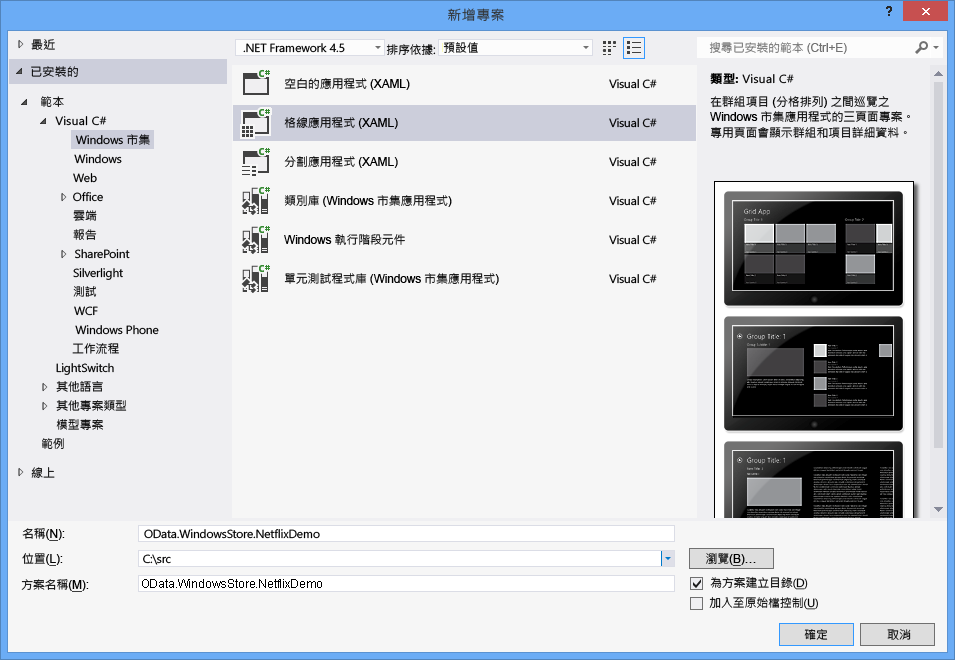
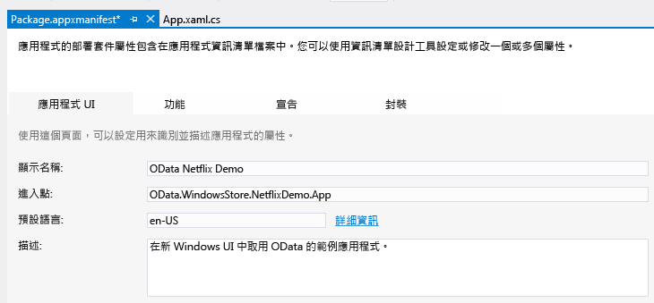
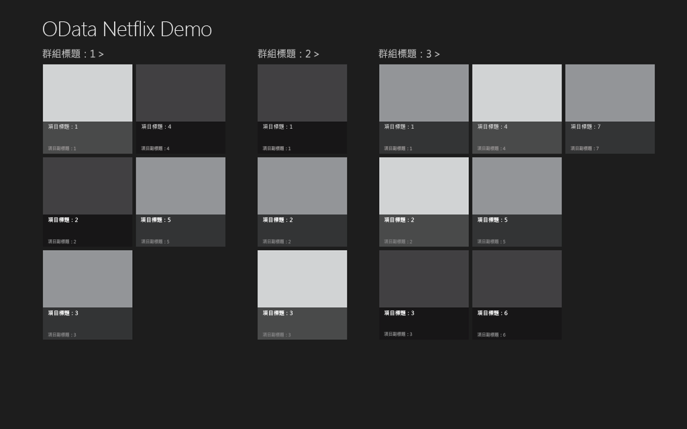
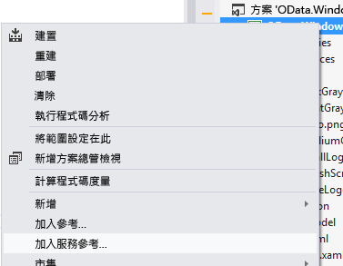
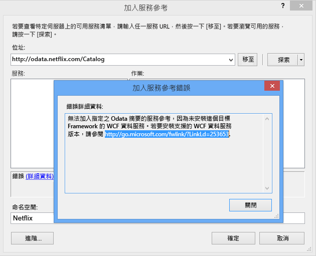
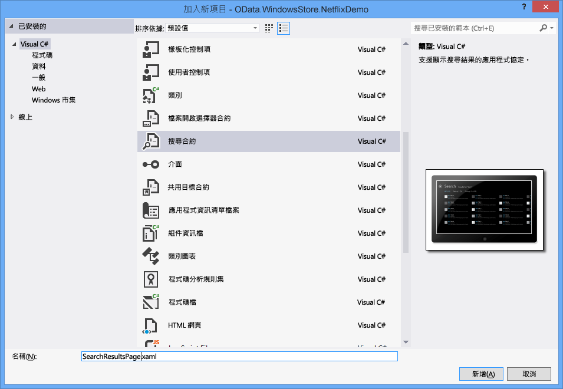

# <a name="writing-a-windows-store-app-that-consumes-an-odata-service"></a>撰寫使用 OData 服務的 Windows 市集應用程式
Windows 8 引入新的應用程式類型： Windows 市集應用程式。 Windows 市集應用程式具有全新的外觀及操作，可在多種裝置上執行，並透過 Windows 市集提供。 本主題說明如何撰寫使用 OData 服務 (尤其是 NetFlix Catalog OData 服務) 的 Windows 市集應用程式。 如需 Windows 市集應用程式的詳細資訊，請閱讀[Windows 市集應用程式使用者入門](http://msdn.microsoft.com/library/windows/apps/br211386.aspx)。  
  
## <a name="prerequisites"></a>必要條件  
  
1.  [Microsoft Windows 8](http://go.microsoft.com/fwlink/p/?LinkId=266654)  
  
2.  [Microsoft Visual Studio 2012](http://go.microsoft.com/fwlink/p/?LinkId=266655)  
  
3.  [WCF 資料服務](http://msdn.microsoft.com/data/bb931106)  
  
#### <a name="creating-the-default-windows-store-grid-application"></a>建立預設 Windows 市集格線應用程式  
  
1.  使用 C# 和 XAML 建立新的 Windows 市集格線應用程式。 將應用程式命名為 OData.WindowsStore.NetflixDemo：  
  
       
  
2.  開啟 Package.appxmanifest，然後在顯示名稱文字方塊中輸入易記名稱。 這會指定搭配 Windows 8 搜尋功能使用的應用程式名稱。  
  
       
  
3.  輸入中的易記名稱\<AppName > App.xaml 檔案中的項目。 這會設定應用程式啟動時所顯示的應用程式名稱：  
  
       
  
4.  建置並啟動應用程式。 請先參閱應用程式的啟動顯示畫面。 下面的螢幕擷取畫面顯示預設啟動顯示畫面。 使用的影像儲存在專案的 Assets 資料夾中。  
  
       
  
     然後，應用程式便會顯示。  
  
       
  
     預設應用程式在 SampleDataSource.cs 中定義一組類別：SampleDataGroup 和 SampleDataItem，兩者都是衍生自 SampleDataCommon，而 SampleDataCommon 本身則衍生自 BindableBase。 SampleDataGroup 和 SampleDataItem 會繫結至預設 GridView。 SampleDataSource.cs 位於 NetflixDemo 專案內的 DataModel 資料夾中。 此應用程式會顯示群組集合。 每個群組包含任何數目的項目，分別由 SampleDataGroup 和 SampleDataItem 表示。 在上一個螢幕擷取畫面中，您會看到稱為「群組標題 1」的一個群組，並同時顯示群組中的所有項目。  
  
     應用程式的主頁面是 GroupedItemsPage.xaml。 其中包含的 GridView 會顯示 SampleDataSource.cs 類別所建立的範例資料。 GroupedItemsPage 是由 App.xaml.cs 呼叫 rootFrame.Navigate 所載入：  
  
    ```csharp  
    if (!rootFrame.Navigate(typeof(GroupedItemsPage), "AllGroups"))  
    {  
        throw new Exception("Failed to create initial page");  
    }  
    ```  
  
     這會具現化 GroupedItemsPage，並呼叫其 LoadState 方法。 LoadState 會建立靜態 SampleDataSource 執行個體，再由其建立 SampleDataGroup 物件的集合。 每個 SampleDataGroup 物件都包含 SampleDataItem 物件的集合。 LoadState 在 DefaultViewModel 中儲存 SampleDataGroup 物件的集合：  
  
    ```csharp  
    protected override void LoadState(Object navigationParameter, Dictionary<String, Object> pageState)  
    {  
        var sampleDataGroups = SampleDataSource.GetGroups((String)navigationParameter);  
        this.DefaultViewModel["Groups"] = sampleDataGroups;  
    }  
    ```  
  
     DefaultViewModel 接著會繫結至 GridView。 這會在設定資料繫結時，於 GroupedItemsPage.xaml 檔案中提供參考。  
  
    ```xaml
    <CollectionViewSource  
                x:Name="groupedItemsViewSource"  
                Source="{Binding Groups}"  
                IsSourceGrouped="true"  
                ItemsPath="TopItems"  
                d:Source="{Binding AllGroups, Source={d:DesignInstance Type=data:SampleDataSource, IsDesignTimeCreatable=True}}"/>  
    ```  
  
     CollectionViewSource 可當做處理群組集合的 Proxy。 進行繫結時，它會逐一查看 SampleDataGroup 物件的集合，以填入 GridView。  ItemsPath 屬性指示 CollectionViewSource 在每個 SampleDataGroup 物件上，使用哪些屬性來尋找物件所包含的 SampleDataItems。 在此範例中，每個 SampleDataGroup 物件都包含 SampleDataItem 物件的 TopItems 集合。  
  
     在 Netflix 應用程式中，影片會依內容類型分組。 因此，應用程式會顯示一些內容類型及該內容類型中的影片清單。  
  
#### <a name="add-a-service-reference-to-the-netflix-odata-service"></a>將服務參考加入 Netflix OData 服務  
  
1.  對 Netflix OData 服務進行任何呼叫之前，必須加入服務參考。 以滑鼠右鍵按一下 [方案總管] 中的專案，並選取 [加入服務參考]。  
  
       
  
2.  在位址列中輸入 Netflix OData 服務的 URL，然後按一下 [移至]。 將服務參考的命名空間設為 Netflix，然後按一下 [確定]。  
  
       
  
    > [!NOTE]
    >  如果您尚未安裝[WCF 資料服務工具為 Windows 市集應用程式](http://go.microsoft.com/fwlink/p/?LinkId=266652)，系統將提示您使用如上述那一個訊息。 您必須下載並安裝連結中所參考的工具，再繼續進行。  
  
 加入服務參考會產生強型別類別，WCF 資料服務將使用此類別來剖析 Netflix OData 服務傳回的 OData。 在 SampleDataSource.cs 中定義的類別可繫結至 GridView，因此必須將資料從產生的 OData 用戶端類別傳送至 SampleDataSource.cs 中定義之可繫結的類別。  若要執行這項操作，必須對 SampleDataSource.cs 中定義的資料模型進行一些變更。  
  
#### <a name="update-the-data-model-for-the-application"></a>更新應用程式的資料模型  
  
1.  中的程式碼取代現有的程式碼在 SampleDataSource.cs 中[gist](https://gist.github.com/3419288)。 更新的程式碼會加入 LoadMovies 方法 (至 SampleDataSource 類別)，以針對 Netflix OData 服務執行查詢，並填入內容類型 (allGroups) 清單及每種內容類型的影片清單。 SampleDataGroup 類別用於表示內容類型，而 SampleDataItem 類別用於表示影片。  
  
    ```csharp  
    public static async void LoadMovies()  
    {  
        IEnumerable<Title> titles = await ((DataServiceQuery<Title>)Context.Titles  
            .Expand("Genres,AudioFormats,AudioFormats/Language,Awards,Cast")  
            .Where(t => t.Rating == "PG")  
            .OrderByDescending(t => t.ReleaseYear)  
            .Take(300)).ExecuteAsync();  
  
        foreach (Title title in titles)  
        {  
            foreach (Genre netflixGenre in title.Genres)  
            {  
                SampleDataGroup genre = GetGroup(netflixGenre.Name);  
                if (genre == null)  
                {  
                    genre = new SampleDataGroup(netflixGenre.Name, netflixGenre.Name, String.Empty, title.BoxArt.LargeUrl, String.Empty);  
                    Instance.AllGroups.Add(genre);  
                }  
                var content = new StringBuilder();  
                // Write additional things to content here if you want them to display in the item detail.  
                genre.Items.Add(new SampleDataItem(title.Id, title.Name, String.Format("{0}rnrn{1} ({2})", title.Synopsis, title.Rating, title.ReleaseYear), title.BoxArt.HighDefinitionUrl ?? title.BoxArt.LargeUrl, "Description", content.ToString()));  
            }  
        }  
    }  
    ```  
  
     [工作架構非同步模式](http://go.microsoft.com/fwlink/p/?LinkId=266651)(TAP) 用來以非同步方式取得 300 部 (Take) 最近 (OrderByDescending) PG 分級 (Where) 影片從 Netflix。 程式碼的其餘部分會從 OData 摘要傳回的實體，建構 SimpleDataItems 和 SimpleDataGroups。  
  
     SampleDataSource 類別也實作簡單的搜尋方法。 在此範例中，該類別會在記憶體中簡單地搜尋載入的影片。  
  
    ```csharp  
    public static IEnumerable<SampleDataItem> Search(string searchString)  
    {  
            var regex = new Regex(searchString, RegexOptions.CultureInvariant | RegexOptions.IgnoreCase | RegexOptions.IgnorePatternWhitespace);  
            return Instance.AllGroups  
                .SelectMany(g => g.Items)  
                .Where(m => regex.IsMatch(m.Title) || regex.IsMatch(m.Subtitle))  
                    .Distinct(new SampleDataItemComparer());  
    }  
    ```  
  
     另外，還會在 SampleDataSource.cs 中定義稱為 ExtensionMethods 的類別。 這些擴充方法使用 TAP 模式允許 SampleDataSource 執行 OData 查詢，而不封鎖 UI。 例如，下列程式碼使用 Task.Factory.FromAsync 方法實作 TAP。  
  
    ```csharp  
    public static async Task<IEnumerable<T>> ExecuteAsync<T>(this DataServiceQuery<T> query)  
    {  
        return await Task.Factory.FromAsync<IEnumerable<T>>(query.BeginExecute(null, null), query.EndExecute);  
    }  
    ```  
  
     如同預設的應用程式，此應用程式的主頁面是 GroupedItemsPage。 不過，此時會顯示從 Netflix 擷取之依內容類型分組的影片。  具現化 GroupedItemsPage 時，會呼叫其 LoadState 方法。 如前所述，LoadState 會建立靜態 SampleDataSource 執行個體，並呼叫 Netflix OData 服務。 LoadState 在 DefaultViewModel 中儲存內容類型 (SampleDataGroup 物件) 的集合：  
  
    ```csharp  
    protected override void LoadState(Object navigationParameter, Dictionary<String, Object> pageState)  
    {  
  
        var sampleDataGroups = SampleDataSource.GetGroups((String)navigationParameter);  
        this.DefaultViewModel["Groups"] = sampleDataGroups;  
    }  
    ```  
  
     如前所述，接著會使用 DefaultViewModel 將資料繫結至 GridView。  
  
#### <a name="add-a-search-contract-to-allow-the-application-to-participate-in-windows-search"></a>加入搜尋合約，讓應用程式參與 Windows 搜尋  
  
1.  將搜尋合約加入應用程式中。 如此可讓應用程式與 Windows 8 搜尋體驗進行整合。 將搜尋合約命名為 SearchResultsPage.xaml  
  
       
  
2.  移除 queryText 前後的內嵌引號，即可修改 SearchResultsPage.xaml.cs 的第 58 行。  
  
    ```csharp  
    // Communicate results through the view model  
    this.DefaultViewModel["QueryText"] = queryText;  
    this.DefaultViewModel["Filters"] = filterList;  
    this.DefaultViewModel["ShowFilters"] = filterList.Count > 1;  
    ```  
  
3.  在 SearchResultsPage.xaml.cs 的第 81 行插入下列兩行程式碼，以擷取搜尋結果。  
  
    ```csharp  
    // TODO: Respond to the change in active filter by setting this.DefaultViewModel["Results"]  
                    //       to a collection of items with bindable Image, Title, Subtitle, and Description properties  
                    var searchValue = (string)this.DefaultViewModel["QueryText"];  
                    this.DefaultViewModel["Results"] = new List<SampleDataItem>(SampleDataSource.Search(searchValue));  
    ```  
  
 當使用者叫用 Windows 搜尋時，輸入搜尋字詞，然後觸碰搜尋列中的 Netflix Demo 應用程式圖示，即會執行 SearchResultsPage 的 LoadState 方法。 傳送至 LoadState 的巡覽參數包含查詢文字。 接著呼叫 Filter_SelectionChanged 方法，再呼叫 SampleDataSource 類別上的 Search 方法。 所傳回的結果會顯示在 SearchResultsPage.xaml 頁面上。  
  
```csharp  
/// <summary>  
        /// Invoked when a filter is selected using the ComboBox in snapped view state.  
        /// </summary>  
        /// <param name="sender">The ComboBox instance.</param>  
        /// <param name="e">Event data describing how the selected filter was changed.</param>  
        void Filter_SelectionChanged(object sender, SelectionChangedEventArgs e)  
        {  
            // Determine what filter was selected  
            var selectedFilter = e.AddedItems.FirstOrDefault() as Filter;  
            if (selectedFilter != null)  
            {  
                // Mirror the results into the corresponding Filter object to allow the  
                // RadioButton representation used when not snapped to reflect the change  
                selectedFilter.Active = true;  
  
                // TODO: Respond to the change in active filter by setting this.DefaultViewModel["Results"]  
                //       to a collection of items with bindable Image, Title, Subtitle, and Description properties  
                var searchValue = (string)this.DefaultViewModel["QueryText"];  
                this.DefaultViewModel["Results"] = new List<SampleDataItem>(SampleDataSource.Search(searchValue));  
  
                // Ensure results are found  
                object results;  
                ICollection resultsCollection;  
                if (this.DefaultViewModel.TryGetValue("Results", out results) &&  
                    (resultsCollection = results as ICollection) != null &&  
                    resultsCollection.Count != 0)  
                {  
                    VisualStateManager.GoToState(this, "ResultsFound", true);  
                    return;  
                }  
            }  
  
            // Display informational text when there are no search results.  
            VisualStateManager.GoToState(this, "NoResultsFound", true);  
        }  
```  
  
 如需詳細資訊，將搜尋整合至應用程式，請參閱[搜尋： 整合到 Windows 8 搜尋體驗](http://go.microsoft.com/fwlink/p/?LinkId=266650)。  
  
## <a name="run-the-application"></a>執行應用程式  
 按 F5 鍵啟動應用程式。 請注意，應用程式啟動之後，需要幾秒鐘的時間載入影像。 此外，您的第一個搜尋嘗試可能不會傳回任何結果。 在實際的應用程式中，您會想要處理這兩個問題。  
  
 應用程式會呼叫 Netflix OData 服務，接收所產生之 OData 用戶端類別中的資料，然後將該資料傳送至可繫結的資料類別 (SampleDataSource、SampleDataGroup 和 SampleDataItem)。 接著使用這些可繫結的類別，將資料繫結至 GridView。 如果您不熟悉 XAML 資料繫結如何運作，請參閱[群組清單或方格 （Windows 市集應用程式使用 C# /vb/c + + 和 XAML） 中的項目如何](http://msdn.microsoft.com/library/windows/apps/xaml/hh780627)。
