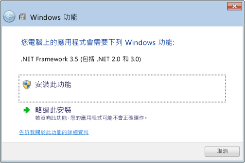

# .NET Framework 初始化錯誤：管理使用者經驗
Common Language Runtime (CLR) 啟用系統會決定將用來執行 Managed 應用程式碼的 CLR 版本。 在某些情況下，啟用系統可能找不到要載入的 CLR 版本。 應用程式需要無效或未安裝在指定電腦上的 CLR 版本時，通常會發生這種情況。 如果找不到要求的版本，CLR 啟用系統會從已呼叫的函式或介面傳回 HRESULT 錯誤碼，而且可能會向執行應用程式的使用者顯示錯誤訊息。 本文提供 HRESULT 代碼清單，並說明如何防止顯示錯誤訊息。  
  
 CLR 提供記錄基礎結構來協助您偵錯 CLR 啟用問題 (如[如何：偵錯 CLR 啟用問題](../../../docs/framework/deployment/how-to-debug-clr-activation-issues.md)中所述)。 此基礎結構不應該與[組件繫結記錄](../../../docs/framework/tools/fuslogvw-exe-assembly-binding-log-viewer.md)混淆，兩者完全不同。  
  
## CLR 啟用 HRESULT 代碼  
 CLR 啟用 API 會傳回 HRESULT 代碼，以向主機報告啟用作業的結果。 CLR 主機應該一律先查閱這些傳回值，再繼續其他作業。  
  
-   CLR_E_SHIM_RUNTIMELOAD  
  
-   CLR_E_SHIM_RUNTIMEEXPORT  
  
-   CLR_E_SHIM_INSTALLROOT  
  
-   CLR_E_SHIM_INSTALLCOMP  
  
-   CLR_E_SHIM_LEGACYRUNTIMEALREADYBOUND  
  
-   CLR_E_SHIM_SHUTDOWNINPROGRESS  
  
## 初始化錯誤的 UI  
 如果 CLR 啟用系統無法載入應用程式所需執行階段的正確版本，則會向使用者顯示錯誤訊息，通知他們的電腦未正確設定成執行應用程式，並提供機會來修正這個狀況。 在此情況下，通常會顯示下列錯誤訊息。 使用者可以選擇 [是] 前往 Microsoft 網站，以在其中下載應用程式的正確 .NET Framework 版本。  
  
 ![[.NET Framework 初始化錯誤] 對話方塊](../../../docs/framework/deployment/media/initerrordialog.png "InitErrorDialog")  
初始化錯誤的一般錯誤訊息  
  
## 解決初始化錯誤  
 身為開發人員，您會有各種不同的選項可控制 .NET Framework 初始化錯誤訊息。 例如，您可以使用 API 旗標來防止顯示訊息，如下節所討論。 不過，您仍然必須解決問題，防止應用程式載入所要求的執行階段。 否則，您的應用程式可能根本未執行，或某些功能可能無法使用。  
  
 若要解決基礎問題，並提供最佳使用者體驗 (錯誤訊息較少)，建議使用下列各項：  
  
-   .NET Framework 3.5 (和更早版本) 應用程式：設定應用程式以支援 .NET Framework 4 或 4.5 (請參閱[指示](../../../docs/framework/migration-guide/how-to-configure-an-app-to-support-net-framework-4-or-4-5.md))。  
  
-   .NET Framework 4 應用程式：在應用程式安裝期間安裝 .NET Framework 4 可轉散發套件。 請參閱[開發人員部署手冊](../../../docs/framework/deployment/deployment-guide-for-developers.md)。  
  
## 控制錯誤訊息  
 顯示可溝通找不到所要求 .NET Framework 版本的錯誤訊息，可以檢視為使用者的有用服務或較不惱人。 在任一情況下，您都可以將旗標傳遞給啟用 API 來控制此 UI。  
  
 [ICLRMetaHostPolicy::GetRequestedRuntime](../../../docs/framework/unmanaged-api/hosting/iclrmetahostpolicy-getrequestedruntime-method.md) 方法會接受 [METAHOST_POLICY_FLAGS](../../../docs/framework/unmanaged-api/hosting/metahost-policy-flags-enumeration.md) 列舉成員作為輸入。 如果找不到所要求的 CLR 版本，您可以包括 METAHOST_POLICY_SHOW_ERROR_DIALOG 旗標來要求錯誤訊息。 根據預設，不會顯示錯誤訊息 ([ICLRMetaHost::GetRuntime](../../../docs/framework/unmanaged-api/hosting/iclrmetahost-getruntime-method.md) 方法不接受這個旗標，並且不提供任何其他方式來顯示錯誤訊息)。  
  
 Windows 提供了 [SetErrorMode](http://go.microsoft.com/fwlink/p/?LinkID=255242) 函式，可讓您用來宣告是否要顯示處理序內執行的程式碼所造成的錯誤訊息。 您可以指定 SEM_FAILCRITICALERRORS 旗標，以防止顯示錯誤訊息。  
  
 不過，在某些情況下，務必覆寫應用程式處理序所設定的 SEM_FAILCRITICALERRORS 設定。 例如，如果您的原生 COM 元件裝載 CLR，並裝載在設定 SEM_FAILCRITICALERRORS 的處理序中，則根據在該特定應用程式處理序中顯示錯誤訊息的影響，您可能會想要覆寫旗標。 在此情況下，您可以使用下列其中一個旗標來覆寫 SEM_FAILCRITICALERRORS：  
  
-   搭配使用 METAHOST_POLICY_IGNORE_ERROR_MODE 與 [ICLRMetaHostPolicy::GetRequestedRuntime](../../../docs/framework/unmanaged-api/hosting/iclrmetahostpolicy-getrequestedruntime-method.md) 方法。  
  
-   搭配使用 RUNTIME_INFO_IGNORE_ERROR_MODE 與 [GetRequestedRuntimeInfo](../../../docs/framework/unmanaged-api/hosting/getrequestedruntimeinfo-function.md) 函式。  
  
## CLR 所提供主機的 UI 原則  
 CLR 會針對各種情況包括一組主機，而且這些主機只要在載入必要執行階段版本時發生問題時就會顯示錯誤訊息。 下表提供主機和其錯誤訊息原則清單。  
  
|CLR 主機|描述|錯誤訊息原則|可以停用錯誤訊息？|  
|--------------|-----------------|--------------------------|------------------------------------|  
|Managed EXE 主機|啟動 Managed EXE。|會在遺漏 .NET Framework 版本時顯示|否|  
|Managed COM 主機|將 Managed COM 元件載入處理序。|會在遺漏 .NET Framework 版本時顯示|是，設定 SEM_FAILCRITICALERRORS 旗標|  
|ClickOnce 主機|啟動 ClickOnce 應用程式。|從 [!INCLUDE[net_v45](../../../includes/net-v45-md.md)] 開始，會在遺漏 .NET Framework 版本時顯示|否|  
|XBAP 主機|啟動 WPF XBAP 應用程式。|從 [!INCLUDE[net_v45](../../../includes/net-v45-md.md)] 開始，會在遺漏 .NET Framework 版本時顯示|否|  
  
## [!INCLUDE[win8](../../../includes/win8-md.md)] 行為和 UI  
 CLR 啟用系統在 [!INCLUDE[win8](../../../includes/win8-md.md)] 上提供的行為和 UI 與其他 Windows 作業系統版本相同，但載入 CLR 2.0 時發生問題時除外。 [!INCLUDE[win8](../../../includes/win8-md.md)] 包括使用 CLR 4.5 的 [!INCLUDE[net_v45](../../../includes/net-v45-md.md)]。 不過，[!INCLUDE[win8](../../../includes/win8-md.md)] 不會包括全都使用 CLR 2.0 的 .NET Framework 2.0、3.0 或 3.5。 因此，相依於 CLR 2.0 的應用程式預設不會在 [!INCLUDE[win8](../../../includes/win8-md.md)] 上執行。 相反地，它們會顯示下列對話方塊，讓使用者可以安裝 .NET Framework 3.5。 使用者也可以在控制台中啟用 .NET Framework 3.5。 [在 Windows 10、Windows 8.1 及 Windows 8 上安裝 .NET Framework 3.5](../../../docs/framework/install/dotnet-35-windows-10.md) 文章討論這兩個選項。  
  
   
視需要提示安裝 .NET Framework 3.5  
  
> [!NOTE]
>  [!INCLUDE[net_v45](../../../includes/net-v45-md.md)] 會取代使用者電腦上的 .NET Framework 4 (CLR 4)。 因此，.NET Framework 4 應用程式會在 [!INCLUDE[win8](../../../includes/win8-md.md)] 上平順地執行，而不會顯示此對話方塊。  
  
 安裝 .NET Framework 3.5 時，使用者可以在其 [!INCLUDE[win8](../../../includes/win8-md.md)] 電腦上執行相依於 .NET Framework 2.0、3.0 或 3.5 的應用程式。 他們也可以執行 .NET Framework 1.0 和 1.1 應用程式，但前提是這些應用程式未明確地設定成只在 .NET Framework 1.0 或 1.1 上執行。 請參閱[從 .NET Framework 1.1 移轉](../../../docs/framework/migration-guide/migrating-from-the-net-framework-1-1.md)。  
  
 從 [!INCLUDE[net_v45](../../../includes/net-v45-md.md)] 開始，已改善 CLR 啟用記錄，可包括記錄何時和為何顯示初始化錯誤訊息的記錄項目。 如需詳細資訊，請參閱[如何：偵錯 CLR 啟用問題](../../../docs/framework/deployment/how-to-debug-clr-activation-issues.md)。  
  
## 請參閱  
 [開發人員部署手冊](../../../docs/framework/deployment/deployment-guide-for-developers.md)  
 [操作說明：設定應用程式以支援 .NET Framework 4 或 4.5](../../../docs/framework/migration-guide/how-to-configure-an-app-to-support-net-framework-4-or-4-5.md)  
 [如何：偵錯 CLR 啟用問題](../../../docs/framework/deployment/how-to-debug-clr-activation-issues.md)  
 [在 Windows 10、Windows 8.1 及 Windows 8 上安裝 .NET Framework 3.5](../../../docs/framework/install/dotnet-35-windows-10.md)
