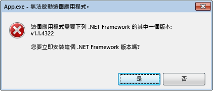

# .NET Framework 初始化錯誤：管理使用者經驗
Common Language Runtime \(CLR\) 啟動系統是用來決定執行 Managed 應用程式程式碼的 CLR 版本。  在某些情況下，啟動系統可能會找不到 CLR 的版本。  這種情況通常發生在應用程式需要的 CLR 版本無效或未安裝在特定電腦上。  如果找不到要求的版本， CLR 啟動系統從呼叫的函式或介面傳回 HRESULT 錯誤碼，而且可能會顯示錯誤訊息給執行應用程式的使用者。  本文提供了HRESULT程式碼清單並說明如何防止錯誤訊息出現。  
  
 CLR 可記錄基礎結構，協助您偵錯 CLR 啟動的問題，如 [如何：偵錯 CLR 啟用問題](../../../docs/framework/deployment/how-to-debug-clr-activation-issues.md)所述。  此基礎結構應該不會和 [組件繫結記錄檔](../../../docs/framework/tools/fuslogvw-exe-assembly-binding-log-viewer.md)混淆，因二者完全不同。  
  
## CLR 啟動 HRESULT 程式碼  
 CLR 啟動應用程式開發介面會傳回 HRESULT 編碼，以向主機報告啟動作業的結果。  CLR 主機應用程式永遠應該在其他作業執行之前先參閱這些傳回值。  
  
-   CLR\_E\_SHIM\_RUNTIMELOAD  
  
-   CLR\_E\_SHIM\_RUNTIMEEXPORT  
  
-   CLR\_E\_SHIM\_INSTALLROOT  
  
-   CLR\_E\_SHIM\_INSTALLCOMP  
  
-   CLR\_E\_SHIM\_LEGACYRUNTIMEALREADYBOUND  
  
-   CLR\_E\_SHIM\_SHUTDOWNINPROGRESS  
  
## 初始化錯誤的 UI  
 如果 CLR 啟動系統無法載入應用程式需要執行階段的正確版本，則會顯示錯誤訊息給使用者以通知他們的電腦未正確設定執行應用程式，並提供其機會來補救此狀況。  在這種情況下，通常會出現下列錯誤訊息。  使用者可以選擇 **Yes**前往Microsoft網站，即可為應用程式下載正確的 .NET Framework 版本。  
  
   
初始化錯誤下的典型錯誤訊息  
  
## 解決初始化錯誤。  
 身為開發人員，您可以控制 .NET Framework 初始化錯誤訊息的各種選項。  例如，您可以使用應用程式開發介面旗標以不顯示訊息，如下一節中所述。  不過，您還是必須解決防止應用程式載入要求的執行階段的問題。  否則，應用程式可能無法執行，或部分功能可能無法使用。  
  
 若要修正基礎問題並提供最佳的使用者經驗 \(更少的錯誤訊息\)，我們的建議如下:  
  
-   在 .NET Framework 3.5 \(及舊版\) 應用程式：設定應用程式支援 .NET Framework 4 或 4.5 \(請參閱\)[命令](../../../docs/framework/migration-guide/how-to-configure-an-app-to-support-net-framework-4-or-4-5.md)。  
  
-   在 .NET Framework 4 應用程式：安裝 .NET Framework 4 可轉散發套件\(在應用程式安裝中的一部分\)。  請參閱 [開發人員部署手冊](../../../docs/framework/deployment/deployment-guide-for-developers.md)。  
  
## 控制錯誤訊息  
 顯示錯誤資訊以通知「所要求的 .NET Framework 版本找不到」對使用者可被視為一個有用的服務或次要解析錯誤。  不論是哪種情況，您可以傳遞旗標來控制這個 UI 以對應啟動應用程式開發介面。  
  
 [ICLRMetaHostPolicy::GetRequestedRuntime](../Topic/ICLRMetaHostPolicy::GetRequestedRuntime%20Method.md) 方法會接受一個 [METAHOST\_POLICY\_FLAGS](../../../ocs/framework/unmanaged-api/hosting/metahost-policy-flags-enumeration.md) 列舉成員做為輸入。  如果CLR 的要求版本找不到，則可以加入 METAHOST\_POLICY\_SHOW\_ERROR\_DIALOG 旗標來要求錯誤訊息 。  根據預設，錯誤訊息不會顯示。\( [ICLRMetaHost::GetRuntime](../Topic/ICLRMetaHost::GetRuntime%20Method.md) 方法不接受這個旗標，且不提供任何其他方式顯示錯誤訊息\)。  
  
 Windows 提供 [SetErrorMode](http://go.microsoft.com/fwlink/p/?LinkID=255242) 函式，可讓您設定是否要顯示處理序執行的程式碼所造成的錯誤訊息。  您可以指定 SEM\_FAILCRITICALERRORS 旗標以防止錯誤訊息出現。  
  
 不過，在某些情況下，覆寫應用程式處理序設定的 SEM\_FAILCRITICALERRORS 設定是很重要的。  例如，如果您有裝載 CLR，並在處理序所裝載設定 SEM\_FAILCRITICALERRORS 的原生 COM 元件，您可能想要以顯示該特定應用程式處理序中之錯誤訊息的影響覆寫旗標。  在這種情況下，您可以使用下列的旗標覆寫 SEM\_FAILCRITICALERRORS:  
  
-   使用 [ICLRMetaHostPolicy::GetRequestedRuntime](../Topic/ICLRMetaHostPolicy::GetRequestedRuntime%20Method.md) 方法的 METAHOST\_POLICY\_IGNORE\_ERROR\_MODE。  
  
-   使用 [GetRequestedRuntimeInfo](../../../ocs/framework/unmanaged-api/hosting/getrequestedruntimeinfo-function.md) 函式的 RUNTIME\_INFO\_IGNORE\_ERROR\_MODE。  
  
## CLR\-Provided Hosts 的UI 原則  
 CLR 包含一組主機應用程式中不同的案例，而且這些主機全部都會顯示錯誤訊息，當它們在載入執行階段時必要版本時遇到問題。  下表提供主應用程式及其錯誤訊息原則清單。  
  
|CLR 主應用程式|描述|錯誤訊息原則|錯誤訊息可以停用嗎?|  
|---------------|--------|------------|----------------|  
|Managed EXE host|啟動 Managed EXE。|在一個遺漏的 .NET Framework 版本的情況下顯示|否|  
|Managed COM host|載入 Managed COM 元件至處理序。|在一個遺漏的 .NET Framework 版本的情況下顯示|是，藉由設定 SEM\_FAILCRITICALERRORS 旗標|  
|ClickOnce 主應用程式|啟動 ClickOnce 應用程式。|在一個遺漏的 .NET Framework 版本的情況下顯示，從 [!INCLUDE[net_v45](../../../includes/net-v45-md.md)]開始。|否|  
|XBAP 主應用程式|啟動 XBAP WPF 應用程式。|在一個遺漏的 .NET Framework 版本的情況下顯示，從 [!INCLUDE[net_v45](../../../includes/net-v45-md.md)]開始。|否|  
  
## [!INCLUDE[win8](../../../includes/win8-md.md)] 行為和 UI  
 CLR 啟動系統在做為 Windows 作業系統上的其他版本所做的 [!INCLUDE[win8](../../../includes/win8-md.md)] 提供相同的行為和 UI，除了遇到載入 CLR 2.0 的問題。  [!INCLUDE[win8](../../../includes/win8-md.md)] 包含使用 CLR 4.5的 [!INCLUDE[net_v45](../../../includes/net-v45-md.md)]，。不過， [!INCLUDE[win8](../../../includes/win8-md.md)] 不包含 .NET Framework 2.0、3.0 或 3.5，此兩者都使用 CLR 2.0。  因此，必須依賴 CLR 2.0 的應用程式在 [!INCLUDE[win8](../../../includes/win8-md.md)] 預設為不會執行。  相反地，它們顯示下列對話方塊讓使用者可安裝 .NET Framework 3.5。  使用者也可以在控制台中啟用 .NET Framework 3.5。  這兩種選擇在本文 [Installing the .NET Framework 3.5 on Windows 8 and later versions](../../../docs/framework/install/net-framework-3-5-on-windows-8-plus.md)中會討論到。  
  
   
視需要提示安裝 .NET Framework 3.5  
  
> [!NOTE]
>  [!INCLUDE[net_v45](../../../includes/net-v45-md.md)] 取代了在使用者電腦上的 .NET Framework 4 \(CLR 4\)。  因此， .NET Framework 4 應用程式緊密地執行，在 [!INCLUDE[win8](../../../includes/win8-md.md)]中不會顯示這個對話方塊。  
  
 在 .NET Framework 3.5 安裝時，使用者可以執行需要 .NET Framework 2.0，3.0 或 3.5 為目標的應用程式，在他們的 [!INCLUDE[win8](../../../includes/win8-md.md)] 電腦上。  他們也可以執行 .NET Framework 1.0 和 1.1 版應用程式，在這些應用程式不明確地設定只執行在 .NET Framework 1.0 或 1.1 的情況下。  請參閱 [從 .NET Framework 1.1 移轉](../../../docs/framework/migration-guide/migrating-from-the-net-framework-1-1.md)。  
  
 從[!INCLUDE[net_v45](../../../includes/net-v45-md.md)]開始，CLR 啟動記錄已經被改善，以包含記錄「何時、為何初始化錯誤訊息被顯示」的項目。  如需詳細資訊，請參閱[如何：偵錯 CLR 啟用問題](../../../docs/framework/deployment/how-to-debug-clr-activation-issues.md)。  
  
## 請參閱  
 [開發人員部署手冊](../../../docs/framework/deployment/deployment-guide-for-developers.md)   
 [HOW TO：設定應用程式以支援 .NET Framework 4 或 4.5](../../../docs/framework/migration-guide/how-to-configure-an-app-to-support-net-framework-4-or-4-5.md)   
 [如何：偵錯 CLR 啟用問題](../../../docs/framework/deployment/how-to-debug-clr-activation-issues.md)   
 [在 Windows 10、Windows 8.1 及 Windows 8 上安裝 .NET Framework 3.5](../../../docs/framework/install/dotnet-35-windows-10.md)

