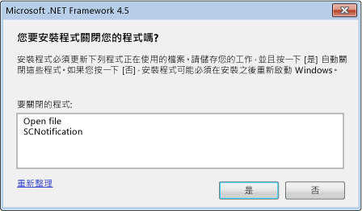

# 在 .NET Framework 4.5 安裝期間減少系統重新啟動的次數Reducing System Restarts During .NET Framework 4.5 Installations
[!INCLUDE[net_v45](../../../includes/net-v45-md.md)] 安裝程式會使用[重新啟動管理員](https://go.microsoft.com/fwlink/?LinkId=231425)，盡可能在安裝時防止系統重新啟動。The [!INCLUDE[net_v45](../../../includes/net-v45-md.md)] installer uses the [Restart Manager](https://go.microsoft.com/fwlink/?LinkId=231425) to prevent system restarts whenever possible during installation. 如果您的應用程式安裝程式安裝 .NET Framework，則可以與 [重新啟動管理員] 互動來利用這項功能。If your app setup program installs the .NET Framework, it can interface with the Restart Manager to take advantage of this feature. 如需詳細資訊，請參閱[＜How to：取得 .NET Framework 4.5 安裝程式的進度](../../../docs/framework/deployment/how-to-get-progress-from-the-dotnet-installer.md)。For more information, see [How to: Get Progress from the .NET Framework 4.5 Installer](../../../docs/framework/deployment/how-to-get-progress-from-the-dotnet-installer.md).  
  
## 重新啟動的原因Reasons for a Restart  
 如果在安裝期間正在使用 .NET Framework 4 應用程式，則 [!INCLUDE[net_v45](../../../includes/net-v45-md.md)] 安裝需要重新啟動系統。The [!INCLUDE[net_v45](../../../includes/net-v45-md.md)] installation requires a system restart if a .NET Framework 4 app is in use during the installation. 這是因為 [!INCLUDE[net_v45](../../../includes/net-v45-md.md)] 會取代 .NET Framework 4 檔案，並且需要這些檔案可在安裝期間使用。This is because the [!INCLUDE[net_v45](../../../includes/net-v45-md.md)] replaces .NET Framework 4 files and requires those files to be available during installation. 在許多情況下，事先偵測和關閉正在使用的 .NET Framework 4 應用程式，即可避免重新啟動。In many cases, the restart can be prevented by preemptively detecting and closing.NET Framework 4 apps that are in use. 不過，不應該關閉部分系統應用程式。However, some system apps should not be closed. 在這些情況下，無法避免重新啟動。In these cases, a restart cannot be avoided.  
  
## 一般使用者體驗End-User Experience  
 如果安裝程式偵測到正在使用 .NET Framework 4 應用程式，執行完整 [!INCLUDE[net_v45](../../../includes/net-v45-md.md)] 安裝的一般使用者就有機會可以避免重新啟動系統。An end-user who is doing a full installation of the [!INCLUDE[net_v45](../../../includes/net-v45-md.md)] is given the opportunity to avoid a system restart if the installer detects .NET Framework 4 apps in use. 訊息會列出所有執行中 .NET Framework 4 應用程式，並提供選項來關閉這些應用程式，再進行安裝。A message lists all running .NET Framework 4 apps and provides the option to close these apps before the installation. 如果使用者確認，則安裝程式會關閉這些應用程式，並避免重新啟動系統。If the user confirms, these apps are shut down by the installer, and a system restart is avoided. 如果使用者在一段時間內未回應訊息，則會繼續安裝，而不需要關閉任何應用程式。If the user does not respond to the message within a certain amount of time, the installation continues without closing any apps.  
  
 如果 [重新啟動管理員] 偵測到即使關閉執行中應用程式也需要重新啟動系統的情況，則不會顯示訊息。If the Restart Manager detects a situation that will require a system restart even if running apps are closed, the message is not displayed.  
  
   
提示關閉正在使用的 .NET Framework 應用程式Prompt for closing .NET Framework apps that are in use  
  
## 使用鏈結的安裝程式Using a Chained Installer  
 如果您想要轉散發 .NET Framework 與應用程式，但想要使用自己的安裝程式和 UI，則可以在安裝程序中包括 (鏈結) .NET Framework 安裝程序。If you want to redistribute the .NET Framework with your app, but you want to use your own setup program and UI, you can include (chain) the .NET Framework setup process to your setup process. 如需鏈結之安裝的詳細資訊，請參閱[開發人員部署手冊](../../../docs/framework/deployment/deployment-guide-for-developers.md)。For more information about chained installations, see [Deployment Guide for Developers](../../../docs/framework/deployment/deployment-guide-for-developers.md). 為了減少在鏈結的安裝中重新啟動系統，.NET Framework 安裝程式會將要關閉的應用程式清單提供給安裝程式。To reduce system restarts in chained installations, the .NET Framework installer supplies your setup program with the list of apps to close. 安裝程式必須透過使用者介面 (例如訊息方塊) 將這項資訊提供給使用者，並取得使用者的回應，然後將回應傳遞回 .NET Framework 安裝程式。Your setup program must provide this information to the user through a user interface such as a message box, get the user’s response, and then pass the response back to the .NET Framework installer. 如需所鏈結安裝程式的範例，請參閱[如何：取得 .NET Framework 4.5 安裝程式的進度](../../../docs/framework/deployment/how-to-get-progress-from-the-dotnet-installer.md)一文。For an example of a chained installer, see the article [How to: Get Progress from the .NET Framework 4.5 Installer](../../../docs/framework/deployment/how-to-get-progress-from-the-dotnet-installer.md).  
  
 如果您要使用鏈結的安裝程式，但不想要提供關閉應用程式的專屬訊息方塊，則可以在鏈結 .NET Framework 安裝程序時，於命令列上使用 `/showrmui` 和 `/passive` 選項。If you're using a chained installer, but you do not want to provide your own message box for closing apps, you can use the `/showrmui` and `/passive` options on the command line when you chain the .NET Framework setup process. 當您一起使用這些選項時，安裝程式會顯示關閉可關閉之應用程式的訊息方塊，以避免重新啟動系統。When you use these options together, the installer shows the message box for closing apps if they can be closed to avoid a system restart. 被動模式下之這個訊息方塊的行為與完整使用者介面的作用相同。This message box behaves the same in passive mode as it does under the full user interface. 如需 .NET Framework 可轉散發套件的完整一組命令列選項，請參閱[開發人員部署手冊](../../../docs/framework/deployment/deployment-guide-for-developers.md)。See [Deployment Guide for Developers](../../../docs/framework/deployment/deployment-guide-for-developers.md) for the complete set of command-line options for the .NET Framework redistributable.  
  
## 另請參閱See also
- [部署Deployment](../../../docs/framework/deployment/index.md)
- [開發人員部署手冊Deployment Guide for Developers](../../../docs/framework/deployment/deployment-guide-for-developers.md)
- [如何：取得 .NET Framework 4.5 安裝程式的進度How to: Get Progress from the .NET Framework 4.5 Installer](../../../docs/framework/deployment/how-to-get-progress-from-the-dotnet-installer.md)
