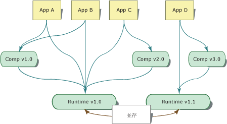
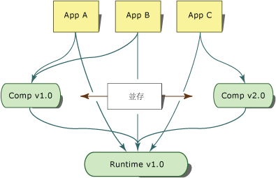

# <a name="side-by-side-execution-in-the-net-framework"></a>.NET Framework 並存執行
並存執行是在同一台電腦上執行多個版本之應用程式或元件的能力。 在同一台電腦上，您可以同時擁有通用語言執行平台的多個版本，以及使用某一版執行階段的應用程式和元件的多個版本。  
  
 下圖顯示在同一台電腦上有幾個應用程式使用執行階段的兩個不同版本。 應用程式 A、B 和 C 使用 Runtime 1.0 版，而應用程式 D 則使用 Runtime 1.1 版。  
  
   
兩個版本執行階段的並存執行  
  
 .NET Framework 包含通用語言執行平台以及內含 API 類型的組件集合。 Runtime 和 .NET Framework 組件的版本為個別指定。 例如，4.0 版的執行階段實際上是 4.0.319 版，而 1.0 版的 .NET Framework 組件則是 1.0.3300.0 版。  
  
 下圖顯示在同一台電腦上有幾個應用程式使用元件的兩個不同版本。 應用程式 A 和 B 使用 1.0 版的元件，而應用程式 C 則使用相同元件的 2.0 版。  
  
   
兩個版本元件的並存執行  
  
 並存執行提供更多控制權，供您控制應用程式所繫結之元件版本，以及應用程式所使用的執行階段版本。  
  
## <a name="benefits-of-side-by-side-execution"></a>並存執行的優點  
 在 Windows XP 和 .NET Framework 推出之前，由於應用程式無法辨別相同程式碼的不相容版本，因此會發生 DLL 衝突的狀況。 DLL 中包含的類型資訊只繫結至檔案名稱， 故應用程式無從得知 DLL 中包含的類型是否與應用程式建置時所用的類型相同。 因此，新版元件可能會覆寫舊版元件並破壞應用程式。  
  
 並存執行和 .NET Framework 提供下列功能以消除 DLL 的衝突：  
  
-   強式名稱的組件。  
  
     並存執行使用強式名稱的組件，將類型資訊繫結至組件的特定版本。 這可防止應用程式或元件繫結至組件的無效版本。 強式名稱的組件也允許多個版本的檔案存在同一台電腦上，並供應用程式使用。 如需詳細資訊，請參閱[強式名稱的組件](../../../docs/framework/app-domains/strong-named-assemblies.md)。  
  
-   版本感知程式碼儲存區。  
  
     .NET Framework 在全域組件快取中提供版本感知程式碼儲存區。 全域組件快取是一種全電腦程式碼快取，存在於已經安裝 .NET Framework 的所有電腦上。 它是依據版本、文化特性和發行者資訊來儲存組件，並且可以支援多個版本的元件和應用程式。 如需詳細資訊，請參閱[全域組件快取](../../../docs/framework/app-domains/gac.md)。  
  
-   隔離性。  
  
     使用 .NET Framework，您可以建立隔離執行的應用程式和元件。 這種隔離執行的功能是並存執行的基本構成要素。 隔離的主要因素在於能夠掌握您要使用的資源，並且能放心地在應用程式或元件的多個版本之間共用資源。 隔離也包括使用版本特定的方式儲存檔案。 如需隔離的詳細資訊，請參閱[建立並存執行元件的方針](../../../docs/framework/deployment/guidelines-for-creating-components-for-side-by-side-execution.md)。  
  
## <a name="version-compatibility"></a>版本相容性  
 .NET Framework 的 1.0 和 1.1 版設計成可彼此相容。 用 .NET Framework 1.0 版建置的應用程式應該可以在 1.1 版上執行，而用 .NET Framework 1.1 版建置的應用程式也應該可以在 1.0 版上執行。 但請注意，.NET Framework 1.1 版中加入的 API 功能無法在 1.0 版的 .NET Framework 中使用。 以 2.0 版建立的應用程式僅能在 2.0 版上執行。 2.0 版的應用程式在 1.1 或之前的版本上無法執行。  
  
 .NET Framework 的版本被視為一個由執行階段及其關聯的 .NET Framework 組件組成的單一單位 (這個概念稱為「組件的版本對應轉換」)。 您可以將組件繫結重新導向，以包含 .NET Framework 組件的其他版本，但是覆寫預設組件繫結可能會有風險，因此部署之前必須經過棈密的測試。  
  
## <a name="locating-runtime-version-information"></a>找出執行階段版本資訊  
 編譯應用程式或元件時所使用的執行階段版本資訊，以及應用程式執行所需的執行階段版本資訊，會分開儲存在兩個位置。 編譯應用程式或元件時所使用的執行階段版本資訊會儲存在 Managed 可執行檔中； 而應用程式或元件所需的執行階段版本資訊則儲存在應用程式組態檔中。  
  
### <a name="runtime-version-information-in-the-managed-executable"></a>Managed 可執行檔中的執行階段版本資訊  
 每個 Managed 應用程式和元件的可攜式執行檔 (PE) 標頭會包含建置時所使用的執行階段版本資訊。 Common Language Runtime 使用這項資訊來決定應用程式執行時最有可能需要的執行階段版本。  
  
### <a name="runtime-version-information-in-the-application-configuration-file"></a>應用程式組態檔中的執行階段版本資訊  
 除了 PE 檔標頭中的資訊之外，還可使用提供執行階段版本資訊的應用程式組態檔來部署應用程式。 應用程式組態檔是以 XML 為基礎的檔案，它是由應用程式開發人員所設計，並與應用程式一起發行。 如果這個檔案中有 [\<startup> 區段](../../../docs/framework/configure-apps/file-schema/startup/startup-element.md)的 [\<requiredRuntime> 項目](../../../docs/framework/configure-apps/file-schema/startup/requiredruntime-element.md)，則會指定該應用程式支援哪個版本的執行階段和元件。 您也可以在測試中使用這個檔案測試應用程式與各種執行階段版本的相容性。  
  
 Unmanaged 程式碼 (包括 COM 和 COM+ 應用程式) 可以有應用程式組態檔，以供執行階段用來與 Managed 程式碼互動。 應用程式組態檔會影響您透過 COM 啟動的任何 Managed 程式碼。 這個檔案可以指定程式碼支援的執行階段版本，以及組件重新導向。 根據預設，呼叫 Managed 程式碼的 COM Interop 應用程式會使用電腦上安裝的最新版執行階段。  
  
 如需應用程式組態檔的詳細資訊，請參閱[設定應用程式](../../../docs/framework/configure-apps/index.md)。  
  
## <a name="determining-which-version-of-the-runtime-to-load"></a>決定要載入的執行階段版本  
 Common Language Runtime 使用下列資訊來決定要為應用程式載入的執行階段版本：  
  
-   可用的執行階段版本。  
  
-   應用程式支援的執行階段版本。  
  
### <a name="supported-runtime-versions"></a>支援的執行階段版本  
 執行階段使用應用程式組態檔和可攜式執行檔 (PE) 標頭，來決定應用程式支援的執行階段版本。 如果應用程式組態檔不存在，執行階段會載入應用程式的 PE 檔標頭中指定的執行階段版本 (如果該版本可用的話)。  
  
 如果應用程式組態檔存在，執行階段會根據下列程序的結果來決定要載入的適當執行階段版本：  
  
1.  執行階段檢查應用程式組態檔中的 [\<supportedRuntime> 項目](../../../docs/framework/configure-apps/file-schema/startup/supportedruntime-element.md)項目。 如果 **\<supportedRuntime>** 項目中指定了一或多個支援的執行階段版本，執行階段會載入第一個 **\<supportedRuntime>** 項目所指定的執行階段版本。 如果無法使用這個版本，執行階段會檢查下一個 **\<supportedRuntime>** 項目並嘗試載入指定的執行階段版本。 如果這個執行階段版本不能使用，則會檢查後面的 **\<supportedRuntime>** 項目。 如果沒有可用的受支援執行階段版本，執行階段便無法載入執行階段版本並顯示訊息給使用者 (請參閱步驟 3)。  
  
2.  執行階段讀取應用程式可執行檔的 PE 檔標頭。 如果有 PE 檔標頭指定的執行階段版本可用，執行階段便會載入該版本。 如果無法使用指定的執行階段版本，執行階段會搜尋 Microsoft 判斷可與 PE 標頭中的執行階段版本相容的執行階段版本。 如果找不到該版本，則會繼續進行本程序中的步驟 3。  
  
3.  執行階段顯示訊息，指出應用程式支援的執行階段版本無法使用。 此時不會載入執行階段。  
  
    > [!NOTE]
    >  您可以使用登錄機碼 HKLM\Software\Microsoft\\.NETFramework 下的 NoGuiFromShim 值，或使用環境變數 COMPLUS_NoGuiFromShim，來隱藏這項訊息。 例如，您可以隱藏通常不需與使用者互動之應用程式 (例如自動安裝或 Windows 服務) 的訊息。 隱藏這項訊息之後，執行階段會將訊息寫入事件記錄檔。  將登錄值 NoGuiFromShim 設定為 1，以隱藏電腦上所有應用程式的這項訊息。 或者，將 COMPLUS_NoGuiFromShim 環境變數設定為 1，以隱藏特定使用者內容中所執行之應用程式的這項訊息。  
  
> [!NOTE]
>  載入執行階段版本之後，組件繫結重新導向可以指定載入個別 .NET Framework 組件的不同版本。 這些繫結重新導向只會影響被重新導向的特定組件。  
  
## <a name="partially-qualified-assembly-names-and-side-by-side-execution"></a>部分限定的組件名稱和並存執行  
 由於不完整的組件參考可能會造成並存問題，因此只能用來繫結至應用程式目錄中的組件。 請避免在您的程式碼中使用不完整的組件參考。  
  
 若要減少程式碼中不完整的組件參考，您可以在應用程式組態檔中使用 [\<qualifyAssembly>](../../../docs/framework/configure-apps/file-schema/runtime/qualifyassembly-element.md) 項目，讓程式碼中不完整的組件參考變完整。 請使用 **\<qualifyAssembly>** 項目，只指定不完整參考中未設定的欄位。 以 **fullName** 屬性列出的組件識別必須包含使組件名稱完整的所有必要資訊：組件名稱、公開金鑰、文化特性和版本。  
  
 下列範例示範使組件 `myAssembly` 完整的應用程式組態檔項目。  
  
```xml  
<assemblyBinding xmlns="urn:schemas-microsoft-com:asm.v1">   
<qualifyAssembly partialName="myAssembly"   
fullName="myAssembly,  
      version=1.0.0.0,   
publicKeyToken=...,   
      culture=neutral"/>   
</assemblyBinding>   
```  
  
 當組件載入陳述式參考 `myAssembly` 時，這些組態檔設定便會使執行階段自動將不完整的 `myAssembly` 參考轉譯成完整的參考。 例如，Assembly.Load("myAssembly") 會變成 Assembly.Load("myAssembly, version=1.0.0.0, publicKeyToken=..., culture=neutral")。  
  
> [!NOTE]
>  您可以使用 **LoadWithPartialName** 方法，略過禁止從全域組件快取載入不完整參考組件的 Common Language Runtime 限制。 這個方法只能用於遠端處理案例，因為它很容易造成並存執行的問題。  
  
## <a name="related-topics"></a>相關主題  
  
|標題|說明|  
|-----------|-----------------|  
|[如何：啟用和停用自動繫結重新導向](../../../docs/framework/configure-apps/how-to-enable-and-disable-automatic-binding-redirection.md)|說明如何將應用程式繫結至組件的特定版本。|  
|[設定組件繫結重新導向](../../../docs/framework/deployment/configuring-assembly-binding-redirection.md)|說明如何將組件繫結參考重新導向至 .NET Framework 組件的特定版本。|  
|[同處理序並存執行](../../../docs/framework/deployment/in-process-side-by-side-execution.md)|討論如何使用同處理序並存執行階段主機啟用，在單一處理序中執行多個版本的 CLR。|  
|[Common Language Runtime 中的組件](../../../docs/framework/app-domains/assemblies-in-the-common-language-runtime.md)|提供組件的概觀。|  
|[應用程式定義域](../../../docs/framework/app-domains/application-domains.md)|提供應用程式定義域的概觀。|  
  
## <a name="reference"></a>參考資料  
 [\<supportedRuntime> 項目](../../../docs/framework/configure-apps/file-schema/startup/supportedruntime-element.md)
