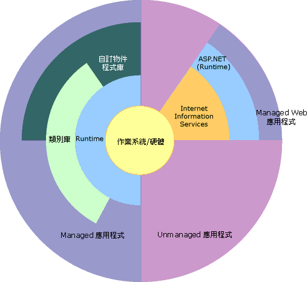

# .NET Framework 的概觀Overview of the .NET Framework

.NET Framework 是支援建置和執行新一代應用程式及 XML Web Service 的技術。The .NET Framework is a technology that supports building and running the next generation of apps and XML Web services. .NET Framework 是專為實現以下目標所設計的：The .NET Framework is designed to fulfill the following objectives:

- 提供一致的物件導向程式設計環境，不論目的碼 (Object Code) 是在本機中儲存及執行、在本機執行但分散至網際網路或在遠端執行。To provide a consistent object-oriented programming environment whether object code is stored and executed locally, executed locally but Internet-distributed, or executed remotely.

- 提供可減少軟體部署和版本控制衝突的程式碼執行環境。To provide a code-execution environment that minimizes software deployment and versioning conflicts.

- 提供加強程式碼安全執行的程式碼執行環境，包括未知或非完全信任之協力廠商所建立的程式碼。To provide a code-execution environment that promotes safe execution of code, including code created by an unknown or semi-trusted third party.

- 提供可消除編寫指令碼或解譯環境效能問題的程式碼執行環境。To provide a code-execution environment that eliminates the performance problems of scripted or interpreted environments.

- 使開發人員在開發各類應用程式 (例如 Windows 架構應用程式和 Web 架構應用程式) 時享有一致的體驗。To make the developer experience consistent across widely varying types of apps, such as Windows-based apps and Web-based apps.

- 根據業界標準建構所有通訊，確保以 .NET Framework 為基礎的程式碼能與任何其他程式碼整合。To build all communication on industry standards to ensure that code based on the .NET Framework integrates with any other code.

> [!NOTE]
> 如需適用於使用者和開發人員的 .NET Framework 一般簡介，請參閱[使用者入門](../../../docs/framework/get-started/index.md)。For a general introduction to the .NET Framework for both users and developers, see [Getting Started](../../../docs/framework/get-started/index.md).

.NET Framework 是由 Common Language Runtime (CLR) 和 .NET Framework 類別庫所組成。The .NET Framework consists of the common language runtime (CLR) and the .NET Framework class library. Common Language Runtime 是 .NET Framework 的基礎。The common language runtime is the foundation of the .NET Framework. 請將執行階段視為在執行階段管理程式碼的代理程式，可提供記憶體管理、執行緒管理和遠端作業等核心服務，並同時強制執行嚴格的型別安全及其他形式的程式碼精確度，以提升安全性和穩定性。Think of the runtime as an agent that manages code at execution time, providing core services such as memory management, thread management, and remoting, while also enforcing strict type safety and other forms of code accuracy that promote security and robustness. 事實上，程式碼管理的概念是此執行階段的基本原則。In fact, the concept of code management is a fundamental principle of the runtime. 針對執行階段所開發的程式碼稱為 Managed 程式碼，而不針對執行階段所開發的程式碼稱為 Unmanaged 程式碼。Code that targets the runtime is known as managed code, while code that doesn't target the runtime is known as unmanaged code. 類別庫是範圍廣泛、物件導向、可重複使用類型的集合，您可用它來開發應用程式，範圍從傳統命令列或圖形使用者介面 (GUI) 應用程式到以 ASP.NET 所提供最新創新方式為基礎的應用程式，例如 Web Form 和 XML Web Service，都包括在內。The class library is a comprehensive, object-oriented collection of reusable types that you use to develop apps ranging from traditional command-line or graphical user interface (GUI) apps to apps based on the latest innovations provided by ASP.NET, such as Web Forms and XML Web services.

.NET Framework 可由 Unmanaged 元件裝載，此類元件會將 Common Language Runtime 載入其處理序並初始化 Managed 程式碼的執行，因此建立出能同時運用 Managed 和 Unmanaged 功能的軟體環境。The .NET Framework can be hosted by unmanaged components that load the common language runtime into their processes and initiate the execution of managed code, thereby creating a software environment that exploits both managed and unmanaged features. .NET Framework 不只提供數個執行階段主機，也支援協力廠商執行階段主機的開發。The .NET Framework not only provides several runtime hosts but also supports the development of third-party runtime hosts.

例如，ASP.NET 裝載執行階段以提供可擴充、伺服器端的 Managed 程式碼環境。For example, ASP.NET hosts the runtime to provide a scalable, server-side environment for managed code. ASP.NET 可直接搭配執行階段作業，以啟用 ASP.NET 應用程式和 XML Web Service，本主題稍後將討論這兩者。ASP.NET works directly with the runtime to enable ASP.NET apps and XML Web services, both of which are discussed later in this topic.

Internet Explorer 是裝載執行階段的 Unmanaged 應用程式範例 (採用 MIME 類型擴充的形式)。Internet Explorer is an example of an unmanaged app that hosts the runtime (in the form of a MIME type extension). 使用 Internet Explorer 裝載執行階段，讓您能夠將 Managed 元件或 Windows Form 控制項嵌入 HTML 文件。Using Internet Explorer to host the runtime enables you to embed managed components or Windows Forms controls in HTML documents. 以這種方式裝載執行階段，就會讓 Managed 行動程式碼變得可行，不過只有 Managed 程式碼才能提供明顯的改善，例如非完全信任執行和隔離檔案儲存。Hosting the runtime in this way makes managed mobile code possible, but with significant improvements that only managed code offers, such as semi-trusted execution and isolated file storage.

下圖顯示 Common Language Runtime 和類別庫與您的應用程式及整體系統的關係。The following illustration shows the relationship of the common language runtime and the class library to your apps and to the overall system. 下圖也顯示 Managed 程式碼是如何在較大架構中運作的。The illustration also shows how managed code operates within a larger architecture.

.NET Framework 關係架構圖 .NET Framework in context

下列章節將更詳細說明 .NET Framework 的主要功能。The following sections describe the main features of the .NET Framework in greater detail.

## Common Language Runtime 的功能Features of the common language runtime

Common Language Runtime 負責管理記憶體、執行緒執行、程式碼執行、程式碼安全驗證、編譯 (Compilation) 和其他系統服務。The common language runtime manages memory, thread execution, code execution, code safety verification, compilation, and other system services. 這些功能都內建到在 Common Language Runtime 上執行的 Managed 程式碼中。These features are intrinsic to the managed code that runs on the common language runtime.

就安全性而言，Managed 元件會根據若干因素而被授予不同程度的信任，這些因素包括元件的原始出處 (例如網際網路、企業網路或本機電腦)。Regarding security, managed components are awarded varying degrees of trust, depending on a number of factors that include their origin (such as the Internet, enterprise network, or local computer). 這表示即使是在相同作用中的應用程式中使用，Managed 元件可能可以也可能無法執行檔案存取作業、註冊存取作業或其他易受影響的功能。This means that a managed component might or might not be able to perform file-access operations, registry-access operations, or other sensitive functions, even if it's used in the same active app.

Runtime 也會藉由實作嚴格的型別和程式碼驗證基礎架構，也就是一般型別系統 (CTS)，強制執行程式碼的加強性。The runtime also enforces code robustness by implementing a strict type-and-code-verification infrastructure called the common type system (CTS). CTS 確保所有 Managed 程式碼都能夠自我描述。The CTS ensures that all managed code is self-describing. 不同的 Microsoft 和協力廠商語言編譯器會產生符合 CTS 的 Managed 程式碼。The various Microsoft and third-party language compilers generate managed code that conforms to the CTS. 這表示 Managed 程式碼不但能夠使用其他 Managed 型別和執行個體，同時還能嚴格強制執行型別精確度和型別安全。This means that managed code can consume other managed types and instances, while strictly enforcing type fidelity and type safety.

此外，Runtime 的 Managed 環境排除許多常見的軟體問題。In addition, the managed environment of the runtime eliminates many common software issues. 例如，Runtime 能夠自動處理物件配置，並管理對物件的參考，而且在不再用它們時加以釋放。For example, the runtime automatically handles object layout and manages references to objects, releasing them when they are no longer being used. 這種自動記憶體管理解決了兩個最常見的應用程式錯誤：記憶體流失和無效的記憶體參考。This automatic memory management resolves the two most common app errors, memory leaks and invalid memory references.

Runtime 也提升開發人員的產能。The runtime also accelerates developer productivity. 例如，程式設計人員可以用自己選擇的開發語言撰寫應用程式，但仍充分利用其他開發人員以其他語言所撰寫的執行階段、類別庫和元件。For example, programmers write apps in their development language of choice yet take full advantage of the runtime, the class library, and components written in other languages by other developers. 選擇以執行階段為目標來開發編譯器的廠商都可作到這一點。Any compiler vendor who chooses to target the runtime can do so. 以 .NET Framework 為目標的語言編譯器可以將 .NET Framework 的功能提供給以該語言所撰寫的現有程式碼使用，大幅簡化現有應用程式的移轉程序。Language compilers that target the .NET Framework make the features of the .NET Framework available to existing code written in that language, greatly easing the migration process for existing apps.

Runtime 是為未來軟體所設計的，但它也支援目前和過去的軟體。While the runtime is designed for the software of the future, it also supports software of today and yesterday. Managed 和 Unmanaged 程式碼的互通性 (Interoperability)，讓開發人員繼續使用必要的 COM 元件和 DLL。Interoperability between managed and unmanaged code enables developers to continue to use necessary COM components and DLLs.

Runtime 是為增強效能所設計的。The runtime is designed to enhance performance. 雖然 Common Language Runtime 提供許多標準的執行階段服務，但未曾解譯 Managed 程式碼。Although the common language runtime provides many standard runtime services, managed code is never interpreted. 透過一項稱為 Just-In-Time (JIT) 編譯的功能，所有的 Managed 程式碼都可使用執行所在系統的原生機器語言執行。A feature called just-in-time (JIT) compiling enables all managed code to run in the native machine language of the system on which it's executing. 同時，記憶體管理員移除分散的記憶體的可能性，增加記憶體參考位置，以進一步提高效能。Meanwhile, the memory manager removes the possibilities of fragmented memory and increases memory locality-of-reference to further increase performance.

最後，執行階段可由高效能的伺服器端應用程式裝載，例如 Microsoft SQL Server 和 Internet Information Services (IIS)。Finally, the runtime can be hosted by high-performance, server-side apps, such as Microsoft SQL Server and Internet Information Services (IIS). 這個基礎架構讓您使用 Managed 程式碼撰寫商務邏輯的同時，仍能夠享受到由業界最佳、可支援執行階段主應用程式的企業伺服器所提供的超高效能。This infrastructure enables you to use managed code to write your business logic, while still enjoying the superior performance of the industry's best enterprise servers that support runtime hosting.

## .NET Framework 類別庫.NET Framework class library

.NET Framework 類別庫是與 Common Language Runtime 緊密整合的可重複使用型別的集合。The .NET Framework class library is a collection of reusable types that tightly integrate with the common language runtime. 此類別庫為物件導向，能提供類型讓您撰寫自己的 Managed 程式碼從其衍生功能。The class library is object oriented, providing types from which your own managed code derives functionality. 這不但使 .NET Framework 類型易於使用，也減少了學習 .NET Framework 新功能所需的時間。This not only makes the .NET Framework types easy to use but also reduces the time associated with learning new features of the .NET Framework. 此外，協力廠商元件也可以與 .NET Framework 中的類別完美整合。In addition, third-party components integrate seamlessly with classes in the .NET Framework.

例如，.NET Framework 集合類別會實作一組介面，以開發您自己的集合類別。For example, the .NET Framework collection classes implement a set of interfaces for developing your own collection classes. 您的集合類別會與 .NET Framework 中的類別完美結合。Your collection classes blend seamlessly with the classes in the .NET Framework.

如同您對物件導向類別庫的期望，.NET Framework 型別讓您完成許多常見的程式設計工作，包括字串管理、資料收集、資料庫連接和檔案存取等。As you would expect from an object-oriented class library, the .NET Framework types enable you to accomplish a range of common programming tasks, including tasks such as string management, data collection, database connectivity, and file access. 除了通用工作，類別庫還包括能夠支援各種特定開發案例的型別。In addition to these common tasks, the class library includes types that support a variety of specialized development scenarios. 您可以使用 .NET Framework 開發下列類型的應用程式和服務：Use the .NET Framework to develop the following types of apps and services:

- 主控台應用程式。Console apps. 請參閱[建置主控台應用程式](../../../docs/standard/building-console-apps.md)。See [Building Console Applications](../../../docs/standard/building-console-apps.md).

- Windows GUI 應用程式 (Windows Forms)。Windows GUI apps (Windows Forms). 請參閱 [Windows Forms](../../../docs/framework/winforms/index.md)。See [Windows Forms](../../../docs/framework/winforms/index.md).

- Windows Presentation Foundation (WPF) 應用程式。Windows Presentation Foundation (WPF) apps. 請參閱 [Windows Presentation Foundation](../../../docs/framework/wpf/index.md)。See [Windows Presentation Foundation](../../../docs/framework/wpf/index.md).

- ASP.NET 應用程式。ASP.NET apps. 請參閱[使用 ASP.NET 的 Web 應用程式](../../../docs/framework/develop-web-apps-with-aspnet.md)。See [Web Applications with ASP.NET](../../../docs/framework/develop-web-apps-with-aspnet.md).

- Windows 服務Windows services. 請參閱 [Windows 服務應用程式簡介](../../../docs/framework/windows-services/introduction-to-windows-service-applications.md)。See [Introduction to Windows Service Applications](../../../docs/framework/windows-services/introduction-to-windows-service-applications.md).

- 使用 Windows Communication Foundation (WCF) 的服務導向應用程式。Service-oriented apps using Windows Communication Foundation (WCF). 請參閱[使用 WCF 以服務為導向的應用程式](../../../docs/framework/wcf/index.md)。See [Service-Oriented Applications with WCF](../../../docs/framework/wcf/index.md).

- 使用 Windows Workflow Foundation (WF) 啟用工作流程的應用程式。Workflow-enabled apps using Windows Workflow Foundation (WF). 請參閱 [.NET Framework 中的建置工作流程](http://msdn.microsoft.com/library/cbf3880f-dc7b-466d-b808-1109b1223f4a)。See [Building Workflows in the .NET Framework](http://msdn.microsoft.com/library/cbf3880f-dc7b-466d-b808-1109b1223f4a).

Windows Forms 類別是一組完整且可重複使用的類型，可大幅簡化 Windows GUI 的開發。The Windows Forms classes are a comprehensive set of reusable types that vastly simplify Windows GUI development. 如果要撰寫 ASP.NET Web Form 應用程式，即可使用 Web Form 類別。If you write an ASP.NET Web Form app, you can use the Web Forms classes.

## 另請參閱See also

[系統需求](../../../docs/framework/get-started/system-requirements.md) [System Requirements](../../../docs/framework/get-started/system-requirements.md)   
[安裝指南](../../../docs/framework/install/index.md) [Installation guide](../../../docs/framework/install/index.md)   
[開發指南](../../../docs/framework/development-guide.md) [Development Guide](../../../docs/framework/development-guide.md)   
[工具](../../../docs/framework/tools/index.md) [Tools](../../../docs/framework/tools/index.md)   
[.NET Framework 範例](http://msdn.microsoft.com/library/177055f8-4a1f-43e7-aee6-995c196079b1) [.NET Framework Samples](http://msdn.microsoft.com/library/177055f8-4a1f-43e7-aee6-995c196079b1)   
[.NET Framework 類別庫.NET Framework Class Library](http://go.microsoft.com/fwlink/?LinkID=227195)
