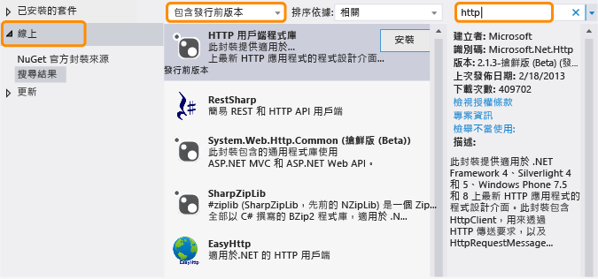

# .NET Framework 和 Out-of-Band 發行版本
.NET Framework 持續朝向容納不同平台 (例如 Windows Phone 和 Windows 市集應用程式以及傳統桌面和 Web 應用程式)，以及獲得最大程式碼重複使用率而不斷進化。 除了定期發行的 .NET Framework 版本之外，我們還會發行非常態 (Out-of-Band，OOB) 新功能，藉此改善跨平台開發工作或引入新功能。 本主題將討論 .NET Framework 及其 OOB 版本的未來方向。  
  
## OOB 版本的優點  
 以非常態 (OOB) 的方式推出新元件或更新，能夠讓 Microsoft 為 .NET Framework 提供更頻繁的更新。 此外，我們還能更迅速地彙總和回應客戶意見。  
  
 當您在應用程式中使用 OOB 功能時，使用者不需要安裝最新版的 .NET Framework 就能執行您的應用程式，因為 OOB 組件會隨您的應用程式套件一併部署。  
  
## OOB 套件散發的方式  
核心通用語言執行平台 (CLR) 元件的 OOB 版本是透過 [NuGet](https://www.nuget.org/) 所提供，這是 .NET 的套件管理員。 NuGet 可讓您從 Visual Studio 的 [方案總管] 中，輕鬆地瀏覽程式庫並加入至 .NET Framework 專案。 從 Visual Studio 2012 開始，NuGet 隨附於所有 Visual Studio 版本。 若要查看是否已安裝 NuGet，請在 Visual Studio 的 [工具] 功能表上尋找 [程式庫套件管理員]。 如果尚未安裝：  
  
1.  在 Visual Studio 功能表列上，選擇 [工具]、[擴充功能和更新] (在 Visual Studio 2010 中請選擇 [擴充管理員])。  
  
     [擴充功能和更新] 對話方塊隨即開啟。  
  
2.  選擇 [連線]、[NuGet 套件管理員]，然後選擇 [下載]。  
  
3.  下載完成後，請重新啟動 Visual Studio。  
  
 如需詳細的安裝指示，請參閱 NuGet 文件網站上的[安裝 NuGet](http://docs.nuget.org/docs/start-here/installing-nuget) (英文)。 如需 NuGet 的詳細資訊，請參閱 [NuGet 文件](http://docs.nuget.org/) (英文)。  
  
## 使用 NuGet OOB 套件  
 安裝 NuGet 之後，您可以使用 Visual Studio 中的 [方案總管]，瀏覽並加入 NuGet 套件的參考：  
  
1.  開啟 Visual Studio 中專案的捷徑功能表，然後選擇 [管理 NuGet 套件]。 (這個選項也可以在 [專案] 功能表中取得)。  
  
2.  在左窗格中，選擇 [連線]。  
  
3.  如果您想要使用發行前套件，請在中間窗格的下拉式清單方塊中，選擇 [包含發行前版本]，而不要選擇 [僅限穩定版本]。  
  
4.  在右窗格中，使用 [搜尋] 方塊尋找您要使用的套件。 某些 Microsoft 套件已獲得 Microsoft .NET Framework 標誌識別，而且所有套件都會將 Microsoft 識別為發行者。  
  
   
  
 如前面所述，當您部署使用 OOB 套件的應用程式時，OOB 組件會隨附於應用程式套件。  
  
## OOB 版本的類型  
 通常，OOB 套件會有一個或多個發行前版本和一個穩定版本。 發行前版本隨附的授權通常不允許轉散發，但是可讓您試用套件並提供意見。 意見會納入對套件的任何更新中。 最終版本會做為穩定套件隨 NuGet 一起散發，並且包含可讓您隨應用程式轉散發 NuGet 套件的授權。 Microsoft 支援穩定套件。 Microsoft 會為所有套件提供 IntelliSense 支援，以及其他類型的文件 (例如，部落格文章和論壇解答)。 此外，部分 (但不是所有) 套件可能會隨附原始程式碼。 如需有關新套件和更新套件的公告，您可以訂閱 [.NET Framework 部落格](http://blogs.msdn.com/b/dotnet/)。  
  
 若要尋找發行前版本和穩定套件，請在 NuGet 套件管理員中選擇 [包含發行前版本]。  
  
 如果您想要收到穩定套件的發行通知，請訂閱 [.NET Framework 摘要](https://nuget.org/api/v2/curated-feeds/dotnetframework/Packages/)。  
  
## 請參閱  
 [快速入門](../../../docs/framework/get-started/index.md)
