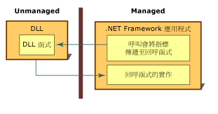

# 回呼函式
回呼函式是 Managed 應用程式內的程式碼，協助未管理 DLL 函式完成工作。 回呼函式的呼叫會透過 DLL 函式從 Managed 應用程式間接傳遞，然後傳遞回 Managed 實作。 許多使用平台叫用所呼叫的 DLL 函式有一部分需要 Managed 程式碼中有回呼函式，才能正確執行。  
  
 若要從 Managed 程式碼呼叫大部分的 DLL 函式，請建立函式的 Managed 定義，然後進行呼叫。 此程序相當直接明瞭。  
  
 使用需要回呼函式的 DLL 函式時有一些額外步驟。 首先，您必須查看函式的文件，以決定函式是否需要回呼。 接下來，您必須在 Managed 應用程式中建立回呼函式。 最後，您呼叫 DLL 函式，以將指標傳遞給回呼函式以作為引數。 下圖摘要說明這些步驟。  
  
   
回呼函式和實作  
  
 回呼函式最適合用於重複執行工作的情況。 在 Win32 API 中，另一個常見用法是列舉函式，例如 **EnumFontFamilies**、**EnumPrinters** 和 **EnumWindows**。 **EnumWindows** 函式會逐一列舉電腦上的所有現有視窗，以呼叫回呼函式來對每個視窗執行工作。 如需指示和範例，請參閱[如何：實作回呼函式](../../../docs/framework/interop/how-to-implement-callback-functions.md)。  
  
## 請參閱  
 [如何：實作回呼函式](../../../docs/framework/interop/how-to-implement-callback-functions.md)  
 [呼叫 DLL 函式](../../../docs/framework/interop/calling-a-dll-function.md)
