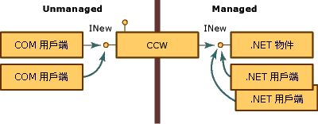
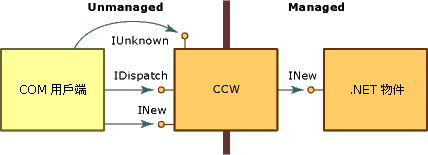

# <a name="com-callable-wrapper"></a>COM 可呼叫包裝函式
當 COM 用戶端呼叫 .NET 物件時，Common Language Runtime 會建立 Managed 物件和物件的 COM 可呼叫包裝函式 (CCW)。 無法直接參考 .NET 物件，因此 COM 用戶端使用 CCW 做為 Managed 物件的 Proxy。  
  
 執行階段會為 Managed 物件建立剛好一個 CCW，不論要求其服務的 COM 用戶端數目有多少。 如下圖所示，多個 COM 用戶端可以保留對公開 INew 介面之 CCW 的參考。 CCW 接著會保留對實作介面且已記憶體回收之 Managed 物件的單一參考。 COM 和 .NET 用戶端都可以同時對相同的 Managed 物件提出要求。  
  
   
透過 COM 可呼叫包裝函式存取 .NET 物件  
  
 在 .NET Framework 內執行的其他類別看不到 COM 可呼叫包裝函式。 其主要目的是要封送處理 Managed 和 Unmanaged 程式碼之間的呼叫。不過，CCW 也會管理物件識別和它們所包裝之 Managed 物件的物件存留期。  
  
## <a name="object-identity"></a>物件識別  
 執行階段會從其記憶體回收的堆積來配置 .NET 物件的記憶體，這讓執行階段能視需要在記憶體中四處移動物件。 相反地，執行階段會從未回收的堆積配置記憶體給 CCW，讓 COM 用戶端可以直接參考包裝函式。  
  
## <a name="object-lifetime"></a>物件存留期  
 不同於它所包裝的 .NET 用戶端，CCW 是以傳統 COM 方式計算參考。 當 CCW 上的參考計數到達零時，包裝函式便會釋放對 Managed 物件的參考。 沒有剩餘參考的 Managed 物件會在下一個記憶體回收循環期間回收。  
  
## <a name="simulating-com-interfaces"></a>模擬 COM 介面

CCW 會以與 COM 強制進行介面型互動一致的方式，向 COM 用戶端公開所有公用且 COM 可見的介面、資料類型和傳回值。 對於 COM 用戶端而言，在 .NET Framework 物件上叫用方法與在 COM 物件上叫用方法相同。  
  
 為了建立這種無縫式的方法，CCW 會製造傳統 COM 介面，例如 **IUnknown** 和 **IDispatch**。 如下圖所示，CCW 會維護對其所包裝之 .NET 物件的單一參考。 COM 用戶端和 .NET 物件會透過 Proxy 和 CCW 虛設常式建構彼此互動。  
  
   
COM 介面與 COM 可呼叫包裝函式  
  
 除了公開受管理環境中的類別明確實作的介面，.NET Framework 也會代表物件提供下表所列 COM 介面的實作。 .NET 類別可以藉由提供自己的這些介面實作來覆寫預設行為。 不過，執行階段一律會提供 **IUnknown** 和 **IDispatch** 介面的實作。  
  
|介面|說明|  
|---------------|-----------------|  
|**Idispatch**|提供晚期類型繫結的機制。|  
|**IerrorInfo**|提供錯誤的文字描述、其來源、說明檔、說明內容，以及定義錯誤之介面的 GUID (.NET 類別一律為 **GUID_NULL**)。|  
|**IprovideClassInfo**|可讓 COM 用戶端存取 Managed 類別所實作的 **ITypeInfo** 介面。|  
|**IsupportErrorInfo**|可讓 COM 用戶端判斷 Managed 物件是否支援 **IErrorInfo** 介面。 如果是的話，可讓用戶端取得最新例外狀況物件的指標。 所有 Managed 類型都支援 **IErrorInfo** 介面。|  
|**ItypeInfo**|提供與 Tlbexp.exe 所產生之類型資訊完全相同之類別的類型資訊。|  
|**Iunknown**|提供 **IUnknown** 介面的標準實作，COM 用戶端用它來管理 CCW 的存留期，並提供類型強制型轉。|  
  
 Managed 類別也可以提供下表所述的 COM 介面。  
  
|介面|說明|  
|---------------|-----------------|  
|(\_*classname*) 類別介面|由執行階段公開且未明確定義的介面，它會公開所有公用介面、方法、屬性和 Managed 物件上明確公開的欄位。|  
|**IConnectionPoint** 和 **IConnectionPointContainer**|來源為以委派為基礎之事件的物件介面 (註冊事件訂閱者用的介面)。|  
|**IdispatchEx**|如果類別實作 **IExpando**，則為執行階段提供的介面。 **IDispatchEx** 介面是 **IDispatch** 介面的延伸模組，它不同於 **IDispatch**，可進行成員的列舉、新增、刪除和區分大小寫的呼叫。|  
|**IEnumVARIANT**|集合類型類別的介面，如果類別實作 **IEnumerable**，它會列舉集合中的物件。|  
  
## <a name="introducing-the-class-interface"></a>類別介面簡介  
 類別介面未在 Managed 程式碼中明確定義，它是公開所有公用方法、屬性、欄位和 .NET 物件上明確公開之事件的介面。 這個介面可以是雙重介面或僅分派介面。 類別介面會接收 .NET 類別的名稱本身，前面加上底線。 例如，對於類別 Mammal，類別介面是 \_Mammal。  
  
 對於衍生類別，類別介面也會公開和基底類別的所有公用方法、屬性欄位。 衍生類別也會為每個基底類別公開類別介面。 例如，如果類別 Mammal 會延伸類別 MammalSuperclass，而 MammalSuperclass 本身會延伸 System.Object，則 .NET 物件會向 COM 用戶端公開三個類別介面，名稱分別為 \_Mammal、\_MammalSuperclass 及 \_Object。  
  
 例如，請參考下列 .NET 類別：  
  
```vb  
' Applies the ClassInterfaceAttribute to set the interface to dual.  
<ClassInterface(ClassInterfaceType.AutoDual)> _  
' Implicitly extends System.Object.  
Public Class Mammal  
    Sub Eat()  
    Sub Breathe()  
    Sub Sleep()  
End Class  
```  
  
```csharp
// Applies the ClassInterfaceAttribute to set the interface to dual.
[ClassInterface(ClassInterfaceType.AutoDual)]
// Implicitly extends System.Object.
public class Mammal
{
    public void Eat() {}
    public void Breathe() {}
    public void Sleep() {}
}
```
  
 COM 用戶端可以取得名為 `_Mammal` 之類別介面的指標，它描述於[型別程式庫匯出工具 (Tlbexp.exe)](../tools/tlbexp-exe-type-library-exporter.md) 工具所產生的型別程式庫中。 如果 `Mammal` 類別實作一個或多個介面，介面會出現在 coclass 底下。  
  
```  
[odl, uuid(…), hidden, dual, nonextensible, oleautomation]  
interface _Mammal : IDispatch  
{  
    [id(0x00000000), propget] HRESULT ToString([out, retval] BSTR*  
        pRetVal);  
    [id(0x60020001)] HRESULT Equals([in] VARIANT obj, [out, retval]  
        VARIANT_BOOL* pRetVal);  
    [id(0x60020002)] HRESULT GetHashCode([out, retval] short* pRetVal);  
    [id(0x60020003)] HRESULT GetType([out, retval] _Type** pRetVal);  
    [id(0x6002000d)] HRESULT Eat();  
    [id(0x6002000e)] HRESULT Breathe();  
    [id(0x6002000f)] HRESULT Sleep();  
}  
[uuid(…)]  
coclass Mammal   
{  
    [default] interface _Mammal;  
}  
```  
  
 產生類別介面是選擇性的。 根據預設，COM Interop 會為您匯出至類型程式庫的每個類別產生一個僅分派介面。 您可以藉由套用 <xref:System.Runtime.InteropServices.ClassInterfaceAttribute> 到您的類別，避免或修改自動建立此介面。 雖然類別介面可以簡化公開 Managed 類別給 COM 的工作，其用法會受到限制。  
  
> [!CAUTION]
>  使用類別介面，而不是自行明確定義的話，可能會使 Managed 類別的未來版本控制變複雜。 請先閱讀下列方針，再使用類別介面。  
  
### <a name="define-an-explicit-interface-for-com-clients-to-use-rather-than-generating-the-class-interface"></a>定義明確的介面以供 COM 用戶端使用，而不要產生類別介面。  
 由於 COM Interop 會自動產生類別介面，對您類別的後續版本變更可以修改 Common Language Runtime 所公開的類別介面配置。 由於 COM 用戶端通常並未預期要處理介面配置中的變更，如果您變更類別的成員配置，它們會中斷。  
  
 此方針強調公開給 COM 用戶端的介面必須維持不變這樣的概念。 若要減少因為不小心重新排列介面配置而中斷 COM 用戶端的風險，請藉由明確定義介面，將對類別的所有變更與介面配置相隔離。  
  
 使用 **ClassInterfaceAttribute** 解除類別介面的自動產生，並實作類別的明確介面，如下列程式碼片段所示：  
  
```vb  
<ClassInterface(ClassInterfaceType.None)>Public Class LoanApp  
    Implements IExplicit  
    Sub M() Implements IExplicit.M  
…  
End Class  
```  
  
```csharp
[ClassInterface(ClassInterfaceType.None)]
public class LoanApp : IExplicit
{
    int IExplicit.M() { return 0; }
}
```
  
 **ClassInterfaceType.None** 值可防止在類別中繼資料匯出至型別程式庫時產生類別介面。 在上述範例中，COM 用戶端只能透過 `IExplicit` 介面存取 `LoanApp` 類別。  
  
### <a name="avoid-caching-dispatch-identifiers-dispids"></a>避免快取分派識別碼 (DispId)
 使用類別介面對於指令碼式用戶端、Microsoft Visual Basic 6.0 用戶端，或不會快取介面成員 DispId 的任何晚期繫結用戶端而言，是可接受的選項。 DispId 可識別介面成員以啟用晚期繫結。  
  
 對於類別介面，DispId 的產生是根據成員在介面中的位置。 如果您變更成員的順序，並將類別匯出至類型程式庫，您會修改在類別介面中產生的 DispId。  
  
 若要避免在使用類別介面時中斷晚期繫結 COM 用戶端，請套用具有 **ClassInterfaceType.AutoDispatch** 值的 **ClassInterfaceAttribute**。 這個值會實作僅分派類別介面，但會略過來自類型程式庫的介面描述。 沒有介面描述，用戶端將無法在編譯時間快取 DispId。 雖然這是類別介面的預設介面類型，您仍可以明確地套用屬性值。  
  
```vb  
<ClassInterface(ClassInterfaceType.AutoDispatch)> Public Class LoanApp  
    Implements IAnother  
    Sub M() Implements IAnother.M  
…  
End Class  
```  
  
```csharp
[ClassInterface(ClassInterfaceType.AutoDispatch)]
public class LoanApp
{
    public int M() { return 0; }
}
```
  
 若要在執行階段取得介面成員的 DispId，COM 用戶端可以呼叫 **IDispatch.GetIdsOfNames**。 若要在介面上叫用方法，請將傳回的 DispId 作為引數傳遞給 **IDispatch.Invoke**。  
  
### <a name="restrict-using-the-dual-interface-option-for-the-class-interface"></a>限制針對類別介面使用雙重介面選項。  
 雙重介面可讓 COM 用戶端進行介面成員的早期和晚期繫結。 在設計階段和測試期間，您可能會發現將類別介面設為雙重很有用。 對於絕對不會修改的 Managed 類別 (和其基底類別)，此選項也是可以接受的。 在其他情況下，請避免將類別介面設定為雙重。  
  
 自動產生的雙重介面可能適合於少數情況，不過，通常它會造成與版本相關的複雜性。 例如，使用衍生類別之類別介面的 COM 用戶端，可能會因為對基底類別的變更而輕易地中斷。 當協力廠商提供基底類別時，類別介面的配置會超出您的控制。 此外，不同於僅分派介面，雙重介面 (**ClassInterfaceType.AutoDual**) 會在匯出的型別程式庫中提供類別介面的描述。 這類描述鼓勵晚期繫結的用戶端在執行階段快取 DispId。  
  
### <a name="ensure-that-all-com-event-notifications-are-late-bound"></a>請確定所有 COM 事件通知都是晚期繫結的。

根據預設，COM 型別資訊會直接內嵌到受控組件，而不需主要的 interop 組件 (PIA)。 不過，內嵌型別資訊的其中一個限制是它不支援透過早期繫結 vtable 呼叫的 COM 事件通知傳遞，但只支援晚期繫結的 `IDispatch::Invoke` 呼叫。

如果您的應用程式需要對 COM 事件介面方法進行早期繫結呼叫，您可以在 Visual Studio 中將**內嵌 Interop 型別**屬性設定為 `true`，或在您的專案檔中包含下列元素：

```xml
<EmbedInteropTypes>True</EmbedInteropTypes>
```

## <a name="see-also"></a>另請參閱
- <xref:System.Runtime.InteropServices.ClassInterfaceAttribute>
- [COM 包裝函式](com-wrappers.md)
- [將 .NET Framework 元件公開給 COM](exposing-dotnet-components-to-com.md)
- [限定互通的 .NET 類型](qualifying-net-types-for-interoperation.md)
- [執行階段可呼叫包裝函式](runtime-callable-wrapper.md)
