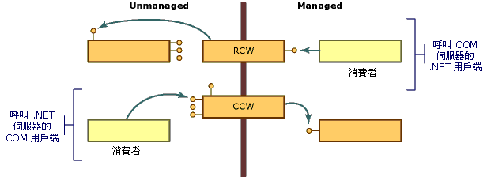

# COM 包裝函式
COM 與 .NET Framework 物件模型在數個重要方面不同：  
  
-   COM 物件用戶端必須管理這些物件的存留期；Common Language Runtime 會管理其環境中物件的存留期。  
  
-   COM 物件用戶端會透過要求提供該服務的介面並取回介面指標來探索服務是否可用。 .NET 物件的用戶端可以取得使用反映之物件功能的描述。  
  
-   NET 物件位在 .NET Framework 執行環境所管理的記憶體中。 基於效能原因，執行環境可以在記憶體中移動物件，並更新所移動物件的所有參考。 已取得物件指標的 Unmanaged 用戶端依賴此物件來維持在相同的位置。 這些用戶端沒有機制可以處理其位置不固定的物件。  
  
 為了克服這些差異，執行階段提供包裝函式類別，讓 Managed 和 Unmanaged 用戶端認為它們在其各自環境內呼叫物件。 只要 Managed 用戶端對 COM 物件呼叫方法，執行階段就會建立[執行階段可呼叫包裝函式](runtime-callable-wrapper.md) (RCW)。 此外，RCW 會擷取 Managed 與 Unmanaged 參考機制之間的差異。 執行階段也會建立 [COM 可呼叫包裝函式](com-callable-wrapper.md) (CCW) 來反轉程序，讓 COM 用戶端在 .NET 物件上順暢地呼叫方法。 如下圖所示，呼叫端程式碼的角度可決定執行階段所建立的包裝函式類別。  
  
   
COM 包裝函式概觀  
  
 在大部分情況下，執行階段所產生的標準 RCW 或 CCW 提供呼叫的足夠封送處理，而這些呼叫跨越 COM 與 .NET Framework 之間的界限。 使用自訂屬性，您可以選擇性地調整執行階段呈現 Managed 和 Unmanaged 程式碼的方式。  
  
## 另請參閱
- [進階 COM 互通性](https://docs.microsoft.com/previous-versions/dotnet/netframework-4.0/bd9cdfyx(v=vs.100))
- [執行階段可呼叫包裝函式](runtime-callable-wrapper.md)
- [COM 可呼叫包裝函式](com-callable-wrapper.md)
- [自訂標準包裝函式](https://docs.microsoft.com/previous-versions/dotnet/netframework-4.0/h7hx9abd(v=vs.100))
- [如何：自訂執行階段可呼叫包裝函式](https://docs.microsoft.com/previous-versions/dotnet/netframework-4.0/56kh4hy7(v=vs.100))
