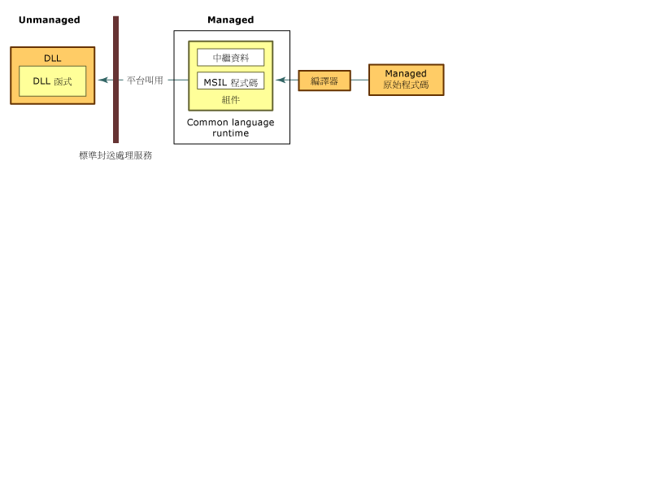

# 使用 Unmanaged DLL 函式
平台叫用服務，可讓 Managed 程式碼呼叫 Unmanaged 函式在動態連結程式庫 \(DLL\) 中實作，例如 Win32 API 中。  它會找出並叫用匯出的函式，並且在需要的時候於交互操作界限之間封送處理其引數 \(整數、 字串、 陣列、 結構和其他\) 。  如需有關這項服務的詳細資訊，請參閱[進一步了解平台叫用](http://msdn.microsoft.com/zh-tw/ba9dd55b-2eaa-45cd-8afd-75cb8d64d243)。  
  
 本節將介紹幾個與使用 Unmanaged DLL 函式相關聯的工作。  除了下列工作之外，還有一般考量以及提供其他資訊和範例的連結。  
  
#### 使用匯出的 DLL 函式  
  
1.  [識別 DLL 中的函式](../../../docs/framework/interop/identifying-functions-in-dlls.md)。  
  
     至少，您必須指定函式的名稱以及包含該函式之 DLL 的名稱。  
  
2.  [建立類別以包裝 DLL 函式](../../../docs/framework/interop/creating-a-class-to-hold-dll-functions.md)。  
  
     您可以使用現有的類別、為每個 Unmanaged 函式建立個別的類別、或建立一個類別，其中包含一組相關的 Unmanaged 函式。  
  
3.  [在 Managed 程式碼中建立原型](../../../docs/framework/interop/creating-prototypes-in-managed-code.md)。  
  
     \[Visual Basic\] 使用**宣告**陳述式搭配 **函式** 和 **Lib** 關鍵字。  在某些罕見的情況下，您可以使用 **DllImportAttribute** 與 **共用函式**關鍵字。  關於這種情況本節會於稍後加以說明。  
  
     \[C\#\] 使用 **DllImportAttribute** 來識別 DLL 和函式。  以**靜態**和**外部**修飾詞來標記方法。  
  
     \[C\+\+\] 使用 **DllImportAttribute** 來識別 DLL 和函式。  以**外部 "C"** 來標記包裝方法或函式 。  
  
4.  [呼叫 DLL 函式](../../../docs/framework/interop/calling-a-dll-function.md)。  
  
     在您的 Managed 類別上呼叫方法，如同您呼叫任何其他 Managed 方法。  [傳遞結構](../../../docs/framework/interop/passing-structures.md)和[實作回呼函式](../../../docs/framework/interop/callback-functions.md)為特殊案例。  
  
 如需示範如何用平台叫用來建構以 .NET 為基礎之宣告的範例，請參閱[封送處理平台叫用的資料](../../../docs/framework/interop/marshaling-data-with-platform-invoke.md)。  
  
## 進一步了解平台叫用  
 平台叫用依賴中繼資料來找出被匯出的函式，並在執行階段封送處理其引數。  下圖將顯示本項處理。  
  
   
平台叫用呼叫 Unmanaged DLL 函式  
  
 當平台叫用呼叫 Unmanaged 函式時，它會依序執行下列動作：  
  
1.  找出包含該函式的 DLL。  
  
2.  將 DLL 載入到記憶體中。  
  
3.  在記憶體中找出函式的位址，並將其引數推送至堆疊中，視需要封送處理資料。  
  
    > [!NOTE]
    >  僅在首次呼叫函式時尋找和載入 DLL，且尋找記憶體中的函式位址。  
  
4.  將控制項傳輸至 Unmanaged 函式。  
  
 平台叫用會擲回由 Unmanaged 函式產生的例外狀況給 Managed 呼叫端。  
  
## 請參閱  
 [與 Unmanaged 程式碼互通](../../../docs/framework/interop/index.md)   
 [平台叫用範例](../../../docs/framework/interop/platform-invoke-examples.md)   
 [Interop 封送處理](../../../docs/framework/interop/interop-marshaling.md)   
 [使用 Unmanaged DLL 函式](../../../docs/framework/interop/consuming-unmanaged-dll-functions.md)