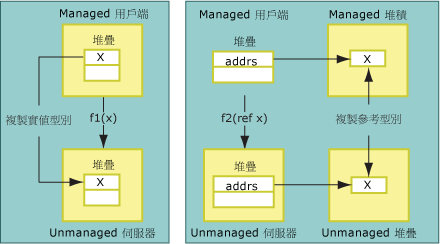
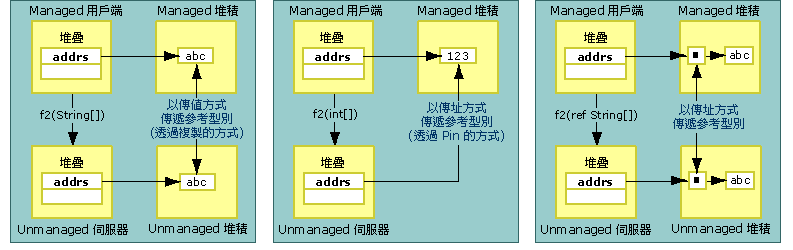

# 複製和 Pin
封送處理資料時，Interop 封送處理器可以複製或釘選所封送處理的資料。 複製資料時會將某個記憶體位置中的一份資料放入另一個記憶體位置。 下圖顯示複製實值型別與以傳址方式將類型從 Managed 複製至 Unmanaged 記憶體之間的差異。  
  
   
以傳值和傳址方式傳遞的實值類型  
  
 以傳值方式傳遞的方法引數會封送處理成 Unmanaged 程式碼，以作為堆疊上的值。 複製程序是直接的。 以傳址方式傳遞的引數會傳遞為堆疊上的指標。 同時以傳值和傳址方式傳遞參考型別。 如下圖所示，會複製或釘選以傳值方式傳遞的參考型別。  
  
   
以傳值和傳址方式傳遞的參考型別  
  
 釘選會暫時鎖定其目前記憶體位置中的資料，因此 Common Language Runtime 的記憶體回收行程不會重新定位它。 封送處理器會釘選資料，以減少複製和增強效能的額外負荷。 資料的類型決定在封送處理程序期間複製還是釘選資料。  在封送處理期間，會針對 <xref:System.String> 這類物件自動執行釘選，不過，您也可以使用 <xref:System.Runtime.InteropServices.GCHandle> 類別來手動釘選記憶體。  
  
## 格式化 Blittable 類別  
 格式化 [Blittable](blittable-and-non-blittable-types.md) 類別具有固定配置 (格式化) 以及 Managed 和 Unmanaged 記憶體中的常見資料呈現。 這些類型需要封送處理時，會將堆積中物件的指標直接傳遞給被呼叫者。 被呼叫者可以變更指標所參考記憶體位置的內容。  
  
> [!NOTE]
>  如果參數標記 Out 或 In/Out，則被呼叫者可以變更記憶體內容。相反地，將參數設定為封送處理為 In (這是格式化 Blittable 類型的預設值) 時，被呼叫者應該避免變更內容。 修改 In 物件時會在將相同類別匯出至型別程式庫時產生問題，並且用來進行跨 Apartment 呼叫。  
  
## 格式化非 Blittable 類別  
 格式化[非 Blittable](blittable-and-non-blittable-types.md) 類別具有固定配置 (格式化)，但 Managed 和 Unmanaged 記憶體中的資料呈現不同。 在下列情況下，資料可能需要轉換：  
  
-   如果以傳值方式封送處理非 Blittable 類別，被呼叫者會收到一份資料結構的指標。  
  
-   如果以傳址方式封送處理非 Blittable 類別，被呼叫者會收到一份資料結構的指標。  
  
-   如果設定 <xref:System.Runtime.InteropServices.InAttribute> 屬性，則一律會使用執行個體狀態來初始化此複本，並依需要封送處理。  
  
-   如果設定 <xref:System.Runtime.InteropServices.OutAttribute> 屬性，則一律會在傳回時將狀態複製回執行個體，並依需要封送處理。  
  
-   如果同時設定 **InAttribute** 和 **OutAttribute**，則需要兩個複本。 如果省略任一屬性，則封送處理器可以透過排除任一複本來進行最佳化。  
  
## 參考類型  
 可以透過傳值或傳址方式傳遞參考型別。 以傳值方式傳遞它們時，會在堆疊上傳遞類型的指標。 以傳址方式傳遞時，會在堆疊上傳遞類型的指標。  
  
 參考型別具有下列條件式行為：  
  
-   如果以傳值方式傳遞參考型別，而且它具有非 Blittable 類型的成員，則會將類型轉換兩次：  
  
    -   將引數傳遞給 Unmanaged 端時。  
  
    -   從呼叫傳回時。  
  
     為了避免不必要的複製和轉換，這些類型會封送處理為 In 參數。 您必須將 **InAttribute** 和 **OutAttribute** 屬性明確地套用至呼叫者的引數，以查看被呼叫者所進行的變更。  
  
-   如果以傳值方式傳遞參考型別，而且它只有 Blittable 類型的成員，則可以在封送處理期間釘選它，而且呼叫者會看到被呼叫者對類型成員所進行的任何變更。 如果您想要這個行為，請明確地套用 **InAttribute** 和 **OutAttribute**。 如果沒有這些方向屬性，Interop 封送處理器就不會將方向資訊匯出至型別程式庫 (它會匯出為 In，這是預設值)，而且這可能會導致 COM 跨 Apartment 封送處理問題。  
  
-   如果以傳址方式傳遞參考型別，則預設會將它封送處理為 In/Out。  
  
## System.String 和 System.Text.StringBuilder  
 以傳值方式或傳址方式將資料封送處理至 Unmanaged 程式碼時，封送處理器通常會將資料複製至次要緩衝區 (可能會在複製期間轉換字元集)，並將緩衝區的參考傳遞給被呼叫者。 除非參考是與 **SysAllocString** 一起配置的 **BSTR**，否則參考一律是與 **CoTaskMemAlloc** 一起配置。  
  
 以傳值方式封送處理任一字串類型來進行最佳化時，(例如 Unicode 字元字串)，封送處理器會將內部 Unicode 緩衝區中 Managed 字串的直接指標傳遞給被呼叫者，而不是將它複製至新的緩衝區。  
  
> [!CAUTION]
>  以傳值方式傳遞字串時，被呼叫者必須永遠不得改變封送處理器所傳遞的參考。 這樣做可能會損毀 Managed 堆積。  
  
 以傳址方式傳遞 <xref:System.String?displayProperty=nameWithType> 時，封送處理器會先將字串的內容複製至次要緩衝區，再提出要求。 它接著會透過呼叫，在傳回時將緩衝區的內容複製至新的字串。 這項技術可確保不可變的 Managed 字串保持不變。  
  
 以傳值方式傳遞 <xref:System.Text.StringBuilder?displayProperty=nameWithType> 時，封送處理器會直接將 **StringBuilder** 的內部緩衝區參考傳遞給呼叫者。 呼叫者和被呼叫者必須同意緩衝區的大小。 呼叫者負責建立長度足夠的 **StringBuilder**。 被呼叫者必須採取必要的預防措施，確保緩衝區未溢位。 **StringBuilder** 是規則的例外狀況，而此規則預設會將以傳值方式傳遞的參考型別傳遞為 In 參數。 它一律會傳遞為 In/Out。  
  
## 另請參閱  
 [預設的封送處理行為](default-marshaling-behavior.md)  
 [使用 Interop 封送處理器進行記憶體管理](https://msdn.microsoft.com/library/417206ce-ee3e-4619-9529-0c0b686c7bee(v=vs.100))  
 [方向屬性](https://msdn.microsoft.com/library/241ac5b5-928e-4969-8f58-1dbc048f9ea2(v=vs.100))  
 [Interop 封送處理](interop-marshaling.md)
