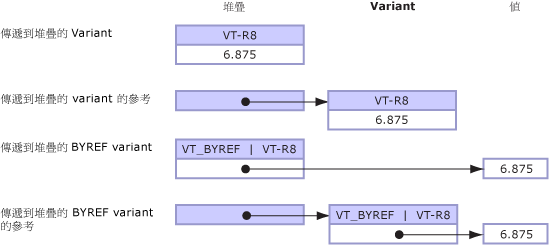

# <a name="default-marshaling-for-objects"></a>物件的預設封送處理
類型為 <xref:System.Object?displayProperty=nameWithType> 的參數和欄位可以向 Unmanaged 程式碼公開為下列類型之一：  
  
-   Variant，當物件是參數時。  
  
-   介面，當物件是結構欄位時。  
  
 只有 COM Interop 支援封送處理物件類型。 預設行為是封送處理 COM Variant 的物件。 這些規則只適用於**物件**類型，不適用於衍生自**物件**類別的強型別物件。  
  
 本主題提供下列有關封送處理物件類型的額外資訊：  
  
-   [封送處理選項](#cpcondefaultmarshalingforobjectsanchor7)  
  
-   [將物件封送處理成介面](#cpcondefaultmarshalingforobjectsanchor2)  
  
-   [將物件封送處理成 Variant](#cpcondefaultmarshalingforobjectsanchor3)  
  
-   [將 Variant 封送處理成物件](#cpcondefaultmarshalingforobjectsanchor4)  
  
-   [封送處理的 ByRef Variant](#cpcondefaultmarshalingforobjectsanchor6)  
  
<a name="cpcondefaultmarshalingforobjectsanchor7"></a>   
## <a name="marshaling-options"></a>封送處理選項  
 下表顯示**物件**資料類型的封送處理選項。 <xref:System.Runtime.InteropServices.MarshalAsAttribute> 屬性提供幾種 <xref:System.Runtime.InteropServices.UnmanagedType> 列舉值來封送處理物件。  
  
|列舉類型|Unmanaged 格式的描述|  
|----------------------|-------------------------------------|  
|**UnmanagedType.Struct**<br /><br /> (參數預設值)|COM 樣式的 Variant。|  
|**UnmanagedType.Interface**|如果可能的話，為 **IDispatch** 介面；否則為 **IUnknown** 介面。|  
|**UnmanagedType.IUnknown**<br /><br /> (欄位預設值)|**IUnknown** 介面。|  
|**UnmanagedType.IDispatch**|**IDispatch** 介面。|  
  
 下例顯示 `MarshalObject` 的 Managed 介面定義。  
  
```vb  
Interface MarshalObject  
   Sub SetVariant(o As Object)  
   Sub SetVariantRef(ByRef o As Object)  
   Function GetVariant() As Object  
  
   Sub SetIDispatch( <MarshalAs(UnmanagedType.IDispatch)> o As Object)  
   Sub SetIDispatchRef(ByRef <MarshalAs(UnmanagedType.IDispatch)> o _  
      As Object)  
   Function GetIDispatch() As <MarshalAs(UnmanagedType.IDispatch)> Object  
   Sub SetIUnknown( <MarshalAs(UnmanagedType.IUnknown)> o As Object)  
   Sub SetIUnknownRef(ByRef <MarshalAs(UnmanagedType.IUnknown)> o _  
      As Object)  
   Function GetIUnknown() As <MarshalAs(UnmanagedType.IUnknown)> Object  
End Interface  
```  
  
```csharp  
interface MarshalObject {  
   void SetVariant(Object o);  
   void SetVariantRef(ref Object o);  
   Object GetVariant();  
  
   void SetIDispatch ([MarshalAs(UnmanagedType.IDispatch)]Object o);  
   void SetIDispatchRef([MarshalAs(UnmanagedType.IDispatch)]ref Object o);  
   [MarshalAs(UnmanagedType.IDispatch)] Object GetIDispatch();  
   void SetIUnknown ([MarshalAs(UnmanagedType.IUnknown)]Object o);  
   void SetIUnknownRef([MarshalAs(UnmanagedType.IUnknown)]ref Object o);  
   [MarshalAs(UnmanagedType.IUnknown)] Object GetIUnknown();  
}  
```  
  
 下列程式碼會將 `MarshalObject` 介面匯出至型別程式庫。  
  
```  
interface MarshalObject {  
   HRESULT SetVariant([in] VARIANT o);  
   HRESULT SetVariantRef([in,out] VARIANT *o);  
   HRESULT GetVariant([out,retval] VARIANT *o)   
   HRESULT SetIDispatch([in] IDispatch *o);  
   HRESULT SetIDispatchRef([in,out] IDispatch **o);  
   HRESULT GetIDispatch([out,retval] IDispatch **o)   
   HRESULT SetIUnknown([in] IUnknown *o);  
   HRESULT SetIUnknownRef([in,out] IUnknown **o);  
   HRESULT GetIUnknown([out,retval] IUnknown **o)   
}  
```  
  
> [!NOTE]
>  Interop 封送處理器會呼叫之後，自動釋放 Variant 內所有的配置物件。  
  
 下例會顯示格式化的實值型別。  
  
```vb  
Public Structure ObjectHolder  
   Dim o1 As Object  
   <MarshalAs(UnmanagedType.IDispatch)> Public o2 As Object  
End Structure  
```  
  
```csharp  
public struct ObjectHolder {  
   Object o1;  
   [MarshalAs(UnmanagedType.IDispatch)]public Object o2;  
}  
```  
  
 下列程式碼會將格式化的類型匯出至型別程式庫。  
  
```  
struct ObjectHolder {  
   VARIANT o1;  
   IDispatch *o2;  
}  
```  
  
<a name="cpcondefaultmarshalingforobjectsanchor2"></a>   
## <a name="marshaling-object-to-interface"></a>將物件封送處理成介面  
 向 COM 將物件公開為介面時，該介面是 Managed 類型 <xref:System.Object> 的類別介面 (**_Object** 介面)。 在產生的型別程式庫中，這個介面類型為 **IDispatch** (<xref:System.Runtime.InteropServices.UnmanagedType>) 或 **IUnknown** (**UnmanagedType.IUnknown**)。 COM 用戶端可以動態方式叫用 Managed 類別的成員，或其衍生類別透過 **_Object** 介面所實作的任何成員。 用戶端也可以呼叫 **QueryInterface** 取得 Managed 類型明確實作的任何其他介面。  
  
<a name="cpcondefaultmarshalingforobjectsanchor3"></a>   
## <a name="marshaling-object-to-variant"></a>將物件封送處理成 Variant  
 當物件封送處理成 Variant 時，會根據下列規則在執行階段決定內部的 Variant 類型：  
  
-   如果物件參考為 null (Visual Basic 為**Nothing**)，物件會封送處理成 **VT_EMPTY** 類型的 Variant。  
  
-   如果物件是下表所列任一類型的執行個體，則產生的 Variant 類型是由封送處理器內建的規則決定，並顯示在資料表中。  
  
-   需要明確控制封送處理行為的其他物件，可以實作 <xref:System.IConvertible> 介面。 在此情況下，Variant 類型是由 <xref:System.IConvertible.GetTypeCode%2A?displayProperty=nameWithType> 方法傳回的類型程式碼所決定。 否則，物件會封送處理成 **VT_UNKNOWN** 類型的 Variant。  
  
### <a name="marshaling-system-types-to-variant"></a>將系統類型封送處理為 Variant  
 下表顯示 Managed 物件類型及其對應的 COM Variant 類型。 只有當正在呼叫的方法簽章是 <xref:System.Object?displayProperty=nameWithType> 類型時，這些類型才會轉換。  
  
|物件類型|COM Variant 類型|  
|-----------------|----------------------|  
|Null 物件參考 (在 Visual Basic 中為 **Nothing**)。|**VT_EMPTY**|  
|<xref:System.DBNull?displayProperty=nameWithType>|**VT_NULL**|  
|<xref:System.Runtime.InteropServices.ErrorWrapper?displayProperty=nameWithType>|**VT_ERROR**|  
|<xref:System.Reflection.Missing?displayProperty=nameWithType>|**VT_ERROR** 與 **E_PARAMNOTFOUND**|  
|<xref:System.Runtime.InteropServices.DispatchWrapper?displayProperty=nameWithType>|**VT_DISPATCH**|  
|<xref:System.Runtime.InteropServices.UnknownWrapper?displayProperty=nameWithType>|**VT_UNKNOWN**|  
|<xref:System.Runtime.InteropServices.CurrencyWrapper?displayProperty=nameWithType>|**VT_CY**|  
|<xref:System.Boolean?displayProperty=nameWithType>|**VT_BOOL**|  
|<xref:System.SByte?displayProperty=nameWithType>|**VT_I1**|  
|<xref:System.Byte?displayProperty=nameWithType>|**VT_UI1**|  
|<xref:System.Int16?displayProperty=nameWithType>|**VT_I2**|  
|<xref:System.UInt16?displayProperty=nameWithType>|**VT_UI2**|  
|<xref:System.Int32?displayProperty=nameWithType>|**VT_I4**|  
|<xref:System.UInt32?displayProperty=nameWithType>|**VT_UI4**|  
|<xref:System.Int64?displayProperty=nameWithType>|**VT_I8**|  
|<xref:System.UInt64?displayProperty=nameWithType>|**VT_UI8**|  
|<xref:System.Single?displayProperty=nameWithType>|**VT_R4**|  
|<xref:System.Double?displayProperty=nameWithType>|**VT_R8**|  
|<xref:System.Decimal?displayProperty=nameWithType>|**VT_DECIMAL**|  
|<xref:System.DateTime?displayProperty=nameWithType>|**VT_DATE**|  
|<xref:System.String?displayProperty=nameWithType>|**VT_BSTR**|  
|<xref:System.IntPtr?displayProperty=nameWithType>|**VT_INT**|  
|<xref:System.UIntPtr?displayProperty=nameWithType>|**VT_UINT**|  
|<xref:System.Array?displayProperty=nameWithType>|**VT_ARRAY**|  
  
 使用前一個範例中定義的 `MarshalObject` 介面，下列程式碼範例示範如何將各種類型的 Variant 傳送到 COM 伺服器。  
  
```vb  
Dim mo As New MarshalObject()  
mo.SetVariant(Nothing)         ' Marshal as variant of type VT_EMPTY.  
mo.SetVariant(System.DBNull.Value) ' Marshal as variant of type VT_NULL.  
mo.SetVariant(CInt(27))        ' Marshal as variant of type VT_I2.  
mo.SetVariant(CLng(27))        ' Marshal as variant of type VT_I4.  
mo.SetVariant(CSng(27.0))      ' Marshal as variant of type VT_R4.  
mo.SetVariant(CDbl(27.0))      ' Marshal as variant of type VT_R8.  
```  
  
```csharp  
MarshalObject mo = new MarshalObject();  
mo.SetVariant(null);            // Marshal as variant of type VT_EMPTY.  
mo.SetVariant(System.DBNull.Value); // Marshal as variant of type VT_NULL.  
mo.SetVariant((int)27);          // Marshal as variant of type VT_I2.  
mo.SetVariant((long)27);          // Marshal as variant of type VT_I4.  
mo.SetVariant((single)27.0);   // Marshal as variant of type VT_R4.  
mo.SetVariant((double)27.0);   // Marshal as variant of type VT_R8.  
```  
  
 沒有對應 Managed 類型的 COM 類型，可以使用 <xref:System.Runtime.InteropServices.ErrorWrapper>、<xref:System.Runtime.InteropServices.DispatchWrapper>、<xref:System.Runtime.InteropServices.UnknownWrapper> 和 <xref:System.Runtime.InteropServices.CurrencyWrapper> 等包裝函式類別予以封送處理。 下列程式碼範例示範如何使用這些包裝函式將各種類型的 Variant 傳送到 COM 伺服器。  
  
```vb  
Imports System.Runtime.InteropServices  
' Pass inew as a variant of type VT_UNKNOWN interface.  
mo.SetVariant(New UnknownWrapper(inew))  
' Pass inew as a variant of type VT_DISPATCH interface.  
mo.SetVariant(New DispatchWrapper(inew))  
' Pass a value as a variant of type VT_ERROR interface.  
mo.SetVariant(New ErrorWrapper(&H80054002))  
' Pass a value as a variant of type VT_CURRENCY interface.  
mo.SetVariant(New CurrencyWrapper(New Decimal(5.25)))  
```  
  
```csharp  
using System.Runtime.InteropServices;  
// Pass inew as a variant of type VT_UNKNOWN interface.  
mo.SetVariant(new UnknownWrapper(inew));  
// Pass inew as a variant of type VT_DISPATCH interface.  
mo.SetVariant(new DispatchWrapper(inew));  
// Pass a value as a variant of type VT_ERROR interface.  
mo.SetVariant(new ErrorWrapper(0x80054002));  
// Pass a value as a variant of type VT_CURRENCY interface.  
mo.SetVariant(new CurrencyWrapper(new Decimal(5.25)));  
```  
  
 包裝函式類別是在 <xref:System.Runtime.InteropServices> 命名空間中定義。  
  
### <a name="marshaling-the-iconvertible-interface-to-variant"></a>將 IConvertible 介面封送處理為 Variant  
 上節中未列出的其他類型，可以透過實作 <xref:System.IConvertible> 介面來控制封送處理的方式。 如果物件實作 **IConvertible** 介面，從 <xref:System.IConvertible.GetTypeCode%2A?displayProperty=nameWithType> 方法傳回的 <xref:System.TypeCode> 列舉值會在執行階段決定 COM Variant 類型。  
  
 下表顯示可能的 **TypeCode** 列舉值和每個值對應的 COM Variant 類型。  
  
|TypeCode|COM Variant 類型|  
|--------------|----------------------|  
|**TypeCode.Empty**|**VT_EMPTY**|  
|**TypeCode.Object**|**VT_UNKNOWN**|  
|**TypeCode.DBNull**|**VT_NULL**|  
|**TypeCode.Boolean**|**VT_BOOL**|  
|**TypeCode.Char**|**VT_UI2**|  
|**TypeCode.Sbyte**|**VT_I1**|  
|**TypeCode.Byte**|**VT_UI1**|  
|**TypeCode.Int16**|**VT_I2**|  
|**TypeCode.UInt16**|**VT_UI2**|  
|**TypeCode.Int32**|**VT_I4**|  
|**TypeCode.UInt32**|**VT_UI4**|  
|**TypeCode.Int64**|**VT_I8**|  
|**TypeCode.UInt64**|**VT_UI8**|  
|**TypeCode.Single**|**VT_R4**|  
|**TypeCode.Double**|**VT_R8**|  
|**TypeCode.Decimal**|**VT_DECIMAL**|  
|**TypeCode.DateTime**|**VT_DATE**|  
|**TypeCode.String**|**VT_BSTR**|  
|不支援。|**VT_INT**|  
|不支援。|**VT_UINT**|  
|不支援。|**VT_ARRAY**|  
|不支援。|**VT_RECORD**|  
|不支援。|**VT_CY**|  
|不支援。|**VT_Variant**|  
  
 COM Variant 的值是透過呼叫 **IConvertible.To** *Type* 介面所決定；其中 **To** *Type* 是轉換常式，對應到從 **IConvertible.GetTypeCode** 傳回的類型。 例如，從 **IConvertible.GetTypeCode** 傳回 **TypeCode.Double** 的物件，會封送處理成 **VT_R8** 類型的 COM Variant。 您可以透過轉換為 **IConvertible** 介面及呼叫 <xref:System.IConvertible.ToDouble%2A> 方法，取得 Variant 的值 (儲存在 COM Variant 的 **dblVal** 欄位)。  
  
<a name="cpcondefaultmarshalingforobjectsanchor4"></a>   
## <a name="marshaling-variant-to-object"></a>將 Variant 封送處理成物件  
 將 Variant 封送處理成物件時，已封送處理的 Variant 類型 (有時是值)，可以判斷所產生的物件類型。 下表可以識別當 Variant 從 COM 傳遞至 .NET ＦFramework 時，封送處理器建立的每個 Variant 類型和對應的物件類型。  
  
|COM Variant 類型|物件類型|  
|----------------------|-----------------|  
|**VT_EMPTY**|Null 物件參考 (在 Visual Basic 中為 **Nothing**)。|  
|**VT_NULL**|<xref:System.DBNull?displayProperty=nameWithType>|  
|**VT_DISPATCH**|**System.__ComObject** or null if (pdispVal == null)|  
|**VT_UNKNOWN**|**System.__ComObject** or null if (punkVal == null)|  
|**VT_ERROR**|<xref:System.UInt32?displayProperty=nameWithType>|  
|**VT_BOOL**|<xref:System.Boolean?displayProperty=nameWithType>|  
|**VT_I1**|<xref:System.SByte?displayProperty=nameWithType>|  
|**VT_UI1**|<xref:System.Byte?displayProperty=nameWithType>|  
|**VT_I2**|<xref:System.Int16?displayProperty=nameWithType>|  
|**VT_UI2**|<xref:System.UInt16?displayProperty=nameWithType>|  
|**VT_I4**|<xref:System.Int32?displayProperty=nameWithType>|  
|**VT_UI4**|<xref:System.UInt32?displayProperty=nameWithType>|  
|**VT_I8**|<xref:System.Int64?displayProperty=nameWithType>|  
|**VT_UI8**|<xref:System.UInt64?displayProperty=nameWithType>|  
|**VT_R4**|<xref:System.Single?displayProperty=nameWithType>|  
|**VT_R8**|<xref:System.Double?displayProperty=nameWithType>|  
|**VT_DECIMAL**|<xref:System.Decimal?displayProperty=nameWithType>|  
|**VT_DATE**|<xref:System.DateTime?displayProperty=nameWithType>|  
|**VT_BSTR**|<xref:System.String?displayProperty=nameWithType>|  
|**VT_INT**|<xref:System.Int32?displayProperty=nameWithType>|  
|**VT_UINT**|<xref:System.UInt32?displayProperty=nameWithType>|  
|**VT_ARRAY** &#124; **VT_**\*|<xref:System.Array?displayProperty=nameWithType>|  
|**VT_CY**|<xref:System.Decimal?displayProperty=nameWithType>|  
|**VT_RECORD**|對應 Boxed 實值型別。|  
|**VT_Variant**|不支援。|  
  
 從 COM 傳遞至 Managed 程式碼再回到 COM 的 Variant 類型，在呼叫期間可能不會保留相同的 Variant 類型。 當 **VT_DISPATCH** 類型的 Variant 從 COM 傳遞至 .NET Framework 時，請考慮會發生什麼情況。 在封送處理期間，Variant 會轉換成 <xref:System.Object?displayProperty=nameWithType>。 如果接著將**物件**傳送回 COM，它會封送處理回 **VT_UNKNOWN** 類型的 Variant。 當物件從 Managed 程式碼封送處理到 COM 時產生的 Variant，不保證和最初用來產生物件的 Variant 是同一類型。  
  
<a name="cpcondefaultmarshalingforobjectsanchor6"></a>   
## <a name="marshaling-byref-variants"></a>封送處理 ByRef Variant  
 雖然 Variant 本身可以傳值方式或傳址方式傳遞，**VT_BYREF** 旗標也可搭配任何 Variant 類型使用來表示 Variant 的內容正在以傳址方式傳遞，不是以傳值方式傳遞。 以傳址方式封送處理的 Variant 和封送處理設有 **VT_BYREF** 旗標的 Variant 之間的差異，會造成混淆。 下圖將釐清這些差異。  
  
   
以傳值方式傳遞和以傳址方式傳遞的 Variant  
  
 **依值封送處理物件和 Variant 的預設行為**  
  
-   當從 Managed 程式碼將物件傳送至 COM 時，會使用[將物件封送處理成 Variant](#cpcondefaultmarshalingforobjectsanchor3) 中定義的規則，將物件的內容複製到封送處理器所建立的新 Variant 中。 對 Unmanaged 端的 Variant 所做的變更，在從呼叫傳回時，不會傳播回原始物件。  
  
-   當從 COM 將 Variant 傳送至 Managed 程式碼時，會使用[將 Variant 封送處理成物件](#cpcondefaultmarshalingforobjectsanchor4)中定義的規則，將 Variant 的內容複製到新建立的物件中。 對 Unmanaged 端的 Variant 所做的變更，在從呼叫傳回時，不會傳播回原始物件。  
  
 **依參考封送處理物件和 Variant 的預設行為**  
  
 若要將變更傳播回呼叫端，必須以傳址方式傳遞參數。 例如，您可以在 C# 中使用 **ref** 關鍵字 (或在 Visual Basic 的 Managed 程式碼中使用 **ByRef**)，以傳址方式傳遞參數。 在 COM 中，參考參數是使用 **Variant \*** 等指標傳遞。  
  
-   以傳址方式將物件傳遞給 COM 時，封送處理器會建立新的 Variant，先將物件參考的內容複製到 Variant，再進行呼叫。 Variant 會傳遞至 Unmanaged 函式，使用者可在此任意變更 Variant 的內容。 對 Unmanaged 端的 Variant 所做的變更，在從呼叫傳回時，會傳播回原始物件。 如果 Variant 的類型和傳遞至呼叫的 Variant 類型不同，則變更會傳播回不同類型的物件。 也就是說，傳遞至呼叫的物件類型，可以不同於從呼叫傳回的物件類型。  
  
-   以傳址方式將 Variant 傳遞給 Managed 程式碼時，封送處理器會建立新的物件，先將 Variant 的內容複製到物件，再進行呼叫。 物件參考會傳遞至 Managed 函式，使用者可在此任意變更物件。 對參考的物件所做的任何變更，在從呼叫傳回時，會傳播回原始的 Variant。 如果物件的類型和傳遞給呼叫的物件類型不同，原始 Variant 類型就會變更，值也會傳播回 Variant。 同樣地，傳遞至呼叫的 Variant 類型，可以不同於從呼叫傳回的 Variant 類型。  
  
 **封送處理設有 VT_BYREF 旗標的 Variant 的預設行為**  
  
-   正以傳值方式傳遞至 Managed 程式碼的 Variant 可設定 **VT_BYREF** 旗標，以表示 Variant 包含的是參考，不是值。 如果是這樣，Variant 仍會被封送處理成物件，因為 Variant 正以傳值方式傳遞。 封送處理器會自動取值 Variant 的內容，並將它先複製到新建立的物件中，再進行呼叫。 然後物件會傳遞到 Managed 函式，但在從呼叫傳回時，該物件不會傳播回原始的 Variant。 遺失對 Managed 物件所做的變更。  
  
    > [!CAUTION]
    >  沒有任何方法可以變更以傳值方式傳遞的 Variant 值，即使 Variant 設定了 **VT_BYREF** 旗標。  
  
-   正以傳址方式傳遞至 Managed 程式碼的 Variant 也可以設定 **VT_BYREF** 旗標，以表示 Variant 包含另一個參考。 如果是這樣，Variant 會被封送處理成 **ref** 物件，因為 Variant 正以傳址方式傳遞。 封送處理器會自動取值 Variant 的內容，並將它先複製到新建立的物件中，再進行呼叫。 在從呼叫傳回時，只有當物件的類型和傳入的物件相同時，物件的值才會傳播回原始 Variant 內的參考。 也就是傳播不會變更設有 **VT_BYREF** 旗標的 Variant 類型。 如果物件的類型在呼叫期間變更，從呼叫傳回時，就會發生 <xref:System.InvalidCastException>。  
  
 下表摘要說明 Variant 和物件的傳播規則。  
  
|從|以|變更傳播回|  
|----------|--------|-----------------------------|  
|**Variant**  *v*|**物件**  *o*|永不|  
|**物件**  *o*|**Variant**  *v*|永不|  
|**Variant**   ***\****  *pv*|**Ref 物件**  *o*|永遠|  
|**Ref 物件**  *o*|**Variant**   ***\****  *pv*|永遠|  
|**Variant**  *v* **(VT_BYREF** *&#124;* **VT_\*)**|**物件**  *o*|永不|  
|**Variant**  *v* **(VT_BYREF** *&#124;* **VT_)**|**Ref 物件**  *o*|只有當類型不變更時。|  
  
## <a name="see-also"></a>請參閱  
 [預設的封送處理行為](default-marshaling-behavior.md)  
 [Blittable 和非 Blittable 類型](blittable-and-non-blittable-types.md)  
 [方向屬性](https://msdn.microsoft.com/library/241ac5b5-928e-4969-8f58-1dbc048f9ea2(v=vs.100))  
 [複製和 Pin](copying-and-pinning.md)
