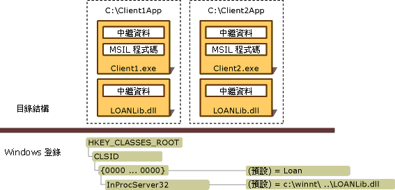

# 部署 Interop 應用程式
通常，Interop 應用程式會包括 .NET 用戶端的組件、代表各種 COM 型別程式庫的 Interop 的組件，以及一或多個已註冊 COM 元件。  Visual Studio 和 [!INCLUDE[winsdklong](../../../includes/winsdklong-md.md)] 提供了一些將型別程式庫匯入和轉換為 Interop 組件的工具，如[匯入類型程式庫做為組件](../../../docs/framework/interop/importing-a-type-library-as-an-assembly.md)中所述。  有兩種方式可部署 Interop 應用程式：  
  
-   使用內嵌 Interop 型別：以 [!INCLUDE[net_v40_long](../../../includes/net-v40-long-md.md)]開始，您可以指示編譯器將 Interop 組件的型別資訊內嵌至可執行檔中。  編譯器只會內嵌應用程式使用的型別資訊。  您不一定要隨應用程式一起部署 Interop 組件。  這是建議使用的技巧。  
  
-   部署 Interop 組件：您可以建立 Interop 組件的標準參考。  在這種情況下，Interop 組件必須隨您的應用程式一起部署。  如果您使用此方法，而且並未使用私密 COM 元件，請務必參考要併入 Managed 程式碼之 COM 元件作者所發行的主要 Interop 組件 \(PIA\)。  如需產生和使用主要 Interop 組件的詳細資訊，請參閱[主要 Interop 組件](http://msdn.microsoft.com/zh-tw/b977a8be-59a0-40a0-a806-b11ffba5c080)。  
  
 如果您使用內嵌 Interop 型別，則部署簡單而直接。  沒有需要執行的特別操作。  本文的其餘部分說明與應用程式一起部署 Interop 組件的情節。  
  
## 部署 Interop 組件  
 組件可以具有強式名稱 \(Strong Name\)。  強式名稱的組件包括了提供唯一識別 \(Identity\) 的發行者公開金鑰 \(Public Key\)。  由[型別程式庫匯入工具 \(Tlbimp.exe\)](../../../docs/framework/tools/tlbimp-exe-type-library-importer.md) 產生的組件，可以由發行者使用 **\/keyfile** 選項加以簽署。  您可以將簽名的組件安裝到全域組件快取中。  未簽名的組件必須安裝到使用者的電腦上做為私用組件。  
  
### 私用組件  
 若要安裝以私用方式使用的組件，則應用程式可執行檔和含有匯入 COM 型別的 Interop 組件兩者都必須安裝在同一個目錄結構中。  下圖顯示了要在不同應用程式目錄中，由 Client1.exe 和 Client2.exe 以私用方式使用的未簽名 Interop 組件。  在這個範例中，會將名稱為 LOANLib.dll 的 Interop 組件安裝兩次。  
  
   
私用部署的目錄結構和登錄項目  
  
 與這個應用程式關聯的所有 COM 元件必須安裝在 Windows 登錄中。  如果圖中的 Client1.exe 和 Client2.exe 是安裝在不同的電腦上，那麼您必須在兩部電腦上都註冊這些 COM 元件。  
  
### 共用組件  
 由多個應用程式所共用的組件應該安裝在名為全域組件快取的集中式儲存機制內。  .NET 用戶端可以存取已簽名並且安裝在全域組件快取中的同一個 Interop 組件複本。  如需產生和使用主要 Interop 組件的詳細資訊，請參閱[主要 Interop 組件](http://msdn.microsoft.com/zh-tw/b977a8be-59a0-40a0-a806-b11ffba5c080)。  
  
## 請參閱  
 [將 COM 元件公開給 .NET Framework](../../../docs/framework/interop/exposing-com-components.md)   
 [匯入類型程式庫做為組件](../../../docs/framework/interop/importing-a-type-library-as-an-assembly.md)   
 [Using COM Types in Managed Code](http://msdn.microsoft.com/zh-tw/1a95a8ca-c8b8-4464-90b0-5ee1a1135b66)   
 [編譯 Interop 專案](../../../docs/framework/interop/compiling-an-interop-project.md)