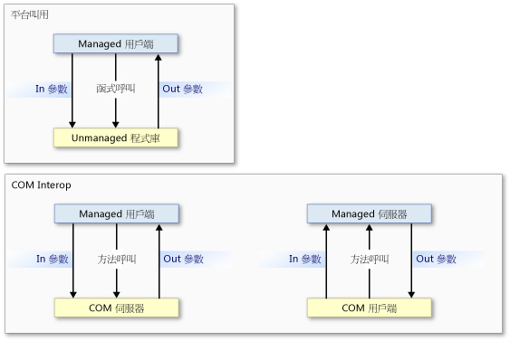
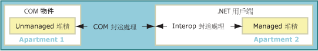
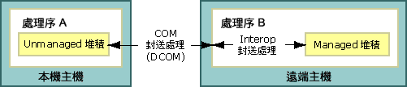
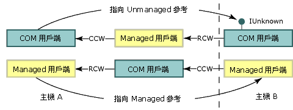

# Interop 封送處理
 Interop 封送處理會控制如何以方法引數傳遞資料，以及控制呼叫期間於 Managed 和 Unmanaged 記憶體之間的傳回值。 Interop 封送處理是由 Common Language Runtime 的封送處理服務所執行的執行階段活動。  
  
 大部分的資料類型在 Managed 和 Unmanaged 記憶體中有共通的表示。 Interop 封送處理器會為您處理這些類型。 其他類型可能模稜兩可，或根本不會在 Managed 記憶體中表示。  
  
 模稜兩可的類型不是有多個對應到單一 Managed 類型的 Unmanaged 表示，就是遺漏類型資訊 (例如陣列的大小)。 針對模稜兩可的類型，封送處理器會提供預設表示，以及替代表示 (其中有多個表示)。 您可以將有關如何封送處理模稜兩可類型的明確指示，提供給封送處理器。  
  
 本概觀包含下列各節：  
  
-   [平台叫用和 COM Interop 模型](#platform_invoke_and_com_interop_models)  
  
-   [封送處理和 COM Apartment](#marshaling_and_com_apartments)  
  
-   [封送處理遠端呼叫](#marshaling_remote_calls)  
  
-   [相關主題](#related_topics)  
  
-   [參考資料](#reference)  
  
   
## 平台叫用和 COM Interop 模型  
 Common Language Runtime 提供兩種與 Unmanaged 程式碼互通的機制：  
  
-   平台叫用，可讓 Managed 程式碼呼叫 Unmanaged 程式庫所匯出的函式。  
  
-   COM Interop，可讓 Managed 程式碼透過介面與元件物件模型 (COM) 物件互動。  
  
 平台叫用和 COM Interop 都會使用 Interop 封送處理，正確地將方法引數在呼叫端和被呼叫端之間來回移動 (如有必要)。 如下圖所示，除非需要[回呼函式](../../../docs/framework/interop/callback-functions.md)，否則平台叫用方法呼叫會從 Managed 程式碼流向 Unmanaged 程式碼，但絕不會反向流回。 即使平台叫用呼叫只可以從 Managed 程式碼流向 Unmanaged 程式碼，資料還是可以當做輸入或輸出參數來進行雙向流動。 COM Interop 方法呼叫可以流向任一方向。  
  
   
平台叫用和 COM Interop 呼叫流程  
  
 這兩種機制在最低層級會使用相同的 Interop 封送處理服務，但特定資料類型只受 COM Interop 或平台叫用支援。 如需詳細資料，請參閱[預設的封送處理行為](../../../docs/framework/interop/default-marshaling-behavior.md)。  
  
 [回到頁首](#top)  
  
   
## 封送處理和 COM Apartment  
 Interop 封送處理器會在 Common Language Runtime 堆積和 Unmanaged 堆積之間封送處理資料。 當呼叫端和被呼叫端無法在相同的資料執行個體上進行操作時，就會發生封送處理。 即使呼叫端和被呼叫端擁有其自己的資料複本，Interop 封送處理器還是可以讓呼叫端和被呼叫端在相同的資料上進行操作。  
  
 COM 也有一個封送處理器，可在不同的 COM Apartment 或不同的 COM 處理序之間封送處理資料。 在相同 COM Apartment 中的 Managed 和 Unmanaged 程式碼之間呼叫時，只需要 Interop 封送處理器。 在不同 COM Apartment 或不同處理序中的 Managed 程式碼和 Unmanaged 程式碼之間呼叫時，則同時需要 Interop 封送處理器和 COM 封送處理器。  
  
### COM 用戶端和 Managed 伺服器  
 具有 [Regasm.exe (組件註冊工具)](../../../docs/framework/tools/regasm-exe-assembly-registration-tool.md) 所註冊之類型程式庫的已匯出 Managed 伺服器，會將 `ThreadingModel` 登錄項目設定為 `Both`。 這個值表示伺服器可在單一執行緒 Apartment (STA) 或多執行緒 Apartment (MTA) 中啟動。 伺服器物件是在與其呼叫端相同的 Apartment 中所建立，如下表所示。  
  
|COM 用戶端|.NET 伺服器|封送處理需求|  
|----------------|-----------------|-----------------------------|  
|STA|`Both` 變成 STA。|相同 Apartment 封送處理。|  
|MTA|`Both` 變成 MTA。|相同 Apartment 封送處理。|  
  
 由於用戶端和伺服器位於相同的 Apartment 中，因此 Interop 封送處理服務會自動處理所有資料封送處理。 下圖顯示 Interop 封送處理服務在相同 COM 樣式 Apartment 內的 Managed 和 Unmanaged 堆積之間進行操作。  
  
   
相同 Apartment 封送處理流程  
  
 如果您打算匯出 Managed 伺服器，請注意 COM 用戶端會決定伺服器的 Apartment。 由 MTA 中初始化的 COM 用戶端所呼叫的 Managed 伺服器必須確保執行緒安全。  
  
### Managed 用戶端和 COM 伺服器  
 Managed 用戶端 Apartment 的預設值為 MTA；不過，.NET 用戶端的應用程式類型可以變更預設值。 例如，[!INCLUDE[vbprvblong](../../../includes/vbprvblong-md.md)] 用戶端 Apartment 設定為 STA。 您可以使用 <xref:System.STAThreadAttribute?displayProperty=nameWithType>、<xref:System.MTAThreadAttribute?displayProperty=nameWithType>、<xref:System.Threading.Thread.ApartmentState%2A?displayProperty=nameWithType> 屬性或 <xref:System.Web.UI.Page.AspCompatMode%2A?displayProperty=nameWithType> 屬性，來檢查及變更 Managed 用戶端的 Apartment 設定。  
  
 元件作者會設定 COM 伺服器的執行緒相似性。 下表顯示 .NET 用戶端和 COM 伺服器的 Apartment 設定組合， 並顯示組合所產生的封送處理需求。  
  
|.NET 用戶端|COM 伺服器|封送處理需求|  
|-----------------|----------------|-----------------------------|  
|MTA (預設值)|MTA   STA|Interop 封送處理。   Interop 和 COM 封送處理。|  
|STA|MTA   STA|Interop 和 COM 封送處理。   Interop 封送處理。|  
  
 當 Managed 用戶端和 Unmnaged 伺服器位於相同的 Apartment 中時，Interop 封送處理服務會處理所有資料封送處理。 不過，當用戶端和伺服器在不同的 Apartment 中初始化時，還需要 COM 封送處理。 下圖顯示跨 Apartment 呼叫的項目。  
  
   
.NET 用戶端和 COM 物件之間的跨 Apartment 呼叫  
  
 針對跨 Apartment 封送處理，您可以執行下列動作：  
  
-   接受跨 Apartment 封送處理的額外負荷，只有在許多呼叫跨界限時才會很明顯。 您必須註冊 COM 元件的類型程式庫，呼叫才能成功跨 Apartment 界限。  
  
-   將用戶端執行緒設定為 STA 或 MTA 來變更主執行緒。 例如，如果您的 C# 用戶端呼叫許多 STA COM 元件，您可以將主執行緒設定為 STA，以避免跨 Apartment 封送處理。  
  
    > [!NOTE]
    >  將 C# 用戶端的執行緒設定為 STA 之後，對 MTA COM 元件的呼叫會需要跨 Apartment 封送處理。  
  
 如需明確選取 Apartment 模型的指示，請參閱 [Managed 和 Unmanaged 執行緒處理](http://msdn.microsoft.com/en-us/db425c20-4b2f-4433-bf96-76071c7881e5)。  
  
 [回到頁首](#top)  
  
   
## 封送處理遠端呼叫  
 如同跨 Apartment 封送處理，當物件位於不同的處理序時，在 Managed 和 Unmanaged 程式碼之間的每一個呼叫都需要 COM 封送處理。 例如：  
  
-   在遠端主機上叫用 Managed 伺服器的 COM 用戶端會使用分散式 COM (DCOM)。  
  
-   在遠端主機上叫用 COM 伺服器的 Managed 用戶端會使用 DCOM。  
  
 下圖顯示 Interop 封送處理和 COM 封送處理如何跨處理序和主機界限提供通訊通道。  
  
   
跨處理序封送處理  
  
### 保留識別  
 Common Language Runtime 會保留 Managed 和 Unmanaged 參考的識別。 下圖顯示跨處理序和主機界限的直接 Unmanaged 參考 (上方列) 和直接 Managed 參考 (下方列) 的流程。  
  
   
跨處理序和主機界限傳遞的參考  
  
 在本圖中：  
  
-   Unmanaged 用戶端會從 Managed 物件取得 COM 物件的參考 (Managed 物件會從遠端主機取得這個參考)。 遠端處理機制是 DCOM。  
  
-   Managed 用戶端會從 COM 物件取得 Managed 物件的參考 (COM 物件會從遠端主機取得這個參考)。 遠端處理機制是 DCOM。  
  
    > [!NOTE]
    >  必須註冊 Managed 伺服器的匯出類型程式庫。  
  
 呼叫端和被呼叫端之間的處理序界限數目並不相關；同處理序和跨處理序呼叫會有相同的直接參考。  
  
### Managed 遠端處理  
 執行階段也會提供 Managed 遠端處理，可供您用來建立跨處理序和主機界限的 Managed 物件之間的通訊通道。 Managed 遠端處理可以提供通訊元件之間的防火牆，如下圖所示。  
  
   
使用 SOAP 或 TcpChannel 類別跨防火牆進行遠端呼叫  
  
 某些 Unmanaged 呼叫可以透過 SOAP 進行傳送，例如 [Serviced 元件](http://msdn.microsoft.com/en-us/f109ee24-81ad-4d99-9892-51ac6f34978c)和 COM 之間的呼叫。  
  
 [回到頁首](#top)  
  
   
## 相關主題  
  
|標題|描述|  
|-----------|-----------------|  
|[預設的封送處理行為](../../../docs/framework/interop/default-marshaling-behavior.md)|描述 Interop 封送處理服務用來封送處理資料的規則。|  
|[使用平台叫用封送處理資料](../../../docs/framework/interop/marshaling-data-with-platform-invoke.md)|描述如何宣告方法參數，以及將引數傳遞給 Unmanaged 程式庫所匯出的函式。|  
|[使用 COM Interop 封送處理資料](../../../docs/framework/interop/marshaling-data-with-com-interop.md)|描述如何自訂 COM 包裝函式來變更封送處理行為。|  
|[如何：將 Managed 程式碼 DCOM 移轉至 WCF](../../../docs/framework/interop/how-to-migrate-managed-code-dcom-to-wcf.md)|描述如何從 DCOM 移轉至 WCF。|  
|[操作說明：對應 HRESULT 和例外狀況](../../../docs/framework/interop/how-to-map-hresults-and-exceptions.md)|描述如何將自訂例外狀況對應到 HRESULT，並提供每一個 HRESULT 與其在 .NET Framework 中可比較的例外狀況類別之完整對應。|  
|[使用泛型型別互通](http://msdn.microsoft.com/en-us/26b88e03-085b-4b53-94ba-a5a9c709ce58)|描述使用泛型類型來取得 COM 互通性時所支援的動作。|  
|[與 Unmanaged 程式碼互通](../../../docs/framework/interop/index.md)|描述 Common Language Runtime 提供的互通性服務。|  
|[進階 COM 互通性](http://msdn.microsoft.com/en-us/3ada36e5-2390-4d70-b490-6ad8de92f2fb)|提供有關將 COM 元件納入 .NET Framework 應用程式的詳細資訊連結。|  
|[交互操作的設計考量](http://msdn.microsoft.com/en-us/b59637f6-fe35-40d6-ae72-901e7a707689)|提供撰寫整合式 COM 元件的秘訣。|  
  
 [回到頁首](#top)  
  
   
## 參考資料  
 <xref:System.Runtime.InteropServices?displayProperty=nameWithType>  
  
 [回到頁首](#top)
