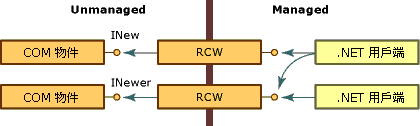
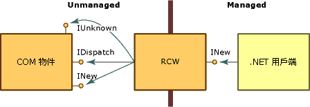

# 執行階段可呼叫包裝函式
Common Language Runtime 會透過名為執行階段可呼叫包裝函式 (RCW) 的 Proxy 來公開 COM 物件。 雖然 RCW 對 .NET 用戶端似乎是個普通物件，但其主要功能是在 .NET 用戶端與 COM 物件之間封送處理呼叫。  
  
 不論 COM 物件上存在著多少參考，執行階段都會針對每個 COM 物件各建立一個 RCW。 執行階段會針對每個物件的每個處理序各維護一個 RCW。  如果您在一個應用程式定義域或 Apartment 中建立 RCW，然後將參考傳遞至另一個應用程式定義域或 Apartment，將會使用第一個物件的 Proxy。  如下圖所示，任何數目的 Managed 用戶端都可以保存公開 INew 和 INewer 介面之 COM 物件的參考。  
  
   
透過執行階段可呼叫包裝函式來存取 COM 物件  
  
 使用衍生自類型程式庫的中繼資料，執行階段可以建立所呼叫的 COM 物件，以及該物件的包裝函式。 每個 RCW 都會在其包裝的 COM 物件上維護介面指標的快取，當不再需要 RCW 時，就會在 COM 物件上釋出其參考。 執行階段會在 RCW 上執行記憶體回收。  
  
 RCW 有許多活動，其中包括代表所包裝的物件，在 Managed 與 Unmanaged 程式碼之間封送處理資料。 具體來說，每當用戶端與伺服器之間，有不同表示方式的資料要傳遞時，RCW 就會針對方法引數和方法傳回值提供封送處理。  
  
 標準包裝函式會強制執行內建的封送處理規則。 例如，當 .NET 用戶端將字串類型當做引數的一部分傳遞至 Unmanaged 物件時，包裝函式會將字串轉換成 BSTR 類型。 如果 COM 物件將 BSTR 傳回至其 Managed 呼叫端，該呼叫端會收到一個字串。 用戶端和伺服器都會傳送及接收其熟悉的資料。 其他類型則不需轉換。 比方說，標準包裝函式一律會在 Managed 與 Unmanaged 程式碼之間傳遞 4 位元組的整數，而不會轉換類型。  
  
## 封送處理選取的介面  
 [執行階段可呼叫包裝函式](runtime-callable-wrapper.md) (RCW) 的主要目標，是要隱藏 Managed 與 Unmanaged 程式設計模型之間的差異。 為了建立無縫轉換，RCW 會使用所選取的 COM 介面，而不會將其公開給 .NET 用戶端，如下圖所示。  
  
   
COM 介面與執行階段可呼叫包裝函式  
  
 當 RCW 建立為早期繫結物件時，其為特定類型。 它會實作 COM 物件實作的介面，並從物件的介面公開方法、屬性和事件。 在圖例中，RCW 公開 INew 介面，但使用 **IUnknown** 和 **IDispatch** 介面。 此外，RCW 也向 .NET 用戶端公開 INew 介面的所有成員。  
  
 RCW 使用下表中列出的介面，其包裝的物件會公開這些介面。  
  
|介面|說明|  
|---------------|-----------------|  
|**IDispatch**|適用於透過反映，晚期繫結至 COM 物件。|  
|**IErrorInfo**|提供錯誤的文字描述、其來源、說明檔、說明內容，以及定義錯誤之介面的 GUID (.NET 類別一律為 **GUID_NULL**)。|  
|**IProvideClassInfo**|如果所包裝的 COM 物件實作 **IProvideClassInfo**，RCW 會從這個介面擷取類型資訊，以提供更好的類型身分識別。|  
|**IUnknown**|針對物件識別、強制型轉和存留期管理：   -   物件身分識別      執行階段會比較每個物件的 **IUnknown** 介面值，以區別 COM 物件。 -   類型強制型轉      RCW 會辨識 **QueryInterface** 方法所執行的動態類型探索。 -   存留期管理      使用 **QueryInterface** 方法，RCW 可以取得並保存 Unmanaged 物件的參考，直到執行階段在包裝函式上執行記憶體回收，這會釋放 Unmanaged 物件。|  
  
 RCW 會選擇性使用下表列出的介面，其包裝的物件會公開這些介面。  
  
|介面|說明|  
|---------------|-----------------|  
|**IConnectionPoint** 和 **IConnectionPointContainer**|RCW 會將公開連接點事件樣式的物件，轉換成委派架構的事件。|  
|**IDispatchEx**|如果類別實作 **IDispatchEx**，RCW 就會實作 **IExpando**。 **IDispatchEx** 介面是 **IDispatch** 介面的延伸，它不同於 **IDispatch**，可進行成員的列舉、新增、刪除和區分大小寫呼叫。|  
|**IEnumVARIANT**|可讓支援列舉的 COM 類型被視為集合來處理。|  
  
## 另請參閱
- [COM 包裝函式](com-wrappers.md)
- [封送處理選取的介面](https://msdn.microsoft.com/library/fdb97fd0-f694-4832-bf15-a4e7cf413840(v=vs.100))
- [COM 可呼叫包裝函式](com-callable-wrapper.md)
- [型別程式庫至組件轉換的摘要](https://msdn.microsoft.com/library/bf3f90c5-4770-4ab8-895c-3ba1055cc958(v=vs.100))
- [匯入類型程式庫做為組件](importing-a-type-library-as-an-assembly.md)
