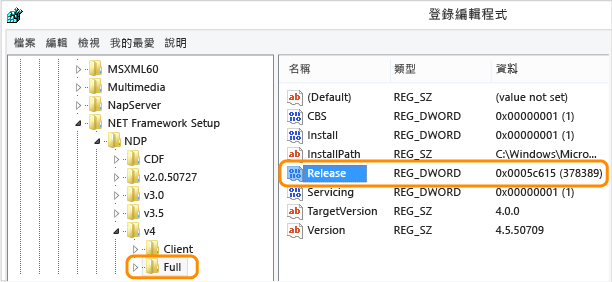

# 如何：判斷安裝的 .NET Framework 版本
使用者可以在電腦上安裝及執行多個版本的 .NET Framework。 當您開發或部署應用程式時，您可能需要知道使用者電腦上安裝的 .NET Framework 版本。 請注意，.NET Framework 包含兩個主要元件，這兩個元件的版本控制會分開處理：  
  
-   組件集合，這是為應用程式提供功能的類型與資源集合。 .NET Framework 和組件會共用相同的版本號碼。  
  
-   通用語言執行平台 \(CLR\)，負責管理和執行應用程式的程式碼。 CLR 是透過自己的版本號碼加以識別 \(請參閱 [版本和相依性](../../../docs/framework/migration-guide/versions-and-dependencies.md)\)。  
  
 若要取得電腦上安裝之 .NET Framework 版本的正確清單，您可以檢視登錄或查詢程式碼中的登錄：  
  
 [檢視登錄 \(1\-4 版\)](#net_a)  
[檢視登錄 \(4.5 版及更新版本\)](#net_b)  
[使用程式碼查詢登錄 \(1\-4 版\)](#net_c)  
[使用程式碼查詢登錄 \(4.5 版及更新版本\)](#net_d)  
  
 若要尋找 CLR 版本，您可以使用工具或程式碼：  
  
 [使用 Clrver 工具](#clr_a)  
[使用程式碼查詢 System.Environment 類別](#clr_b)  
  
 如需偵測每一版 .NET Framework 已安裝之更新的相關資訊，請參閱[如何：判斷安裝的 .NET Framework 更新](../../../docs/framework/migration-guide/how-to-determine-which-net-framework-updates-are-installed.md)。 如需安裝 .NET Framework 的詳細資訊，請參閱[安裝指南](../../../docs/framework/install/guide-for-developers.md)。  
  
<a name="net_a"></a>   
#### 藉由檢視登錄尋找 .NET Framework 版本 \(.NET Framework 1\-4\)  
  
1.  在 \[開始\] 功能表中選擇 \[執行\]。  
  
2.  在 \[開啟\] 方塊中輸入 **regedit.exe**。  
  
     您必須具有系統管理認證才能執行 regedit.exe。  
  
3.  在 \[登錄編輯程式\] 中，開啟下列子機碼：  
  
     `HKEY_LOCAL_MACHINE\SOFTWARE\Microsoft\NET Framework Setup\NDP`  
  
     安裝的版本會在 \[NDP\] 子機碼底下列出。 版本號碼是儲存在 \[Version\] 項目中。 在 [!INCLUDE[net_v40_long](../../../includes/net-v40-long-md.md)] 中，\[Version\] 項目位於 \[Client\] 或 \[Full\] 子機碼底下 \(在 \[NDP\] 底下\)，或是同時在這兩個子機碼底下。  
  
    > [!NOTE]
    >  登錄中的 \[NET Framework Setup\] 資料夾不是以英文句號開頭。  
  
<a name="net_b"></a>   
#### 藉由檢視登錄尋找 .NET Framework 版本 \(.NET Framework 4.5 及更新版本\)  
  
1.  在 \[開始\] 功能表中選擇 \[執行\]。  
  
2.  在 \[開啟\] 方塊中輸入 **regedit.exe**。  
  
     您必須具有系統管理認證才能執行 regedit.exe。  
  
3.  在 \[登錄編輯程式\] 中，開啟下列子機碼：  
  
     `HKEY_LOCAL_MACHINE\SOFTWARE\Microsoft\NET Framework Setup\NDP\v4\Full`  
  
     請注意，路徑 `Full` 子機碼包含子機碼 `Net Framework` 而非`.NET Framework`。  
  
    > [!NOTE]
    >  如果 `Full` 子機碼不存在，則您未安裝 .NET Framework 4.5 或更新版本。  
  
     檢查名為 `Release` 的 DWORD 值。`Release` DWORD 存在即表示 [!INCLUDE[net_v45](../../../includes/net-v45-md.md)] 或更新版本已安娤在該電腦上。  
  
       
  
     `Release` DWORD 的值表示安裝的 .NET Framework 版本。  
  
    |Release DWORD 的值|版本|  
    |----------------------|--------|  
    |378389|.NET Framework 4.5|  
    |378675|隨 Windows 8.1 或 Windows Server 2012 R2 安裝的 .NET Framework 4.5.1|  
    |378758|Windows 8、Windows 7 SP1 或 Windows Vista SP2 上安裝的 .NET Framework 4.5.1|  
    |379893|.NET Framework 4.5.2|  
    |Windows 10 系統：393295<br /><br /> 所有其他作業系統版本：393297|[!INCLUDE[net_v46](../../../includes/net-v46-md.md)]|  
    |Windows 10 11 月更新系統：394254<br /><br /> 所有其他作業系統版本：394271|[!INCLUDE[net_v461](../../../includes/net-v461-md.md)]|  
  
<a name="net_c"></a>   
#### 藉由查詢程式碼中的登錄尋找 .NET Framework 版本 \(.NET Framework 1\-4\)  
  
-   使用 <xref:Microsoft.Win32.RegistryKey?displayProperty=fullName> 類別存取 Windows 登錄中，HKEY\_LOCAL\_MACHINE 底下的 Software\\Microsoft\\NET Framework Setup\\NDP\\ 子機碼。  
  
     下列程式碼將示範此查詢的範例。  
  
    > [!NOTE]
    >  這個程式碼不會顯示如何偵測 [!INCLUDE[net_v45](../../../includes/net-v45-md.md)] 或更新版本。 檢查 `Release` DWORD 即可偵測這些版本，如上一節所述。  
  
     [!code-csharp[ListVersions#0](../../../samples/snippets/csharp/VS_Snippets_CLR/listversions/cs/program.cs#0)]
     [!code-vb[ListVersions#0](../../../samples/snippets/visualbasic/VS_Snippets_CLR/listversions/vb/program.vb#0)]  
    [!code-csharp[ListVersions#1](../../../samples/snippets/csharp/VS_Snippets_CLR/listversions/cs/program.cs#1)]
    [!code-vb[ListVersions#1](../../../samples/snippets/visualbasic/VS_Snippets_CLR/listversions/vb/program.vb#1)]  
  
     這個範例產生的輸出類似下面所述：  
  
    ```  
  
    v2.0.50727  2.0.50727.4016  SP2 v3.0  3.0.30729.4037  SP2 v3.5  3.5.30729.01  SP1 v4 Client  4.0.30319 Full  4.0.30319  
    ```  
  
<a name="net_d"></a>   
#### 藉由查詢程式碼中的登錄尋找 .NET Framework 版本 \(.NET Framework 4.5 及更新版本\)  
  
1.  `Release` DWORD 存在即表示電腦上已安裝 .NET Framework 4.5 或更新版本。 關鍵字的值表示已安裝的版本。 若要檢查此關鍵字，請使用 <xref:Microsoft.Win32.RegistryKey?displayProperty=fullName> 類別的 <xref:Microsoft.Win32.RegistryKey.OpenBaseKey%2A> 和 <xref:Microsoft.Win32.RegistryKey.OpenSubKey%2A> 方法，存取 Windows 登錄中 HKEY\_LOCAL\_MACHINE 底下的 Software\\Microsoft\\NET Framework Setup\\NDP\\v4\\Full 子機碼。  
  
2.  檢查 `Release` 關鍵字的值，判斷已安裝的版本。 若要向前相容，您可以檢查大於或等於表格中所列值的值。 以下是 .NET Framework 版本及相關聯的 `Release` 關鍵字。  
  
    |版本|Release DWORD 的值|  
    |--------|----------------------|  
    |.NET Framework 4.5|378389|  
    |隨 Windows 8.1 安裝的 .NET Framework 4.5.1|378675|  
    |Windows 8、Windows 7 SP1 或 Windows Vista SP2 上安裝的 .NET Framework 4.5.1|378758|  
    |.NET Framework 4.5.2|379893|  
    |隨 Windows 8.1 安裝的 [!INCLUDE[net_v46](../../../includes/net-v46-md.md)]|393295|  
    |所有其他 Windows 作業系統版本上安裝的 [!INCLUDE[net_v46](../../../includes/net-v46-md.md)]|393297|  
    |[!INCLUDE[net_v461](../../../includes/net-v461-md.md)] 安裝在 Windows 10|394254|  
    |所有其他 Windows 作業系統版本上安裝的 [!INCLUDE[net_v461](../../../includes/net-v461-md.md)]|394271|  
  
     以下是檢查大於或等於每個版本之發行關鍵字值的範例：  
  
     [!code-csharp[ListVersions#0](../../../samples/snippets/csharp/VS_Snippets_CLR/listversions/cs/program.cs#0)]
     [!code-vb[ListVersions#0](../../../samples/snippets/visualbasic/VS_Snippets_CLR/listversions/vb/program.vb#0)]  
    [!code-csharp[ListVersions#3](../../../samples/snippets/csharp/VS_Snippets_CLR/listversions/cs/program.cs#3)]
    [!code-vb[ListVersions#3](../../../samples/snippets/visualbasic/VS_Snippets_CLR/listversions/vb/program.vb#3)]  
    [!code-csharp[ListVersions#4](../../../samples/snippets/csharp/VS_Snippets_CLR/listversions/cs/program.cs#4)]
    [!code-vb[ListVersions#4](../../../samples/snippets/visualbasic/VS_Snippets_CLR/listversions/vb/program.vb#4)]  
  
     這個範例產生的輸出類似下面所述：  
  
    ```  
    Version: 4.5.1 or later  
    ```  
  
<a name="clr_a"></a>   
#### 使用 Clrver 工具尋找目前的執行階段版本  
  
-   使用 CLR 版本工具 \(Clrver.exe\) 判斷電腦上安裝了哪些通用語言執行平台 \(CLR\) 版本。  
  
     在 Visual Studio 命令提示字元中輸入 `clrver`。 這個命令產生的輸出類似下面所述：  
  
    ```  
    Versions installed on the machine: v2.0.50727 v4.0.30319  
    ```  
  
     如需使用這項工具的詳細資訊，請參閱 [Clrver.exe \(CLR Version Tool\)](../../../docs/framework/tools/clrver-exe-clr-version-tool.md)。  
  
<a name="clr_b"></a>   
#### 若要藉由查詢程式碼中的 Environment 類別尋找目前的執行階段版本  
  
-   查詢 <xref:System.Environment.Version%2A?displayProperty=fullName> 屬性，以擷取可識別目前執行程式碼的執行階段版本的 <xref:System.Version>。 您可以使用 <xref:System.Version.Major%2A?displayProperty=fullName> 屬性取得主要版本識別項 \(例如，"4" 代表 4.0 版\)，使用 <xref:System.Version.Minor%2A?displayProperty=fullName> 屬性取得次要版本識別項 \(例如，"0" 代表 4.0 版\)，或者使用 <xref:System.Object.ToString%2A?displayProperty=fullName> 方法取得整個版本字串 \(例如 "4.0.30319.18010"，如下列程式碼所示\)。 這個屬性會傳回單一值，反映出目前執行程式碼的執行階段版本，但是不會傳回電腦上可能已安裝的組件版本或其他執行階段版本。  
  
     針對 .NET Framework 4、4.5、4.5.1 和 4.5.2 版，<xref:System.Environment.Version%2A?displayProperty=fullName> 屬性會傳回 <xref:System.Version> 物件，其字串表示的格式為 `4.0.30319.xxxxx`。 針對 [!INCLUDE[net_v46](../../../includes/net-v46-md.md)]，其形式如下：`4.0.30319.42000`。  
  
     以下是查詢 <xref:System.Environment.Version%2A?displayProperty=fullName> 屬性取得執行階段版本資訊的範例：  
  
     [!code-csharp[ListVersions#0](../../../samples/snippets/csharp/VS_Snippets_CLR/listversions/cs/program.cs#0)]
     [!code-vb[ListVersions#0](../../../samples/snippets/visualbasic/VS_Snippets_CLR/listversions/vb/program.vb#0)]  
    [!code-csharp[ListVersions#2](../../../samples/snippets/csharp/VS_Snippets_CLR/listversions/cs/program.cs#2)]
    [!code-vb[ListVersions#2](../../../samples/snippets/visualbasic/VS_Snippets_CLR/listversions/vb/program.vb#2)]  
  
     這個範例產生的輸出類似下面所述：  
  
    ```  
    Version: 4.0.30319.18010  
    ```  
  
## 請參閱  
 [如何：判斷安裝的 .NET Framework 更新](../../../docs/framework/migration-guide/how-to-determine-which-net-framework-updates-are-installed.md)   
 [安裝指南](../../../docs/framework/install/guide-for-developers.md)   
 [版本和相依性](../../../docs/framework/migration-guide/versions-and-dependencies.md)