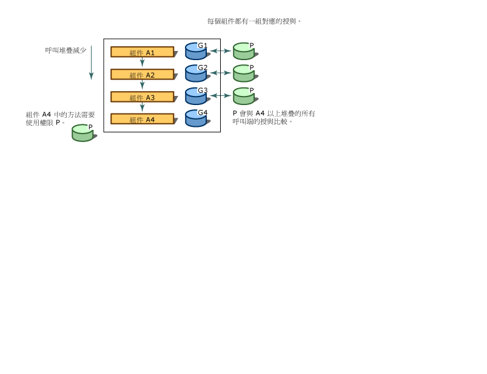

# 程式碼存取安全性
[!INCLUDE[net_security_note](../../../includes/net-security-note-md.md)]  
  
 現今高度連接的電腦系統，經常會暴露於源自各種可能未知來源的程式碼。 程式碼可以附加至電子郵件、 包含在文件，或透過網際網路下載。 不幸的是，許多電腦使用者都直接經歷過惡意行動程式碼的效應，包括病毒和蠕蟲，它們可能會損壞或摧毀資料，並造成時間和金錢上的損失。  
  
 最常見的安全性機制是根據使用者的登入認證 (通常是密碼) 來提供權限給使用者，並限制使用者可以存取的資源 (通常是目錄和檔案)。 不過，這個方法無法解決幾個問題：使用者從許多來源取得程式碼，其中有些可能不可靠；程式碼可能包含 Bug 或安全性弱點，而被惡意程式碼利用；而程式碼有時會做使用者不知道它會做的事情。 如此一來，當謹慎且值得信賴的使用者執行惡意或充滿錯誤的軟體時，就可能損害電腦系統和竊取私人資料。 大部分作業系統安全性機制都會要求每個程式碼片段必須受到完全信任才能執行，但是網頁上的指令碼可能除外。 因此，還是需要可廣泛套用的安全性機制，讓源自於一部電腦系統的程式碼，在另一個系統上執行時可以受到保護，即使系統之間沒有信任關係也一樣。  
  
 .NET Framework 提供一種名為程式碼存取安全性的安全性機制，以協助保護電腦系統免於惡意行動程式碼的傷害、允許來自未知來源的程式碼在受到防護的情況下執行，並協助防止受信任的程式碼有意或無意地危及安全性。 程式碼存取安全性依程式碼的來源和程式碼本身的其他部分，分別給與程式碼不同程度的信任等級。 程式碼存取安全性也會在程式碼上強制執行各種信任層級，這會將必須完全信任才能執行的程式碼數量降到最低。 使用程式碼存取安全性可以減少您的程式碼被惡意或充滿錯誤的程式碼誤用的可能性。 它可減少您的負擔，因為您可以指定一組允許您的程式碼執行的作業。 程式碼存取安全性也有助於減少因為您的程式碼中的安全性弱點而導致的損害。  
  
> [!NOTE]
>  [!INCLUDE[net_v40_long](../../../includes/net-v40-long-md.md)] 中的程式碼存取安全性已有重大變更。 最值得注意的變更已[安全性透明度](../../../docs/framework/misc/security-transparent-code.md)，但也有其他會影響程式碼存取安全性的重大變更。 如需這些變更的資訊，請參閱 <<c0> [ 安全性變更](../../../docs/framework/security/security-changes.md)。  
  
 程式碼存取安全性主要會影響程式庫程式碼和部分信任的應用程式。 程式庫開發人員必須保護其程式碼，不要受到部分信任應用程式的未經授權存取。 部分信任的應用程式是從外部來源 (例如網際網路) 載入的應用程式。 安裝在桌面上或近端內部網路上的應用程式是以完全信任執行。 完全信任應用程式不會影響程式碼存取安全性除非被標示為[安全性透明](../../../docs/framework/misc/security-transparent-code.md)，因為它們是完全受信任。 完全信任應用程式的唯一限制是，標示 <xref:System.Security.SecurityTransparentAttribute> 屬性的應用程式不能呼叫標示 <xref:System.Security.SecurityCriticalAttribute> 屬性的程式碼。 部分信任的應用程式必須在沙箱 (例如，在 Internet Explorer) 中執行，這樣才能套用程式碼存取安全性。 如果您從網際網路下載應用程式，並嘗試從您的桌面執行，您會收到<xref:System.NotSupportedException>訊息：「 嘗試載入組件從網路位置，這導致要沙箱化，在舊版的.NET Framework 組件。 這一版 .NET Framework 預設不會啟用 CAS 原則，所以此載入可能有危險。」 如果您確定可以信任應用程式時，您可以讓它使用可執行以完全信任[ \<loadFromRemoteSources > 項目](../../../docs/framework/configure-apps/file-schema/runtime/loadfromremotesources-element.md)。 如需在沙箱中執行的應用程式的資訊，請參閱[How to:在沙箱中執行部分信任的程式碼](../../../docs/framework/misc/how-to-run-partially-trusted-code-in-a-sandbox.md)中所述。  
  
 以 Common Language Runtime 為目標的所有 Managed 程式碼，皆受益於程式碼存取安全性，即使該程式碼沒有進行單一程式碼存取安全性呼叫也一樣。 如需詳細資訊，請參閱[程式碼存取安全性基本概念](../../../docs/framework/misc/code-access-security-basics.md)。  
  
   
## 程式碼存取安全性的主要功能  
 程式碼存取安全性有助於限制程式碼存取受保護的資源和作業。 在 .NET Framework 中，程式碼存取安全性可執行下列功能：  
  
- 定義代表存取各種系統資源之權利的權限和權限集合。  
  
- 讓程式碼得以要求其呼叫端必須具備特定的權限。  
  
- 使程式碼要求它的呼叫端處理數位簽章，而只允許特定組織或站台的呼叫端可以呼叫受保護的程式碼。  
  
- 藉由比較呼叫堆疊上授與每個呼叫端的權限與呼叫端必須具備的權限，在執行階段對程式碼強制執行限制。  
  
   
## 查核呼叫堆疊  
 為了判斷程式碼是否經授權可存取資源或執行某項作業，執行階段的安全性系統會查核呼叫堆疊，並比較每個呼叫端被授與的權限與要求的權限。 如果呼叫堆疊中的任何呼叫端沒有所要求的權限，系統就會擲回安全性例外狀況，並拒絕存取。 堆疊查核行程的設計是為了協助防止引誘攻擊，在這些攻擊中，信任度較低的程式碼會呼叫受高度信任的程式碼，並使用它來執行未經授權的動作。 在執行階段要求所有呼叫端的權限會影響效能，但這是基本的防護措施，可協助保護程式碼不會引誘信任度較低的程式碼攻擊。 為了最佳化效能，您可以讓您的程式碼執行較少堆疊查核行程；不過，您必須確認，每當您執行這項操作時，不會暴露安全性弱點。  
  
 下圖顯示當組件 A4 中的方法要求其呼叫端擁有權限 P 時，堆疊查核行程所造成的結果。  
  
   
安全性堆疊查核行程  
  
   
## 相關主題  
  
|標題|描述|  
|-----------|-----------------|  
|[程式碼存取安全性的基本概念](../../../docs/framework/misc/code-access-security-basics.md)|說明程式碼存取安全性及其最常見的用法。|  
|[安全性透明程式碼，層級 2](../../../docs/framework/misc/security-transparent-code-level-2.md)|說明 [!INCLUDE[net_v40_short](../../../includes/net-v40-short-md.md)] 中的安全性透明度模型。|  
|[從部分受信任程式碼使用程式庫](../../../docs/framework/misc/using-libraries-from-partially-trusted-code.md)|說明如何讓程式庫能夠與 Unmanaged 程式碼搭配使用，以及如何使用來自 Unmanaged 程式碼的程式庫。|  
|[重要的安全性概念](../../../docs/standard/security/key-security-concepts.md)|提供 .NET Framework 安全性系統中所使用之許多主要詞彙和概念的概觀。|  
|[以角色為基礎的安全性](../../../docs/standard/security/role-based-security.md)|說明如何依據角色來納入安全性。|  
|[The signature is valid](../../../docs/standard/security/cryptographic-services.md)|說明如何將密碼編譯納入您的應用程式中。|
