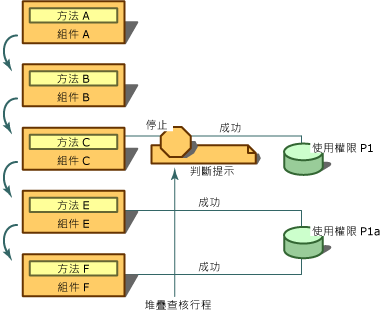

# <a name="using-the-assert-method"></a><span data-ttu-id="8b28d-102">使用 Assert 方法</span><span class="sxs-lookup"><span data-stu-id="8b28d-102">Using the Assert Method</span></span>
[!INCLUDE[net_security_note](../../../includes/net-security-note-md.md)]  
  
 <span data-ttu-id="8b28d-103"><xref:System.Security.CodeAccessPermission.Assert%2A> 是一種方法，可以在程式碼存取權限類別以及 <xref:System.Security.PermissionSet> 類別上呼叫。</span><span class="sxs-lookup"><span data-stu-id="8b28d-103"><xref:System.Security.CodeAccessPermission.Assert%2A> is a method that can be called on code access permission classes and on the <xref:System.Security.PermissionSet> class.</span></span> <span data-ttu-id="8b28d-104">您可以使用**Assert**啟用您的程式碼 （和下游的呼叫端） 來執行您的程式碼有權執行的動作，但其呼叫端可能沒有權限。</span><span class="sxs-lookup"><span data-stu-id="8b28d-104">You can use **Assert** to enable your code (and downstream callers) to perform actions that your code has permission to do but its callers might not have permission to do.</span></span> <span data-ttu-id="8b28d-105">安全性判斷提示會變更執行階段在安全性檢查期間執行的一般程序。</span><span class="sxs-lookup"><span data-stu-id="8b28d-105">A security assertion changes the normal process that the runtime performs during a security check.</span></span> <span data-ttu-id="8b28d-106">當您判斷提示權限時，它會告訴安全性系統不要檢查已判斷提示權限的程式碼呼叫端。</span><span class="sxs-lookup"><span data-stu-id="8b28d-106">When you assert a permission, it tells the security system not to check the callers of your code for the asserted permission.</span></span>  
  
> [!CAUTION]
>  <span data-ttu-id="8b28d-107">請小心使用判斷提示，因為它們可能會開啟安全性漏洞，破壞的執行階段強制執行安全性限制的機制。</span><span class="sxs-lookup"><span data-stu-id="8b28d-107">Use assertions carefully because they can open security holes and undermine the runtime's mechanism for enforcing security restrictions.</span></span>  
  
 <span data-ttu-id="8b28d-108">判斷提示適用於程式庫呼叫 Unmanaged 程式碼，或呼叫需要與程式庫預期用途不明顯相關的權限時。</span><span class="sxs-lookup"><span data-stu-id="8b28d-108">Assertions are useful in situations in which a library calls into unmanaged code or makes a call that requires a permission that is not obviously related to the library's intended use.</span></span> <span data-ttu-id="8b28d-109">例如，所有受管理的程式碼呼叫 unmanaged 程式碼必須具備**SecurityPermission**與**UnmanagedCode**指定旗標。</span><span class="sxs-lookup"><span data-stu-id="8b28d-109">For example, all managed code that calls into unmanaged code must have **SecurityPermission** with the **UnmanagedCode** flag specified.</span></span> <span data-ttu-id="8b28d-110">非來自本機電腦的程式碼，例如從近端內部網路下載的程式碼，預設不會授與此權限。</span><span class="sxs-lookup"><span data-stu-id="8b28d-110">Code that does not originate from the local computer, such as code that is downloaded from the local intranet, will not be granted this permission by default.</span></span> <span data-ttu-id="8b28d-111">因此，為了讓從近端內部網路下載的程式碼，能夠呼叫使用 Unmanaged 程式碼的程式庫，它必須具備由程式庫判斷提示的權限。</span><span class="sxs-lookup"><span data-stu-id="8b28d-111">Therefore, in order for code that is downloaded from the local intranet to be able to call a library that uses unmanaged code, it must have the permission asserted by the library.</span></span> <span data-ttu-id="8b28d-112">此外，某些程式庫可能會進行呼叫端看不到且需要特殊權限的呼叫。</span><span class="sxs-lookup"><span data-stu-id="8b28d-112">Additionally, some libraries might make calls that are unseen to callers and require special permissions.</span></span>  
  
 <span data-ttu-id="8b28d-113">您也可以在您的程式碼存取資源時完全向呼叫端隱藏的情況下使用判斷提示。</span><span class="sxs-lookup"><span data-stu-id="8b28d-113">You can also use assertions in situations in which your code accesses a resource in a way that is completely hidden from callers.</span></span> <span data-ttu-id="8b28d-114">例如，假設您的程式庫從資料庫取得資訊，但在過程中也從電腦登錄中讀取資訊。</span><span class="sxs-lookup"><span data-stu-id="8b28d-114">For example, suppose your library acquires information from a database, but in the process also reads information from the computer registry.</span></span> <span data-ttu-id="8b28d-115">使用您的程式庫的開發人員不必存取您的來源，因為它們有無從得知其程式碼需要**RegistryPermission**才能使用您的程式碼。</span><span class="sxs-lookup"><span data-stu-id="8b28d-115">Because developers using your library do not have access to your source, they have no way of knowing that their code requires **RegistryPermission** in order to use your code.</span></span> <span data-ttu-id="8b28d-116">在此情況下，如果您認為要求程式碼呼叫端必須擁有存取登錄的權限是不合理或不必要的，可以判斷提示讀取登錄的權限。</span><span class="sxs-lookup"><span data-stu-id="8b28d-116">In this case, if you decide that it is not reasonable or necessary to require that callers of your code have permission to access the registry, you can assert permission for reading the registry.</span></span> <span data-ttu-id="8b28d-117">在此情況下，便適合程式庫判斷提示權限，而不該呼叫端**RegistryPermission**可以使用程式庫。</span><span class="sxs-lookup"><span data-stu-id="8b28d-117">In this situation, it is appropriate for the library to assert the permission so that callers without **RegistryPermission** can use the library.</span></span>  
  
 <span data-ttu-id="8b28d-118">只有在已判斷提示的權限和下游呼叫端需要的權限屬於相同類型，且需要的權限是判斷提示權限的子集時，判斷提示才會影響堆疊查核行程。</span><span class="sxs-lookup"><span data-stu-id="8b28d-118">The assertion affects the stack walk only if the asserted permission and a permission demanded by a downstream caller are of the same type and if the demanded permission is a subset of the asserted permission.</span></span> <span data-ttu-id="8b28d-119">例如，如果您判斷提示**FileIOPermission**讀取 C 磁碟機，而下游需要的所有檔案進行**FileIOPermission**讀取 C:\Temp 中的檔案，判斷提示可能會影響堆疊查核行程;不過，如果是需要**FileIOPermission**以寫入 C 磁碟機，判斷提示會有任何影響。</span><span class="sxs-lookup"><span data-stu-id="8b28d-119">For example, if you assert **FileIOPermission** to read all files on the C drive, and a downstream demand is made for **FileIOPermission** to read files in C:\Temp, the assertion could affect the stack walk; however, if the demand was for **FileIOPermission** to write to the C drive, the assertion would have no effect.</span></span>  
  
 <span data-ttu-id="8b28d-120">若要執行判斷提示，您的程式碼必須同時被授與您正在判斷提示的權限，和表示進行判斷提示之權限的 <xref:System.Security.Permissions.SecurityPermission>。</span><span class="sxs-lookup"><span data-stu-id="8b28d-120">To perform assertions, your code must be granted both the permission you are asserting and the <xref:System.Security.Permissions.SecurityPermission> that represents the right to make assertions.</span></span> <span data-ttu-id="8b28d-121">雖然您可以判斷提示您的程式碼尚未被授與的權限，但判斷提示會毫無意義，因為安全性檢查會在判斷提示可能導致它成功之前就先失敗。</span><span class="sxs-lookup"><span data-stu-id="8b28d-121">Although you could assert a permission that your code has not been granted, the assertion would be pointless because the security check would fail before the assertion could cause it to succeed.</span></span>  
  
 <span data-ttu-id="8b28d-122">下圖顯示當您使用時，會發生什麼事**Assert**。</span><span class="sxs-lookup"><span data-stu-id="8b28d-122">The following illustration shows what happens when you use **Assert**.</span></span> <span data-ttu-id="8b28d-123">假設以下有關組件 A、B、C、E 和 F，以及 P1 和 P1A 兩個權限的陳述成立：</span><span class="sxs-lookup"><span data-stu-id="8b28d-123">Assume that the following statements are true about assemblies A, B, C, E, and F, and two permissions, P1 and P1A:</span></span>  
  
-   <span data-ttu-id="8b28d-124">P1A 代表讀取 C 磁碟機上 .txt 檔案的權限。</span><span class="sxs-lookup"><span data-stu-id="8b28d-124">P1A represents the right to read .txt files on the C drive.</span></span>  
  
-   <span data-ttu-id="8b28d-125">P1 代表讀取 C 磁碟機上所有檔案的權限。</span><span class="sxs-lookup"><span data-stu-id="8b28d-125">P1 represents the right to read all files on the C drive.</span></span>  
  
-   <span data-ttu-id="8b28d-126">P1A 和 P1 都**FileIOPermission**類型，且 P1A 為 P1 的子集。</span><span class="sxs-lookup"><span data-stu-id="8b28d-126">P1A and P1 are both **FileIOPermission** types, and P1A is a subset of P1.</span></span>  
  
-   <span data-ttu-id="8b28d-127">組件 E 和 F 已被授與 P1A 權限。</span><span class="sxs-lookup"><span data-stu-id="8b28d-127">Assemblies E and F have been granted P1A permission.</span></span>  
  
-   <span data-ttu-id="8b28d-128">組件 C 已被授與 P1 權限。</span><span class="sxs-lookup"><span data-stu-id="8b28d-128">Assembly C has been granted P1 permission.</span></span>  
  
-   <span data-ttu-id="8b28d-129">組件 A 和 B 未被授與 P1 或 P1A 權限。</span><span class="sxs-lookup"><span data-stu-id="8b28d-129">Assemblies A and B have been granted neither P1 nor P1A permissions.</span></span>  
  
-   <span data-ttu-id="8b28d-130">方法 A 包含在組件 A 中，方法 B 包含在組件 B 中，依此類推。</span><span class="sxs-lookup"><span data-stu-id="8b28d-130">Method A is contained in assembly A, method B is contained in assembly B, and so on.</span></span>  
  
 <span data-ttu-id="8b28d-131"></span><span class="sxs-lookup"><span data-stu-id="8b28d-131"></span></span>  
<span data-ttu-id="8b28d-132">使用判斷提示</span><span class="sxs-lookup"><span data-stu-id="8b28d-132">Using Assert</span></span>  
  
 <span data-ttu-id="8b28d-133">這個案例中，方法 A 呼叫 B、 B 呼叫 C、 C 呼叫 E，與 E 呼叫 f 方法 C 判斷提示讀取 C 磁碟機 （權限 P1），檔案的權限讀取 C 磁碟機 （權限 P1A） 上的.txt 檔案的方法 E 要求權限。</span><span class="sxs-lookup"><span data-stu-id="8b28d-133">In this scenario, method A calls B, B calls C, C calls E, and E calls F. Method C asserts permission to read files on the C drive (permission P1), and method E demands permission to read .txt files on the C drive (permission P1A).</span></span> <span data-ttu-id="8b28d-134">在執行階段遇到 F 中的需求時，堆疊查核行程，檢查 F 所有呼叫端的權限執行開頭 E E 已授與 P1A 權限，因此堆疊查核行程繼續檢查的 C，發現 C 的判斷提示的位置的權限。</span><span class="sxs-lookup"><span data-stu-id="8b28d-134">When the demand in F is encountered at run time, a stack walk is performed to check the permissions of all callers of F, starting with E. E has been granted P1A permission, so the stack walk proceeds to examine the permissions of C, where C's assertion is discovered.</span></span> <span data-ttu-id="8b28d-135">因為需要的權限 (P1A) 是判斷提示權限 (P1) 的子集，堆疊查核行程會停止，且安全性檢查會自動成功。</span><span class="sxs-lookup"><span data-stu-id="8b28d-135">Because the demanded permission (P1A) is a subset of the asserted permission (P1), the stack walk stops and the security check automatically succeeds.</span></span> <span data-ttu-id="8b28d-136">組件 A 和 B 未被授與權限 P1A 並不重要。</span><span class="sxs-lookup"><span data-stu-id="8b28d-136">It does not matter that assemblies A and B have not been granted permission P1A.</span></span> <span data-ttu-id="8b28d-137">藉由判斷提示 P1，C 方法可確保其呼叫者可以存取 P1 保護的資源，即使呼叫端未獲得存取該資源的權限亦然。</span><span class="sxs-lookup"><span data-stu-id="8b28d-137">By asserting P1, method C ensures that its callers can access the resource protected by P1, even if the callers have not been granted permission to access that resource.</span></span>  
  
 <span data-ttu-id="8b28d-138">如果您設計類別程式庫，而類別會存取受保護的資源，在大部分情況下，您應該提出安全性需求，要求類別的呼叫端具有適當的權限。</span><span class="sxs-lookup"><span data-stu-id="8b28d-138">If you design a class library and a class accesses a protected resource, you should, in most cases, make a security demand requiring that the callers of the class have the appropriate permission.</span></span> <span data-ttu-id="8b28d-139">如果類別接著執行的操作您知道其呼叫端大多不會具有權限，以及如果您願意為讓這些呼叫端呼叫您的程式碼負責，您可以判斷提示權限藉由呼叫**Assert**表示作業的權限物件上方法的程式碼正在執行。</span><span class="sxs-lookup"><span data-stu-id="8b28d-139">If the class then performs an operation for which you know most of its callers will not have permission, and if you are willing to take the responsibility for letting these callers call your code, you can assert the permission by calling the **Assert** method on a permission object that represents the operation the code is performing.</span></span> <span data-ttu-id="8b28d-140">使用**Assert**以這種方式通常無法這樣可讓呼叫端呼叫您的程式碼。</span><span class="sxs-lookup"><span data-stu-id="8b28d-140">Using **Assert** in this way lets callers that normally could not do so call your code.</span></span> <span data-ttu-id="8b28d-141">因此，如果您判斷提示權限，便務必要先執行適當的安全性檢查，以防止您的元件遭到誤用。</span><span class="sxs-lookup"><span data-stu-id="8b28d-141">Therefore, if you assert a permission, you should be sure to perform appropriate security checks beforehand to prevent your component from being misused.</span></span>  
  
 <span data-ttu-id="8b28d-142">例如，假設您受高度信任的程式庫類別具有刪除檔案的方法。</span><span class="sxs-lookup"><span data-stu-id="8b28d-142">For example, suppose your highly trusted library class has a method that deletes files.</span></span> <span data-ttu-id="8b28d-143">它會藉由呼叫 Unmanaged 的 Win32 函式來存取檔案。</span><span class="sxs-lookup"><span data-stu-id="8b28d-143">It accesses the file by calling an unmanaged Win32 function.</span></span> <span data-ttu-id="8b28d-144">呼叫端叫用您的程式碼**刪除**方法，並傳入要刪除的檔案名稱 C:\Test.txt。</span><span class="sxs-lookup"><span data-stu-id="8b28d-144">A caller invokes your code's **Delete** method, passing in the name of the file to be deleted, C:\Test.txt.</span></span> <span data-ttu-id="8b28d-145">內**刪除**方法，您的程式碼會建立<xref:System.Security.Permissions.FileIOPermission>物件，代表 C:\Test.txt 的寫入權限。</span><span class="sxs-lookup"><span data-stu-id="8b28d-145">Within the **Delete** method, your code creates a <xref:System.Security.Permissions.FileIOPermission> object representing write access to C:\Test.txt.</span></span> <span data-ttu-id="8b28d-146">(必須要有寫入權限才能刪除檔案。)您的程式碼接著會叫用命令式安全性檢查藉由呼叫**FileIOPermission**物件的**需求**方法。</span><span class="sxs-lookup"><span data-stu-id="8b28d-146">(Write access is required to delete a file.) Your code then invokes an imperative security check by calling the **FileIOPermission** object's **Demand** method.</span></span> <span data-ttu-id="8b28d-147">如果呼叫堆疊中的其中一個呼叫端沒有這個權限，就會擲回 <xref:System.Security.SecurityException>。</span><span class="sxs-lookup"><span data-stu-id="8b28d-147">If one of the callers in the call stack does not have this permission, a <xref:System.Security.SecurityException> is thrown.</span></span> <span data-ttu-id="8b28d-148">如果未擲回任何例外狀況，您便知道所有呼叫端都擁有存取 C:\Test.txt 的權限。</span><span class="sxs-lookup"><span data-stu-id="8b28d-148">If no exception is thrown, you know that all callers have the right to access C:\Test.txt.</span></span> <span data-ttu-id="8b28d-149">因為您相信大部分的呼叫端不會具有存取 unmanaged 程式碼的權限，您的程式碼接著會建立<xref:System.Security.Permissions.SecurityPermission>物件，代表呼叫 unmanaged 程式碼的權限，並呼叫物件的**Assert**方法。</span><span class="sxs-lookup"><span data-stu-id="8b28d-149">Because you believe that most of your callers will not have permission to access unmanaged code, your code then creates a <xref:System.Security.Permissions.SecurityPermission> object that represents the right to call unmanaged code and calls the object's **Assert** method.</span></span> <span data-ttu-id="8b28d-150">最後，它會呼叫 Unmanaged 的 Win32 函式，刪除 C:\Text.txt，並將控制權傳回給呼叫端。</span><span class="sxs-lookup"><span data-stu-id="8b28d-150">Finally, it calls the unmanaged Win32 function to delete C:\Text.txt and returns control to the caller.</span></span>  
  
> [!CAUTION]
>  <span data-ttu-id="8b28d-151">您必須確定您的程式碼使用判斷提示時，不會是程式碼可以供其他程式碼用來存取由您正在判斷提示之權限所保護的資源的情況。</span><span class="sxs-lookup"><span data-stu-id="8b28d-151">You must be sure that your code does not use assertions in situations where your code can be used by other code to access a resource that is protected by the permission you are asserting.</span></span> <span data-ttu-id="8b28d-152">例如，在寫入至檔案，其名稱由呼叫端做為參數指定的程式碼，您不會判斷提示**FileIOPermission**以寫入檔案，因為您的程式碼遭到第三者的誤用。</span><span class="sxs-lookup"><span data-stu-id="8b28d-152">For example, in code that writes to a file whose name is specified by the caller as a parameter, you would not assert the **FileIOPermission** for writing to files because your code would be open to misuse by a third party.</span></span>  
  
 <span data-ttu-id="8b28d-153">當您使用命令式安全性語法時，呼叫**Assert**相同方法中的多個權限的方法會導致擲回安全性例外狀況。</span><span class="sxs-lookup"><span data-stu-id="8b28d-153">When you use the imperative security syntax, calling the **Assert** method on multiple permissions in the same method causes a security exception to be thrown.</span></span> <span data-ttu-id="8b28d-154">相反地，您應該建立**PermissionSet**物件，請將它傳遞您想要叫用，然後再呼叫個別的權限**Assert**方法**PermissionSet**物件。</span><span class="sxs-lookup"><span data-stu-id="8b28d-154">Instead, you should create a **PermissionSet** object, pass it the individual permissions you want to invoke, and then call the **Assert** method on the **PermissionSet** object.</span></span> <span data-ttu-id="8b28d-155">您可以呼叫**Assert**方法超過一次當您使用宣告式安全性語法。</span><span class="sxs-lookup"><span data-stu-id="8b28d-155">You can call the **Assert** method more than once when you use the declarative security syntax.</span></span>  
  
 <span data-ttu-id="8b28d-156">下列範例示範宣告式語法，覆寫安全性檢查使用**Assert**方法。</span><span class="sxs-lookup"><span data-stu-id="8b28d-156">The following example shows declarative syntax for overriding security checks using the **Assert** method.</span></span> <span data-ttu-id="8b28d-157">請注意， **FileIOPermissionAttribute**語法採用兩個值：<xref:System.Security.Permissions.SecurityAction>列舉型別和位置的檔案或目錄是要授與權限。</span><span class="sxs-lookup"><span data-stu-id="8b28d-157">Notice that the **FileIOPermissionAttribute** syntax takes two values: a <xref:System.Security.Permissions.SecurityAction> enumeration and the location of the file or directory to which permission is to be granted.</span></span> <span data-ttu-id="8b28d-158">呼叫**Assert**會造成需要存取`C:\Log.txt`成功，即使呼叫端不會檢查用於存取檔案的使用權限。</span><span class="sxs-lookup"><span data-stu-id="8b28d-158">The call to **Assert** causes demands for access to `C:\Log.txt` to succeed, even though callers are not checked for permission to access the file.</span></span>  
  
```vb  
Option Explicit  
Option Strict  
  
Imports System  
Imports System.IO  
Imports System.Security.Permissions  
  
Namespace LogUtil  
   Public Class Log  
      Public Sub New()  
  
      End Sub  
  
     <FileIOPermission(SecurityAction.Assert, All := "C:\Log.txt")> Public Sub   
      MakeLog()  
         Dim TextStream As New StreamWriter("C:\Log.txt")  
         TextStream.WriteLine("This  Log was created on {0}", DateTime.Now) '  
         TextStream.Close()  
      End Sub  
   End Class  
End Namespace  
```  
  
```csharp  
namespace LogUtil  
{  
   using System;  
   using System.IO;  
   using System.Security.Permissions;  
  
   public class Log  
   {  
      public Log()  
      {      
      }     
      [FileIOPermission(SecurityAction.Assert, All = @"C:\Log.txt")]  
      public void MakeLog()  
      {     
         StreamWriter TextStream = new StreamWriter(@"C:\Log.txt");  
         TextStream.WriteLine("This  Log was created on {0}", DateTime.Now);  
         TextStream.Close();  
      }  
   }  
}   
```  
  
 <span data-ttu-id="8b28d-159">下列程式碼片段顯示的命令式語法，覆寫安全性檢查使用**Assert**方法。</span><span class="sxs-lookup"><span data-stu-id="8b28d-159">The following code fragments show imperative syntax for overriding security checks using the **Assert** method.</span></span> <span data-ttu-id="8b28d-160">在此範例中，執行個體**FileIOPermission**宣告物件。</span><span class="sxs-lookup"><span data-stu-id="8b28d-160">In this example, an instance of the **FileIOPermission** object is declared.</span></span> <span data-ttu-id="8b28d-161">其建構函式會傳遞**FileIOPermissionAccess.AllAccess**以定義類型的存取權限允許，後面接著描述檔案的位置的字串。</span><span class="sxs-lookup"><span data-stu-id="8b28d-161">Its constructor is passed **FileIOPermissionAccess.AllAccess** to define the type of access allowed, followed by a string describing the file's location.</span></span> <span data-ttu-id="8b28d-162">一次**FileIOPermission**物件定義，您只需要呼叫其**Assert**方法覆寫安全性檢查。</span><span class="sxs-lookup"><span data-stu-id="8b28d-162">Once the **FileIOPermission** object is defined, you only need to call its **Assert** method to override the security check.</span></span>  
  
```vb  
Option Explicit  
Option Strict  
Imports System  
Imports System.IO  
Imports System.Security.Permissions  
Namespace LogUtil  
   Public Class Log  
      Public Sub New()  
      End Sub 'New  
  
      Public Sub MakeLog()  
         Dim FilePermission As New FileIOPermission(FileIOPermissionAccess.AllAccess, "C:\Log.txt")  
         FilePermission.Assert()  
         Dim TextStream As New StreamWriter("C:\Log.txt")  
         TextStream.WriteLine("This  Log was created on {0}", DateTime.Now)  
         TextStream.Close()  
      End Sub  
   End Class  
End Namespace  
```  
  
```csharp  
namespace LogUtil  
{  
   using System;  
   using System.IO;  
   using System.Security.Permissions;  
  
   public class Log  
   {  
      public Log()  
      {      
      }     
      public void MakeLog()  
      {  
         FileIOPermission FilePermission = new FileIOPermission(FileIOPermissionAccess.AllAccess,@"C:\Log.txt");   
         FilePermission.Assert();  
         StreamWriter TextStream = new StreamWriter(@"C:\Log.txt");  
         TextStream.WriteLine("This  Log was created on {0}", DateTime.Now);  
         TextStream.Close();  
      }  
   }  
}  
```  
  
## <a name="see-also"></a><span data-ttu-id="8b28d-163">另請參閱</span><span class="sxs-lookup"><span data-stu-id="8b28d-163">See Also</span></span>  
 <xref:System.Security.PermissionSet>  
 <xref:System.Security.Permissions.SecurityPermission>  
 <xref:System.Security.Permissions.FileIOPermission>  
 <xref:System.Security.Permissions.SecurityAction>  
 [<span data-ttu-id="8b28d-164">屬性</span><span class="sxs-lookup"><span data-stu-id="8b28d-164">Attributes</span></span>](../../../docs/standard/attributes/index.md)  
 [<span data-ttu-id="8b28d-165">程式碼存取安全性</span><span class="sxs-lookup"><span data-stu-id="8b28d-165">Code Access Security</span></span>](../../../docs/framework/misc/code-access-security.md)
