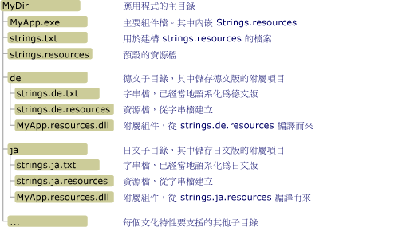

# 建立桌面應用程式的附屬組件
資源檔在當地語系化的應用程式上扮演主要角色。  如果使用者自己的語言或文化特性資源無法使用，它們可讓應用程式顯示字串、影像、其他資料使用者自己的語言、文化特性 \(Culture\) 和提供替代的資料。  .NET Framework 使用中樞和輪輻模型來尋找和擷取當地語系化的資源。  中樞為主要組件，包含無法當地語系化的可執行程式碼，以及稱為中性或預設文化特性的單一文化特性的資源。  預設文化特性為應用程式的後援文化特性;，其為當地語系化資源無法使用時使用。  您可以使用 <xref:System.Resources.NeutralResourcesLanguageAttribute> 屬性指定應用程式的預設文化特性。  各個輪輻都連接至含有單一文化特性資源 \(但不包含任何程式碼\) 的附屬組件。  因為附屬組件不是主要組件的一部分，所以您可以輕易取代或更新對應至特定文化特性的資源，而不需取代應用程式的主要組件。  
  
> [!NOTE]
>  應用程式的預設文化特性資源的附屬組件也可以儲存。  若要這麼做，您將設置 <xref:System.Resources.NeutralResourcesLanguageAttribute> 屬性 <xref:System.Resources.UltimateResourceFallbackLocation?displayProperty=fullName>的值。  
  
## 附屬組件的名稱和位置  
 中樞和輪輻模型需要您將資源置於特定位置，以便可以輕易找到並使用它們。  如果您無法編譯並命名資源般運作，或者如果您不將它們放在正確位置， Common Language Runtime 將無法找到它們和使用預設文化特性資源。  .NET Framework 資源管理員，以 <xref:System.Resources.ResourceManager> 物件來自動存取當地語系化的資源。  資源管理員需要下列項目:  
  
-   單一附屬組件必須包含特定文化特性的所有資源。  換句話說，您應該以編譯多個 .txt 或 .resx 檔案至單一二進位 .resources 檔中。  
  
-   對於每一個當地語系化文化特性，必須儲存在該文化特性資源的應用程式目錄中的個別的子目錄中。  子目錄名稱必須與文化特性名稱相同。  或者，您可以在全域組件快取儲存您的附屬組件。  在這種情況下，組件的強式名稱的文化特性資訊元件必須表示它的文化特性。\(請參閱本主題稍後的 [安裝附屬組件安裝在全域組件快取](#SN) 部分\)。  
  
    > [!NOTE]
    >  如果您的應用程式包含子文化特性的資源，請將各個子文化特性放置在應用程式目錄的子目錄下。  不要將子文化特性置於它們主要文化特性目錄的子目錄中。  
  
-   附屬組件的名稱必須與應用程式相同，而且必須使用副檔名「.resources.dll」。  例如，如果應用程式命名為 Example.exe，每個附屬組件的名稱應該是 Example.resources.dll。  請注意附屬組件名稱不表示其資源檔的文化特性。  不過，附屬組件出現在指定文化特性的目錄。  
  
-   在組件的中繼資料 \(Metadata\) 必須包含有關附屬組件的文化特性資訊。  當您在附屬組件時，使用 [組件連結器。](../../../docs/framework/tools/al-exe-assembly-linker.md) 內嵌資源要儲存文化特性名稱在附屬組件中的中繼資料，您可以指定 `/culture` 選項。  
  
 下圖說明您在[全域組件快取](../../../docs/framework/app-domains/gac.md)中沒有安裝的應用程式之範例目錄結構和位置需求。  具有 .txt 和 .resources 檔副檔名的項目不會與最終應用程式一起發行。  這些是用來建立最終附屬資源組件的中繼資源檔。  在這個範例中，您可以用 .resx 檔替代 .txt 檔。  如需詳細資訊，請參閱 [封裝和部署資源](../../../docs/framework/resources/packaging-and-deploying-resources-in-desktop-apps.md)。  
  
   
附屬組件目錄  
  
## 編譯附屬組件  
 包含資源加入至二進位 .resources 檔案的使用 [資源檔產生器 \(Resgen.exe\)](../../../docs/framework/tools/resgen-exe-resource-file-generator.md) 編譯文字檔或 XML \(.resx\) 檔案。  使用[組件連結器 \(Al.exe\)](../../../docs/framework/tools/al-exe-assembly-linker.md)，將 .resources 檔編譯成附屬組件。  Al.exe 從您指定的 .resources 檔建立組件。  附屬組件只能包含資源;它們不能包含任何可執行程式碼。  
  
 下列 Al.exe 命令建立應用程式的 `Example` 附屬組件從德文資源檔 strings.de.resources。  
  
```  
al /target:lib /embed:strings.de.resources /culture:de /out:Example.resources.dll  
```  
  
 下列 Al.exe 命令也會從檔案 strings.de.resources 為應用程式 `Example` 建立附屬組件。  **\/template** 選項讓附屬組件繼承所有組件中繼資料 \(除了其從父組件 \(Example.dll\) 的文化特性資訊。  
  
```  
al /target:lib /embed:strings.de.resources /culture:de /out:Example.resources.dll /template:Example.dll  
```  
  
 下表說明這些命令更詳細的 Al.exe 選項。  
  
|選項|說明|  
|--------|--------|  
|**\/target:**LIB|設定您的附屬組件要編譯為程式庫 \(.dll\) 檔案。  因為附屬組件不包含可執行程式碼且並不是應用程式的主要組件，您必須儲存附屬組件為 DLL。|  
|**\/embed:**strings.de.resources|指定資源檔的名稱在 Al.exe 編譯組件時嵌入 。  您可以在附屬組件中嵌入多個 .resources 檔，不過，如果您遵循中樞和輪輻模型，您必須編譯每個文化特性的附屬組件。  然而，您可以為字串和物件建立不同的 .resources 檔。|  
|**\/culture:**de|指定資源的文化特性進行編譯。  Common Language Runtime 會在搜尋指定文化特性的資源時使用這個資訊。  如果您省略這個選項，Al.exe 仍然編譯資源，但執行階段將在使用者要求時無法找到它。|  
|**\/out:**Example.resources.dll|指定輸出檔名稱。  名稱必須遵循命名標準 *baseName*.resources.*extension*，其中 *baseName* 為主要組件的名稱，而 *extension* 則為合法的副檔名 \(例如 .dll\)。  請注意執行階段無法判斷根據其輸出檔名的附屬組件的文化特性;您必須使用 **\/culture** 選項指定它。|  
|**\/template:**Example.dll|設定要從其中繼承全部組件中繼資料 \(除文化特性欄位之外\) 的組件。  這個選項會影響附屬組件，只有在您指定的 [強式名稱](../../../docs/framework/app-domains/strong-named-assemblies.md)的組件。|  
  
 如需 Al.exe 可用選項的完整清單，請參閱[組件連結器 \(Al.exe\)](../../../docs/framework/tools/al-exe-assembly-linker.md)。  
  
## 附屬組件:一個範例  
 以下是顯示包含當地語系化的歡迎訊息方塊的簡單「Hello World」範例。  這個範例包括英文 \(美國\)，法文人員 \(法國\) 和俄文 \(俄羅斯\) 文化特性的資源，因此，它的後援文化特性英文。  若要建立此範例，請執行下列步驟:  
  
1.  建立名為 Greeting.resx 或 Greeting.txt 的資源檔包含預設文化特性資源。  在這個檔案儲存具名為「Hello World "的 `HelloString` 的單一字串\!」。  
  
2.  若要指示 "en" 為應用程式的預設文化特性，您也必須將下列 <xref:System.Resources.NeutralResourcesLanguageAttribute?displayProperty=fullName> 屬性加入至應用程式的 AssemblyInfo 檔案，或是加入至將要編譯成應用程式主要組件的其中一個原始程式碼檔。  
  
     [!code-csharp[Conceptual.Resources.Locating#2](../../../samples/snippets/csharp/VS_Snippets_CLR/conceptual.resources.locating/cs/assemblyinfo.cs#2)]
     [!code-vb[Conceptual.Resources.Locating#2](../../../samples/snippets/visualbasic/VS_Snippets_CLR/conceptual.resources.locating/vb/assemblyinfo.vb#2)]  
  
3.  加入其他文化特性支援 \(en\-US、fr\-FR 和 ru\-RU\) 加入至應用程式如下所示:  
  
    -   若要支援 "en\-US" 或英文 \(美國\) 文化特性，請建立名為 Greeting.en\-US.resx 或 Greeting.en\-US.txt 的資源檔，並將它儲存在名為 `HelloString` 的單一字串中 \(其值為 "Hi world\!"\)。  
  
    -   若要支援 "fr\-FR" 或法文 \(法國\) 文化特性，請建立名為 Greeting.fr\-FR.resx 或 Greeting.fr\-FR.txt 的資源檔，並將它儲存在名為 `HelloString` 的單一字串中 \(其值為 "Salut tout le monde\!"\)。  
  
    -   若要支援 "ru\-RU" 或俄文 \(俄羅斯\) 文化特性，請建立名為 Greeting.ru\-RU.resx 或 Greeting.ru\-RU.txt 的資源檔，並將它儲存在名為 `HelloString` 的單一字串中 \(其值為 "Всем привет\!"\)。  
  
4.  使用 [Resgen.exe](../../../docs/framework/tools/resgen-exe-resource-file-generator.md) 編譯每個文字或 XML 資源檔至二進位 .resources 檔。  輸出是根名稱和 .resx 或 .txt 檔相同的一組檔案，不過副檔名為 .resources。  如果您使用 Visual Studio 建立的範例，編譯處理序會自動處理。  如果您不是使用 Visual Studio 中執行下列命令，以編譯 .resx 檔為 .resources 檔:  
  
    ```  
  
    resgen Greeting.resx  
    resgen Greeting.en-us.resx  
    resgen Greeting.fr-FR.resx  
    resgen Greeting.ru-RU.resx  
  
    ```  
  
     如果您的資源在文字檔中而不是 XML 檔案，請以 .txt 取代 .resx 副檔名。  
  
5.  使用預設文化特性的資源時會編譯下列原始程式碼至應用程式的主要組件:  
  
    > [!IMPORTANT]
    >  如果您使用命令列 \(而非 Visual Studio 建置範例，您應該修改該呼叫成員 <xref:System.Resources.ResourceManager> 類別建構函式的下列各項: `ResourceManager rm = new ResourceManager("Greetings",``typeof(Example).Assembly);`  
  
     [!code-csharp[Conceptual.Resources.Locating#1](../../../samples/snippets/csharp/VS_Snippets_CLR/conceptual.resources.locating/cs/program.cs#1)]
     [!code-vb[Conceptual.Resources.Locating#1](../../../samples/snippets/visualbasic/VS_Snippets_CLR/conceptual.resources.locating/vb/module1.vb#1)]  
  
     如果應用程式中名為 Example，以及從命令列進行編譯， C\# 編譯器的順序為:  
  
    ```  
    csc Example.cs /res:Greeting.resources  
    ```  
  
     對應的 Visual Basic 編譯器命令如下:  
  
    ```  
    vbc Example.vb /res:Greeting.resources  
    ```  
  
6.  建立支援每個當地語系化文化特性的子目錄在主應用程式目錄下。  您應該建立 en\-US、fr\-FR 和 ru\-RU 子目錄。  為編譯過程中， Visual Studio 會自動建立這些子目錄。  
  
7.  內嵌個別文化特性而異的 .resources 檔到附屬組件並儲存在適當的目錄。  這個命令是對每個 .resources 檔的:  
  
    ```  
    al /target:lib /embed:Greeting.culture.resources /culture:culture /out:culture\Example.resources.dll  
    ```  
  
     其中 *culture* 是包含文化特性的資源附屬組件名稱。  Visual Studio 會自動處理這個處理序。  
  
 您可以執行這個範例。  它會隨機地使其中一個支援的文化特性顯示當地語系化的歡迎畫面。  
  
<a name="SN"></a>   
## 將附屬組件安裝在全域組件快取中  
 除已安裝之本機應用程式子目錄中的組件外，您可以將它們安裝在全域組件快取中。  如果您有多個應用程式使用類別庫和類別庫資源組件，這將特別有用。  
  
 將組件安裝在全域組件快取需要求它們具有強式名稱。  強式名稱的組件以有效的公開\/私密金鑰組來簽名。  它們包含執行階段用來識別的版本資訊，以判斷使用哪個組件符合繫結要求。  如需強式名稱和版本控制的詳細資訊，請參閱 [組件版本控制](../../../docs/framework/app-domains/assembly-versioning.md)。  如需強式名稱的詳細資訊，請參閱[強式名稱的組件](../../../docs/framework/app-domains/strong-named-assemblies.md)。  
  
 當您正在開發應用程式時，您將不可能擁有對最終公開\/私密金鑰組的存取權。  為了安裝附屬組件於全域組件快取中，並確保它會按照預期來工作，您可以使用稱為延遲簽名的技術。  當您延遲簽名組件時，您於組建時間內在檔案中為強式名稱 \(Strong Name\) 簽章保留空間。  實際的簽名會延遲直到日後最終公開\/私密金鑰組可用的時候。  如需延遲簽名的詳細資訊，請參閱[延遲簽名組件](../../../docs/framework/app-domains/delay-sign-assembly.md)。  
  
### 取得公開金鑰  
 為了延遲簽名組件，您必須具有對公開金鑰 \(Public Key\) 的存取權。  您可以從公司內執行最終簽名的組織取得真實的公開金鑰，或使用[強式名稱工具 \(Sn.exe\)](../../../docs/framework/tools/sn-exe-strong-name-tool.md) 建立公開金鑰。  
  
 下列 Sn.exe 命令會建立測試公開\/私密金鑰組。  **–k** 選項會指定 Sn.exe 應該建立新的金鑰組並將它儲存在名為 TestKeyPair.snk 的檔案。  
  
```  
sn –k TestKeyPair.snk   
```  
  
 您可以從含有測試金鑰組的檔案擷取公開金鑰。  下列命令會從 TestKeyPair.snk 擷取公開金鑰並將它儲存在 PublicKey.snk:  
  
```  
sn –p TestKeyPair.snk PublicKey.snk  
```  
  
### 延遲簽名組件  
 一旦您已經取得或建立公開金鑰，請使用[組件連結器 \(Al.exe\)](../../../docs/framework/tools/al-exe-assembly-linker.md) 來編譯組件並指定延遲簽名。  
  
 下列 Al.exe 命令會從 strings.ja.resources 檔案建立應用程式的 StringLibrary 強式名稱附屬組件:  
  
```  
al /target:lib /embed:strings.ja.resources /culture:ja /out:StringLibrary.resources.dll /delay+ /keyfile:PublicKey.snk  
```  
  
 **\/delay\+** 選項指定組件連結器應該延遲簽署組件。  **\/keyfile:** 選項指定包含公開金鑰的金鑰檔名稱，用來延遲簽名組件。  
  
### 重新簽名組件  
 在部署應用程式之前，您必須重新簽署延遲簽署的附屬組件與真實金鑰組。  您可以使用 Sn.exe 這麼做。  
  
 下列 Sn.exe 命令簽署儲存在檔中的金鑰組的 StringLibrary.resources.dll RealKeyPair.snk。  **–R** 選項會指定 Sn.exe 重新簽署先前簽署過或延遲簽署的組件。  
  
```  
sn –R StringLibrary.resources.dll RealKeyPair.snk   
```  
  
### 將附屬組件安裝在全域組件快取中  
 在資源後援處理序中，[全域組件快取](../../../docs/framework/app-domains/gac.md)是執行階段搜尋資源的第一個位置。如需詳細資訊，請參閱[封裝和部署資源](../../../docs/framework/resources/packaging-and-deploying-resources-in-desktop-apps.md)主題中的＜資源後援程序＞章節。在附屬組件以強式名稱簽署，您可以使用 [全域組件快取工具 \(Gacutil.exe\)](../../../docs/framework/tools/gacutil-exe-gac-tool.md)，它可以在全域組件快取中安裝。  
  
 下列 Gacutil.exe 命令在全域組件快取中安裝 StringLibrary.resources.dll:  
  
```  
gacutil /i:StringLibrary.resources.dll  
```  
  
 **\/i** 選項會指定 Gacutil.exe 要將指定的組件安裝到全域組件快取。  在附屬組件於快取中之後，附屬組件中包含的資源變成可供所有應用程式設計使用，。  
  
### 資源在全域組件快取中:一個範例  
 下列範例會在 .NET Framework 類別庫 \(Class Library\) 中使用方法從資源檔擷取並傳回當地語系化的歡迎畫面。  程式庫和其資源在全域組件快取中註冊。  這個範例包括英文 \(美國\)，法文，俄文 \(俄羅斯\) 和英文文化特性的資源。  英文預設文化特性;其資源儲存在主要組件中。  這個範例一開始延遲簽署程式庫和其附屬組件有公開金鑰，然後重新簽署它們使用公開\/私密金鑰組。  若要建立此範例，請執行下列步驟:  
  
1.  如果您不是使用 Visual Studio 中，使用下列命令 [強式名稱工具 \(Sn.exe\)](../../../docs/framework/tools/sn-exe-strong-name-tool.md) 建立公開\/私密金鑰組具名 ResKey.snk:  
  
    ```  
    sn –k ResKey.snk  
    ```  
  
     如果您使用的是 Visual Studio，請使用專案 \[**內容**\] 對話方塊的 \[**簽署**\] 選項產生金鑰檔。  
  
2.  使用下列 [強式名稱工具 \(Sn.exe\)](../../../docs/framework/tools/sn-exe-strong-name-tool.md) 命令會建立名為 PublicKey.snk 的公開金鑰檔:  
  
    ```  
    sn –p ResKey.snk PublicKey.snk  
    ```  
  
3.  建立名為 Strings.resx 資源檔包含預設文化特性資源。  儲存具名值為「的 `Greeting` 的單一字串"?」在該檔案中。  
  
4.  若要指示 "en" 為應用程式的預設文化特性，您也必須將下列 <xref:System.Resources.NeutralResourcesLanguageAttribute?displayProperty=fullName> 屬性加入至應用程式的 AssemblyInfo 檔案，或是加入至將要編譯成應用程式主要組件的其中一個原始程式碼檔。  
  
     [!code-csharp[Conceptual.Resources.Satellites#2](../../../samples/snippets/csharp/VS_Snippets_CLR/conceptual.resources.satellites/cs/stringlibrary.cs#2)]
     [!code-vb[Conceptual.Resources.Satellites#2](../../../samples/snippets/visualbasic/VS_Snippets_CLR/conceptual.resources.satellites/vb/stringlibrary.vb#2)]  
  
5.  加入其他文化特性支援 \(en\-US、fr\-FR 和 ru\-RU 文化\) 加入至應用程式如下所示:  
  
    -   若要支援 "en\-US" 或英文 \(美國\) 文化特性，請建立名為 Strings.en\-US.resx 或 Strings.en\-US.txt 的資源檔，並將它儲存在名為 `Greeting` 的單一字串中 \(其值為 "Hi world\!"\)。  
  
    -   若要支援 "fr\-FR" 或法文文化特性，請建立名為 Strings.fr\-FR.resx 或 Strings.fr\-FR.txt 的資源檔，並將它儲存在值為 "Bon jour\!" 的單一字串 `Greeting` 中  
  
    -   若要支援 "ru\-RU" 或俄文 \(俄羅斯\) 文化特性，請建立名為 Strings.ru\-RU.resx 或 Strings.ru\-RU.txt 的資源檔，並將它儲存在值為 "Привет\!" 的單一字串 `Greeting` 中  
  
6.  使用 [Resgen.exe](../../../docs/framework/tools/resgen-exe-resource-file-generator.md) 編譯每個文字或 XML 資源檔至二進位 .resources 檔。  輸出是根名稱和 .resx 或 .txt 檔相同的一組檔案，不過副檔名為 .resources。  如果您使用 Visual Studio 建立的範例，編譯處理序會自動處理。  如果您不是使用 Visual Studio 中執行下列命令，以編譯 .resx 檔為 .resources 檔:  
  
    ```  
    resgen filename  
    ```  
  
     其中 *filename* 是 .resx 或文字檔的選擇性路徑、檔案名稱和副檔名。  
  
7.  使用預設文化特性資源一起編譯 StringLibrary.vb 或 StringLibrary.cs 的下列原始程式碼編譯延遲簽署的程式庫組件名稱為 StringLibrary.dll:  
  
    > [!IMPORTANT]
    >  如果您使用命令列 而非 Visual Studio 建置範例，您應該修改該呼叫成員 <xref:System.Resources.ResourceManager> 類別建構函式的 `ResourceManager rm = new ResourceManager("Strings",` `typeof(Example).Assembly);`。  
  
     [!code-csharp[Conceptual.Resources.Satellites#1](../../../samples/snippets/csharp/VS_Snippets_CLR/conceptual.resources.satellites/cs/stringlibrary.cs#1)]
     [!code-vb[Conceptual.Resources.Satellites#1](../../../samples/snippets/visualbasic/VS_Snippets_CLR/conceptual.resources.satellites/vb/stringlibrary.vb#1)]  
  
     C\# 編譯器的命令為:  
  
    ```  
    csc /t:library /resource:Strings.resources /delaysign+ /keyfile:publickey.snk StringLibrary.cs  
    ```  
  
     對應的 Visual Basic 編譯器命令如下:  
  
    ```  
    vbc /t:library /resource:Strings.resources /delaysign+ /keyfile:publickey.snk StringLibrary.vb  
    ```  
  
8.  建立支援每個當地語系化文化特性的子目錄在主應用程式目錄下。  您應該建立 en\-US、fr\-FR 和 ru\-RU 子目錄。  為編譯過程中， Visual Studio 會自動建立這些子目錄。  由於所有用來儲存個別的特定文化特性的附屬組件具有相同檔名子目錄，除非簽署使用公開\/私密金鑰組。  
  
9. 內嵌個別文化特性而異的 .resources 檔到延遲簽署的附屬組件並儲存在適當的目錄。  這個命令是對每個 .resources 檔的:  
  
    ```  
    al /target:lib /embed:Strings.culture.resources /culture:culture /out:culture\StringLibrary.resources.dll /delay+ /keyfile:publickey.snk  
    ```  
  
     其中 *culture* 是文化特性的名稱。  在此範例中，文化特性名稱是 en\-US、fr\-FR 和 ru\-RU。  
  
10. 使用[強式名稱工具 \(Sn.exe\)](../../../docs/framework/tools/sn-exe-strong-name-tool.md)重新簽署StringLibrary.dll 如下所示:  
  
    ```  
    sn –R StringLibrary.dll RealKeyPair.snk  
    ```  
  
11. 重新簽署個別附屬組件。  若要這樣做，請針對每個附屬組件使用 [強式名稱工具 \(Sn.exe\)](../../../docs/framework/tools/sn-exe-strong-name-tool.md) 如下:  
  
    ```  
    sn –R StringLibrary.resources.dll RealKeyPair.snk  
    ```  
  
12. 您可以使用下列命令，註冊其附屬組件 StringLibrary.dll 和每個都位於全域快取中的組件:  
  
    ```  
    gacutil /i filename  
    ```  
  
     其中 *filename* 是註冊檔的名稱。  
  
13. 如果您使用 Visual Studio 中，建立名為的新 `Example`\[**主控台應用程式**\] 專案，將參考加入至 StringLibrary.dll 的參考和下列原始程式碼，然後編譯。  
  
     [!code-csharp[Conceptual.Resources.Satellites#3](../../../samples/snippets/csharp/VS_Snippets_CLR/conceptual.resources.satellites/cs/example.cs#3)]
     [!code-vb[Conceptual.Resources.Satellites#3](../../../samples/snippets/visualbasic/VS_Snippets_CLR/conceptual.resources.satellites/vb/example.vb#3)]  
  
     若要從命令列編譯，針對 C\# 編譯器使用下列命令:  
  
    ```  
    csc Example.cs /r:StringLibrary.dll   
    ```  
  
     Visual Basic 編譯器的命令是:  
  
    ```  
    vbc Example.vb /r:StringLibrary.dll   
    ```  
  
14. 執行 Example.exe。  
  
## 請參閱  
 [封裝和部署資源](../../../docs/framework/resources/packaging-and-deploying-resources-in-desktop-apps.md)   
 [延遲簽署組件](../../../docs/framework/app-domains/delay-sign-assembly.md)   
 [Al.exe \(組件連結器\)](../../../docs/framework/tools/al-exe-assembly-linker.md)   
 [Sn.exe \(Strong Name Tool\)](../../../docs/framework/tools/sn-exe-strong-name-tool.md)   
 [Gacutil.exe \(Global Assembly Cache Tool\)](../../../docs/framework/tools/gacutil-exe-gac-tool.md)   
 [桌面應用程式中的資源](../../../docs/framework/resources/index.md)