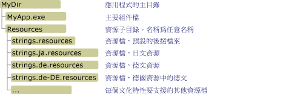

# <a name="retrieving-resources-in-desktop-apps"></a><span data-ttu-id="542a8-102">擷取桌面應用程式中的資源</span><span class="sxs-lookup"><span data-stu-id="542a8-102">Retrieving Resources in Desktop Apps</span></span>
<span data-ttu-id="542a8-103">當您在 .NET Framework 傳統型應用程式中使用當地語系化資源時，最好使用主要組件封裝預設或中性文化特性的資源，並針對應用程式支援的每個語言或文化特性，建立個別的附屬組件。</span><span class="sxs-lookup"><span data-stu-id="542a8-103">When you work with localized resources in .NET Framework desktop apps, you should ideally package the resources for the default or neutral culture with the main assembly and create a separate satellite assembly for each language or culture that your app supports.</span></span> <span data-ttu-id="542a8-104">然後您可以使用下一節中所述的 <xref:System.Resources.ResourceManager> 類別，來存取具名資源。</span><span class="sxs-lookup"><span data-stu-id="542a8-104">You can then use the <xref:System.Resources.ResourceManager> class as described in the next section to access named resources.</span></span> <span data-ttu-id="542a8-105">如果您選擇不要將資源嵌入主要組件和附屬組件，您也可以直接存取二進位 .resources 檔，如本文稍後的 [從 .resources 檔擷取資源](#from_file) 一節中所述。</span><span class="sxs-lookup"><span data-stu-id="542a8-105">If you choose not to embed your resources in the main assembly and satellite assemblies, you can also access binary .resources files directly, as discussed in the section [Retrieving Resources from .resources files](#from_file) later in this article.</span></span>  <span data-ttu-id="542a8-106">若要擷取 [!INCLUDE[win8_appname_long](../../../includes/win8-appname-long-md.md)] 應用程式中的資源，請參閱 Windows 開發人員中心的 [建立和擷取 Windows 市集應用程式中的資源](http://go.microsoft.com/fwlink/p/?LinkID=241674) 。</span><span class="sxs-lookup"><span data-stu-id="542a8-106">To retrieve resources in [!INCLUDE[win8_appname_long](../../../includes/win8-appname-long-md.md)] apps, see [Creating and retrieving resources in Windows Store apps](http://go.microsoft.com/fwlink/p/?LinkID=241674) in the Windows Dev Center.</span></span>  
  
<a name="from_assembly"></a>   
## <a name="retrieving-resources-from-assemblies"></a><span data-ttu-id="542a8-107">從組件擷取資源</span><span class="sxs-lookup"><span data-stu-id="542a8-107">Retrieving Resources from Assemblies</span></span>  
 <span data-ttu-id="542a8-108"><xref:System.Resources.ResourceManager> 類別提供對執行階段資源的存取。</span><span class="sxs-lookup"><span data-stu-id="542a8-108">The <xref:System.Resources.ResourceManager> class provides access to resources at run time.</span></span> <span data-ttu-id="542a8-109">您可以使用 <xref:System.Resources.ResourceManager.GetString%2A?displayProperty=nameWithType> 方法來擷取字串資源，以及使用 <xref:System.Resources.ResourceManager.GetObject%2A?displayProperty=nameWithType> 或 <xref:System.Resources.ResourceManager.GetStream%2A?displayProperty=nameWithType> 方法來擷取非字串資源。</span><span class="sxs-lookup"><span data-stu-id="542a8-109">You use the <xref:System.Resources.ResourceManager.GetString%2A?displayProperty=nameWithType> method to retrieve string resources and the <xref:System.Resources.ResourceManager.GetObject%2A?displayProperty=nameWithType> or <xref:System.Resources.ResourceManager.GetStream%2A?displayProperty=nameWithType> method to retrieve non-string resources.</span></span> <span data-ttu-id="542a8-110">每個方法都有兩個多載：</span><span class="sxs-lookup"><span data-stu-id="542a8-110">Each method has two overloads:</span></span>  
  
-   <span data-ttu-id="542a8-111">具有單一參數的多載，此參數是包含資源名稱的字串。</span><span class="sxs-lookup"><span data-stu-id="542a8-111">An overload whose single parameter is a string that contains the name of the resource.</span></span> <span data-ttu-id="542a8-112">此方法會嘗試擷取目前執行緒文化特性的資源。</span><span class="sxs-lookup"><span data-stu-id="542a8-112">The method attempts to retrieve that resource for the current thread culture.</span></span> <span data-ttu-id="542a8-113">如需詳細資訊，請參閱 <xref:System.Resources.ResourceManager.GetString%28System.String%29>、 <xref:System.Resources.ResourceManager.GetObject%28System.String%29>和 <xref:System.Resources.ResourceManager.GetStream%28System.String%29> 方法。</span><span class="sxs-lookup"><span data-stu-id="542a8-113">For more information, see the <xref:System.Resources.ResourceManager.GetString%28System.String%29>, <xref:System.Resources.ResourceManager.GetObject%28System.String%29>, and <xref:System.Resources.ResourceManager.GetStream%28System.String%29> methods.</span></span>  
  
-   <span data-ttu-id="542a8-114">具有兩個參數的多載︰一個包含資源名稱的字串，以及一個代表所擷取資源之文化特性的 <xref:System.Globalization.CultureInfo> 物件。</span><span class="sxs-lookup"><span data-stu-id="542a8-114">An overload that has two parameters: a string containing the name of the resource, and a <xref:System.Globalization.CultureInfo> object that represents the culture whose resource is to be retrieved.</span></span> <span data-ttu-id="542a8-115">如果找不到為該文化特性設定的資源，資源管理員會使用後援規則來擷取適當的資源。</span><span class="sxs-lookup"><span data-stu-id="542a8-115">If a resource set for that culture cannot be found, the resource manager uses fallback rules to retrieve an appropriate resource.</span></span> <span data-ttu-id="542a8-116">如需詳細資訊，請參閱 <xref:System.Resources.ResourceManager.GetString%28System.String%2CSystem.Globalization.CultureInfo%29>、 <xref:System.Resources.ResourceManager.GetObject%28System.String%2CSystem.Globalization.CultureInfo%29>和 <xref:System.Resources.ResourceManager.GetStream%28System.String%2CSystem.Globalization.CultureInfo%29> 方法。</span><span class="sxs-lookup"><span data-stu-id="542a8-116">For more information, see the <xref:System.Resources.ResourceManager.GetString%28System.String%2CSystem.Globalization.CultureInfo%29>, <xref:System.Resources.ResourceManager.GetObject%28System.String%2CSystem.Globalization.CultureInfo%29>, and <xref:System.Resources.ResourceManager.GetStream%28System.String%2CSystem.Globalization.CultureInfo%29> methods.</span></span>  
  
 <span data-ttu-id="542a8-117">資源管理員使用資源後援處理序，來控制應用程式如何擷取文化特性專屬資源。</span><span class="sxs-lookup"><span data-stu-id="542a8-117">The resource manager uses the resource fallback process to control how the app retrieves culture-specific resources.</span></span> <span data-ttu-id="542a8-118">如需詳細資訊，請參閱 [Packaging and Deploying Resources](../../../docs/framework/resources/packaging-and-deploying-resources-in-desktop-apps.md)中的＜Resource Fallback Process＞一節。</span><span class="sxs-lookup"><span data-stu-id="542a8-118">For more information, see the "Resource Fallback Process" section in [Packaging and Deploying Resources](../../../docs/framework/resources/packaging-and-deploying-resources-in-desktop-apps.md).</span></span> <span data-ttu-id="542a8-119">如需具現化 <xref:System.Resources.ResourceManager> 物件的資訊，請參閱 <xref:System.Resources.ResourceManager> 類別主題中的＜Instantiating a ResourceManager Object＞(具現化 ResourceManager 物件) 一節。</span><span class="sxs-lookup"><span data-stu-id="542a8-119">For information about instantiating a <xref:System.Resources.ResourceManager> object, see the "Instantiating a ResourceManager Object" section in the <xref:System.Resources.ResourceManager> class topic.</span></span>  
  
### <a name="retrieving-string-data-an-example"></a><span data-ttu-id="542a8-120">擷取字串資料︰範例</span><span class="sxs-lookup"><span data-stu-id="542a8-120">Retrieving String Data: An Example</span></span>  
 <span data-ttu-id="542a8-121">下列範例會呼叫 <xref:System.Resources.ResourceManager.GetString%28System.String%29> 方法來擷取目前 UI 文化特性的字串資源。</span><span class="sxs-lookup"><span data-stu-id="542a8-121">The following example calls the <xref:System.Resources.ResourceManager.GetString%28System.String%29> method to retrieve the string resources of the current UI culture.</span></span> <span data-ttu-id="542a8-122">其中包含英文 (美國) 文化特性的中性字串資源，以及法文 (法國) 和俄文 (俄羅斯) 文化特性的當地語系化資源。</span><span class="sxs-lookup"><span data-stu-id="542a8-122">It includes a neutral string resource for the English (United States) culture and localized resources for the French (France) and Russian (Russia) cultures.</span></span> <span data-ttu-id="542a8-123">下列英文 (美國) 資源是在名為 Strings.txt 的檔案中：</span><span class="sxs-lookup"><span data-stu-id="542a8-123">The following English (United States) resource is in a file named Strings.txt:</span></span>  
  
```  
TimeHeader=The current time is  
```  
  
 <span data-ttu-id="542a8-124">法文 (法國) 資源是在名為 Strings.fr-FR.txt 的檔案中：</span><span class="sxs-lookup"><span data-stu-id="542a8-124">The French (France) resource is in a file named Strings.fr-FR.txt:</span></span>  
  
```  
TimeHeader=L'heure actuelle est  
```  
  
 <span data-ttu-id="542a8-125">俄文 (俄羅斯) 資源是在名為 Strings.ru-RU-txt 的檔案中：</span><span class="sxs-lookup"><span data-stu-id="542a8-125">The Russian (Russia) resource is in a file named Strings.ru-RU-txt:</span></span>  
  
```  
TimeHeader=Текущее время —  
```  
  
 <span data-ttu-id="542a8-126">此範例的原始程式碼 (C# 版程式碼的檔名為 GetString.cs，Visual Basic 版為 GetString.vb) 會定義一個字串陣列，其中包含四個文化特性的名稱︰可用資源的三個文化特性，以及西班牙文 (西班牙) 文化特性。</span><span class="sxs-lookup"><span data-stu-id="542a8-126">The source code for this example, which is in a file named GetString.cs for the C# version of the code and GetString.vb for the Visual Basic version, defines a string array that contains the name of four cultures: the three cultures for which resources are available and the Spanish (Spain) culture.</span></span> <span data-ttu-id="542a8-127">會出現一個迴圈隨機執行五次，然後選取其中一個文化特性並將其指派給 <xref:System.Threading.Thread.CurrentCulture%2A?displayProperty=nameWithType> 和 <xref:System.Globalization.CultureInfo.CurrentUICulture%2A?displayProperty=nameWithType> 屬性。</span><span class="sxs-lookup"><span data-stu-id="542a8-127">A loop that executes five times randomly selects one of these cultures and assigns it to the <xref:System.Threading.Thread.CurrentCulture%2A?displayProperty=nameWithType> and <xref:System.Globalization.CultureInfo.CurrentUICulture%2A?displayProperty=nameWithType> properties.</span></span> <span data-ttu-id="542a8-128">然後它會呼叫 <xref:System.Resources.ResourceManager.GetString%28System.String%29> 方法來擷取當地語系化字串，並連同日期時間一起顯示。</span><span class="sxs-lookup"><span data-stu-id="542a8-128">It then calls the <xref:System.Resources.ResourceManager.GetString%28System.String%29> method to retrieve the localized string, which it displays along with the time of day.</span></span>  
  
 [!code-csharp[Conceptual.Resources.Retrieving#3](../../../samples/snippets/csharp/VS_Snippets_CLR/conceptual.resources.retrieving/cs/getstring.cs#3)]
 [!code-vb[Conceptual.Resources.Retrieving#3](../../../samples/snippets/visualbasic/VS_Snippets_CLR/conceptual.resources.retrieving/vb/getstring.vb#3)]  
  
 <span data-ttu-id="542a8-129">下列批次 (.bat) 檔案會編譯此範例，並在適當的目錄中產生附屬組件。</span><span class="sxs-lookup"><span data-stu-id="542a8-129">The following batch (.bat) file compiles the example and generates satellite assemblies in the appropriate directories.</span></span> <span data-ttu-id="542a8-130">然後提供適用於 C# 語言和編譯器的命令。</span><span class="sxs-lookup"><span data-stu-id="542a8-130">The commands are provided for the C# language and compiler.</span></span> <span data-ttu-id="542a8-131">若為 Visual Basic，請將 `csc` 變更為 `vbc`，並將 `GetString.cs` 變更為 `GetString.vb`。</span><span class="sxs-lookup"><span data-stu-id="542a8-131">For Visual Basic, change `csc` to `vbc`, and change `GetString.cs` to `GetString.vb`.</span></span>  
  
```  
resgen strings.txt  
csc GetString.cs -resource:strings.resources  
  
resgen strings.fr-FR.txt  
md fr-FR  
al -embed:strings.fr-FR.resources -culture:fr-FR -out:fr-FR\GetString.resources.dll  
  
resgen strings.ru-RU.txt  
md ru-RU  
al -embed:strings.ru-RU.resources -culture:ru-RU -out:ru-RU\GetString.resources.dll  
```  
  
 <span data-ttu-id="542a8-132">當目前 UI 文化特性為西班牙文 (西班牙) 時，請注意，此範例會顯示英文語言資源，因為西班牙文語言資源無法使用，而英文是此範例的預設文化特性。</span><span class="sxs-lookup"><span data-stu-id="542a8-132">When the current UI culture is Spanish (Spain), note that the example displays English language resources, because Spanish language resources are unavailable, and English is the example's default culture.</span></span>  
  
### <a name="retrieving-object-data-two-examples"></a><span data-ttu-id="542a8-133">擷取物件資料︰兩個範例</span><span class="sxs-lookup"><span data-stu-id="542a8-133">Retrieving Object Data: Two Examples</span></span>  
 <span data-ttu-id="542a8-134">您可以使用 <xref:System.Resources.ResourceManager.GetObject%2A> 和 <xref:System.Resources.ResourceManager.GetStream%2A> 方法來擷取物件資料。</span><span class="sxs-lookup"><span data-stu-id="542a8-134">You can use the <xref:System.Resources.ResourceManager.GetObject%2A> and <xref:System.Resources.ResourceManager.GetStream%2A> methods to retrieve object data.</span></span> <span data-ttu-id="542a8-135">包括基本資料類型、可序列化的物件，以及使用二進位格式儲存的物件 (例如影像)。</span><span class="sxs-lookup"><span data-stu-id="542a8-135">This includes primitive data types, serializable objects, and objects that are stored in binary format (such as images).</span></span>  
  
 <span data-ttu-id="542a8-136">下列範例使用 <xref:System.Resources.ResourceManager.GetStream%28System.String%29> 方法來擷取應用程式開頭顯示畫面視窗中使用的點陣圖。</span><span class="sxs-lookup"><span data-stu-id="542a8-136">The following example uses the <xref:System.Resources.ResourceManager.GetStream%28System.String%29> method to retrieve a bitmap that is used in an app's opening splash window.</span></span> <span data-ttu-id="542a8-137">下列原始程式碼位於名為 CreateResources.cs (適用於 C#) 或 CreateResources.vb (適用於 Visual Basic) 的檔案中，會產生包含序列化影像的 .resx 檔。</span><span class="sxs-lookup"><span data-stu-id="542a8-137">The following source code in a file named CreateResources.cs (for C#) or CreateResources.vb (for Visual Basic) generates a .resx file that contains the serialized image.</span></span> <span data-ttu-id="542a8-138">在此情況下，會從名為 SplashScreen.jpg 的檔案載入影像；您可以修改檔案名稱以替代成您自己的影像。</span><span class="sxs-lookup"><span data-stu-id="542a8-138">In this case, the image is loaded from a file named SplashScreen.jpg; you can modify the file name to substitute your own image.</span></span>  
  
 [!code-csharp[Conceptual.Resources.Retrieving#4](../../../samples/snippets/csharp/VS_Snippets_CLR/conceptual.resources.retrieving/cs/createresources.cs#4)]
 [!code-vb[Conceptual.Resources.Retrieving#4](../../../samples/snippets/visualbasic/VS_Snippets_CLR/conceptual.resources.retrieving/vb/createresources.vb#4)]  
  
 <span data-ttu-id="542a8-139">下列程式碼會擷取資源，並顯示 <xref:System.Windows.Forms.PictureBox> 控制項中的影像。</span><span class="sxs-lookup"><span data-stu-id="542a8-139">The following code retrieves the resource and displays the image in a <xref:System.Windows.Forms.PictureBox> control.</span></span>  
  
 [!code-csharp[Conceptual.Resources.Retrieving#5](../../../samples/snippets/csharp/VS_Snippets_CLR/conceptual.resources.retrieving/cs/getstream.cs#5)]
 [!code-vb[Conceptual.Resources.Retrieving#5](../../../samples/snippets/visualbasic/VS_Snippets_CLR/conceptual.resources.retrieving/vb/getstream.vb#5)]  
  
 <span data-ttu-id="542a8-140">您可以使用下列批次檔來建立 C# 範例。</span><span class="sxs-lookup"><span data-stu-id="542a8-140">You can use the following batch file to build the C# example.</span></span> <span data-ttu-id="542a8-141">若是 Visual Basic，請將 `csc` 變更為 `vbc`，並將原始程式碼檔案的副檔名從 `.cs` 變更為 `.vb`。</span><span class="sxs-lookup"><span data-stu-id="542a8-141">For Visual Basic, change `csc` to `vbc`, and change the extension of the source code file from `.cs` to `.vb`.</span></span>  
  
```  
csc CreateResources.cs  
CreateResources  
  
resgen AppResources.resx  
  
csc GetStream.cs -resource:AppResources.resources  
```  
  
 <span data-ttu-id="542a8-142">下列範例使用 <xref:System.Resources.ResourceManager.GetObject%28System.String%29?displayProperty=nameWithType> 方法來還原序列化自訂物件。</span><span class="sxs-lookup"><span data-stu-id="542a8-142">The following example uses the <xref:System.Resources.ResourceManager.GetObject%28System.String%29?displayProperty=nameWithType> method to deserialize a custom object.</span></span> <span data-ttu-id="542a8-143">此範例包含名為 UIElements.cs (若是 Visual Basic 則為 UIElements.vb) 的原始程式碼檔，其中包含名為 `PersonTable`的下列結構。</span><span class="sxs-lookup"><span data-stu-id="542a8-143">The example includes a source code file named UIElements.cs (UIElements.vb for Visual Basic) that defines the following structure named `PersonTable`.</span></span> <span data-ttu-id="542a8-144">此結構是為了供一般資料表顯示常式使用，以顯示資料表資料行的當地語系化名稱。</span><span class="sxs-lookup"><span data-stu-id="542a8-144">This structure is intended to be used by a general table display routine that displays the localized names of table columns.</span></span> <span data-ttu-id="542a8-145">請注意， `PersonTable` 結構會以 <xref:System.SerializableAttribute> 屬性標記。</span><span class="sxs-lookup"><span data-stu-id="542a8-145">Note that the `PersonTable` structure is marked with the <xref:System.SerializableAttribute> attribute.</span></span>  
  
 [!code-csharp[Conceptual.Resources.Retrieving#6](../../../samples/snippets/csharp/VS_Snippets_CLR/conceptual.resources.retrieving/cs/example.cs#6)]
 [!code-vb[Conceptual.Resources.Retrieving#6](../../../samples/snippets/visualbasic/VS_Snippets_CLR/conceptual.resources.retrieving/vb/example.vb#6)]  
  
 <span data-ttu-id="542a8-146">下列程式碼來自於名為 CreateResources.cs (若是 Visual Basic 則為 CreateResources.vb) 的檔案，會建立用以儲存資料表標題的 XML 資源檔 UIResources.resx，以及包含針對英文語言當地語系化之應用程式資訊的 `PersonTable` 物件。</span><span class="sxs-lookup"><span data-stu-id="542a8-146">The following code from a file named CreateResources.cs (CreateResources.vb for Visual Basic) creates an XML resource file named UIResources.resx that stores a table title and a `PersonTable` object that contains information for an app that is localized for the English language.</span></span>  
  
 [!code-csharp[Conceptual.Resources.Retrieving#7](../../../samples/snippets/csharp/VS_Snippets_CLR/conceptual.resources.retrieving/cs/example1.cs#7)]
 [!code-vb[Conceptual.Resources.Retrieving#7](../../../samples/snippets/visualbasic/VS_Snippets_CLR/conceptual.resources.retrieving/vb/example.vb#7)]  
  
 <span data-ttu-id="542a8-147">原始程式碼檔 GetObject.cs (GetObject.vb) 中的下列程式碼會接著擷取資源，並將其顯示到主控台。</span><span class="sxs-lookup"><span data-stu-id="542a8-147">The following code in a source code file named GetObject.cs (GetObject.vb) then retrieves the resources and displays them to the console.</span></span>  
  
 [!code-csharp[Conceptual.Resources.Retrieving#8](../../../samples/snippets/csharp/VS_Snippets_CLR/conceptual.resources.retrieving/cs/example2.cs#8)]
 [!code-vb[Conceptual.Resources.Retrieving#8](../../../samples/snippets/visualbasic/VS_Snippets_CLR/conceptual.resources.retrieving/vb/example2.vb#8)]  
  
 <span data-ttu-id="542a8-148">您可以建立必要的資源檔和組件，並藉由執行下列批次檔來執行應用程式。</span><span class="sxs-lookup"><span data-stu-id="542a8-148">You can build the necessary resource file and assemblies and run the app by executing the following batch file.</span></span> <span data-ttu-id="542a8-149">您必須使用 `/r` 選項將 UIElements.dll 的參考提供給 Resgen.exe，使其可以存取有關 `PersonTable` 結構的資訊。</span><span class="sxs-lookup"><span data-stu-id="542a8-149">You must use the `/r` option to supply Resgen.exe with a reference to UIElements.dll so that it can access information about the `PersonTable` structure.</span></span> <span data-ttu-id="542a8-150">如果使用 C#，請將 `vbc` 編譯器名稱取代成 `csc`，並將 `.vb` 副檔名取代成 `.cs`。</span><span class="sxs-lookup"><span data-stu-id="542a8-150">If you're using C#, replace the `vbc` compiler name with `csc`, and replace the `.vb` extension with `.cs`.</span></span>  
  
```  
vbc -t:library UIElements.vb  
vbc CreateResources.vb -r:UIElements.dll  
CreateResources  
  
resgen UIResources.resx  -r:UIElements.dll  
vbc GetObject.vb -r:UIElements.dll -resource:UIResources.resources  
  
GetObject.exe  
```  
  
## <a name="versioning-support-for-satellite-assemblies"></a><span data-ttu-id="542a8-151">附屬組件的版本控制支援</span><span class="sxs-lookup"><span data-stu-id="542a8-151">Versioning Support for Satellite Assemblies</span></span>  
 <span data-ttu-id="542a8-152">根據預設，當 <xref:System.Resources.ResourceManager> 物件擷取要求的資源時，它會尋找其版本號碼符合主要組件之版本號碼的附屬組件。</span><span class="sxs-lookup"><span data-stu-id="542a8-152">By default, when the <xref:System.Resources.ResourceManager> object retrieves requested resources, it looks for satellite assemblies that have version numbers that match the version number of the main assembly.</span></span> <span data-ttu-id="542a8-153">部署應用程式之後，您可能需要更新主要組件或特定資源附屬組件。</span><span class="sxs-lookup"><span data-stu-id="542a8-153">After you have deployed an app, you might want to update the main assembly or specific resource satellite assemblies.</span></span> <span data-ttu-id="542a8-154">.NET Framework 提供主要組件和附屬組件的版本控制支援。</span><span class="sxs-lookup"><span data-stu-id="542a8-154">The .NET Framework provides support for versioning the main assembly and satellite assemblies.</span></span>  
  
 <span data-ttu-id="542a8-155"><xref:System.Resources.SatelliteContractVersionAttribute> 屬性為主要組件提供了版本控制支援。</span><span class="sxs-lookup"><span data-stu-id="542a8-155">The <xref:System.Resources.SatelliteContractVersionAttribute> attribute  provides versioning support for a main assembly.</span></span> <span data-ttu-id="542a8-156">在應用程式的主要組件上指定這個屬性可讓您更新並重新部署主要組件，而不更新其附屬組件。</span><span class="sxs-lookup"><span data-stu-id="542a8-156">Specifying this attribute on an app's main assembly enables you to update and redeploy a main assembly without updating its satellite assemblies.</span></span> <span data-ttu-id="542a8-157">更新主要組件之後，主要組件的版本號碼會遞增，但附屬合約版本號碼則保持不變。</span><span class="sxs-lookup"><span data-stu-id="542a8-157">After you update the main assembly, increment the main assembly's version number but leave the satellite contract version number unchanged.</span></span> <span data-ttu-id="542a8-158">當資源管理員擷取要求的資源時，它會載入此屬性指定的附屬組件版本。</span><span class="sxs-lookup"><span data-stu-id="542a8-158">When the resource manager retrieves requested resources, it loads the satellite assembly version specified by this attribute.</span></span>  
  
 <span data-ttu-id="542a8-159">發行者原則組件提供附屬組件的版本控制支援。</span><span class="sxs-lookup"><span data-stu-id="542a8-159">Publisher policy assemblies provide support for versioning satellite assemblies.</span></span> <span data-ttu-id="542a8-160">您可以更新並重新部署附屬組件，而不更新主要組件。</span><span class="sxs-lookup"><span data-stu-id="542a8-160">You can update and redeploy a satellite assembly without updating the main assembly.</span></span> <span data-ttu-id="542a8-161">更新附屬組件之後，其版本號碼會遞增，並隨附於發行者原則組件。</span><span class="sxs-lookup"><span data-stu-id="542a8-161">After you update a satellite assembly, increment its version number and ship it with a publisher policy assembly.</span></span> <span data-ttu-id="542a8-162">在發行者原則組件中，指定您的新附屬組件與其舊版相容。</span><span class="sxs-lookup"><span data-stu-id="542a8-162">In the publisher policy assembly, specify that your new satellite assembly is backward-compatible with its previous version.</span></span> <span data-ttu-id="542a8-163">資源管理員會使用 <xref:System.Resources.SatelliteContractVersionAttribute> 屬性來判斷附屬組件的版本，但組件載入器會繫結至發行者原則所指定的附屬組件版本。</span><span class="sxs-lookup"><span data-stu-id="542a8-163">The resource manager will use the <xref:System.Resources.SatelliteContractVersionAttribute> attribute to determine the version of the satellite assembly, but the assembly loader will bind to the satellite assembly version specified by the publisher policy.</span></span> <span data-ttu-id="542a8-164">如需發行者原則組件的詳細資訊，請參閱 [Creating a Publisher Policy File](../../../docs/framework/configure-apps/how-to-create-a-publisher-policy.md)(建立發行者原則檔)。</span><span class="sxs-lookup"><span data-stu-id="542a8-164">For more information about publisher policy assemblies, see [Creating a Publisher Policy File](../../../docs/framework/configure-apps/how-to-create-a-publisher-policy.md).</span></span>  
  
 <span data-ttu-id="542a8-165">若要啟用完整的組件版本控制支援，建議您在 [全域組件快取](../../../docs/framework/app-domains/gac.md) 中部署強式名稱的組件，並在應用程式目錄中部署沒有強式名稱的組件。</span><span class="sxs-lookup"><span data-stu-id="542a8-165">To enable full assembly versioning support, we recommend that you deploy strong-named assemblies in the [global assembly cache](../../../docs/framework/app-domains/gac.md) and deploy assemblies that don't have strong names in the application directory.</span></span> <span data-ttu-id="542a8-166">如果您想要在應用程式目錄中部署強式名稱的組件，當您更新組件時，將無法遞增附屬組件的版本號碼。</span><span class="sxs-lookup"><span data-stu-id="542a8-166">If you want to deploy strong-named assemblies in the application directory, you will not be able to increment a satellite assembly's version number when you update the assembly.</span></span> <span data-ttu-id="542a8-167">相反地，您必須執行就地更新，以更新的程式碼取代現有程式碼，並維持相同的版本號碼。</span><span class="sxs-lookup"><span data-stu-id="542a8-167">Instead, you must perform an in-place update where you replace the existing code with the updated code and maintain the same version number.</span></span> <span data-ttu-id="542a8-168">例如，如果您想要更新 1.0.0.0 版的附屬組件，而且該組件已完整指定組件名稱 "myApp.resources, Version=1.0.0.0, Culture=de, PublicKeyToken=b03f5f11d50a3a"，請覆寫成使用完整指定之相同組件名稱 "myApp.resources, Version=1.0.0.0, Culture=de, PublicKeyToken=b03f5f11d50a3a" 編譯的已更新 myApp.resources.dll。</span><span class="sxs-lookup"><span data-stu-id="542a8-168">For example, if you want to update version 1.0.0.0 of a satellite assembly with the fully specified assembly name "myApp.resources, Version=1.0.0.0, Culture=de, PublicKeyToken=b03f5f11d50a3a", overwrite it with the updated myApp.resources.dll that has been compiled with the same, fully specified assembly name "myApp.resources, Version=1.0.0.0, Culture=de, PublicKeyToken=b03f5f11d50a3a".</span></span> <span data-ttu-id="542a8-169">請注意，在附屬組件檔上使用就地更新，會讓應用程式很難正確判斷附屬組件的版本。</span><span class="sxs-lookup"><span data-stu-id="542a8-169">Note that using in-place updates on satellite assembly files makes it difficult for an app to accurately determine the version of a satellite assembly.</span></span>  
  
 <span data-ttu-id="542a8-170">如需組件版本控制的詳細資訊，請參閱 [組件版本控制](../../../docs/framework/app-domains/assembly-versioning.md) 和 [執行階段如何找出組件](../../../docs/framework/deployment/how-the-runtime-locates-assemblies.md)。</span><span class="sxs-lookup"><span data-stu-id="542a8-170">For more information about assembly versioning, see [Assembly Versioning](../../../docs/framework/app-domains/assembly-versioning.md) and [How the Runtime Locates Assemblies](../../../docs/framework/deployment/how-the-runtime-locates-assemblies.md).</span></span>  
  
<a name="from_file"></a>   
## <a name="retrieving-resources-from-resources-files"></a><span data-ttu-id="542a8-171">從 .resources 檔擷取資源</span><span class="sxs-lookup"><span data-stu-id="542a8-171">Retrieving Resources from .resources Files</span></span>  
 <span data-ttu-id="542a8-172">如果您選擇不要部署附屬組件中的資源，您仍然可以使用 <xref:System.Resources.ResourceManager> 物件直接從 .resources 檔存取資源。</span><span class="sxs-lookup"><span data-stu-id="542a8-172">If you choose not to deploy resources in satellite assemblies, you can still use a <xref:System.Resources.ResourceManager> object to access resources from .resources files directly.</span></span> <span data-ttu-id="542a8-173">若要這樣做，您必須正確部署 .resources 檔。</span><span class="sxs-lookup"><span data-stu-id="542a8-173">To do this, you must deploy the .resources files correctly.</span></span> <span data-ttu-id="542a8-174">然後您可以使用 <xref:System.Resources.ResourceManager.CreateFileBasedResourceManager%2A?displayProperty=nameWithType> 方法具現化 <xref:System.Resources.ResourceManager> 物件，並指定包含獨立 .resources 檔的目錄。</span><span class="sxs-lookup"><span data-stu-id="542a8-174">Then you use the <xref:System.Resources.ResourceManager.CreateFileBasedResourceManager%2A?displayProperty=nameWithType> method to instantiate a <xref:System.Resources.ResourceManager> object and specify the directory that contains the standalone .resources files.</span></span>  
  
### <a name="deploying-resources-files"></a><span data-ttu-id="542a8-175">部署 .resources 檔</span><span class="sxs-lookup"><span data-stu-id="542a8-175">Deploying .resources Files</span></span>  
 <span data-ttu-id="542a8-176">當您將 .resources 檔嵌入應用程式組件和附屬組件時，每個附屬組件都有相同的檔案名稱，但會放在反映附屬組件之文化特性的子目錄中。</span><span class="sxs-lookup"><span data-stu-id="542a8-176">When you embed .resources files in an application assembly and satellite assemblies, each satellite assembly has the same file name, but is placed in a subdirectory that reflects the satellite assembly's culture.</span></span> <span data-ttu-id="542a8-177">相反地，當您直接從 .resources 檔存取資源時，您可以將所有 .resources 檔放在單一目錄中，通常是應用程式目錄的子目錄。</span><span class="sxs-lookup"><span data-stu-id="542a8-177">In contrast, when you access resources from .resources files directly, you can place all the .resources files in a single directory, usually a subdirectory of the application directory.</span></span> <span data-ttu-id="542a8-178">應用程式之預設 .resources 檔的名稱只包含根目錄名稱，而不會有其文化特性指示 (例如 strings.resources)。</span><span class="sxs-lookup"><span data-stu-id="542a8-178">The name of the app's default .resources file consists of a root name only, with no indication of its culture (for example, strings.resources).</span></span> <span data-ttu-id="542a8-179">每個當地語系化文化特性的資源會儲存在其名稱包含根目錄名稱後面接著文化特性的檔案 (例如 strings.ja.resources 或 strings.de-DE.resources)。</span><span class="sxs-lookup"><span data-stu-id="542a8-179">The resources for each localized culture are stored in a file whose name consists of the root name followed by the culture (for example, strings.ja.resources or strings.de-DE.resources).</span></span> <span data-ttu-id="542a8-180">下圖顯示資源檔在目錄結構中的位置。</span><span class="sxs-lookup"><span data-stu-id="542a8-180">The following illustration shows where resource files should be located in the directory structure.</span></span>  
  
 <span data-ttu-id="542a8-181"></span><span class="sxs-lookup"><span data-stu-id="542a8-181"></span></span>  
<span data-ttu-id="542a8-182">.resources 檔的目錄結構和命名慣例</span><span class="sxs-lookup"><span data-stu-id="542a8-182">Directory structure and naming conventions for .resources files</span></span>  
  
### <a name="using-the-resource-manager"></a><span data-ttu-id="542a8-183">使用資源管理員</span><span class="sxs-lookup"><span data-stu-id="542a8-183">Using the Resource Manager</span></span>  
 <span data-ttu-id="542a8-184">建立資源並放在適當目錄之後，您可以呼叫 <xref:System.Resources.ResourceManager> 方法，建立 <xref:System.Resources.ResourceManager.CreateFileBasedResourceManager%28System.String%2CSystem.String%2CSystem.Type%29> 物件來使用資源。</span><span class="sxs-lookup"><span data-stu-id="542a8-184">After you have created your resources and placed them in the appropriate directory, you create a <xref:System.Resources.ResourceManager> object to use the resources by calling the <xref:System.Resources.ResourceManager.CreateFileBasedResourceManager%28System.String%2CSystem.String%2CSystem.Type%29> method.</span></span> <span data-ttu-id="542a8-185">第一個參數指定應用程式預設 .resources 檔的根目錄名稱 (這會是上一節範例中的 "strings")。</span><span class="sxs-lookup"><span data-stu-id="542a8-185">The first parameter specifies the root name of the app's default .resources file (this would be "strings" for the example in the previous section).</span></span> <span data-ttu-id="542a8-186">第二個參數指定資源的位置 (上一個範例中的 "Resources")。</span><span class="sxs-lookup"><span data-stu-id="542a8-186">The second parameter specifies the location of the resources ("Resources" for the previous example).</span></span> <span data-ttu-id="542a8-187">第三個參數指定要使用的 <xref:System.Resources.ResourceSet> 實作。</span><span class="sxs-lookup"><span data-stu-id="542a8-187">The third parameter specifies the <xref:System.Resources.ResourceSet> implementation to use.</span></span> <span data-ttu-id="542a8-188">如果第三個參數是 `null`，則會使用預設執行階段 <xref:System.Resources.ResourceSet> 。</span><span class="sxs-lookup"><span data-stu-id="542a8-188">If the third parameter is `null`, the default runtime <xref:System.Resources.ResourceSet> is used.</span></span>  
  
> [!NOTE]
>  <span data-ttu-id="542a8-189">請勿使用獨立 .resources 檔部署 ASP.NET 應用程式。</span><span class="sxs-lookup"><span data-stu-id="542a8-189">Do not deploy ASP.NET apps using standalone .resources files.</span></span> <span data-ttu-id="542a8-190">這會造成鎖定問題並中斷 XCOPY 部署。</span><span class="sxs-lookup"><span data-stu-id="542a8-190">This can cause locking issues and breaks XCOPY deployment.</span></span> <span data-ttu-id="542a8-191">建議您部署附屬組件中的 ASP.NET 資源。</span><span class="sxs-lookup"><span data-stu-id="542a8-191">We recommend that you deploy ASP.NET resources in satellite assemblies.</span></span> <span data-ttu-id="542a8-192">如需詳細資訊，請參閱 [ASP.NET Web Page Resources Overview](http://msdn.microsoft.com/library/0936b3b2-9e6e-4abe-9c06-364efef9dbbd)。</span><span class="sxs-lookup"><span data-stu-id="542a8-192">For more information, see [ASP.NET Web Page Resources Overview](http://msdn.microsoft.com/library/0936b3b2-9e6e-4abe-9c06-364efef9dbbd).</span></span>  
  
 <span data-ttu-id="542a8-193">具現化 <xref:System.Resources.ResourceManager> 物件之後，您可以使用稍早所述的 <xref:System.Resources.ResourceManager.GetString%2A>、 <xref:System.Resources.ResourceManager.GetObject%2A>和 <xref:System.Resources.ResourceManager.GetStream%2A> 方法來擷取資源。</span><span class="sxs-lookup"><span data-stu-id="542a8-193">After you instantiate the <xref:System.Resources.ResourceManager> object, you use the <xref:System.Resources.ResourceManager.GetString%2A>, <xref:System.Resources.ResourceManager.GetObject%2A>, and <xref:System.Resources.ResourceManager.GetStream%2A> methods as discussed earlier to retrieve the resources.</span></span> <span data-ttu-id="542a8-194">不過，直接從 .resources 檔擷取資源，與從組件擷取內嵌資源不同。</span><span class="sxs-lookup"><span data-stu-id="542a8-194">However, the retrieval of resources directly from .resources files differs from the retrieval of embedded resources from assemblies.</span></span> <span data-ttu-id="542a8-195">當您從 .resources 檔擷取資源時， <xref:System.Resources.ResourceManager.GetString%28System.String%29>、 <xref:System.Resources.ResourceManager.GetObject%28System.String%29>和 <xref:System.Resources.ResourceManager.GetStream%28System.String%29> 方法一律會擷取預設文化特性的資源，而不論目前的文化特性為何。</span><span class="sxs-lookup"><span data-stu-id="542a8-195">When you retrieve resources from .resources files, the <xref:System.Resources.ResourceManager.GetString%28System.String%29>, <xref:System.Resources.ResourceManager.GetObject%28System.String%29>, and <xref:System.Resources.ResourceManager.GetStream%28System.String%29> methods always retrieve the default culture's resources regardless of the current culture.</span></span> <span data-ttu-id="542a8-196">若要擷取應用程式之目前文化特性或特定文化特性的資源，您必須呼叫 <xref:System.Resources.ResourceManager.GetString%28System.String%2CSystem.Globalization.CultureInfo%29>、 <xref:System.Resources.ResourceManager.GetObject%28System.String%2CSystem.Globalization.CultureInfo%29>或 <xref:System.Resources.ResourceManager.GetStream%28System.String%2CSystem.Globalization.CultureInfo%29> 方法，並指定所要擷取之資源的文化特性。</span><span class="sxs-lookup"><span data-stu-id="542a8-196">To retrieve the resources of the either the app's current culture or a specific culture, you must call the <xref:System.Resources.ResourceManager.GetString%28System.String%2CSystem.Globalization.CultureInfo%29>, <xref:System.Resources.ResourceManager.GetObject%28System.String%2CSystem.Globalization.CultureInfo%29>, or <xref:System.Resources.ResourceManager.GetStream%28System.String%2CSystem.Globalization.CultureInfo%29> method and specify the culture whose resources are to be retrieved.</span></span> <span data-ttu-id="542a8-197">若要擷取目前文化特性的資源，請將 <xref:System.Globalization.CultureInfo.CurrentCulture%2A?displayProperty=nameWithType> 屬性的值指定為 `culture` 引數。</span><span class="sxs-lookup"><span data-stu-id="542a8-197">To retrieve the resources of the current culture, specify the value of the <xref:System.Globalization.CultureInfo.CurrentCulture%2A?displayProperty=nameWithType> property as the `culture` argument.</span></span> <span data-ttu-id="542a8-198">如果資源管理員無法擷取 `culture`的資源，則會使用標準資源後援規則來擷取適當的資源。</span><span class="sxs-lookup"><span data-stu-id="542a8-198">If the resource manager cannot retrieve the resources of `culture`, it uses the standard resource fallback rules to retrieve the appropriate resources.</span></span>  
  
### <a name="an-example"></a><span data-ttu-id="542a8-199">範例</span><span class="sxs-lookup"><span data-stu-id="542a8-199">An Example</span></span>  
 <span data-ttu-id="542a8-200">下列範例說明資源管理員如何直接從 .resources 檔擷取資源。</span><span class="sxs-lookup"><span data-stu-id="542a8-200">The following example illustrates how the resource manager retrieves resources directly from .resources files.</span></span> <span data-ttu-id="542a8-201">此範例是由英文 (美國)、法文 (法國) 和俄文 (俄羅斯) 文化特性的三個文字資源檔所組成。</span><span class="sxs-lookup"><span data-stu-id="542a8-201">The example consists of three text-based resource files for the English (United States), French (France), and Russian (Russia) cultures.</span></span> <span data-ttu-id="542a8-202">英文 (美國) 是此範例的預設文化特性。</span><span class="sxs-lookup"><span data-stu-id="542a8-202">English (United States) is the example's default culture.</span></span> <span data-ttu-id="542a8-203">其資源會儲存在以下名為 Strings.txt 的檔案中：</span><span class="sxs-lookup"><span data-stu-id="542a8-203">Its resources are stored in the following file named Strings.txt:</span></span>  
  
```  
Greeting=Hello  
Prompt=What is your name?  
```  
  
 <span data-ttu-id="542a8-204">法文 (法國) 文化特性的資源會儲存在以下名為 Strings.fr-FR.txt 的檔案中：</span><span class="sxs-lookup"><span data-stu-id="542a8-204">Resources for the French (France) culture are stored in the following file, which is named Strings.fr-FR.txt:</span></span>  
  
```  
Greeting=Bon jour  
Prompt=Comment vous appelez-vous?  
```  
  
 <span data-ttu-id="542a8-205">俄文 (俄羅斯) 文化特性的資源會儲存在以下名為 Strings.ru-RU.txt 的檔案中：</span><span class="sxs-lookup"><span data-stu-id="542a8-205">Resources for the Russian (Russia) culture are stored in the following file, which is named Strings.ru-RU.txt:</span></span>  
  
```  
Greeting=Здравствуйте  
Prompt=Как вас зовут?  
```  
  
 <span data-ttu-id="542a8-206">以下是範例的原始程式碼。</span><span class="sxs-lookup"><span data-stu-id="542a8-206">The following is the source code for the example.</span></span> <span data-ttu-id="542a8-207">此範例會具現化英文 (美國)、英文 (加拿大)、法文 (法國) 和俄文 (俄羅斯) 文化特性的 <xref:System.Globalization.CultureInfo> 物件，並設定每個文化特性作為目前的文化特性。</span><span class="sxs-lookup"><span data-stu-id="542a8-207">The example instantiates <xref:System.Globalization.CultureInfo> objects for the English (United States), English (Canada), French (France), and Russian (Russia) cultures, and makes each the current culture.</span></span> <span data-ttu-id="542a8-208"><xref:System.Resources.ResourceManager.GetString%28System.String%2CSystem.Globalization.CultureInfo%29?displayProperty=nameWithType> 方法會接著提供 <xref:System.Globalization.CultureInfo.CurrentCulture%2A?displayProperty=nameWithType> 屬性的值作為 `culture` 引數，來擷取適當的文化特性專屬資源。</span><span class="sxs-lookup"><span data-stu-id="542a8-208">The <xref:System.Resources.ResourceManager.GetString%28System.String%2CSystem.Globalization.CultureInfo%29?displayProperty=nameWithType> method then supplies the value of the <xref:System.Globalization.CultureInfo.CurrentCulture%2A?displayProperty=nameWithType> property as the `culture` argument to retrieve the appropriate culture-specific resources.</span></span>  
  
 [!code-csharp[Conceptual.Resources.Retrieving#9](../../../samples/snippets/csharp/VS_Snippets_CLR/conceptual.resources.retrieving/cs/example3.cs#9)]
 [!code-vb[Conceptual.Resources.Retrieving#9](../../../samples/snippets/visualbasic/VS_Snippets_CLR/conceptual.resources.retrieving/vb/example3.vb#9)]  
  
 <span data-ttu-id="542a8-209">您可以執行下列批次檔來編譯 C# 版的範例。</span><span class="sxs-lookup"><span data-stu-id="542a8-209">You can compile the C# version of the example by running the following batch file.</span></span> <span data-ttu-id="542a8-210">如果使用 Visual Basic，請將 `csc` 取代成 `vbc`，並將 `.cs` 副檔名取代成 `.vb`。</span><span class="sxs-lookup"><span data-stu-id="542a8-210">If you're using Visual Basic, replace `csc` with `vbc`, and replace the `.cs` extension with `.vb`.</span></span>  
  
```  
Md Resources  
Resgen Strings.txt Resources\Strings.resources  
Resgen Strings.fr-FR.txt Resources\Strings.fr-FR.resources  
Resgen Strings.ru-RU.txt Resources\Strings.ru-RU.resources  
  
csc Example.cs  
```  
  
## <a name="see-also"></a><span data-ttu-id="542a8-211">請參閱</span><span class="sxs-lookup"><span data-stu-id="542a8-211">See Also</span></span>  
 <xref:System.Resources.ResourceManager>  
 [<span data-ttu-id="542a8-212">桌面應用程式中的資源</span><span class="sxs-lookup"><span data-stu-id="542a8-212">Resources in Desktop Apps</span></span>](../../../docs/framework/resources/index.md)  
 [<span data-ttu-id="542a8-213">封裝和部署資源</span><span class="sxs-lookup"><span data-stu-id="542a8-213">Packaging and Deploying Resources</span></span>](../../../docs/framework/resources/packaging-and-deploying-resources-in-desktop-apps.md)  
 [<span data-ttu-id="542a8-214">執行階段如何找出組件</span><span class="sxs-lookup"><span data-stu-id="542a8-214">How the Runtime Locates Assemblies</span></span>](../../../docs/framework/deployment/how-the-runtime-locates-assemblies.md)  
 [<span data-ttu-id="542a8-215">建立和擷取 Windows 市集應用程式中的資源</span><span class="sxs-lookup"><span data-stu-id="542a8-215">Creating and retrieving resources in Windows Store apps</span></span>](http://go.microsoft.com/fwlink/p/?LinkID=241674)
