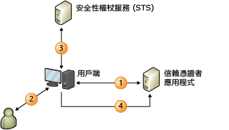

# 宣告式身分識別模型
當您建置宣告感知應用程式時，使用者識別會在應用程式中以一組宣告表示。 一個宣告可以是使用者的名稱，另一個則可能是電子郵件地址。 這個概念是外部識別系統設定為提供應用程式一切必要資訊，使其了解是哪位使用者在提出要求，並且確保會使用密碼編譯您自受信任來源取得的識別資料。  
  
 單一登入在這個模型中可以更輕鬆達成，而且應用程式也不必再對下列項目負責：  
  
- 驗證使用者。  
  
- 儲存使用者帳戶和密碼。  
  
- 呼叫企業目錄以查詢使用者識別詳細資料。  
  
- 與來自其他平台或公司的識別系統整合。  
  
 在這個模型中，應用程式將根據用來驗證您使用者的系統所提供的宣告，制定與識別相關的決策。 從利用使用者名字的簡單應用程式個人化，到授權使用者存取應用程式中價值更高的功能和資源，這些決策可以是任何項目。  
  
 本主題提供下列資訊：  
  
- [宣告式身分識別簡介](claims-based-identity-model.md#BKMK_1)  
  
- [宣告式身分識別模型的基本案例](claims-based-identity-model.md#BKMK_2)  
  
   
## 宣告型識別簡介  
 下列詞彙和概念有助於了解這個新的識別架構。  
  
### 身分識別  
 為了描述 Windows Identity Foundation (WIF) 中的程式設計模型，我們將使用「身分識別」一詞來表示一組屬性，這組屬性可用來描述要在系統中保護其安全性的使用者或其他某些實體。  
  
### 宣告  
 將宣告視為身分識別資訊的一部分，例如名稱、電子郵件地址、年齡、銷售角色中的成員資格。 應用程式接收的宣告愈多，也能讓您愈了解使用者。 您可能會好奇為什麼要使用「宣告」一詞，而不是像通常用於描述企業目錄的「屬性」一詞。 其中原因和傳遞方法有關。 在這個模型中，應用程式不會在目錄中查詢使用者屬性， 而是使用者提供宣告給應用程式，然後應用程式再檢查這些宣告。 每個宣告都是由簽發者發出呈現，而且您信任宣告的程度就如同信任簽發者一樣。 例如，與使用者本身發出的宣告相比，您更信任公司的網域控制站發出的宣告。 WIF 表示的宣告都包含 <xref:System.Security.Claims.Claim> 類型，這個類型的 <xref:System.Security.Claims.Claim.Issuer%2A> 屬性可讓您了解宣告的簽發者是誰。  
  
### 安全性權杖  
 使用者隨著要求提供一組宣告給應用程式。 在 Web 服務中，這些宣告是位於 SOAP 封套的安全性標頭內進行傳送。 在瀏覽器架構 Web 應用程式中，這些宣告則會從使用者的瀏覽器透過 HTTP POST 送出，而且如果工作階段有需要，之後就會被快取在 Cookie 中。 無論這些宣告如何抵達，都必須將它們序列化，這也是需要安全性權杖的地方。 安全性權杖是發行單位以數位方式簽署且經過序列化的宣告集合。 簽章重要之處在於，它可以確保使用者不是僅建立一大堆宣告然後就傳送給您。 雖然在不需要加密的低安全性情況下，您可以使用未簽署的權杖，但是這種情況不屬於本主題的說明範圍。  
  
 WIF 的其中一項核心功能是能夠建立和讀取安全性權杖。 WIF 和 .NET Framework 會處理所有密碼編譯工作，並且告知應用程式有一組您可以讀取的宣告。  
  
### 發行單位  
 發行單位五花八門，從發行 Kerberos 票證的網域控制站到發行 X.509 憑證的憑證授權單位都有，不過本主題所討論的特定類型單位是發行包含宣告的安全性權杖。 發行單位是了解如何發行安全性權杖的 Web 應用程式或 Web 服務。 對於信賴憑證者和提出要求的使用者，發行單位必須有足夠的資訊來發行適當的宣告，而且要負責與使用者存放區互動以查詢宣告和驗證使用者。  
  
 無論您選擇哪個發行單位，該單位在識別解決方案中都扮演著核心角色。 藉由信賴宣告的方式將驗證與應用程式分開，表示您要將責任移交給該單位並要求它代替您驗證使用者。  
  
### 安全性權杖服務 (STS)  
 Security Token Service (STS) 這個服務元件可根據 WS-Trust 和 WS-Federation 通訊協定，建置、簽署和發行安全性權杖。 實作這些通訊協定是一項大工程，但是 WIF 會為您完成這些工作，讓不熟悉通訊協定領域的人也可以輕易使用和執行 STS。 您可以使用預先建置的 STS (例如 [Active Directory® Federation Services (AD FS) 2.0](https://go.microsoft.com/fwlink/?LinkID=247516)) 或雲端 STS (例如 [Windows Azure Access Control Service (ACS)](https://go.microsoft.com/fwlink/?LinkID=247517))。或者，如果您要發行自訂權杖或是提供自訂驗證或授權，也可以使用 WIF 建置專屬自訂 STS。 WIF 可讓您輕鬆建置專屬 STS。  
  
### 信賴憑證者應用程式  
 當您建置依賴宣告的應用程式時，表示您建立的是信賴憑證者 (RP) 應用程式。 RP 的同義字包含「宣告感知應用程式」和「宣告式應用程式」。 Web 應用程式和 Web 服務都可以是 RP。 RP 應用程式會使用 STS 發行的權杖，並從權杖擷取宣告方便進行識別相關工作。 WIF 可提供相關功能，協助您建置 RP 應用程式。  
  
### 標準  
 為了讓上述所有項目互通，前述案例中會使用幾項 WS-* 標準。 案例中會使用 WS-MetadataExchange 擷取原則，而原則本身的結構是以 WS-Policy 規格為基礎。 STS 會公開實作 WS-Trust 規格的端點，以描述如何要求和接收安全性權杖。 現今大部分的 Sts 都會發出使用安全性聲明標記語言（SAML）格式化的權杖。 SAML 是業界公認的 XML 詞彙，可用來以互通方式表示宣告。 或者，這可讓您在多重平台的情況下與完全相異平台上的 STS 溝通，並且無論平台為何，單一登入在您的所有應用程式中都可以達成。  
  
### 瀏覽器架構應用程式  
 並非只有智慧型用戶端可以使用宣告型識別模型， 瀏覽器架構應用程式 (也稱為被動用戶端) 也可以使用。 下列情況將描述這要如何達成。  
  
 首先，使用者將瀏覽器指向一個宣告感知 Web 應用程式 (信賴憑證者應用程式)。 Web 應用程式會將瀏覽器重新導向至 STS 讓使用者進行驗證。 STS 裝載於簡單的 Web 應用程式中，這個 Web 應用程式可以讀取傳入要求、利用標準 HTTP 機制驗證使用者，然後再建立 SAML 權杖並透過 JavaScript 程式碼讓瀏覽器建立 HTTP POST 以將 SAML 權杖送回 RP。 這個 POST 的本文包含 RP 要求的宣告。 此時 RP 通常會將宣告封裝成 Cookie，如此使用者就不必在每次提出要求時，都要經歷重新導向的動作。  
  
   
## 宣告型識別模型的基本案例  
 以下是宣告型系統範例。  
  
   
  
 上圖顯示已設定為使用 WIF 進行驗證的網站 (信賴憑證者應用程式，即 RP) 以及要使用該網站的用戶端 (Web 瀏覽器)。  
  
1. 當未驗證的使用者要求頁面時，其瀏覽器會重新導向至識別提供者（IdP）頁面。  
  
2. IdP 需要使用者出示其認證，例如使用者名稱/密碼或 Kerberos 驗證。  
  
3. IdP 會將權杖發出回傳回給瀏覽器的。  
  
4. 瀏覽器會重新導向至原本要求的頁面，並且 WIF 會判斷該權杖是否有足夠的權限可以存取該頁面。 如果權限沒問題，瀏覽器隨即發行 Cookie 以建立工作階段，因此驗證只需要進行一次，接著就將控制權移交給應用程式。
