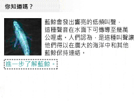

# UI 自動化存取內嵌物件
> [!NOTE]
>  這份文件適用於想要使用 <xref:System.Windows.Automation> 命名空間中定義之 Managed [!INCLUDE[TLA2#tla_uiautomation](../../../includes/tla2sharptla-uiautomation-md.md)] 類別的 .NET Framework 開發人員。 如需最新資訊[!INCLUDE[TLA2#tla_uiautomation](../../../includes/tla2sharptla-uiautomation-md.md)]，請參閱 < [Windows Automation API： 使用者介面自動化](https://go.microsoft.com/fwlink/?LinkID=156746)。  
  
 本主題說明如何使用 [!INCLUDE[TLA#tla_uiautomation](../../../includes/tlasharptla-uiautomation-md.md)] ，以公開文字控制項內容中的內嵌物件。  
  
> [!NOTE]
>  內嵌物件可以包含影像、超連結、按鈕、表格或 ActiveX 控制項。  
  
 內嵌物件會被視為 [!INCLUDE[TLA2#tla_uiautomation](../../../includes/tla2sharptla-uiautomation-md.md)] 文字提供者的子系。 這個特性使得這些物件可以透過與其他所有 [!INCLUDE[TLA#tla_ui](../../../includes/tlasharptla-ui-md.md)] 項目相同的使用者介面自動化樹狀結構結構來公開。 功能則是透過內嵌物件控制項類型所要求的控制項模式公開 (例如，因為超連結是文字，所以支援 <xref:System.Windows.Automation.TextPattern>)。  
  
   
範例文件，內含文字 （「 您知道嗎？ 」...）與兩個內嵌的物件 （一張鯨魚圖片和文字超連結），做為目標的程式碼範例。  
  
## 範例  
 下列程式碼範例說明，如何從 [!INCLUDE[TLA2#tla_uiautomation](../../../includes/tla2sharptla-uiautomation-md.md)] 文字提供者擷取內嵌物件的集合。 簡介中所提供的範例文件，會傳回兩個物件 (影像項目及文字項目)。  
  
> [!NOTE]
>  影像項目應該要與一些描述影像的內建文字關聯，通常是在 <xref:System.Windows.Automation.AutomationElement.NameProperty> 中 (例如「藍鯨」)。 但是，當取得環繞影像物件的文字範圍時，文字資料流中不會傳回影像及描述文字。  
  
 [!code-csharp[FindText#StartApp](../../../samples/snippets/csharp/VS_Snippets_Wpf/FindText/CSharp/SearchWindow.cs#startapp)]
 [!code-vb[FindText#StartApp](../../../samples/snippets/visualbasic/VS_Snippets_Wpf/FindText/VisualBasic/SearchWindow.vb#startapp)]  
[!code-csharp[FindText#FindTextProvider](../../../samples/snippets/csharp/VS_Snippets_Wpf/FindText/CSharp/SearchWindow.cs#findtextprovider)]
[!code-vb[FindText#FindTextProvider](../../../samples/snippets/visualbasic/VS_Snippets_Wpf/FindText/VisualBasic/SearchWindow.vb#findtextprovider)]  
[!code-csharp[FindText#GetChildren](../../../samples/snippets/csharp/VS_Snippets_Wpf/FindText/CSharp/SearchWindow.cs#getchildren)]
[!code-vb[FindText#GetChildren](../../../samples/snippets/visualbasic/VS_Snippets_Wpf/FindText/VisualBasic/SearchWindow.vb#getchildren)]  
  
## 範例  
 下列程式碼範例說明，如何從 [!INCLUDE[TLA2#tla_uiautomation](../../../includes/tla2sharptla-uiautomation-md.md)] 文字提供者的內嵌物件中取得文字範圍。 擷取的文字範圍是空白範圍，起始結束點前面接的是 "… ocean.(空格)"，而結尾結束點的後面則是結尾點 "."，代表內嵌超連結 (如簡介中提供的影像所示)。 即使這是空白範圍，但並不會被視為變質範圍，因為其擁有非零值的範圍。  
  
> [!NOTE]
>  <xref:System.Windows.Automation.TextPattern> 可以擷取文字式的內嵌物件，例如超連結，但是必須取得內嵌物件中的次要 <xref:System.Windows.Automation.TextPattern> ，才能公開其完整的功能。  
  
 [!code-csharp[UIATextPattern_snip#GetRangeFromChild](../../../samples/snippets/csharp/VS_Snippets_Wpf/UIATextPattern_snip/CSharp/SearchWindow.cs#getrangefromchild)]
 [!code-vb[UIATextPattern_snip#GetRangeFromChild](../../../samples/snippets/visualbasic/VS_Snippets_Wpf/UIATextPattern_snip/VisualBasic/SearchWindow.vb#getrangefromchild)]  
  
## 另請參閱  
 [UI 自動化 TextPattern 概觀](../../../docs/framework/ui-automation/ui-automation-textpattern-overview.md)  
 [UI 自動化控制項模式概觀](../../../docs/framework/ui-automation/ui-automation-control-patterns-overview.md)  
 [用戶端的 UI 自動化控制項模式](../../../docs/framework/ui-automation/ui-automation-control-patterns-for-clients.md)  
 [使用 UI 自動化將內容新增至文字方塊](../../../docs/framework/ui-automation/add-content-to-a-text-box-using-ui-automation.md)  
 [使用 UI 自動化尋找和反白顯示文字](../../../docs/framework/ui-automation/find-and-highlight-text-using-ui-automation.md)
