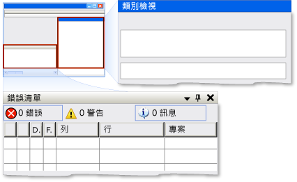

# Implementing the UI Automation Dock Control Pattern
> [!NOTE]
>  這份文件適用於想要使用 <xref:System.Windows.Automation> 命名空間中定義之 Managed [!INCLUDE[TLA2#tla_uiautomation](../../../includes/tla2sharptla-uiautomation-md.md)] 類別的 .NET Framework 開發人員。 如需 [!INCLUDE[TLA2#tla_uiautomation](../../../includes/tla2sharptla-uiautomation-md.md)] 的最新資訊，請參閱[Windows Automation API：使用者介面自動化](http://go.microsoft.com/fwlink/?LinkID=156746)。  
  
 本主題將介紹實作 <xref:System.Windows.Automation.Provider.IDockProvider> 的方針和慣例，包括屬性的相關資訊。 其他參考的連結列於此主題的結尾部分。  
  
 <xref:System.Windows.Automation.DockPattern> 控制項模式是用來公開停駐容器內控制項的停駐屬性。 停駐容器是一種控制項，可讓您依垂直和水平的相對位置排列子項目。 如需實作此控制項模式的控制項範例，請參閱[Control Pattern Mapping for UI Automation Clients](../../../docs/framework/ui-automation/control-pattern-mapping-for-ui-automation-clients.md)。  
  
   
Visual Studio 的停駐範例，其中「類別檢視」視窗是 DockPosition.Right，「錯誤清單」視窗是 DockPosition.Bottom  
  
   
## 實作方針和慣例  
 實作停駐控制項模式時，請注意下列方針和慣例：  
  
-   <xref:System.Windows.Automation.Provider.IDockProvider> 不會公開停駐容器的任何屬性，而對於停駐容器內與目前控制項相鄰的停駐控制項，也不會公開其任何屬性。  
  
-   控制項會根據其目前的疊置順序，在彼此相對的位置停駐；疊置順序的位置愈高，控制項離停駐容器的指定邊緣就愈遠。  
  
-   如果停駐容器可以調整大小，容器內的任何停駐控制項會再次對齊到原始停駐的相同邊緣。 停駐的控制項也會根據其 <xref:System.Windows.Automation.DockPosition> 的停駐行為，調整大小來填滿容器內的任何空間。 例如，如果指定 <xref:System.Windows.Automation.DockPosition>，控制項的左右兩邊就會擴展來填滿任何可用的空間。 如果指定 <xref:System.Windows.Automation.DockPosition>，則控制項的四個邊將會擴展來填滿任何可用的空間。  
  
-   在多監視器系統上，控制項應停駐到目前監視器的左或右邊。 若不可行，則應停駐到最左邊監視器的左邊，或最右邊監視器的右邊。  
  
   
## IDockProvider 的必要成員  
 以下是實作 IDockProvider 介面的必要屬性和方法。  
  
|必要成員|成員類型|備註|  
|----------|----------|--------|  
|<xref:System.Windows.Automation.Provider.IDockProvider.DockPosition%2A>|屬性|無|  
|<xref:System.Windows.Automation.Provider.IDockProvider.SetDockPosition%2A>|方法|無|  
  
 此控制項模式沒有任何相關聯的事件。  
  
   
## 例外狀況  
 提供者必須擲回下列例外狀況。  
  
|例外狀況類型|條件|  
|------------|--------|  
|<xref:System.InvalidOperationException>|<xref:System.Windows.Automation.Provider.IDockProvider.SetDockPosition%2A>   -   當控制項無法執行要求的停駐樣式時。|  
  
## 請參閱  
 [UI Automation Control Patterns Overview](../../../docs/framework/ui-automation/ui-automation-control-patterns-overview.md)   
 [Support Control Patterns in a UI Automation Provider](../../../docs/framework/ui-automation/support-control-patterns-in-a-ui-automation-provider.md)   
 [UI Automation Control Patterns for Clients](../../../docs/framework/ui-automation/ui-automation-control-patterns-for-clients.md)   
 [UI Automation Tree Overview](../../../docs/framework/ui-automation/ui-automation-tree-overview.md)   
 [Use Caching in UI Automation](../../../docs/framework/ui-automation/use-caching-in-ui-automation.md)