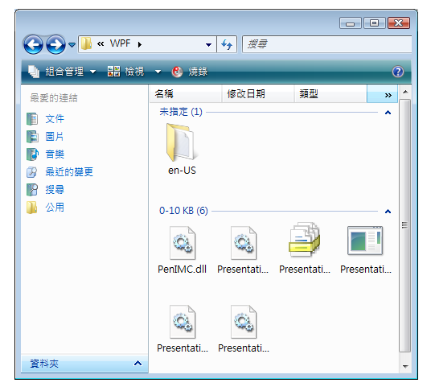

# 實作 UI 自動化 Grid 控制項模式
> [!NOTE]
>  這份文件適用於想要使用 <xref:System.Windows.Automation> 命名空間中定義之 Managed [!INCLUDE[TLA2#tla_uiautomation](../../../includes/tla2sharptla-uiautomation-md.md)] 類別的 .NET Framework 開發人員。 如需最新資訊[!INCLUDE[TLA2#tla_uiautomation](../../../includes/tla2sharptla-uiautomation-md.md)]，請參閱[Windows Automation API:使用者介面自動化](https://go.microsoft.com/fwlink/?LinkID=156746)。  
  
 本主題簡介實作 <xref:System.Windows.Automation.Provider.IGridProvider>的方針和慣例，包括屬性、方法和事件的相關資訊。 其他參考的連結會在概觀的結尾列出。  
  
 <xref:System.Windows.Automation.GridPattern> 控制項模式是用以支援當作子項目集合的容器使用的控制項。 此項目的子系必須實作 <xref:System.Windows.Automation.Provider.IGridItemProvider> ，並組合管理成資料列與資料行可周遊的二維邏輯座標系統。 如需實作此控制項模式的控制項範例，請參閱 [Control Pattern Mapping for UI Automation Clients](../../../docs/framework/ui-automation/control-pattern-mapping-for-ui-automation-clients.md)。  
  
   
## 實作方針和慣例  
 實作方格控制項模式時，請注意下列方針和慣例：  
  
- 方格座標是從左上角 (或根據地區為右上儲存格) 以零為起始，座標為 (0, 0)。  
  
- 如果儲存格是空的，仍必須傳回使用者介面自動化項目，才能支援該儲存格的 <xref:System.Windows.Automation.Provider.IGridItemProvider.ContainingGrid%2A> 屬性。 當子項目在方格中的配置類似不完全陣列 (請參閱以下範例)，就可能發生這種情形。  
  
   
座標是空的方格控制項範例  
  
- 單一項目的方格仍必須實作 <xref:System.Windows.Automation.Provider.IGridProvider> ，才能在邏輯上視為是方格。 方格中的子項目數為多少都沒關係。  
  
- 根據提供者實作而定，隱藏資料列和資料行可能會載入到 [!INCLUDE[TLA2#tla_uiautomation](../../../includes/tla2sharptla-uiautomation-md.md)] 樹狀結構，因此會反映在 <xref:System.Windows.Automation.GridPattern.GridPatternInformation.RowCount%2A> 和 <xref:System.Windows.Automation.GridPattern.GridPatternInformation.ColumnCount%2A> 屬性。 如果隱藏資料列和資料行未載入，則應不會列入計數。  
  
- <xref:System.Windows.Automation.Provider.IGridProvider> 不會啟用方格的使用中操作，而必須實作 <xref:System.Windows.Automation.Provider.ITransformProvider> 才能啟用此功能。  
  
- 使用 <xref:System.Windows.Automation.StructureChangedEventHandler> 接聽方格的結構或配置變更，例如新增、移除或合併儲存格。  
  
- 使用 <xref:System.Windows.Automation.AutomationFocusChangedEventHandler> 追蹤方格項目或儲存格的周遊情形。  
  
   
## IGridProvider 的必要成員  
 以下是實作 IGridProvider 介面的必要屬性和方法。  
  
|必要成員|類型|注意|  
|----------------------|----------|-----------|  
|<xref:System.Windows.Automation.Provider.IGridProvider.RowCount%2A>|屬性|None|  
|<xref:System.Windows.Automation.Provider.IGridProvider.ColumnCount%2A>|屬性|None|  
|<xref:System.Windows.Automation.Provider.IGridProvider.GetItem%2A>|方法|None|  
  
 此控制項模式沒有任何相關聯的事件。  
  
   
## 例外狀況  
 提供者必須擲回下列例外狀況。  
  
|例外狀況類型|條件|  
|--------------------|---------------|  
|<xref:System.ArgumentOutOfRangeException>|<xref:System.Windows.Automation.Provider.IGridProvider.GetItem%2A>   -如果要求的資料列座標大於<xref:System.Windows.Automation.Provider.IGridProvider.RowCount%2A>或資料行座標大於<xref:System.Windows.Automation.Provider.IGridProvider.ColumnCount%2A>。|  
|<xref:System.ArgumentOutOfRangeException>|<xref:System.Windows.Automation.Provider.IGridProvider.GetItem%2A>   -如果要求的資料列或資料行座標小於零。|  
  
## 另請參閱

- [UI 自動化控制項模式概觀](../../../docs/framework/ui-automation/ui-automation-control-patterns-overview.md)
- [支援 UI 自動化提供者的控制項模式](../../../docs/framework/ui-automation/support-control-patterns-in-a-ui-automation-provider.md)
- [用戶端的 UI 自動化控制項模式](../../../docs/framework/ui-automation/ui-automation-control-patterns-for-clients.md)
- [實作 UI 自動化 GridItem 控制項模式](../../../docs/framework/ui-automation/implementing-the-ui-automation-griditem-control-pattern.md)
- [UI 自動化樹狀目錄概觀](../../../docs/framework/ui-automation/ui-automation-tree-overview.md)
- [在 UI 自動化中使用快取](../../../docs/framework/ui-automation/use-caching-in-ui-automation.md)
