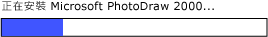

# 實作 UI 自動化 RangeValue 控制項模式
> [!NOTE]
>  這份文件適用於想要使用 <xref:System.Windows.Automation> 命名空間中定義之 Managed [!INCLUDE[TLA2#tla_uiautomation](../../../includes/tla2sharptla-uiautomation-md.md)] 類別的 .NET Framework 開發人員。 如需最新資訊[!INCLUDE[TLA2#tla_uiautomation](../../../includes/tla2sharptla-uiautomation-md.md)]，請參閱 < [Windows Automation API： 使用者介面自動化](https://go.microsoft.com/fwlink/?LinkID=156746)。  
  
 本主題將介紹實作 <xref:System.Windows.Automation.Provider.IRangeValueProvider>的方針和慣例，包括事件和屬性的相關資訊。 其他參考的連結列於主題的結尾。  
  
 <xref:System.Windows.Automation.RangeValuePattern> 控制項模式用來支援可以設定為某範圍內的值之控制項。 如需實作此控制項模式的控制項範例，請參閱 [Control Pattern Mapping for UI Automation Clients](../../../docs/framework/ui-automation/control-pattern-mapping-for-ui-automation-clients.md)。  
  
   
## 實作方針和慣例  
 實作範圍值控制項模式時，請注意下列方針和慣例：  
  
-   控制項可以根據地區設定或使用者偏好設定，重新劃分所支援屬性的刻度。 例如，溫度計控制項可以設為顯示華氏或攝氏溫度。  
  
-   範圍值不明確的控制項 (如進度列或滑桿) 應將這些值正規化。  
  
   
進度列範例，其中的值屬於整數類型，而最小值和最大值的屬性值分別正規化為 0 和 100。  
  
   
## IRangeValueProvider 的必要成員  
  
|必要成員|成員類型|注意|  
|---------------------|-----------------|-----------|  
|<xref:System.Windows.Automation.RangeValuePattern.IsReadOnlyProperty>|屬性|無|  
|<xref:System.Windows.Automation.RangeValuePattern.ValueProperty>|屬性|無|  
|<xref:System.Windows.Automation.RangeValuePattern.LargeChangeProperty>|屬性|無|  
|<xref:System.Windows.Automation.RangeValuePattern.SmallChangeProperty>|屬性|無|  
|<xref:System.Windows.Automation.RangeValuePattern.MaximumProperty>|屬性|無|  
|<xref:System.Windows.Automation.RangeValuePattern.MinimumProperty>|屬性|無|  
|<xref:System.Windows.Automation.RangeValuePattern.SetValue%2A>|方法|無|  
  
 此控制項模式沒有任何相關聯的事件。  
  
   
## 例外狀況  
 提供者必須擲回下列例外狀況。  
  
|例外狀況類型|條件|  
|--------------------|---------------|  
|<xref:System.ArgumentOutOfRangeException>|<xref:System.Windows.Automation.RangeValuePattern.SetValue%2A> 以大於 <xref:System.Windows.Automation.RangeValuePattern.MaximumProperty> 或小於 <xref:System.Windows.Automation.RangeValuePattern.MinimumProperty>的值呼叫。|  
  
## 另請參閱  
 [UI 自動化控制項模式概觀](../../../docs/framework/ui-automation/ui-automation-control-patterns-overview.md)  
 [支援 UI 自動化提供者的控制項模式](../../../docs/framework/ui-automation/support-control-patterns-in-a-ui-automation-provider.md)  
 [用戶端的 UI 自動化控制項模式](../../../docs/framework/ui-automation/ui-automation-control-patterns-for-clients.md)  
 [UI 自動化樹狀目錄概觀](../../../docs/framework/ui-automation/ui-automation-tree-overview.md)  
 [在 UI 自動化中使用快取](../../../docs/framework/ui-automation/use-caching-in-ui-automation.md)
