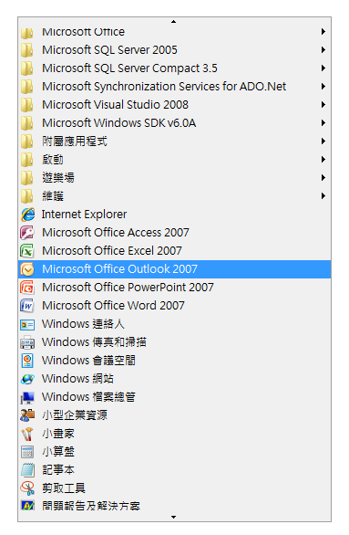

# Implementing the UI Automation Scroll Control Pattern
> [!NOTE]
>  這份文件適用於想要使用 <xref:System.Windows.Automation> 命名空間中定義之 Managed [!INCLUDE[TLA2#tla_uiautomation](../../../includes/tla2sharptla-uiautomation-md.md)] 類別的 .NET Framework 開發人員。 如需 [!INCLUDE[TLA2#tla_uiautomation](../../../includes/tla2sharptla-uiautomation-md.md)] 的最新資訊，請參閱 [Windows Automation API：使用者介面自動化](http://go.microsoft.com/fwlink/?LinkID=156746)。  
  
 本主題將介紹實作 <xref:System.Windows.Automation.Provider.IScrollProvider> 的方針和慣例，包括事件和屬性的相關資訊。 其他參考的連結列於主題的結尾。  
  
 <xref:System.Windows.Automation.ScrollPattern> 控制項模式是用來支援放有一組子項目的捲動式容器控制項。 控制項不一定要使用捲軸才能支援捲動功能，不過它通常會這麼做。  
  
   
不使用捲軸的捲動控制項範例  
  
 如需實作此控制項的控制項範例，請參閱[Control Pattern Mapping for UI Automation Clients](../../../docs/framework/ui-automation/control-pattern-mapping-for-ui-automation-clients.md)。  
  
   
## 實作方針和慣例  
 實作捲軸控制項模式時，請注意下列方針和慣例：  
  
-   這個控制項的子系必須實作 <xref:System.Windows.Automation.Provider.IScrollItemProvider>。  
  
-   容器控制項的捲軸不支援 <xref:System.Windows.Automation.ScrollPattern> 控制項模式。 捲軸必須改成支援 <xref:System.Windows.Automation.RangeValuePattern> 控制項模式。  
  
-   若捲動是以百分比為單位，則與捲動刻度相關的所有值或數量必須標準化為 0 到 100 之間的範圍。  
  
-   <xref:System.Windows.Automation.ScrollPatternIdentifiers.HorizontallyScrollableProperty> 和 <xref:System.Windows.Automation.ScrollPatternIdentifiers.VerticallyScrollableProperty> 與 <xref:System.Windows.Automation.AutomationElement.IsEnabledProperty> 無關。  
  
-   如果 <xref:System.Windows.Automation.ScrollPatternIdentifiers.HorizontallyScrollableProperty> \= `false`，則 <xref:System.Windows.Automation.ScrollPatternIdentifiers.HorizontalViewSizeProperty> 應設為 100%，而且 <xref:System.Windows.Automation.ScrollPatternIdentifiers.HorizontalScrollPercentProperty> 應設為 <xref:System.Windows.Automation.ScrollPatternIdentifiers.NoScroll>。 同樣地，如果 <xref:System.Windows.Automation.ScrollPatternIdentifiers.VerticallyScrollableProperty> \= `false`，則 <xref:System.Windows.Automation.ScrollPatternIdentifiers.VerticalViewSizeProperty> 應設為 100%，而且 <xref:System.Windows.Automation.ScrollPatternIdentifiers.VerticalScrollPercentProperty> 應設為 <xref:System.Windows.Automation.ScrollPatternIdentifiers.NoScroll>。 若用戶端不想捲動的方向啟動時，這可讓使用者介面自動化用戶端在 <xref:System.Windows.Automation.ScrollPattern.SetScrollPercent%2A> 方法中使用這些屬性值，以免發生[競爭情形](http://support.microsoft.com/default.aspx?scid=kb;en-us;317723)。  
  
-   <xref:System.Windows.Automation.Provider.IScrollProvider.HorizontalScrollPercent%2A> 是地區設定特性。 設定 HorizontalScrollPercent \= 100.0 時，必須將控制項的捲動位置設為由左至右語言 \(如英文\) 的最右側位置。 相反地，若為由右至左語言 \(如阿拉伯文\)，設定 HorizontalScrollPercent \= 100.0 時，必須將捲動位置設為最左側位置。  
  
   
## IScrollProvider 的必要成員  
 以下是實作 <xref:System.Windows.Automation.Provider.IScrollProvider> 的必要屬性和方法。  
  
|必要成員|成員類型|備註|  
|----------|----------|--------|  
|<xref:System.Windows.Automation.Provider.IScrollProvider.HorizontalScrollPercent%2A>|屬性|無|  
|<xref:System.Windows.Automation.Provider.IScrollProvider.VerticalScrollPercent%2A>|屬性|無|  
|<xref:System.Windows.Automation.Provider.IScrollProvider.HorizontalViewSize%2A>|屬性|無|  
|<xref:System.Windows.Automation.Provider.IScrollProvider.VerticalViewSize%2A>|屬性|無|  
|<xref:System.Windows.Automation.Provider.IScrollProvider.HorizontallyScrollable%2A>|屬性|無|  
|<xref:System.Windows.Automation.Provider.IScrollProvider.VerticallyScrollable%2A>|屬性|無|  
|<xref:System.Windows.Automation.Provider.IScrollProvider.Scroll%2A>|方法|無|  
|<xref:System.Windows.Automation.Provider.IScrollProvider.SetScrollPercent%2A>|方法|無|  
  
 此控制項模式沒有任何相關聯的事件。  
  
   
## 例外狀況  
 提供者必須擲回下列例外狀況。  
  
|例外狀況類型|條件|  
|------------|--------|  
|<xref:System.ArgumentException>|如果控制項僅支援垂直或水平捲動的 <xref:System.Windows.Automation.ScrollAmount> 值，但傳入了 <xref:System.Windows.Automation.ScrollAmount> 值，<xref:System.Windows.Automation.Provider.IScrollProvider.Scroll%2A> 就會擲回這個例外狀況。|  
|<xref:System.ArgumentException>|當傳入無法轉換成雙精度浮點數的值時，<xref:System.Windows.Automation.Provider.IScrollProvider.SetScrollPercent%2A> 便會擲回這個例外狀況。|  
|<xref:System.ArgumentOutOfRangeException>|當傳入大於 100 或小於 0 的值 \(\-1 例外，因為它相當於 <xref:System.Windows.Automation.ScrollPatternIdentifiers.NoScroll>\) 時，<xref:System.Windows.Automation.Provider.IScrollProvider.SetScrollPercent%2A> 就會擲回這個例外狀況。|  
|<xref:System.InvalidOperationException>|嘗試在不支援的方向捲動時，<xref:System.Windows.Automation.Provider.IScrollProvider.Scroll%2A> 和 <xref:System.Windows.Automation.Provider.IScrollProvider.SetScrollPercent%2A> 都會擲回這個例外狀況。|  
  
## 請參閱  
 [UI Automation Control Patterns Overview](../../../docs/framework/ui-automation/ui-automation-control-patterns-overview.md)   
 [Support Control Patterns in a UI Automation Provider](../../../docs/framework/ui-automation/support-control-patterns-in-a-ui-automation-provider.md)   
 [UI Automation Control Patterns for Clients](../../../docs/framework/ui-automation/ui-automation-control-patterns-for-clients.md)   
 [UI Automation Tree Overview](../../../docs/framework/ui-automation/ui-automation-tree-overview.md)   
 [Use Caching in UI Automation](../../../docs/framework/ui-automation/use-caching-in-ui-automation.md)