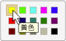

# 實作 UI 自動化 Selection 控制項模式
> [!NOTE]
>  這份文件適用於想要使用 [!INCLUDE[TLA2#tla_uiautomation](../../../includes/tla2sharptla-uiautomation-md.md)] 命名空間中定義之 Managed <xref:System.Windows.Automation> 類別的 .NET Framework 開發人員。 如需最新資訊[!INCLUDE[TLA2#tla_uiautomation](../../../includes/tla2sharptla-uiautomation-md.md)]，請參閱 < [Windows Automation API： 使用者介面自動化](https://go.microsoft.com/fwlink/?LinkID=156746)。  
  
 本主題將介紹實作 <xref:System.Windows.Automation.Provider.ISelectionProvider>的方針和慣例，包括事件和屬性的相關資訊。 其他參考的連結列於主題的結尾。  
  
 <xref:System.Windows.Automation.SelectionPattern> 控制項模式是用以支援當作可選取子項目集合的容器使用的控制項。 這個項目的子系必須實作 <xref:System.Windows.Automation.Provider.ISelectionItemProvider>。 如需實作此控制項模式的控制項範例，請參閱 [Control Pattern Mapping for UI Automation Clients](../../../docs/framework/ui-automation/control-pattern-mapping-for-ui-automation-clients.md)。  
  
   
## 實作方針和慣例  
 實作選取控制項模式時，請注意下列方針和慣例：  
  
-   實作 <xref:System.Windows.Automation.Provider.ISelectionProvider> 的控制項允許選取一個或多個子項目。 例如，清單方塊、清單檢視和樹狀檢視都支援多重選取，而下拉式方塊、滑桿和選項按鈕群組則支援單一選取。  
  
-   有最小值、最大值和連續範圍的控制項 (如 [音量]  滑桿控制項)，應實作 <xref:System.Windows.Automation.Provider.IRangeValueProvider> ，而不是實作 <xref:System.Windows.Automation.Provider.ISelectionProvider>。  
  
-   若單一選取控制項有實作 <xref:System.Windows.Automation.Provider.IRawElementProviderFragmentRoot>的子控制項，例如 [顯示內容]  對話方塊中的 [螢幕解析度]  滑桿或 **的 [色彩選擇器]**[!INCLUDE[TLA#tla_word](../../../includes/tlasharptla-word-md.md)] 選取控制項 (如下所示)，應實作 <xref:System.Windows.Automation.Provider.ISelectionProvider>，其子系應實作 <xref:System.Windows.Automation.Provider.IRawElementProviderFragment> 和 <xref:System.Windows.Automation.Provider.ISelectionItemProvider>。  
  
   
色樣字串對應範例  
  
-   功能表不支援 <xref:System.Windows.Automation.SelectionPattern>。 若使用的功能表項目同時包含圖形和文字 (例如 **[檢視]****功能表中的 [預覽窗格]**[!INCLUDE[TLA#tla_outlook](../../../includes/tlasharptla-outlook-md.md)]項目)，而有必要傳達狀態，則應實作 <xref:System.Windows.Automation.Provider.IToggleProvider>。  
  
   
## ISelectionProvider 的必要成員  
 <xref:System.Windows.Automation.Provider.ISelectionProvider> 介面需要下列屬性、方法和事件。  
  
|必要成員|類型|注意|  
|----------------------|----------|-----------|  
|<xref:System.Windows.Automation.Provider.ISelectionProvider.CanSelectMultiple%2A>|屬性|應支援使用 <xref:System.Windows.Automation.Automation.AddAutomationPropertyChangedEventHandler%2A> 和 <xref:System.Windows.Automation.Automation.RemoveAutomationPropertyChangedEventHandler%2A>的屬性變更事件。|  
|<xref:System.Windows.Automation.Provider.ISelectionProvider.IsSelectionRequired%2A>|屬性|應支援使用 <xref:System.Windows.Automation.Automation.AddAutomationPropertyChangedEventHandler%2A> 和 <xref:System.Windows.Automation.Automation.RemoveAutomationPropertyChangedEventHandler%2A>的屬性變更事件。|  
|<xref:System.Windows.Automation.Provider.ISelectionProvider.GetSelection%2A>|方法|無|  
|<xref:System.Windows.Automation.SelectionPatternIdentifiers.InvalidatedEvent>|Event - 事件|當容器中的選項大幅變更，需要傳送比 <xref:System.Windows.Automation.Provider.AutomationInteropProvider.InvalidateLimit> 常數所允許的更多新增和移除事件時，會引發此事件。|  
  
 <xref:System.Windows.Automation.Provider.ISelectionProvider.IsSelectionRequired%2A> 和 <xref:System.Windows.Automation.Provider.ISelectionProvider.CanSelectMultiple%2A> 屬性可以是動態的。 例如，控制項的最初狀態可能預設沒有選取任何項目，表示 <xref:System.Windows.Automation.Provider.ISelectionProvider.IsSelectionRequired%2A> 為 `false`。 不過，在選取項目之後，控制項就必須至少有一個項目一律保持為選取。 同樣地，在極少數的情況下，控制項可能會允許最初選取多個項目，但之後就只允許單一選取。  
  
   
## 例外狀況  
 提供者必須擲回下列例外狀況。  
  
|例外狀況類型|條件|  
|--------------------|---------------|  
|<xref:System.Windows.Automation.ElementNotEnabledException>|如果未啟用此控制項。|  
|<xref:System.InvalidOperationException>|如果隱藏此控制項。|  
  
## 另請參閱  
 [UI 自動化控制項模式概觀](../../../docs/framework/ui-automation/ui-automation-control-patterns-overview.md)  
 [支援 UI 自動化提供者的控制項模式](../../../docs/framework/ui-automation/support-control-patterns-in-a-ui-automation-provider.md)  
 [用戶端的 UI 自動化控制項模式](../../../docs/framework/ui-automation/ui-automation-control-patterns-for-clients.md)  
 [實作 UI 自動化 SelectionItem 控制項模式](../../../docs/framework/ui-automation/implementing-the-ui-automation-selectionitem-control-pattern.md)  
 [UI 自動化樹狀目錄概觀](../../../docs/framework/ui-automation/ui-automation-tree-overview.md)  
 [在 UI 自動化中使用快取](../../../docs/framework/ui-automation/use-caching-in-ui-automation.md)
