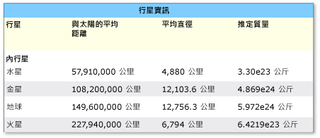
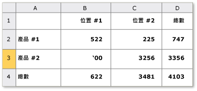

# 實作 UI 自動化 Table 控制項模式
> [!NOTE]
>  這份文件適用於想要使用 <xref:System.Windows.Automation> 命名空間中定義之 Managed [!INCLUDE[TLA2#tla_uiautomation](../../../includes/tla2sharptla-uiautomation-md.md)] 類別的 .NET Framework 開發人員。 如需最新資訊[!INCLUDE[TLA2#tla_uiautomation](../../../includes/tla2sharptla-uiautomation-md.md)]，請參閱[Windows Automation API:使用者介面自動化](https://go.microsoft.com/fwlink/?LinkID=156746)。  
  
 本主題簡介實作 <xref:System.Windows.Automation.Provider.ITableProvider>的方針和慣例，包括屬性、方法和事件的相關資訊。 其他參考的連結會在概觀的結尾列出。  
  
 <xref:System.Windows.Automation.TablePattern> 控制項模式是用以支援當作子項目集合的容器使用的控制項。 此項目的子系必須實作 <xref:System.Windows.Automation.Provider.ITableItemProvider> ，並組合管理成資料列與資料行可周遊的二維邏輯座標系統。 此控制項模式類似 <xref:System.Windows.Automation.Provider.IGridProvider>，相反地，任何實作 <xref:System.Windows.Automation.Provider.ITableProvider> 的控制項也必須公開每個子項目的資料行及 (或) 資料列標頭關聯性。 如需實作此控制項模式的控制項範例，請參閱 [Control Pattern Mapping for UI Automation Clients](../../../docs/framework/ui-automation/control-pattern-mapping-for-ui-automation-clients.md)。  
  
   
## 實作方針和慣例  
 實作表格控制項模式時，請注意下列方針和慣例：  
  
-   透過二維邏輯座標系統或必要 <xref:System.Windows.Automation.Provider.IGridProvider> 並行實作所提供的陣列，才可存取個別資料格的內容。  
  
-   資料行或資料列標頭可以包含在資料表物件中，也可以是與資料表物件建立關係的個別標頭物件。  
  
-   資料行和資料列標頭可同時包含主要標頭和任何支援的標頭。  
  
> [!NOTE]
>  此概念在使用者已定義「名字」資料行的 [!INCLUDE[TLA#tla_xl](../../../includes/tlasharptla-xl-md.md)] 試算表中格外明顯。 此資料行現在有兩個標頭—使用者定義的「名字」標頭和應用程式指派給該資料行的英數字元指定。  
  
-   請參閱[實作 UI 自動化 Grid 控制項模式](../../../docs/framework/ui-automation/implementing-the-ui-automation-grid-control-pattern.md)如需相關的格線功能。  
  
   
具有複雜資料行標頭的資料表範例  
  
   
具有模稜兩可之 RowOrColumnMajor 屬性的資料表範例  
  
   
## ITableProvider 的必要成員  
 ITableProvider 介面需要下列屬性和方法。  
  
|必要成員|成員類型|注意|  
|----------------------|-----------------|-----------|  
|<xref:System.Windows.Automation.Provider.ITableProvider.RowOrColumnMajor%2A>|屬性|None|  
|<xref:System.Windows.Automation.Provider.ITableProvider.GetColumnHeaders%2A>|方法|None|  
|<xref:System.Windows.Automation.Provider.ITableProvider.GetRowHeaders%2A>|方法|None|  
  
 此控制項模式沒有任何相關聯的事件。  
  
   
## 例外狀況  
 此控制項模式沒有任何相關聯的例外狀況。  
  
## 另請參閱

- [UI 自動化控制項模式概觀](../../../docs/framework/ui-automation/ui-automation-control-patterns-overview.md)
- [支援 UI 自動化提供者的控制項模式](../../../docs/framework/ui-automation/support-control-patterns-in-a-ui-automation-provider.md)
- [用戶端的 UI 自動化控制項模式](../../../docs/framework/ui-automation/ui-automation-control-patterns-for-clients.md)
- [實作 UI 自動化 TableItem 控制項模式](../../../docs/framework/ui-automation/implementing-the-ui-automation-tableitem-control-pattern.md)
- [實作 UI 自動化 Grid 控制項模式](../../../docs/framework/ui-automation/implementing-the-ui-automation-grid-control-pattern.md)
- [UI 自動化樹狀目錄概觀](../../../docs/framework/ui-automation/ui-automation-tree-overview.md)
- [在 UI 自動化中使用快取](../../../docs/framework/ui-automation/use-caching-in-ui-automation.md)
